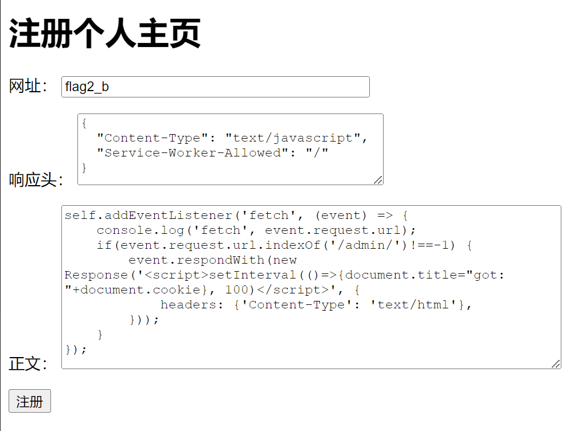

# [Web] 第三新XSS

- 命题人：新燕园校区的 xmcp
- 巡猎：200 分
- 记忆：300 分

## 题目描述

<p>第三新兆京大学的第三新学院坐落在美丽的第三新燕园校区。在这里工作的第三新学生在欣赏第三新燕园校区的第三新风光之余，还组建起了第三新实验室，努力发展解决卡脖子难题的第三新技术。</p>
<p>就像其他世界一流大学一样，第三新学院也有自己的第三新官网，每个第三新学生可以向第三新教务提出申请，在上面放置自己的第三新个人主页。在第三新教务座谈会上，有人提出了质疑：</p>
<blockquote>
<p>“允许任何人在官网上设置个人主页，请问这是否存在安全漏洞？比如，能否通过 XSS 漏洞篡改他人的主页内容。”</p>
<p>“暂时不能给你明确的答复。不过有一点可以保证，这套系统从根本上杜绝了 XSS 漏洞，因为<strong>所有人共享同一个网站</strong>，Cross-Site 不了一点。”</p>
<p>“好的，这套系统没有 XSS 漏洞。那么是否有第三新 XSS 漏洞呢？”</p>
<p>“这个问题需要你自己去衡量。”</p>
</blockquote>
<p>此时人们尚未意识到，命运的第三新齿轮即将开始转动……</p>
<div class="well">
<p><strong>萌新教学：</strong></p>
<p>本题提供了一个模拟受害者行为的程序，称为 XSS Bot。它会自动操作浏览器将 Flag 放置在目标网站上，然后访问你指定的网址。</p>
<p>请设法找到并利用目标网站上的漏洞，通过与 XSS Bot 交互获得受害者浏览器中的 Flag。</p>
</div>
<div class="well">
<p><strong>第二阶段提示：</strong></p>
<ul>
<li>给 Cookie 设置 Path 并不能带来安全性。<a target="_blank" rel="noopener noreferrer" href="https://developer.mozilla.org/en-US/docs/web/api/document/cookie#security">MDN 文档</a> 专门有一节来指出其中的问题。</li>
<li>你需要 <a target="_blank" rel="noopener noreferrer" href="https://developer.mozilla.org/en-US/docs/Web/API/Service_Worker_API/Using_Service_Workers">注册一个 Service Worker</a>，而且要注册到 <code>"/"</code> 这个 scope 上。</li>
</ul>
</div>

**【网页链接：访问题目网页】**

**[【附件：下载题目网页和 XSS Bot 源码（prob01-src.zip）】](attachment/prob01-src.zip)**

**【终端交互：连接到 XSS Bot】**

## 预期解法

打开题目，发现网页提供了注册个人主页的功能，让我们得以控制题目域名下的任意目录，`/admin` 除外，因为这个目录已经被预先注册过了。

然后下载附件，观察 XSS Bot 做了什么。先看 Flag 1：

```python
if protocol=='http': # flag 1

    with webdriver.Chrome(options=options) as driver:
        print('\nSetting up flag 1')
        driver.get(admin_url)
        time.sleep(.5)
        driver.execute_script(f'document.cookie = "flag={getflag(1)}; path=/admin"')
        time.sleep(.5)

        print('\nVisiting your webpage')
        driver.get(hacker_url)
        time.sleep(1)

        title = driver.title
        print('\nThe page title is:', title)
```

可以看到它要求黑客提供的 URL 是 http（而不是 https）协议。然后它访问了 `/admin/`，把 Flag 1 作为 Cookie 埋在了页面里，接下来访问了黑客提供的 URL，最后输出网页的标题。

那么黑客的页面能不能直接输出 `/admin/` 的 Cookie 呢？不行，因为这个 Cookie 设置了 `path=/admin`。但这个设置其实没什么用，因为浏览器一般以 “同源策略” 限制网页的行为，在同一个域名（和协议、端口号）下的不同页面都默认是互相可信的，因此在 JavaScript 里面可以直接操纵其他页面的 DOM：

```html
<iframe src="/admin/"></iframe>
<script>
document.title = 'running';
setTimeout(()=>{
    document.title = 'got: ' + document.querySelector('iframe').contentDocument.cookie;
}, 500);
</script>
```

把上面这段 HTML 注册为自己的个人主页，然后让 XSS Bot 访问就行了。另外除了 iframe（假设 `/admin` 设置了 `X-Frame-Options` 头），也有其他的姿势可以利用，比如 `window.open` 一个 `"/admin/“`，这样也可以拿到它的 `window`，从而依然可以直接读取 Cookie。

再看看 Flag 2：

```python
else: # https, flag 2

    with webdriver.Chrome(options=options) as driver:
        print('\nVisiting your webpage')
        driver.get(hacker_url)
        time.sleep(1)

    with webdriver.Chrome(options=options) as driver:
        print('\nSetting up flag 2')
        driver.get(admin_url)
        time.sleep(.5)
        driver.execute_script(f'document.cookie = "flag={getflag(2)}; path=/admin"')
        time.sleep(1)

        title = driver.title
        print('\nThe page title is:', title)
```

这时 XSS Bot 的行为就比较诡异了，它访问了黑客的网页，然后关掉浏览器重新打开了 `/admin/`，在页面上设置了 Cookie，最后输出网页的标题。黑客的网页总不能在关掉浏览器重开之后还继续运行吧？

诶，还真可以。那就是几年前比较火的 [Service Worker](https://developer.mozilla.org/en-US/docs/Web/API/Service_Worker_API/Using_Service_Workers)，这个东西是 Progressive Web App 全家桶的一部分，意义在于让网页可以提供与原生 App 类似的体验，在离线时仍然可以工作。比如说 Twitter（现已更名 X）这种网站，我们把梯子关了再访问，发现网页已经被 Service Worker 缓存下来了，因此依然可以正常打开：


但这并没什么卵用，因为能打开的只有这个页面本身，里面的内容都是统统无法加载的状态。我们可以在开发者工具里面确认 Service Worker 的存在：


这样的 Service Worker 就像浏览器插件一样，会在后台自动运行。网页可以通过以下代码主动安装 Service Worker：

```javascript
navigator.serviceWorker.register('/path_to/sw.js');
```

然后 Service Worker 就会在此后当用户再次访问网页的时候启动，允许我们干一些花活，比如直接修改 HTTP 请求的响应：

```javascript
self.addEventListener('fetch', (event) => {
    console.log('fetch', event.request.url);
    if(event.request.url.indexOf('/admin/')!==-1) {
        event.respondWith(new Response('hacked!', {
            headers: {'Content-Type': 'text/html'},
        }));
    }
});
```

这个功能一看就很危险，相当于页面上只要曾经存在任何一处 XSS，就能安装一个 Service Worker 让用户永远被 XSS。因此作为安全措施，浏览器默认限制 Service Worker 的工作范围仅限于它所在的这个目录。比如假设 Service Worker 的脚本是 `/path_to/sw.js`，那么它只能看到并修改 `/path_to/` 底下的所有 HTTP 请求，因此 `/admin/` 还是安全的。

但这个措施对一些网站造成了不便，比如假设某公司网站的架构要求所有 JS 代码都放在 `/assets/js/` 目录底下，那这样的 Service Worker 该怎么用呢？因此浏览器还是留了一个口子，允许设置响应头 `Service-Worker-Allowed: /` 来手动提升它的默认工作范围（到 `/`）。

因此，要拿到 Flag 2，我们可以考虑上传一个工作范围为 `/` 的 Service Worker 来劫持 `/admin/`。首先我们准备一个 Service Worker 脚本，把它上传到 `/flag2_b/`，注意设置 `Service-Worker-Allowed` 头：



然后再准备一个注册这个 Service Worker 的页面，上传到 `/flag2_a/`：


这样一旦 XSS Bot 访问 `/flag2_a/`，就会注册上 `/flag2_b/sw.js` 这个 Service Worker，于是此后在这个域名下的所有请求都会被我们看光光。

此题的脚本见 [sol/solve.py](sol/solve.py)。注意 Flag 2 的解法无法用来做 Flag 1，因为 Service Worker 只在 HTTPS 下可用，而 Flag 1 是 HTTP 的。

## 题目背景

此题的背景是国外很多大学都喜欢给每个老师分配一个路径用来放置个人主页，比如 https://www.lfd.uci.edu/~gohlke/pythonlibs/，`/~gohlke` 整个路径都在他的控制之下。这样做显然是与浏览器的同源策略背道而驰的，有很大的安全隐患。Flag 1 和 Flag 2 展示了我能想到的两种安全隐患，都会造成一些不太妙的后果。

正如题面所说，严格来说此题并不算 XSS 题，因为毫无 Cross-Site 的成分在里面。不过我也不知道有什么别的名字可以称呼这种漏洞，暂且还是用 XSS 来称呼吧。

另外此题一开始还有一个思路，就是如果选手能控制 `/.well-known` 路径，就能利用 LetsEncrypt 的 HTTP-01 Challenge 骗一个整站的 SSL 证书。这是一个比较新颖的攻击思路，但最终考虑再三，还是没有允许这样做，因为：

- LetsEncrypt 对同一个域名下的证书申请有频率限制，在正式环境下一周只能申请 50 个，在 [Staging 环境](https://letsencrypt.org/docs/staging-environment/)下一周只能申请 30000 个（但是每小时只能有 60 次验证失败）。因此选手可以搅屎，写脚本把频率用完，让所有人都做不了题。
- 证书申请通过之后，可以在 [crt.sh](https://crt.sh/) 这样的网站上查到对应的域名。因此选手还是可以搅屎，知道别人使用的域名之后写脚本把所有能想到的路径都注册一遍，影响别人做题。
- 说到底使用 `.well-known` 骗证书并没有什么意义。因为如果能控制任何路径了，直接使用现在 Flag 2 的手法装一个 Service Worker 是更简单的攻击方法，没必要再费尽心思搞中间人攻击。