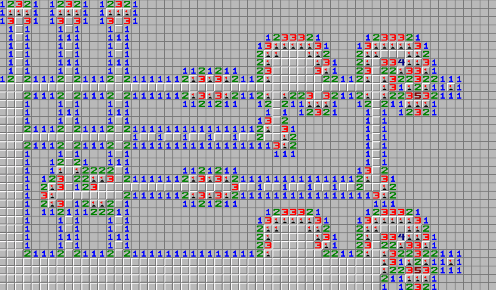
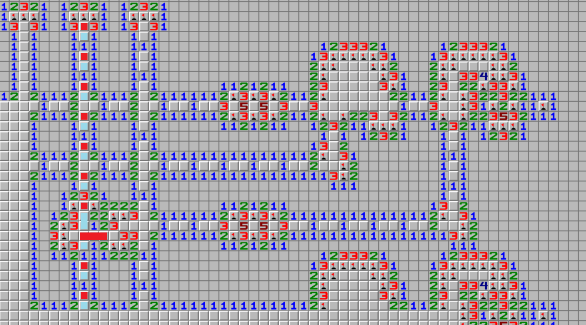
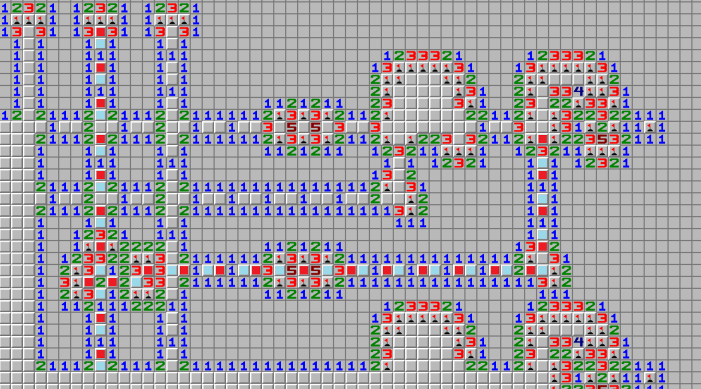
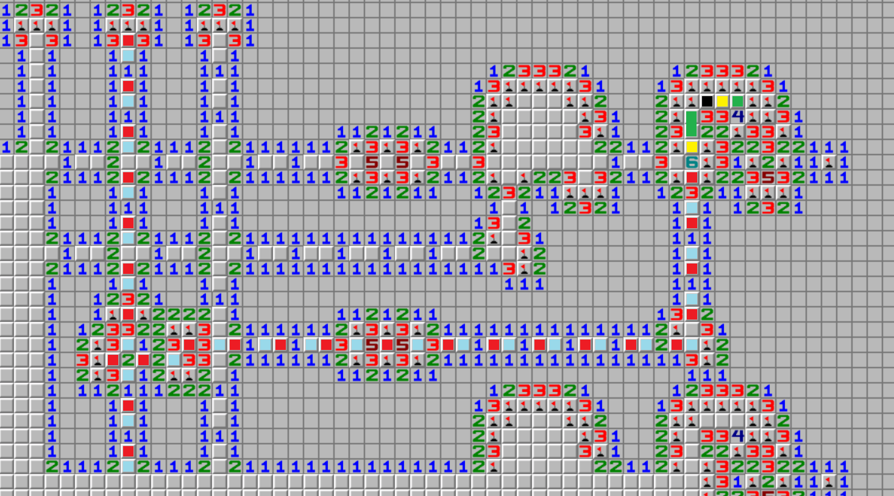
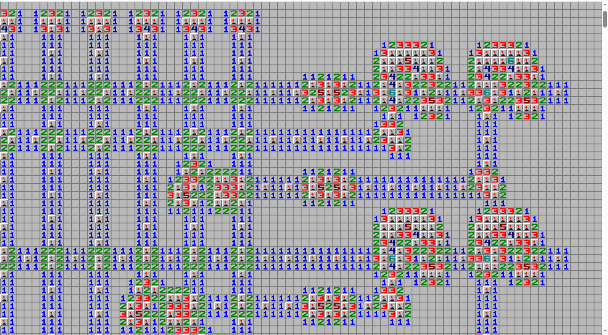
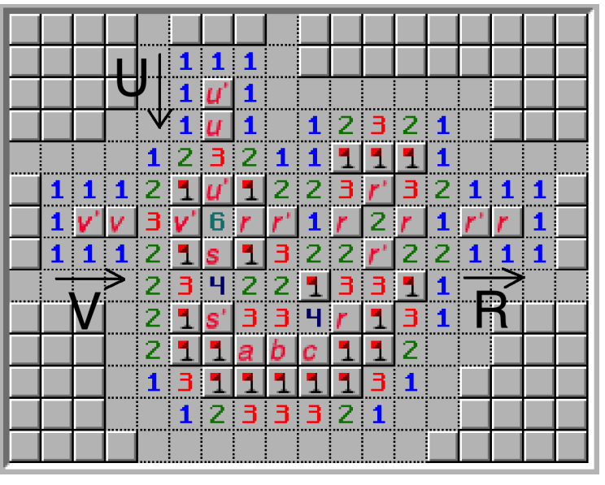

# [Algorithm] 扫雷III

- 命题人：ranwen
- 题目分值：350 分

## 题目描述

<blockquote>
<p>大型纪录片《扫雷》持续为您播出……</p>
</blockquote>
<p>前两届 PKU GeekGame 的扫雷题都被大量选手秒杀。五星上将麦克阿瑟回忆前两次题目的特点，试图找出为什么有这么多选手都能快速秒杀。</p>
<p>仔细思考后，五星上将麦克阿瑟发现了这两次题目都如下缺陷：</p>
<ul>
<li>
<p>生成过于依赖随机数，选手似乎总能看破随机数生成器的规律。</p>
</li>
<li>
<p>地图太小，只有几千个方格怎么能拦住选手呢。</p>
</li>
<li>
<p>雷数太少，选手轻松点几下就能做出题目了。（就连隔壁比赛的拥有大量雷数的大型扫雷也丝毫不会影响选手的切题速度）</p>
</li>
<li>
<p>结束后显示全部的雷，选手可以总结上一盘经验备战下一盘，提高胜率。</p>
</li>
</ul>
<p>五星上将麦克阿瑟总结上述经验，准备了一道全新的扫雷题。<strong>完成扫雷即可获得 Flag。</strong></p>
<p>在本题中，你会见到：</p>
<ul>
<li>
<p>超大棋盘，总共有大约十万格等待你发掘。</p>
</li>
<li>
<p>超多雷数，你需要找到大约一万个雷。</p>
</li>
<li>
<p>不够随机，你无法看透地雷的分布规律。</p>
</li>
<li>
<p>战争迷雾，踩雷爆炸后你也不能看到其他的雷，也不能继续操作。</p>
</li>
</ul>
<p>由于本次题目雷区过大，我们专门为你配备了一个扫雷机器人。这个机器人可以帮你完成一些简单的扫雷工作：机器人会搜索整个雷区，对于容易确定的雷会帮你进行标记、对于容易确定的空地会帮你打开。你也可以一次让扫雷机器人搜索多次。为了保证机器人不会因为玩家的错误操作而报废，机器人只会识别他自己标的雷（即你自己不能亲自标雷）。</p>
<p>题目操作方式：左键打开格子，右键使用机器人探测。</p>
<p><strong>补充说明：</strong></p>
<ul>
<li>由于扫雷游戏的特点，本题后端只会串行处理请求。因此<strong>同时发送多个请求不会提高速度</strong>，反而可能导致前端失去同步而全部重新渲染，造成卡顿。</li>
<li>如果你写了一个 JS 脚本直接在页面上运行，可以开一个新标签页并定时刷新来观测游戏进度。</li>
<li>出题人的串行脚本可以在 5 分钟内解出此题。</li>
</ul>
<div class="well">
<p><strong>第二阶段提示：</strong></p>
<ul>
<li>你需要了解一些扫雷的中阶技巧，可以思考一下格子内数字的含义，并做一些计算和推演。</li>
<li>显然题目雷区是由固定的几类元件以固定的排布方式组成的，可以结合猜测做一些尝试，了解元件的类型以及它们的作用。</li>
<li>可以尝试解决以下使用与本题类似方法生成的地图，这可能对你熟悉扫雷游戏有一定帮助。此图是有唯一解的。
</li>
</ul>
</div>


**【网页链接：访问题目网页】**

## 预期解法

~~当然是手扫扫完了~~

### 选手的视角

首先你至少需要对扫雷游戏有一定了解，例如你需要知道数字的含义，其表示的是周围8格内雷的个数。这意味着每个数字都可以写成一个整数等式，其中未知量表示某个格子有没有雷，且未知量只能取0或1的整数。

知道这些后，你就应该会"做减法"了。例如提示图中，左边的两个1分别表示左边两个格子只有一个雷、左边三个格子只有一个雷，对这两个等式操作一下，就可以推出第三个格子一定不是雷。

借助这些技巧，我们就可以开图了。随便点开边缘的一个格子，能看出来棋盘明现是以特定方式生成的。我们用上述的技巧(实践中会更复杂，但道理上都是做方程的加减法)，以右上角最具有多样性的区域为例，来观测一下棋盘到底是怎么组成的。注意我们可以借助扫雷机器人来完成一些简单的大规模标记，但是需要类似做减法之类的复杂需求还是要亲自点。同时本题推测一些元件的内容需要猜测，但总题并不难猜且容易验证正确性。

注意到我们参考提示，或者观测地图中最上方部分的部分，我们可以发现地图中有大量的**线状**结构，这部分的特征是两边都有一排1，而中间的格子是不确定的。借助这个观测，我们可以再多开一点地方：如果遇到了一排1，则说明应该是有线状结构，我们跳过中间不确定那一行，把线的另外一边也开了。



我们再观察地图，首先可以看出来，所有的线状结构，内部都是两格不确定的然后接一个1的空位。但是线状结构和其他元件交错的地方是不确定的。但我们观测发现，所有的元件以及线都是对齐的，这意味着穿过元件后的线仍然能保持相位(即不同得线空位是对齐的)，当然穿过原件的部分我们不好确定。我们借助观测出来的对齐的性质，可以再开几个方块。

同时在上图中，最右侧的3的左边一定是雷(这个推断比较麻烦)，由于我们不能标雷，因此文本说明一下，上侧的线结构也是可以被推断的(左侧的相同元件同理)

对于中间出现的元件，我们可以观察到内部的3，意味着中间行的三个格子中，只有一个是雷。我们参考线的结构(尽管有一定差别)，可以猜测3中间的格子一定是空的。点开后发现全都是5，这意味着左右两侧的空格中只有一个雷，也很符合我们"类似线"的猜测。

之后我们便可以对图再做推理。我们以右侧第二列和最后一行为例(由于他们中间存在的这个复杂元件，且最后一行与左边列没有线了，我们可以猜测他们是相关的，而其他的行列是无关的)，分析哪些雷一定同时存在。由于我们此时分析的情况比较简单，只分析能被简单确定的格子，因此我们对格子使用红色或者蓝色矩阵覆盖掉，其中相同颜色表示这些地方一定同时存在雷或同时不是雷，颜色不同表示一定有一个是雷。我们假设最上方不能确定的格子是红色的。如果一个矩阵覆盖了多余一个格子，则表示他们的雷数加起来和别的红色或者蓝色一样多(这也是上述扫雷技巧的更复杂版本)。



我们发现，这一行和这一列确实是有关的，我们不妨称这个使他们相关的结构为**分线器**。有了之前猜测的经验，我们不难继续猜测，对于图中一个矩形覆盖多个格子的，一定只有一个格子不一定是非空的(例如下面一个覆盖三个格子的红色矩形，我们认为只有一个格子和红色格子的雷状态一样，而剩下两个一定是空的)。因此我们需要猜测哪个格子一定是空的。当然我们可以从右边那个看起来人畜无害的交叉点猜测，我们认为那个3底下一定是空的。此时我们就可以开出所有的未知格了。因此我们继续做染色。



我们可以观测到，经过中间那个元件后，尽管看起来线的相位一致，但是内部颜色的顺序换了。因此如果我们把线视作**传导信号**的线的话，那么这个元件就是数字电路的**非门**。而我们再观测最右边那个元件，显然这个元件和左侧的元件是一样的，而他们取左侧和下侧的线作为信号输入，以右侧的线作为信号输出(在最右侧的元件中，输出是恒定的)。我们猜测这也是个逻辑门。

当然此时如果你直接上网搜minesweeper circuit，就已经可以搜出来这个是什么门了，这是一个现成的设计。我们这里假装不知道。

此时我们换一个颜色，做更复杂的推断。我们使用黑色表示一定是雷，用黄色和绿色表示两对颜色。同时我们又发现，这个元件输入端的3x3矩阵里面居然有一堆雷，其中两个是输入信号，四角的应该是固定值。我们猜测中间那个格子一定是数字，剩下两个是其他信号，这样的话就可以表示出这四个信号的关系了。点开后发现是6，这意味着剩下的四个信号加起来一定是2(同时在最右侧的元件中，由于输出信号已知，即剩下三个信号加起来一定是1)。



注意到这已经说明了一个问题：这意味着在最右侧的元件中，两个输入的信号中，一定不可能同时为1。考虑到这个元件右侧的输出是恒定的，如果我们认为这是0，那么这和NAND门的行为是一致的。当然我们也可以认为他输入的是负信号，那么他就是一个OR门。既然我们已经做出来这个猜测了，那么他左侧那个类似的元件也可以认为是一个OR门。

我们前文中也已经发现了横线和竖线的关系了。经过大范围的点击猜测，我们不难发现整个地图是一个网格布局的：总共有18个竖列表示位置量，其在某个位置会引出一条横线到最右侧，然后可能经过一个非门，之后参与到NAND门运算后输出0。当然我们不妨假设输入都是负信号，那么就变成了每组三个变量，OR起来后输出1。至此我们已经发现，这个问题似乎就是一个3SAT问题。因此我们可以先点击出网格布局，之后便可以求解出每一组内的变量都是哪些未知量，以及是否经过了非门。具体地，就是3SAT约束本身。

之后我们写一个脚本，把整个网格状地图点开，读出变量并求解。之后在地图上点出一部分未知量中没有雷的网格，让扫雷机器人自动扫就可以扫出大部分剩下的网格(显然简单的线状结构，当未知量已被算出的时候是很容易推断的)，注意到分线器的结构是较难推断的，因此我们在横行和竖列都要点一下。

做完后我们发现，只有部分与门的地方存在少量的未被点出的块。这块我们手推断一下然后手点就好了。当然你要是已经观测出了门的构造方法也可以写脚本点。之后就可以拿到flag了。~~为什么会有选手复制不了alert的文本，以及看源码的话能看出来我还好心帮忙在控制台里面输出了一下，而且成功后再点也是可以重新拿到flag的~~

### 出题人的视角

先给大家看一看上帝视角的完整地图以及与门的设计。





对没错这个设计是我直接网上抄的。因为这个设计似乎是最简单的设计了(需要使用结果反馈做不等式约束)。

关于题目、电路、元件设计思路：

几年前在网上看到Minesweeper可以变成电路问题后就想出这题了。到后来才发现最近两年其实已经有好几场ctf比赛出过类似的题目了(虽然没有形式一致的)。当然考虑到这是一个比较有历史的idea了，倒也正常。

之后是考虑要设计什么样的电路。显然电路必须要每次随机生成，不然很容易就试出来每个变量的值了。随机生成电路时，一个一定要满足的要求是必须能保证电路的合法输入是唯一存在的，经常玩高级扫雷的选手都知道打到最后二择有多痛苦。因此我希望选手在获得电路构造之后能唯一确定答案。如果是完全随机的生成条件约束，那么不管是高效的确定唯一性(同时地图还不能太大)还是地图布线，都非常麻烦。而我又希望保留电路问题的复杂性，不能让选手直接从后往前递推就推出来了(在机器人的帮助下可能只需要亲自点几下)，必须得把电路全部开出来才能获得答案。最后选择了3SAT问题作为电路的约束方式。使用3SAT既能表示足够复杂的问题(毕竟是NP的)，同时也很容易做规则的布线(也就是最终呈现出来的网格状布线)。

在真正开始布线的时候又比较麻烦了。实际上网上其他大部分人设计的元件并不会考虑相位问题，直接拿来用肯定是会有对齐问题的。好在通过研究后发现设计一些调节相位的元件并不难。我们自己设计一些元件就好。

设计元件的思路也比较简单。一个是要充分利用等式的功能，来做信号传递。另外一个是要设计"遮蔽"，通过把某些可能泄露额外关系的数字变成固定的雷，就可以不泄露了。在本题中，分线器，以及非门都是经过这类思想改造的设计。而对于更复杂的元件，如或门的设计就比较复杂，因为它引入了一些非线性性质。我们可以观察上述与门的设计，下面abc那一段，实际上是做了一个`s'+r>=1`的约束。这本质是利用每个数字的值域和他们的线性组合来凑出的一个非线性约束的不等式。我们利用这个设计也能设计出其他更复杂的门。当然，在这个基础上做尝试重新设计与门的话，似乎很难设计出和这个一样简洁的构造。

比赛中有不少人做出了这题，还是比较符合预期的。不太符合预期的是第一位居然是熬夜手点点出来的。当然，虽然这位选手是手点，但他其实也是看出了SAT问题的本质的。只是因为本题唯一解的性质恰好保证了可以枚举少数变量的值，然后直接从右侧逆推其他值，这也使得不得知全部电路就解出此题变为可能。有一些选手似乎并没有看出这题的全部构造，但只要看出来了线的传递性，利用这个性质最后也是能做出来。还有一位选手说他以为自己是误打误撞运气好做出来的，因为他以为最终归约到的是一个01整数规划问题，不是别人说的SAT问题。但实际上它确实也是01整数规划问题，毕竟最后或门的条件就等价于三个信号加起来大于或等于1。

我在比赛中间添加了一个关于出题人脚本求解时间的信息。是因为我发现有大量选手都在尝试做无意义的尝试，最后居然导致这一道题的流量就已经比其他所有题加起来还多了。而我的串行脚本只需要一千多次请求，在校内只需要三分钟左右就能跑完。实际上这个脚本可以再多做一点优化，例如把电路扫描部分改成二分，这样请求数还能少很多。

本题的地图实在是太大了，导致如果每次请求都完整发送棋盘的话，网络流量会爆炸，因此我选择传输差分的方式。但是传输差分的话，对于某些选手的并行脚本来说会出错，所以最后我在比赛中调整了程序，加了同步锁与强制校验，这使得操作起来可能稍微有点卡。还有的选手自己发送了非法请求导致题目炸掉了，然后说我题目锅了，这让我不太爽(当然最后还是修了)。~~总之就是我的题目环境没出锅，都是选手的问题~~

另外出题人不会写js，都是(和copilot)乱糊的，请选手谅解。

### 一键脚本
```python
import requests
import json
import time
from hashlib import md5

board = None
n = None
m = None
remainb, remaing, gstatus = None, None, None

URL = "https://prob12-xxxxxxxx.geekgame.pku.edu.cn/"

RTIMES = 0

req = requests.Session()

RAW = ""


def getboard(txt=None):
    global board, n, m
    global remainb, remaing, gstatus
    global RAW
    if txt is None:
        txt = req.get(URL+"/get_board").text
    RAW = txt
    obj = json.loads(txt)
    typ = obj["type"]
    if board is None:
        assert typ == 0
    n, m = obj['sizex'], obj['sizey']
    remainb, remaing = obj['remainb'], obj['remaing']
    gstatus = obj['status']
    if "flag" in obj:
        print("flag:", obj["flag"])
    if typ == 0:
        xb = obj["board"]
        board = [list(x) for x in xb]
    elif typ == 1:
        diff = obj["board"]
        for x in diff:
            board[x[0]][x[1]] = x[2]
    else:
        assert False
    hashed=md5(("".join(["".join(x) for x in board])).encode()).hexdigest()
    if hashed != obj["hash"]:
        print("HASH ERROR")
        return getboard()
    return board


def doopen(x, y):
    global RTIMES
    if board[x][y] != ".":
        return
    RTIMES += 1
    r = req.post(URL+"/open", data={"x": x, "y": y})
    ret=getboard(r.text)
    assert ret[x][y] != "."
    return ret


def dodetect(times=1):
    global RTIMES
    RTIMES += 1
    r = req.post(URL+"/detect", data={"times": times})
    return getboard(r.text)


def printinfo():
    print(n, m, remainb, remaing, gstatus)


getboard()
printinfo()

cons = n//21
assert n % 21 == 5
nvar = 18

doopen(0, 0)
printinfo()

constriants = []

for i in range(0, cons):
    nc = []
    for j in range(3):
        print(i, j)
        curx = 8+21*i+j*6
        cuv = None
        for k in range(nvar):
            cury = 8+6*k
            doopen(curx, cury)
            hgate = (board[curx+1][cury] == '2')
            if hgate:
                cuv = k
                break
        assert cuv is not None
        doopen(curx+1, 8+6*nvar+2)
        hnot = (board[curx+1][8+6*nvar+2] == '1')
        nc.append((cuv, hnot))
    print(nc)
    constriants.append(nc)
    printinfo()

ansc = None

for st in range(2**nvar):
    cun = []
    for i in range(nvar):
        cun.append((st >> i) & 1)
    flag = True
    for nc in constriants:
        nf = False
        for x in nc:
            tv = cun[x[0]]
            if x[1]:
                tv ^= 1
            nf = nf or tv
        flag = flag and nf
        if not flag:
            break
    if flag:
        # print(cun)
        assert ansc is None
        ansc = cun
        # break

print(ansc)

for i in range(nvar):
    cury = 5+6*i
    curx = 3
    if ansc[i]:
        curx += 1
    print(i)
    doopen(curx, cury)


def process3select(midx, midy, a, b):
    # a=1 b=1: **6
    # a=0 b=1: *5*
    # a=1 b=0: *5*
    # a=0 b=0: 6**
    male = int(a)+int(b)
    doopen(midx, midy-1+male)
    print(a,b,midx,midy-1+male)


def processcenter(midx, midy, a, b):
    c = a | b
    if not c:
        doopen(midx, midy+1)
    if not(a and b):
        doopen(midx-1, midy)
    doopen(midx, midy)


for i in range(cons):
    nc = constriants[i]
    print(nc, ansc[nc[0][0]], ansc[nc[1][0]], ansc[nc[2][0]])
    for h in range(3):
        curx = 11+21*i+h*6
        cury = 8+6*nvar-2
        if ansc[nc[h][0]]:
            cury -= 1
        print(i, h)
        doopen(curx, cury)
        doopen(curx, 8+6*nvar-4)
    curx = 7+21*i
    cury = 8+6*nvar+12
    v1 = ansc[nc[0][0]] ^ nc[0][1]
    v2 = ansc[nc[1][0]] ^ nc[1][1]
    v3 = ansc[nc[2][0]] ^ nc[2][1]
    print(v1, v2, v3)
    process3select(curx, cury, v1, v2)
    # processcenter(curx+4, cury-2, v1, v2)
    cury += 12
    process3select(curx, cury, v1 | v2, v3)
    # doopen(curx+4, cury-4)
    # if v1 | v2:
    #     doopen(curx+4, cury-3)
    # else:
    #     doopen(curx+4, cury-5)

for i in range(1000):
    st = time.time()
    bd = dodetect(10)  # 服务器太卡了
    et = time.time()
    print(et-st)
    o = json.loads(RAW)
    if o["type"] == 1 and len(o["board"]) == 0:
        break

print("FIN1")

for i in range(cons):
    nc = constriants[i]
    curx = 7+21*i
    cury = 8+6*nvar+12
    v1 = ansc[nc[0][0]] ^ nc[0][1]
    v2 = ansc[nc[1][0]] ^ nc[1][1]
    v3 = ansc[nc[2][0]] ^ nc[2][1]
    processcenter(curx+4, cury-2, v1, v2)
    cury += 12
    doopen(curx+4, cury-4)
    if v1 | v2:
        doopen(curx+4, cury-3)
    else:
        doopen(curx+4, cury-5)

for i in range(1000):
    st = time.time()
    bd = dodetect(10)
    et = time.time()
    print(et-st)
    o = json.loads(RAW)
    if o["type"] == 1 and len(o["board"]) == 0:
        break

print(RTIMES)

```