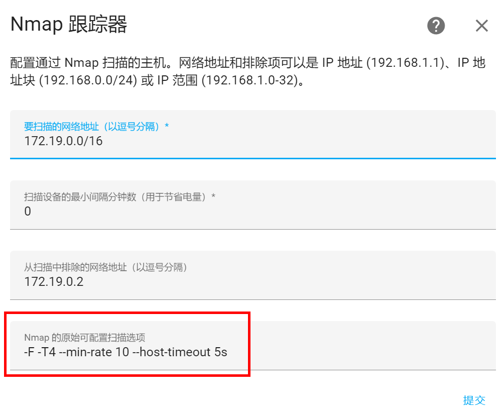
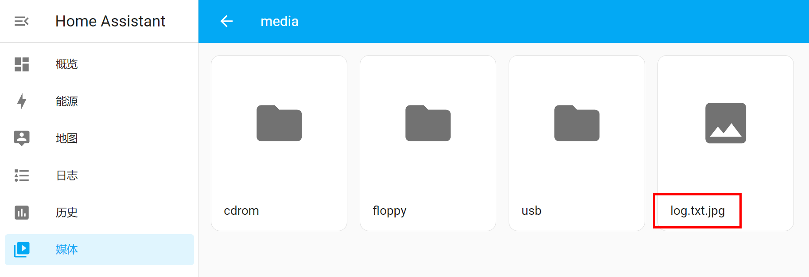
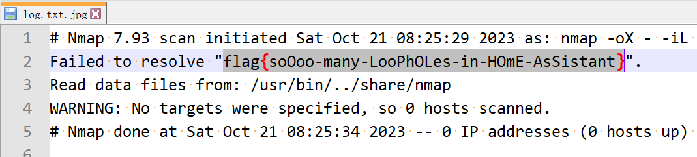
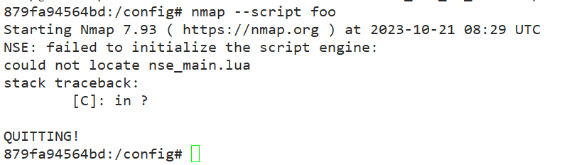
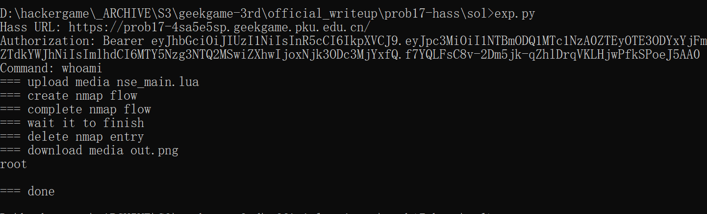
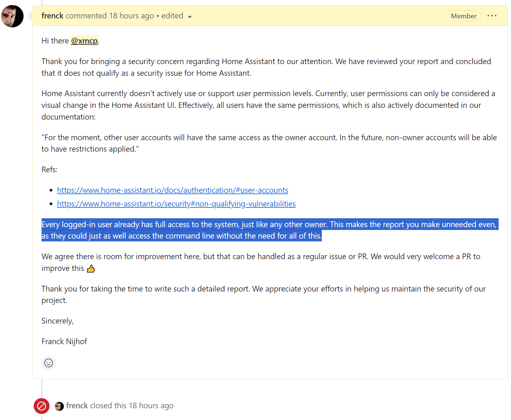

# [Web] 逝界计划

- 命题人：xmcp
- 题目分值：350 分

## 题目描述

注意看，眼前的这个人叫小帅，他是 PKU GeekGame 的平台运维客服，正坚守在平台机房内查看运行状况。

小帅的生活很辛苦。每年都有很多选手为了抢一血在<ruby>凌晨一点<rt>25時</rt></ruby><ruby>熬夜<rt>ナイト</rt></ruby><ruby>写代码<rt>コード</rt></ruby>，因此小帅不得不半夜睡在机房，遇到问题好随时处理。机房的电灯开关在楼下的配电室，操作不便，小帅为此设置了一套智能家居系统 <a target="_blank" rel="noopener noreferrer" href="https://www.home-assistant.io/">Home Assistant</a> 管理电灯开关。

     
    ↑ GeekGame 平台机房（示意图） / &copy;视觉沙勒

小帅在自己的电脑安装上 Home Assistant，惊叹道这个系统极为先进，在网页上点点鼠标就能自动控制智能设备、存储多媒体文件，甚至还能执行任意 Jinja 模版、用 nmap 扫描内网……既然这些功能都能做到，那 <strong>读取服务器磁盘中的 /flag.txt</strong> 也不难做到，对吧？

正所谓 It's not a bug, it's a feature. 点击屏幕下方小黄车，试试就逝世。

<strong>补充说明：</strong>

<ul>
<li>好消息：解出本题无需写任何代码，只需利用 Home Assistant 网页上的已有功能；坏消息：Home Assistant 的已有功能实在是太多了。</li>
<li>解出本题<strong>不依赖于内网其他设备</strong>。</li>
<li>建议选手下载源码在本地运行，以方便调试（例如 <code>docker exec -it hass /bin/bash</code>）。</li>
</ul>

<strong>提示：</strong>

<ul>
<li>为了安全性，大多数与读写文件相关的集成都无法直接从Web界面添加。但是有一个集成看似与读写文件无关，却能顺便做到读写文件……</li>
</ul>

<strong>第二阶段提示：</strong>

<ul>
<li>……那就是大家都喜欢的 <code>nmap</code> 集成。</li>
<li>你可能想用 <code>nmap --script</code> 执行任意脚本，但可惜它的 Docker 里没装完整的运行环境。试试别的方式吧。</li>
</ul>

**【网页链接：访问题目网页（用户名密码均为 geekgame）】**

**[【附件：下载题目源码（prob17-src.zip）】](attachment/prob17-src.zip)**

## 预期解法

Home Assistant 真的是一个很神奇的项目，它具有各种神奇的功能，就比如题面说的执行 Jinja 模板和用 nmap 扫描内网，简直就像是在服务器上种了 10 个 Webshell 然后又安装了 20 个 WAF，似乎什么都能干，又似乎什么都不能干。

那么，当我们拿到了一个 Home Assistant 的登录权限，看看我们能干些什么：

- 在 “开发者工具” 里面可以测试 Jinja 模板。一眼看上去就能执行任意代码，但实际上不行，因为它用了 [Jinja 的 Sandbox](https://jinja.palletsprojects.com/en/3.1.x/sandbox/)，还挺安全的。
- 在 “媒体” 里面可以上传下载 `/media` 目录下的任意文件。
- 在 “配置”>“备份” 里面可以打包下载 `/config` 目录。在 “配置”>“日志” 里面可以查看当前日志。
- 在 “配置”>“设备与服务” 里面可以添加集成。在 Web 界面里可以添加的集成实在是太多太多了，说几个好玩的：
  - 本地 IP 地址，顾名思义可以查看自己的 IP 地址
  - 通用摄像头，可以发起内网 RTSP 请求
  - 文件大小，可以查看本地任意文件的大小，但是[对路径有限制](https://github.com/home-assistant/core/blob/dev/homeassistant/components/filesize/config_flow.py#L30)
  - 正常运行时间，可以查看服务器的 uptime
  - ASUSWRT，可以 SSH 连接到内网
  - CPU 速度，可以……嗯……查看 CPU 速度
  - MQTT，可以发起内网 MQTT 请求
  - Nmap 跟踪器，可以运行 Nmap 命令
  - Profiler，可以输出各种各样的诊断信息
  - Scrape，可以发起内网 HTTP 请求
  - SQL，可以用 SqlAlchemy 执行任意 SQL 命令

好吧，看起来确实似乎什么都能干，但粗看下来这些功能恰好都无法读取 `/flag.txt` 文件。

因此我们需要考虑能否滥用这些功能。比如，让 Scrape 集成访问 `file:///` 网址，让 SQL 集成通过某些神奇的 SQL 函数读取文件，让 Profile 集成泄露内存里的敏感信息，让 Nmap 集成……

等等，这个 Nmap 集成可以传递任意命令行参数？？？

通过[源码](https://github.com/home-assistant/core/blob/dev/homeassistant/components/nmap_tracker/__init__.py#L312)也可以确认它直接把这里配置的命令行参数直接传递给了 nmap。虽然很遗憾此处没有直接的命令注入，无法借机运行其他程序，但 nmap 的自身功能可是多了去了，足够让我们爽到。比如：

- 读取任意文件（`-iL /path/to/read`）
- 写入任意文件（`-oN /path/to/write`）
- 执行任意命令（`--script /path/to/exec.lua`）

要想解出此题，只需要利用 nmap 的前两个功能，直接在命令行参数里面来一个 `-iL /flag.txt -oN /media/log.txt.jpg`，然后在媒体里面把结果下载下来即可。或者输出到 `/config` 里面通过备份功能下载下来，思路是类似的。

但是，只读取个文件太无聊了，能不能来点更给力的？那让我们试试看执行任意命令吧。如果直接尝试往 `/media` 里面传一个 NSE（本质上是 lua）脚本然后用 `--script /media/script.nse` 去执行，是行不通的，因为 Home Assistant 的 Docker 里并没有安装 NSE 的执行环境，所以会报错：

可以看到它试图首先运行 `nse_main.lua`，但可惜找不到，所以报错了。那么这个文件是从哪里找的呢？[阅读源码](https://github.com/nmap/nmap/blob/master/nmap.cc#L2583)可以发现[它寻找的路径](https://github.com/nmap/nmap/blob/master/nmap.cc#L2656)允许通过 `--datadir` 去配置。因此，如果我们能往 `/media` 底下传一个 `nse_main.lua`，然后设置 `--datadir /media`，就可以执行任意 lua 脚本了。

在往 `/media` 上传的时候注意要把文件的 mimetype 设置成图片，除此之外就没什么要注意的了，可以验证通过这种方法确实能执行任意 lua 脚本。

我利用这个漏洞制作了一个脚本 [exp.py](sol/exp.py)，可以一键执行任意 shell 命令。效果如下：

## 花絮

我把这个漏洞报告给了 Home Assistant 团队，但是他们表示登录之后能干任何事情都不算安全漏洞。

好吧，既然他们认为不算安全漏洞，那我就放心地把攻击脚本发出来好了。

另外此题 4qwerty7 还有另一个解法，可以通过 blueprint 的路径穿越漏洞覆盖 configuration.yaml，也能实现执行任意命令。可以去看看他的 Writeup。