# [Tutorial] 小北问答!!!!!

- 命题人：PKU GeekGame 第三季制作委员会
- 半份 Flag：150 分
- 整份 Flag：150 分

## 题目描述

<p>菜宝曾是 PKU GeekGame 的资深出题人。在这届比赛中，新人小祥加入了出题队伍，并包揽了总数三分之一的题目。看着自己昔日的伙伴很快和小祥打成一片，菜宝内心很不是滋味。</p>
<blockquote>
<p>字幕 &amp; 旁白：“觉得 GeekGame 开心，我一次都没有这样想过”</p>
</blockquote>
<p>在凌晨的海底捞，独自一人，坐在角落嗦粉。与出题组告别后的菜宝喝完了一罐又一罐碳酸饮料。</p>
<blockquote>
<p>道具注意要用那种细长的易拉罐，喷成黑色</p>
</blockquote>
<p>突然，手机屏幕亮起。“至少让我当面向你道歉好吗？我也吓了一跳，不知道事情会变成那样……所以我想好好解释一下。”</p>
<blockquote>
<p>屏幕特写，需要额外补光照亮桌面细节</p>
</blockquote>
<p>原来这届比赛还缺一道小北问答作为<strong>考察情报搜集能力</strong>的题目，出题组正一筹莫展。小北问答是 PKU GeekGame 的传统题目，PKU GeekGame 不能失去小北问答，就像东方不能失去博丽灵梦。</p>
<blockquote>
<p>屏幕特写，展示微信发送语音界面，剪辑时注意人声要和对讲机动画同步</p>
</blockquote>
<p>“那……一辈子的小北问答，能陪我出吗？”</p>
<blockquote>
<p>切片尾曲《花の塔》，前奏做 3s 渐入</p>
</blockquote>
<p>啊对，因为故事的背景在海底捞，所以小北问答除了<strong>答对所有题目</strong>可以获得整份 Flag 之外，<strong>答对一半题目</strong>还可以获得半份 Flag。</p>
<div class="well">
<p><strong>第二阶段提示：</strong></p>
<ul>
<li>第四题：比赛平台使用的 Python 版本是 3.8。有很多在线运行 Python 的网站，甚至 <a target="_blank" rel="noopener noreferrer" href="https://godbolt.org/">Compiler Explorer</a> 都能运行各种版本的 Python。</li>
<li>第五题：除了 <a target="_blank" rel="noopener noreferrer" href="https://web.archive.org/">web.archive.org</a> 以外，也可以在其他地方找到一些蛛丝马迹，只不过比较麻烦。比如……2011 年的拜年祭？</li>
<li>第六题：这个照片并非在拍摄会议的会场，而是背对着会场在拍摄对面的建筑。你需要先找到会场，然后再找到对面的建筑。</li>
</ul>
</div>

**【网页链接：访问题目网页】**

## 预期解法

> **[1] 在北京大学（校级）高性能计算平台中，什么命令可以提交一个非交互式任务？**
>
> 答案格式：`^[a-z]+$`

首先搜索这个平台：

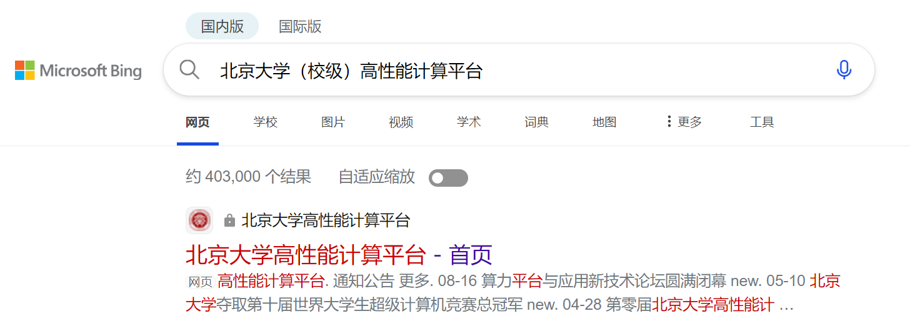

进入官网，点【使用指南】>【上级流程】。

然后看看目录：

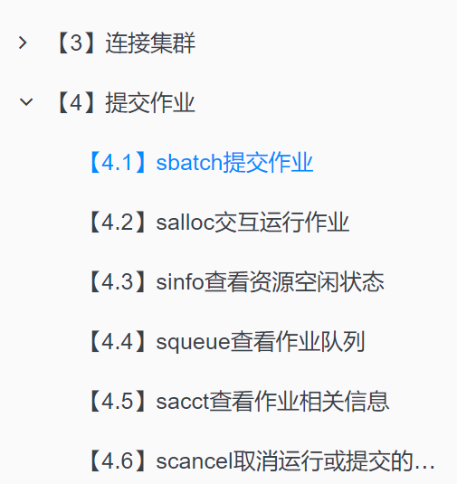

得到答案 `sbatch`。

> **[2] 根据 GPL 许可证的要求，基于 Linux 二次开发的操作系统内核必须开源。例如小米公司开源了 Redmi K60 Ultra 手机的内核。其内核版本号是？**
>
> 答案格式：`^\d+\.\d+\.\d+$`

首先搜索到小米的内核源码：


然后发现小米的所有手机内核源码都在这个项目里，在 README.md 里找到这款手机对应的分支名称：

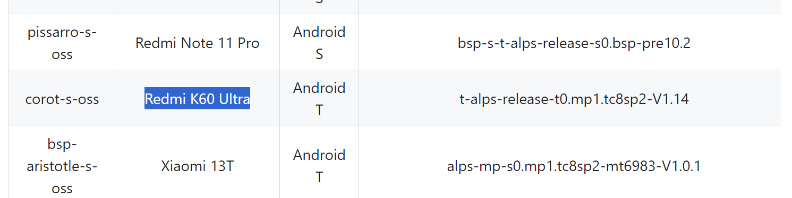

进行一个切换：

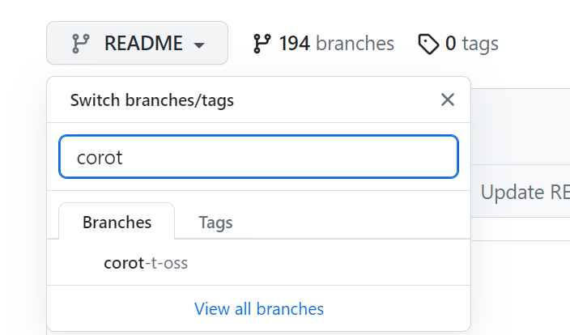

那么怎么看内核版本号呢？[在 Stack Overflow 上可以找到一个回答](https://stackoverflow.com/questions/12151694/where-do-i-find-the-version-of-a-linux-kernel-source-tree)：

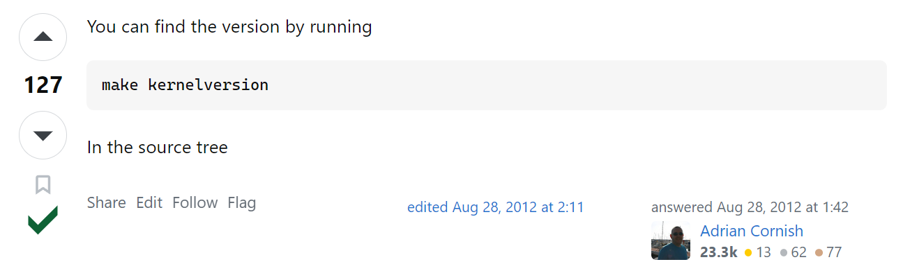

那我们直接点开 Makefile 一看，前三行就是了：

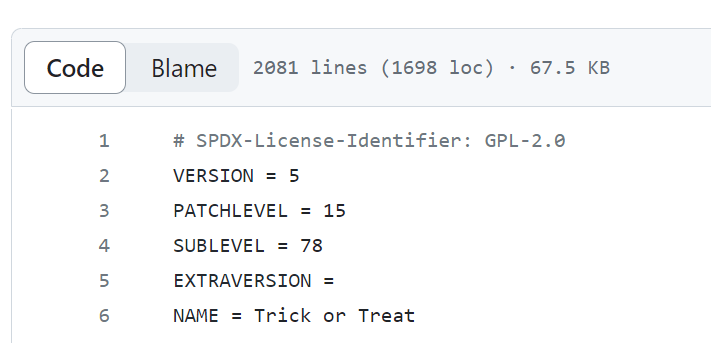

得到答案 `5.15.78`。

> **[3] 每款苹果产品都有一个内部的识别名称（Identifier），例如初代 iPhone 是 `iPhone1,1`。那么 Apple Watch Series 8（蜂窝版本，41mm 尺寸）是什么？**
>
> 答案格式：`^[a-zA-Z\]+\d+,\d+$`

有很多网站会收录苹果产品的各种信息。我个人感觉界面比较好看的是 [appledb.dev](https://appledb.dev/device-selection/)。直接翻到题目要求的型号：

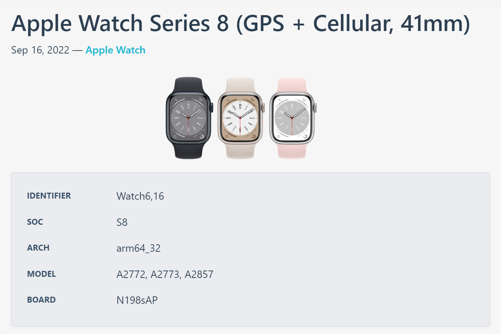

得到答案 `Watch6,16`。

什么？你不知道这个网站？必应搜索 `"iphone1,1"`，就能找到很多类似的网站。

> **[4] 本届 PKU GeekGame 的比赛平台会禁止选手昵称中包含某些特殊字符。截止到 2023 年 10 月 1 日，共禁止了多少个字符？（提示：本题答案与 Python 版本有关，以平台实际运行情况为准）**
>
> 答案格式：`^\d+$`

首先在比赛平台页面底部找到【开放源代码】，可以一路找到[后端源码的仓库](https://github.com/PKU-GeekGame/gs-backend)，直接搜索 “昵称”，直接快速定位到对应逻辑：

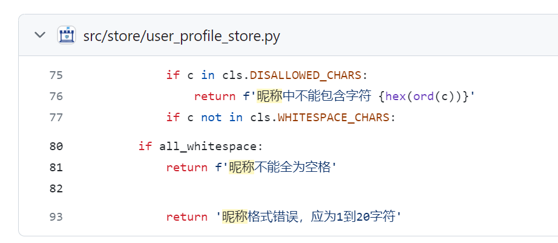

那么显然答案就是在问 `DISALLOWED_CHARS` 这个东西有多少个字符了。把代码稍微梳理一下：

```python
from unicategories import categories

def unicode_chars(*cats: str) -> Set[str]:
    ret = set()
    for cat in cats:
        ret |= set(categories[cat].characters())
    return ret

EMOJI_CHARS = (
    {chr(0x200d)}  # zwj
    | {chr(0x200b)}  # zwsp, to break emoji componenets into independent chars
    | {chr(0x20e3)} # keycap
    | {chr(c) for c in range(0xfe00, 0xfe0f+1)} # variation selector
    | {chr(c) for c in range(0xe0020, 0xe007f+1)} # tag
    | {chr(c) for c in range(0x1f1e6, 0x1f1ff+1)} # regional indicator
)

DISALLOWED_CHARS = (
    unicode_chars('Cc', 'Cf', 'Cs', 'Mc', 'Me', 'Mn', 'Zl', 'Zp') # control and modifier chars
    | {chr(c) for c in range(0x12423, 0x12431+1)} # too long
    | {chr(0x0d78)} # too long
) - EMOJI_CHARS
```

什么？提示说与 Python 版本有关，但这哪里有关啊？实际上可以看看 `unicategories` 的源码，发现它是对标准库 `unicodedata` 的简单包装。而[这个标准库的数据版本是随 Unicode 版本更新的](https://docs.python.org/3/library/unicodedata.html)，比如 Python 3.12 对应的是 UCD 15.0.0：

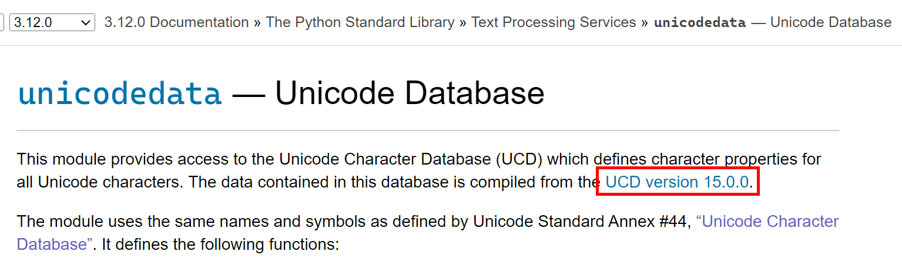

再看看别的版本，3.11 用的是 14.0.0，3.10 和 3.9 用的都是 13.0.0，3.8 用的是 12.1.0。更低的不需要看了，因为比赛平台的后端最低只支持 Python 3.8：

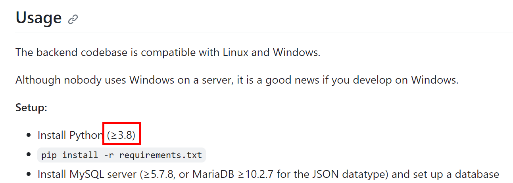

可想而知，随着 Unicode 每年乱扔垃圾的行为，越来越多的字符会被加入到这个数据库中（然后其中的一个子集被禁止）。那么此题可能有 4 种不同的答案，与平台实际运行的 Python 版本有关。

怎么知道平台实际运行的 Python 版本呢？一个思路是直接在平台上尝试。这句话的意思当然不是每个字符挨个尝试，事实上你只需要随便找任何一个在 Python 3.x 没有、在 Python 3.(x+1) 里有的字符，然后去平台上修改自己昵称，看看成功不成功就行了。如果二分查找的话只需要实际在平台上尝试两次。

这里还有一个技巧，就是为了避免冷却 60s，可以故意在昵称结尾放一个已知的非法字符。比如说你已知 `\u0d78` 是非法字符，想测试 `\u1234`，就把昵称修改为 `\u1234\u0d78`。因为后端的判断逻辑是一个循环：

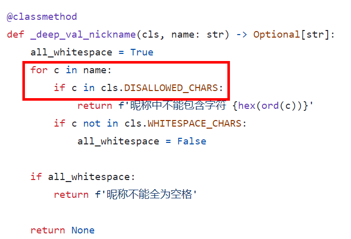

因此可以从报错信息中进行判断，如果提示 `昵称中不能包含字符 0xd78`，就说明前面的 0x1234 是合法的。这样修改昵称一定会报错，因此不会陷入冷却。

当然，如果你对这样是否属于攻击比赛平台的违规行为有疑问，大可直接把 4 种答案都尝试一遍。你并不需要在本地安装所有这些版本的 Python，在网上有很多在线 Python 解释器，甚至用来分析 C 代码很常用的 [Compiler Explorer](https://godbolt.org/) 都能运行 Python，还能自选版本：

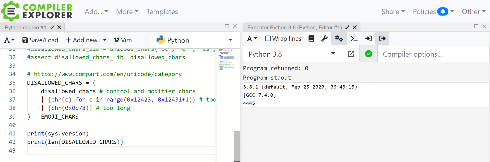

平台实际运行的是 Python 3.8，答案是 `4445`。你问为什么平台还在用 Python 3.8？单纯是因为平台还在用 Ubuntu 20.04，仅此而已。

> **[5] 在 2011 年 1 月，Bilibili 游戏区下共有哪些子分区？（按网站显示顺序，以半角逗号分隔）**
>
> 答案格式：`^[A-Za-z一-龟·,\]+$`

大多数选手大概都是用 [web.archive.org](https://web.archive.org/) 做的。首先根据二刺螈常识，哔哩哔哩在 2011 年 1 月的域名是 bilibili.us，于是我们直接点开一个时间近似的页面：

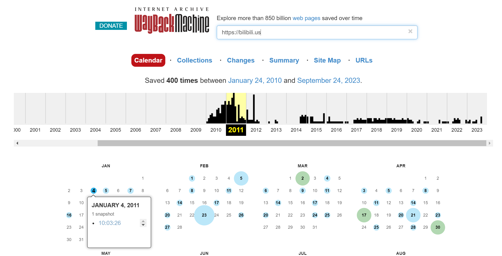

在网页里直接可以得到答案：

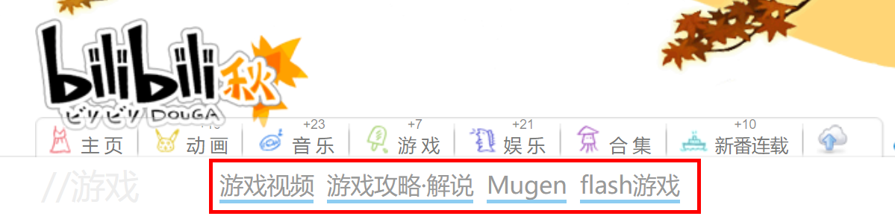

答案是 `游戏视频,游戏攻略·解说,Mugen,flash游戏`。注意到页面底下也出现了一个首字母大写版本的 `Flash游戏`，因此答 `Flash游戏` 也算对。为了防止有选手把 `游戏攻略` 后面的这个点号打错，特意在答案格式里演示了一下点号的正确写法。

——如果我说预期解就是上面这种方法，想必很多选手会不满意：我上不了 web.archive.org 这个网站，能不能教教我怎么做题啊？当然可以！

我们直接 B 站搜索 [2011 年拜年祭](https://www.bilibili.com/video/BV1ax411c7jy)，然后即可在 P3 的 8:24 短暂看到：

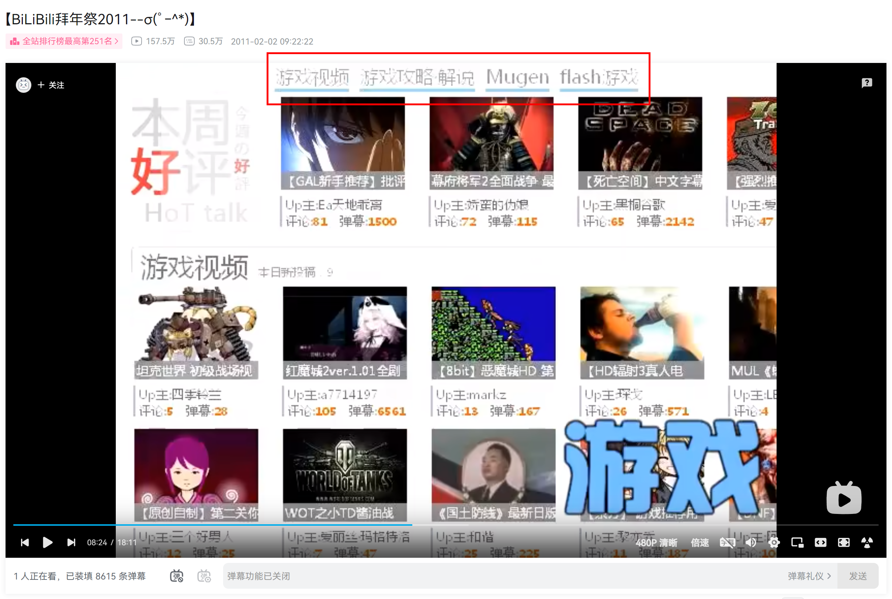

诶，这不就在不使用任何魔法的情况下做出来了吗。我们 GeekGame 的题目可能会很难，但绝不会变质！（CV:高板桐乃）

> **[6] [这个照片](./media/osint-challenge.jpg)中出现了一个大型建筑物，它的官方网站的域名是什么？（照片中部分信息已被有意遮挡，请注意检查答案格式）**
>
> 答案格式：`^[a-z0-9-\]+\.[a-z0-9]{2,3}$`

观察照片，可以发现一些细节：

- 画面中央的旗子上写着 “Sponsor” 和一堆公司的名字，应该是一个什么活动。因为旗子边上有一个楼梯扶手，那么这个照片应该是在一个建筑的台阶上拍摄对面的景色，而且身后的建筑（不是拍到的建筑）大概和旗子所示的活动有关。
- 远处的面包车上写着 “wksound.lu”，访问这个域名发现是一个卢森堡的音响设备租赁公司，可以推出这里应该是卢森堡，而且这附近可能有什么演出活动。就算你没看出来被遮挡的 “wk” 两个字母，也可以从结尾的 “.lu” 推出这里是卢森堡。
- 有人穿短裤也有人穿长裤，说明照片拍摄时间在春秋季。有几个人身上挂着质量看起来不是很高的胸牌，进一步印证了这里正在举行一个活动。

然后使用一款不存在的搜索引擎把所有赞助商的名字拼在一起搜索一下：

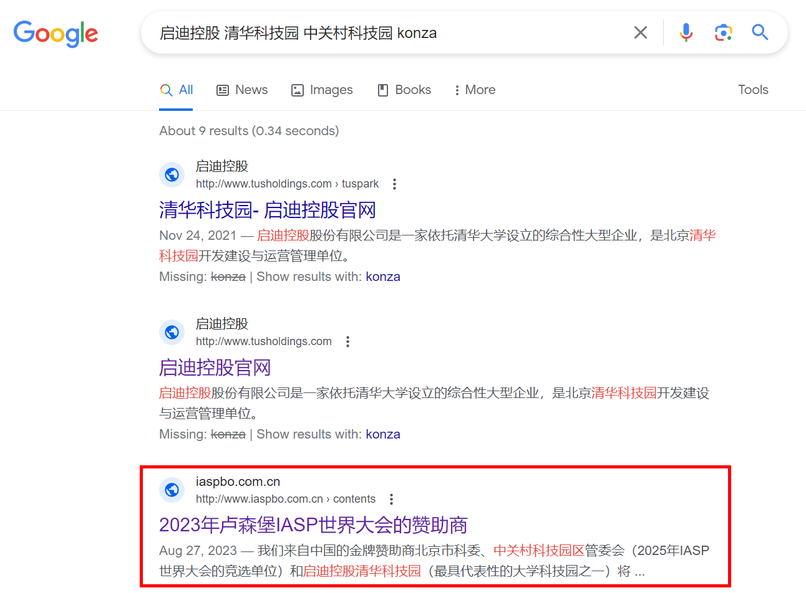

（必应其实也可以，但是需要用英文搜 `tusholdoing zhongguancun` 然后在结果里面多翻翻）

可以确认这些品牌[都是 IASP 这个会议的赞助商](https://www.iaspworldconference.com/sponsors/our-partners-and-exhibitors/)，而且 IASP 的时间在秋季、会场在卢森堡，因此大致可以确认这个活动就是 IASP 会议，照片的拍摄地点是在 IASP 的会场 ECCL。


最后，就是找找 ECCL 周边有什么跟照片中的建筑长得像的东西。确实有！

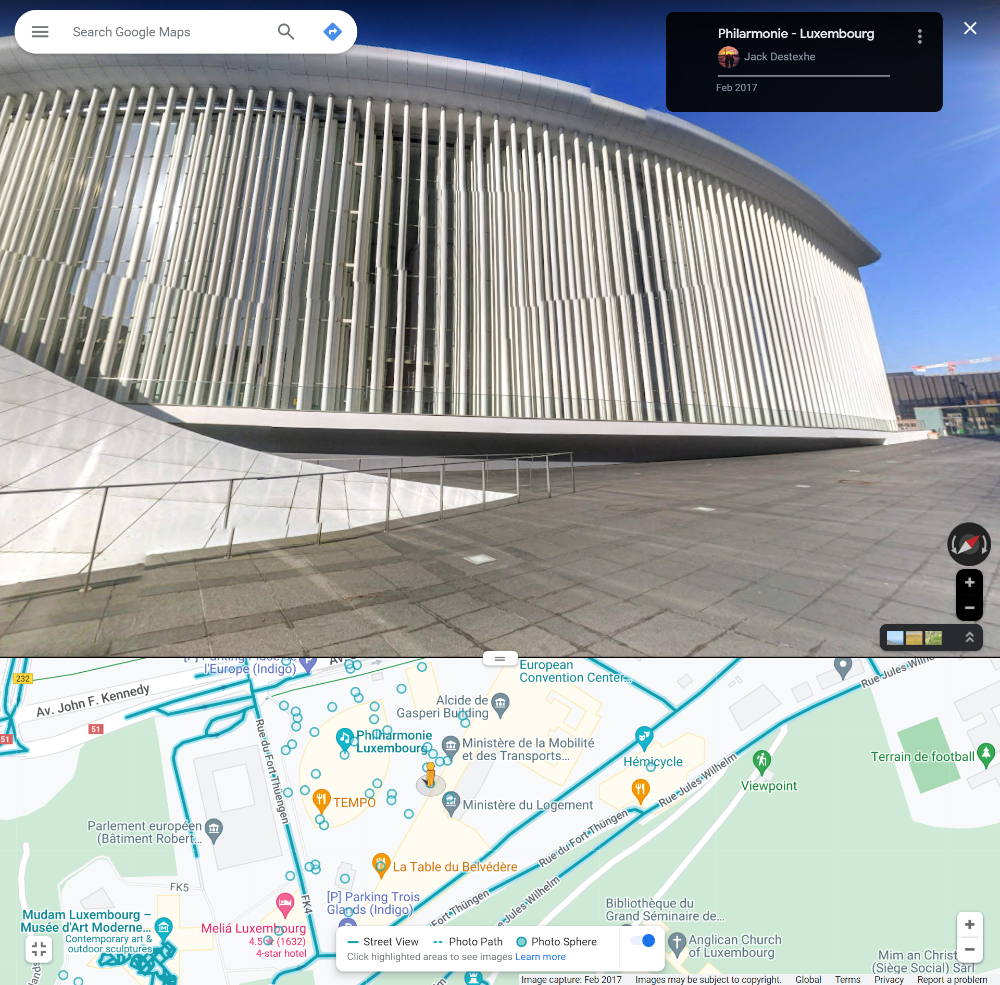

于是果断找到它的官网 `philharmonie.lu`，即为答案。注意出于答案格式要求，不要加 www 前缀。

其实你不需要看出来上述所有这些细节，似乎直接通过 Google Lens 这样的在线服务利用照片里面出现的建筑局部就能搜出来。

## 花絮

以下是每个题目的通过人数：

- 1: 425
- 2: 276
- 3: 350
- 4: 149
- 5: 248
- 6: 274

出题时的预期是 1-3 比较简单，4-6 比较困难。目前来看第 6 题的难度低于预期（我本来推测会有很多选手误以为这个地方在国内，但看来大家还是挺聪明的），第 4 题的难度高于预期（可能因为实在难以看出 Python 版本号是如何影响答案的）。

顺便本题两个 Flag 当然是故意为了勾引选手猜 Flag 而设置的：

- `flag{dang-ran-li-jie-ni-xin-zhong,}`
- `flag{kenn-dingg-xiangg-zaii-woo-shou-zhoongg~~~}`

可想而知，拿到 Flag 1 的 <del>菜宝ガキ</del> 选手们会多么激动地尝试提交 Flag 2：

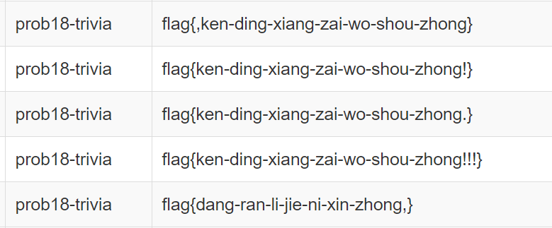

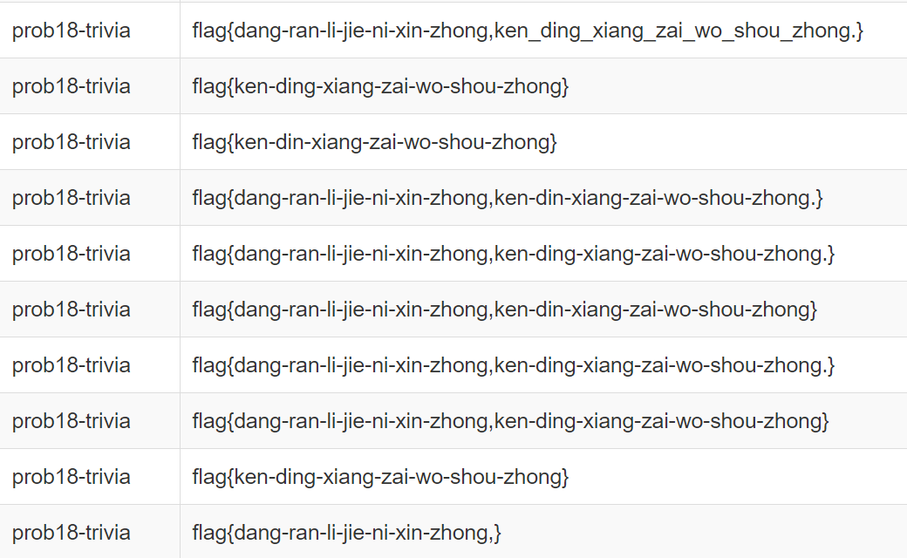

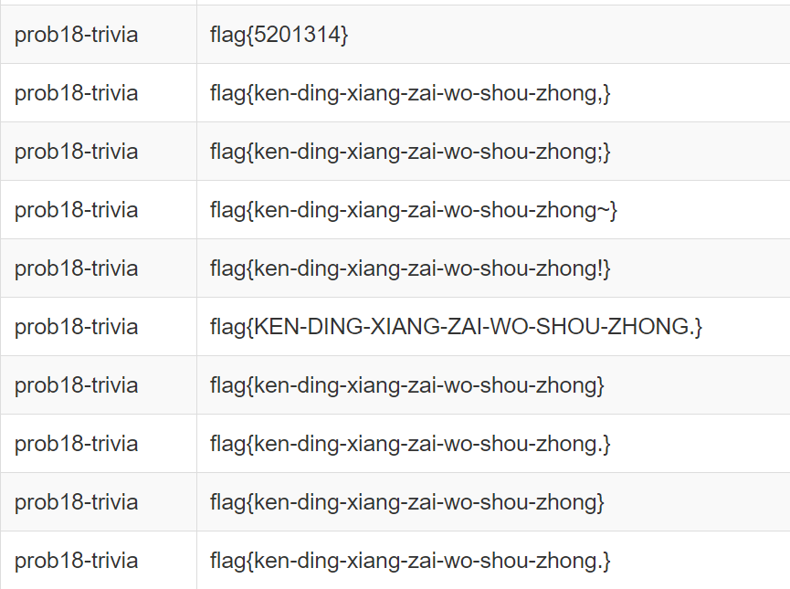

哈哈，猜得出来吗？.jpg
