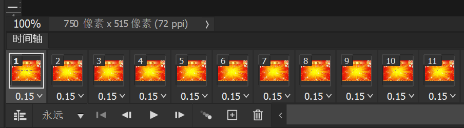
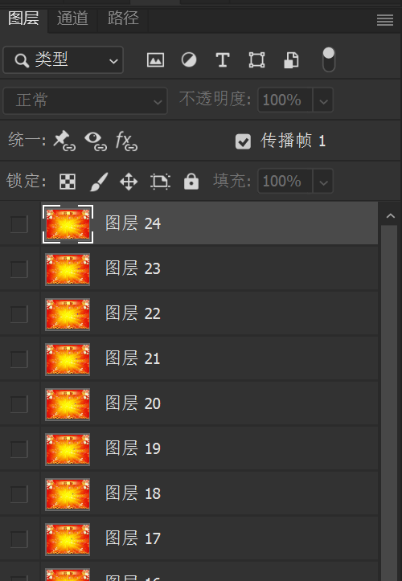
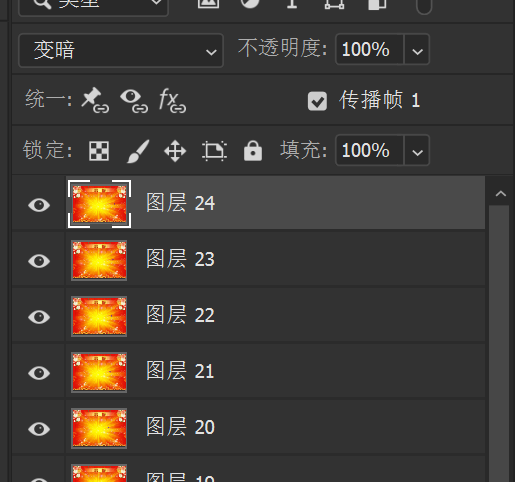
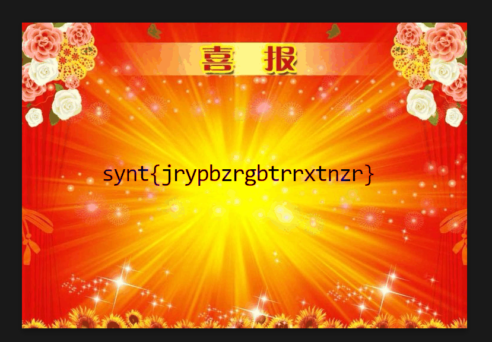

# [Tutorial] 一眼盯帧

- 命题人：xmcp
- 题目分值：100 分

## 题目描述

    

欢迎参赛！随着比赛进行，我们会发布对题目的补充说明、提示及后续赛程安排，届时将在本平台和 QQ 群 895754285 发布。
<del>这是咱们勤工俭学服务中心的 QQ 群，后面爷忘了。</del>

如果你对题目有疑问，可以在群里私聊管理员或发邮件到 geekgame at pku.edu.cn。除通过上述方式与组委会联系外，所有选手在比赛结束前不得与他人讨论题目。

<strong>萌新教学：</strong>

本比赛的每道题目都对应着一个或多个被称为 Flag 的答案，其形如 <code>flag{...}</code>。
Flag 区分大小写，所有字符均为可打印 ASCII 字符。
你需要<strong>根据题目所给附件的要求解出 Flag</strong>，或者攻击题目指定的系统<strong>在服务器中得到 Flag</strong>。将 Flag 输入到下面的文本框即可得分。

<a href="#/game">比赛主页</a> 的 “资料推荐” 栏目有一些让你快速了解常见解题方法的资料。
<a href="#/info/faq">选手常见问题</a> 的 “常用工具” 栏目列举了一些你可能会用到的工具。

<strong>点击下方 “下载题目附件” 查收本题的 Flag。本题的 Flag 是在英文中有意义的内容，且所有字母均为小写。</strong>

<strong>第二阶段提示：</strong>

<ul>
<li>实在不知道该给什么提示。因为只需要把 GIF 里每个帧里的字母拼起来，然后做个 ROT13 就解出来了。</li>
<li>华清大学为了照顾不会提取 GIF 每个帧的选手，<a target="_blank" rel="noopener noreferrer" href="https://mp.weixin.qq.com/s?__biz=MzUyOTg0Mjg4Mw==&amp;mid=2247485759&amp;idx=1&amp;sn=affd2a7a0710605c832009d900902ddb">在比赛前连夜购买了正版 Photoshop</a>，终于跟上了兆大的脚步。让我们恭喜华清大学！</li>
</ul>

**[【附件：下载题目附件（prob23-signin.gif）】](attachment/prob23-signin.gif)**

## 预期解法

直接打开附件，发现GIF里有一堆一闪而过的字母。得把它们提取出来看看。提取的办法很多，`from PIL import Image` 可以，StegSolve 可以，找个视频播放器调播放速度也可以，甚至 Photoshop 都可以。这里讲一下 Photoshop，因为 <del>北大买了、清华也买了</del> 很多人都不知道 Photoshop 其实是有制作 GIF 的功能的。首先在工具栏的 “窗口” 里面勾上 “时间轴”，然后我们就可以看到这个：

这样就可以方便地盯帧了。

实际上也不需要盯帧，因为每一个帧会作为一个图层导入进来：

于是就有一个更快一点的 Trick，就是把除了第一帧以外的图层都显示出来，然后把混合模式改成 “变暗”：

就会发现所有字母都显示到一起了！

接下来看到这个长得跟 Flag 很像又不是很像的东西，动用小学英语知识可以一眼看出是 ROT13。什么？没听说过 ROT13？那凯撒密码总该听说过吧。然后动用小学数学知识即刻解出 Flag。哦顺便还有 https://rot13.com/ 这么一个网站可以在线解密，<del>打算抢签到题一血的选手或许用得上</del>。

## 花絮

本题一血来自于校内选手 `Lost-MSth #呜呜呜我好菜`，解题用时 1 分 37 秒。我就感觉到快.gif

另外似乎本届没有出现开幕直接往签到题交怪话的情况，第一个提交就是正确的提交，让我们失去了很多乐趣。