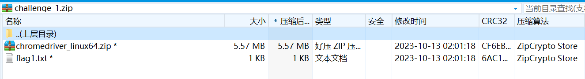
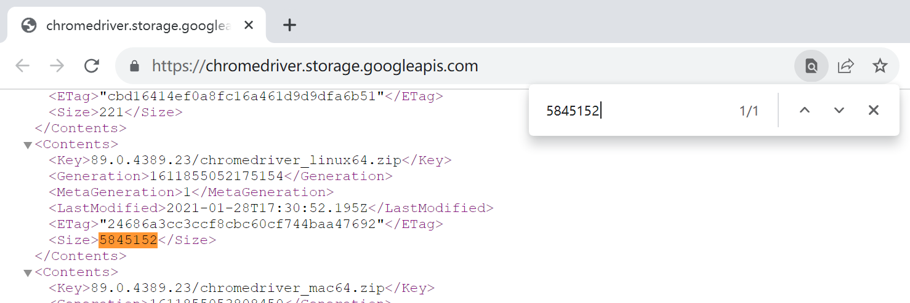
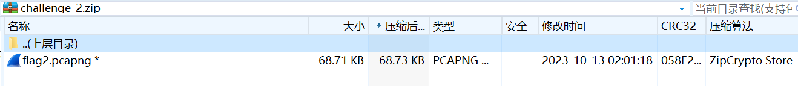
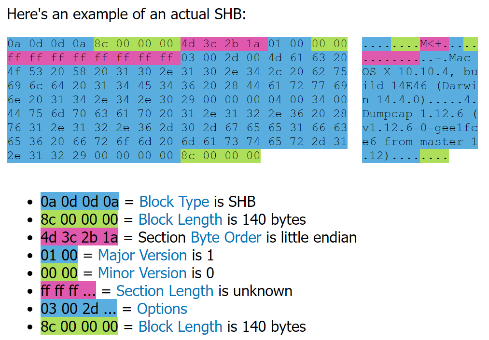
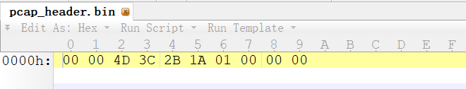

# [Misc] 基本功

- 命题人：xmcp
- 简单的 Flag：150 分
- 冷酷的 Flag：200 分

## 题目描述

在我们嘿客界，有四种基本功要练。知道是哪四种吗？

<em>我知道：说、学、逗、唱。</em>

不对。在我们 GeekGame 是 Misc、Web、Binary、Algorithm。不同的地方说法不一样，比如在别的比赛里，Algorithm 可能叫 Crypto。

<em>确实，也可能叫 Math。</em>

那我们先来说说 Misc 吧。Misc 是基本中的基本，代表所有老赛棍都要掌握的技能。

<em>那万一我不掌握，岂不是比赛就爆了，电脑也爆了，○○也爆了？</em>

很佩服你有如此觉悟，正因如此我们要多多练习。你觉得作为嘿客，最应该练习什么技能？

<em>我觉得是盗 QQ 号，还有破解密码。</em>

盗 QQ 号不行，万一腾讯以后会赞助呢。上届比赛黑了一下某品牌，这届就来赞助了，怪尴尬的。破解密码倒是有很多说法。

<em>对，我就擅长搞这个。比如你的笔记本电脑，我用五秒钟就能破解登录密码。信不信？</em>

不信。你来试试。

<em>好，这个指纹传感器，麻烦按一下。谢谢。</em>

不不不，破解密码不是这么玩的。看见我电脑里这<strong>两个压缩包</strong>了吗，我随便用了个密码给它加密了。也不算太长，<strong>但至少有 50 个字节，可能会有大小写字母和特殊符号</strong>。当然我不会告诉你密码是什么。试试看能不能破解？

<strong>第二阶段提示：</strong>

<ul>
<li>如果你知道压缩包中任何一个文件的内容，即可发起 <a target="_blank" rel="noopener noreferrer" href="https://github.com/kimci86/bkcrack">ZIP 明文攻击</a>。</li>
<li>甚至不需要知道完整的文件内容，只需要知道其中的任意 12 个字节（其中 8 个字节必须连续）即可。</li>
</ul>

**[【附件：下载题目附件（prob24.zip）】](attachment/prob24.zip)**

## 预期解法

我们首先打开第一个压缩包：

看到有我们想要的 `flag1.txt` 和一个不知道干什么用的文件 `chromedriver_linux64.zip`，压缩包被加密了，算法是 ZipCrypto。众所周知，这个算法是非常弱的，可以被明文攻击，即只要知道其中一个文件的明文，就能顺便解密出另一个文件。AARCHPR 这种密码破解软件直接集成了明文攻击的功能。

因此我们想办法搞到 `chromedriver_linux64.zip` 的明文。看到它的文件大小是 5845152 字节，从文件名来看大概是不知道什么版本的 Chrome Driver。[在网站上可以直接列举 Chrome Driver 的所有版本](https://chromedriver.storage.googleapis.com/)，拿文件大小一搜索，即可得到对应的版本号：

这样一来，我们就可以下载这个文件，于是就符合了发起 ZIP 明文攻击的条件。当然可以直接使用 AARCHPR 这样的图形化软件，也可以在 GitHub 上找到专门做明文攻击的 [bkcrack](https://github.com/kimci86/bkcrack) 这个命令行工具。我们直接使用 bkcrack，因为反正 Flag 2 肯定要用 bkcrack。

`bkcrack -C challenge_1.zip -c chromedriver_linux64.zip -p chromedriver_linux64.zip -U challenge_1_dec.zip ""`

这里我们利用已知的明文将压缩包的密码重设为空。然后即可解压出 `flag1.txt`。

然后打开第二个压缩包：

诶，里面只有一个 pcapng 格式的抓包文件，那我的明文去哪了？不要慌，bkcrack 的 README 告诉我们，ZipCrypto 实在是太弱了，以至于 ZIP 明文攻击并不需要完整的明文，只需要明文中任意已知位置的 12 个字节（其中 8 个字节必须连续）即可。请注意此处的 “明文” 是指压缩后、加密前的内容，但此题的压缩包恰好使用了 “仅存储”（Store）的压缩方式，所以明文就是文件的内容。

那么我们[研究一下 pcapng 的文件格式](https://pcapng.com/)，看看怎么抠出 12 个字节来。发现 pcapng 的开头部分是一个叫 Section Header Block 的数据结构：

- 首先四个字节是 0a0d0d0a，是一定已知的。
- 后面的四个字节表示 SHB 的大小。这个数字可能是大端也可能是小端，但正经人谁用大端啊！而且考虑到 SHB 里面记录的信息不多，一般不会超过 255 字节，再怎么说也不会超过 65535 个字节，所以后面两个字节大概是 0000。
- 然后四个字节表示端序。前面已经说了，目前的电脑都是小端，所以它的值一定是 4d3c2b1a。就算你不信这一点，也可以拿大端再试试，无非就是尝试两次。
- 再后面四个字节表示版本号，一定是 01000000。
- 接下来八个字节表示整个文件的长度，实际上大多数抓包软件都会直接设置为  表示不指定文件长度（道理很好懂：抓包软件可能会流式存储 pcapng 文件，它写文件头的时候抓包还在进行，无法知道这里应该填多少），但严格来说我们无法肯定这一点。

好的，到这一步我们已经能够肯定文件头一定是 `0a0d0d0a____00004d3c2b1a01000000`，数一数，有 14 个字节，其中 10 个字节连续。OK，明文攻击走起！

`bkcrack -C challenge_2.zip -c flag2.pcapng -p pcap_header.bin -o 6 -x 0 0a0d0d0a -U challenge_2_dec.zip ""`

（其中 `pcap_header.bin` 存储的内容如下：）

这个命令在我的笔记本电脑上要跑几十分钟的时间，然后它会生成一个密码已经被清空的压缩包，可以解压出来。如果你大胆猜测了文件长度字段是 ffffffffffffffff，它会跑得更快一些。解压完成后可以看到抓包内容是几个 HTTP 请求，里面直接就可以找到 Flag。

## 题目背景

ZIP 明文攻击是一个比较简单而且节目效果很好的考点，因此就拿来出题了。当我知道 ZIP 的密码在很多情况下形同虚设的时候，对我的幼小心灵产生了巨大的震撼。

这里的 “很多情况下” 是指：知道其中一个文件的明文（很常见，尤其是当压缩一些程序的时候，经常会混入一些已知的 DLL 或者 LICENSE.txt），或者知道一个以 “仅存储” 方式压缩的文件的 12 个字节（也很常见，因为 ZIP、JPEG、PNG 这种格式经常以 “仅存储” 方式压缩，而且在文件头和文件尾也很容易凑出 12 字节的已知明文）。

这个情况一旦成立，整个压缩包的密码不管设置得多复杂，都瞬间白给了。顺便一提，本题压缩包的密码是 `"password "+flag`。