# [Binary] 汉化绿色版免费下载

- 命题人：xmcp
- 普通下载：150 分
- 高速下载：200 分

## 题目描述

<div class="codehilite" style="background: #f8f8f8"><pre style="line-height: 125%;"><span></span><code>                      欢迎访问兆大ＣＴＦ：

                      精彩的Flag等着你来拿！！
    
               ╭═══════════════╮
               ║        兆 大 Ｃ Ｔ Ｆ        ║
 ╭══════┤     geekgame.pku.edu.cn      ├══════╮
 ║            ║         世 纪 下 载          ║            ║
 ║            ╰═══════════════╯            ║
 ║                                                          ║
 ║声明：                                                    ║
 ║   1) 本站不保证所提供软件或程序的完整性和安全性。        ║
 ║   2) 请在使用前查毒。                                    ║
 ║   4) 转载本站提供的资源请勿删除本说明文件。              ║
 ║   5) 本站提供的程序均为网上搜集，如果该程序涉及或侵害到您║
 ║      的版权请立即写信通知我们。                          ║
 ║   6) 本站提供软件只可供研究使用，请在下载24小时内删除,   ║
 ║      切勿用于商业用途，由此引起一切后果与本站无关。      ║
 ║                                                          ║
 ║                                                          ║
 ║     1. 推荐使用：WinRAR V3.2以上版本解压本站软件         ║
 ║     2. 本站承接CTF，虚拟皮套，网站制作，等业务           ║
 ║                                                          ║
 ║         兆大ＣＴＦ: https://geekgame.pku.edu.cn          ║
 ║                                                          ║
 ║         奖品领取;网站合作  Email: geekgame at pku.edu.cn ║
 ║                                                          ║
 ║                                                          ║
 ║    ╭───────────────────────╮    ║
 ╰══┤     兆大ＣＴＦ https://geekgame.pku.edu.cn   ├══╯
       ╰───────────────────────╯

如果你觉得我们网站能给你带来方便，请把 https://geekgame.pku.edu.cn 网站介绍给你的朋友！！！
</code></pre></div>

<p><strong>补充说明：</strong></p>
<ul>
<li>如程序描述，Flag 2 是 “出题人在存档里输入的内容”，并非所有能通过程序判定的 Flag 都是对的。Flag 2 可以唯一解出，如果发现多解说明你漏掉了一些信息。</li>
</ul>
<div class="well">
<p><strong>第二阶段提示：</strong></p>
<ul>
<li>Flag 1：有很多做法，比如啃生肉用的机翻软件就可以提取内存中的文字，Cheat Engine 也可以。但为了 Flag 2，还是建议你找个软件解包一下 <code>data.xp3</code>。</li>
<li>Flag 2：除了 <code>data0.kdt</code> 以外，<code>savedata</code> 文件夹里还有两个文件。它们存储了什么信息？</li>
</ul>
</div>

**[【附件：下载最新最热汉化绿色版题目附件！（prob25.zip）】](attachment/prob25.zip)**

## 预期解法

直接下载最新最热汉化绿色版题目附件，发现是一个最新最热汉化绿色版 Kirikiri 游戏：

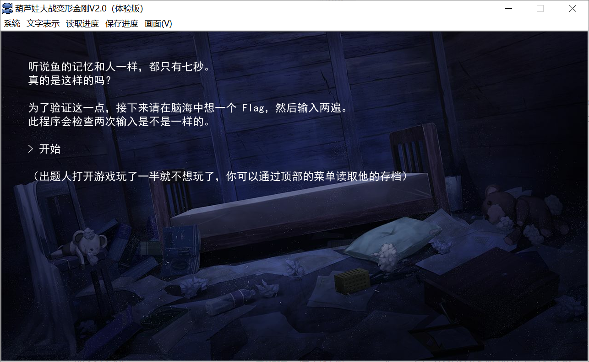

怎么确定是 Kirikiri 呢？就算你不认识附件里面的 `data.xp3`，也能从 EXE 里面找到一些端倪：

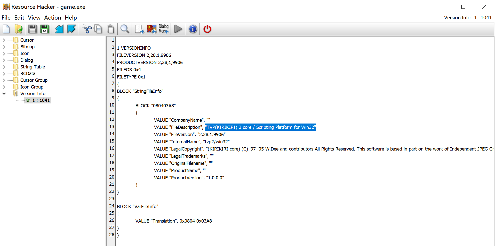

为了确认这个 EXE 没有经过任何修改，可以扔到 [VirusTotal](https://www.virustotal.com/) 上面查一下。VirusTotal 显示这个文件最早的上传日期是 2008 年，因此显然没有经过出题人的任何修改，不需要试图去逆这个 EXE。

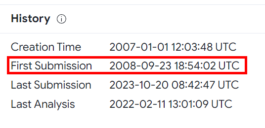

随便玩一下这个游戏，发现它会通过选项的方式让用户输入两遍字符串，如果相同就会吐出 Flag 1：

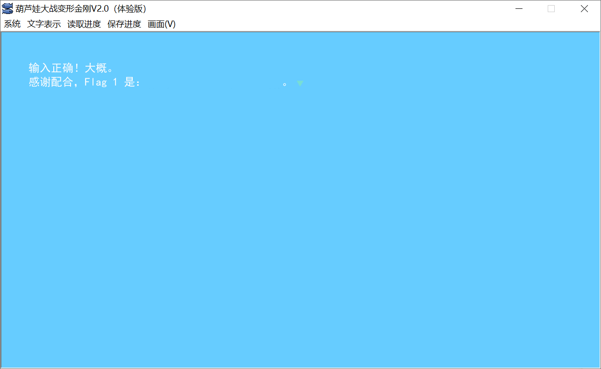

好吧，吐了但没有完全吐，可以推测那大段空白是一些被隐藏掉的文本。

那么怎么显示这些被隐藏掉的文本呢？方法可就太多了，比如用一些可以提取文本的机翻工具。这里展示的是 [MisakaTranslator](https://github.com/hanmin0822/MisakaTranslator)，我感觉 VNR 之类的工具也可以，当然 CheatEngine 也可以（注意要按 UTF-16 搜索）。

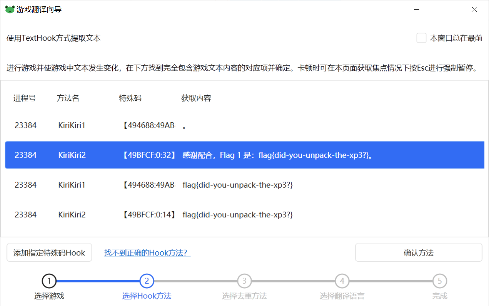

虽然用这个方法能做出 Flag 1，但为了 Flag 2 考虑，更建议直接对 `data.xp3` 进行一个解包。

这里展示的是 [GARbro](https://github.com/morkt/GARbro)，是一个非常良心的 GUI 解包工具，可以解非常非常多种格式。

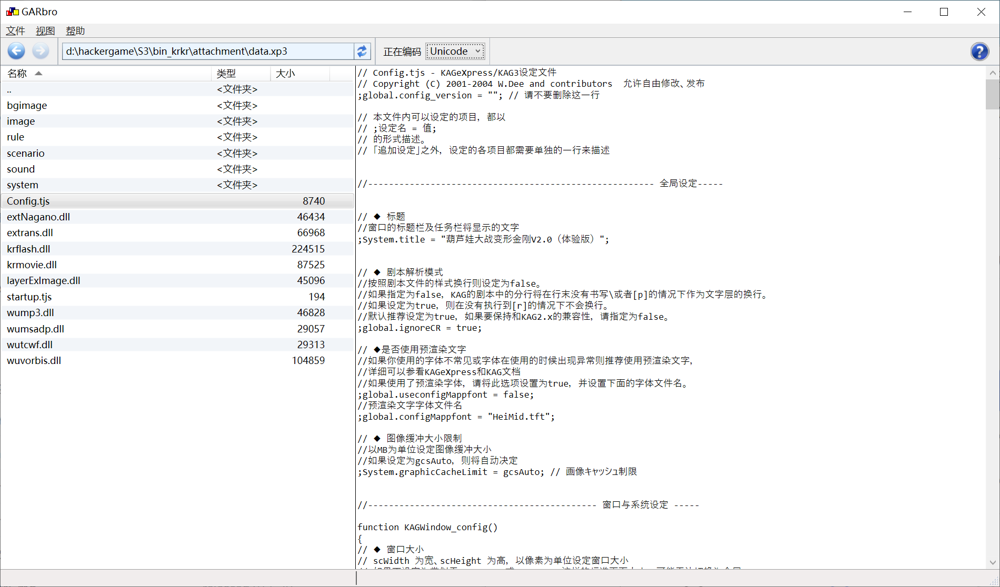

找到 `data.xp3` 文件，选择没有加密，然后右键提取即可。你也可以使用一些其他的命令行工具，总之方法都是大同小异。

解包完成之后就可以把 `data.xp3` 删掉了，只留解出来的 `data` 目录。Kirikiri 的引擎找不到 `data.xp3` 就会去找 `data` 目录，并不需要改完再打包。

我们可以在 `data/scenario` 目录底下观察（当然也可以修改）游戏的逻辑，其中 `done.ks` 里面就记录着字号为 0、颜色和背景色一致的 Flag 1：

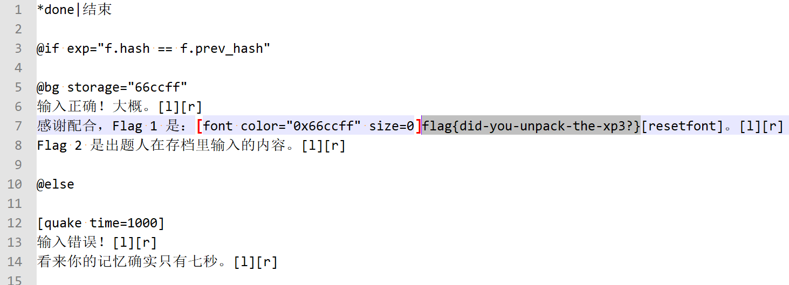

为了拿到 Flag 2，我们继续看看输入文字的逻辑，即 `round1.ks` 和 `round2.ks`。总之就是在输入文字的时候会维护一个哈希，初始为 1337，然后每次乘以 13337、加上 11*n（`AEIOU}` 分别对应 1 到 6）、最后**膜** 19260817。这是一个非常典型的线性同余哈希算法。两次都输入完成后，第一次输入的结果存储在 `f.prev_hash`，第二次输入的结果存储在 `f.hash`，程序会判断它们一不一样。

根据题目指示，出题人在存档中已经把第一遍输入完毕，看来我们需要逆向这个哈希算法，看看出题人到底输入了什么。用 [KirikiriTools](https://github.com/arcusmaximus/KirikiriTools) 这样的工具可以直接解码存档，但还有一些别的方法，下面简单列举两个。

其一，解包后修改 `Config.tjs`，修改为 `debugMenu.visible = true;`，这样游戏启动时就会多一个调试菜单，可以直接调出 TJS 控制台。

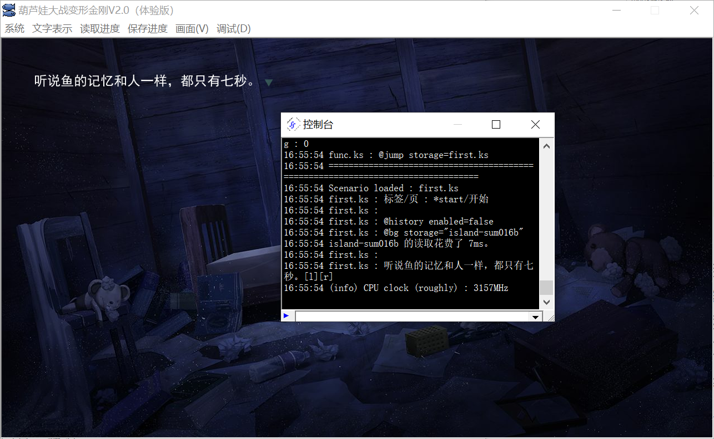

然后我们找到程序本身的读档和存档功能是怎么实现的，发现是在 system/MainWindow.tjs 里：

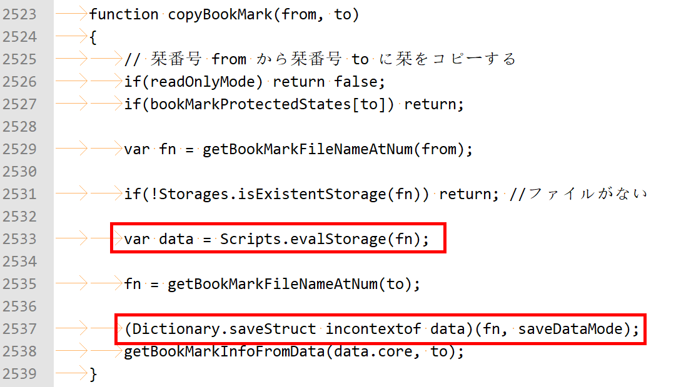

读档是用的 `Scripts.evalStorage`，存档是用的 `Dictionary.saveStruct`。其中存档时可以通过 saveDataMode 指定保存模式，其中 "z" 表示压缩，"s" 表示加密，"" 表示不压缩也不加密。游戏原本的保存模式记录在 Config.tjs 里，是 "z"：

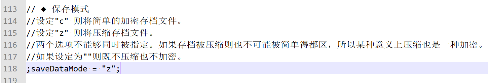

了解到这些信息之后，我们可以在控制台里输入命令，把存档的所有内容都解密出来：

```
(Dictionary.saveStruct incontextof Scripts.evalStorage("D:/path/to/savedata/data0.kdt"))("d:/0.txt", "")
(Dictionary.saveStruct incontextof Scripts.evalStorage("D:/path/to/savedata/datasc.ksd"))("d:/sc.txt", "")
(Dictionary.saveStruct incontextof Scripts.evalStorage("D:/path/to/savedata/datasu.ksd"))("d:/su.txt", "")
```

其二，如果你不想了解 TJS 的写法，可以直接在 Config.tjs 里把 `saveDataMode` 改成 `""`，然后启动游戏、点击读档、点击存档、关闭游戏。这样就利用游戏自己的功能实现存档的解密。

这样我们就可以打开解密后的存档，看看里面有什么。

首先是 `data0.kdt`，可以看到里面确实记录了 `prev_hash` 的值，是 7748521：

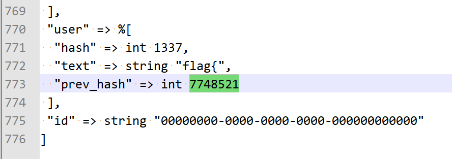

但光这样不够，因为整个哈希的空间只有 19260817，Flag 的长度都不知道，肯定是有无穷多组解的。

所以我们需要再看看剩下的两个文件里面记录了什么。在 `datasu.ksd` 里看到了一些怪东西：

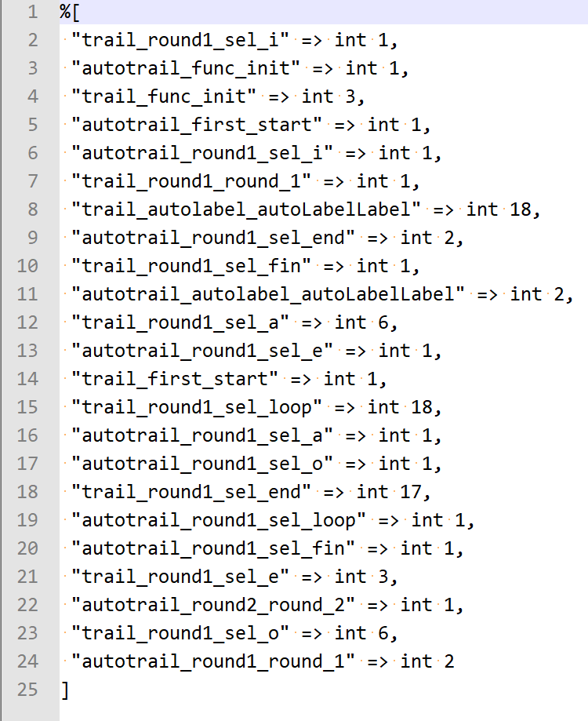

可以找到 [Kirikiri 的文档](https://kirikirikag.sourceforge.net/contents/ReadUnread.html)，发现这是引擎提供的记录已读状态的功能，就是说每当 `foo.ks` 执行到 `bar` 标签，引擎就会给 `trail_foo_bar` 这个标签的值 +1，这样游戏就可以搞一些已读选项变色之类的功能了。就算你没有找到 Kirikiri 的文档，也可以在 `Config.tjs` 里看到关于这个的说明（`autoRecordPageShowing`），再不济通过游玩也能大致推测出这是一个计数器。总之，通过这些计数器，我们能额外知道出题人每个字母按了多少遍。

然后就写一个脚本暴力枚举所有可能的情况，然后用哈希比对一下即可。答案是唯一的。枚举的程序参见 [crack.cpp](sol/crack.cpp)。

## 花絮

此题贡献了整场比赛最多的提交。在所有 10072 次提交中，有 3753 次提交是对应这个题目的，其中 2104 次都是同一个人提交的。可见他真的没看出来 `datasu.ksd` 里的奥秘。

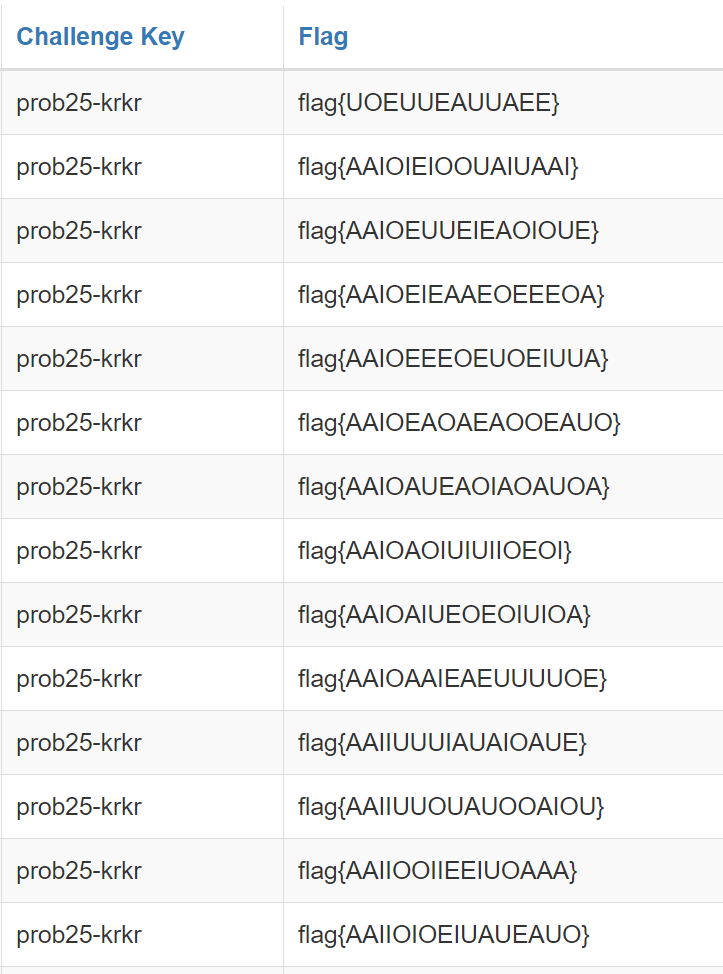