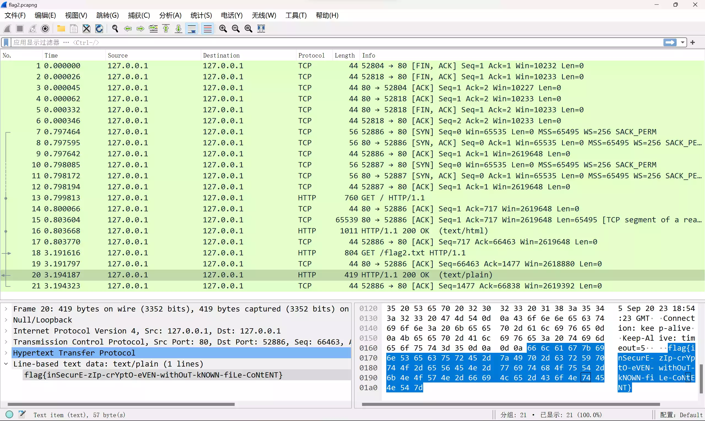

> **成绩**
> 
> 总分 `966`，总排名 `105`
>
> Tutorial `107` + Misc `313` + Web `467` + Binary `79`

偶然在某音游码农群得知了 GeekGame 这个比赛，正好之前也对 CTF 比赛有一些兴趣，就参加来玩玩。这还是第一次参加 CTF 相关比赛，学到了很多东西（

在这里记录一下自己解题的步骤，以免后续遗忘；同时作为自己第一次参加 CTF，写的第一份 Writeup，也有一定纪念意义。（虽然只写出来几题.jpg）

## 一眼盯帧

签到题。题目附件下载下来是一个 GIF 图，每一帧都显示一个字符。

首先用 FFmpeg 把每一帧都提取出来：

```shell
ffmpeg -i prob23-signin.gif prob23-signin-%d.png
```

然后把每一帧拼接起来得到一个字符串 `synt{xxxxxxxxxx}`。很明显这是一个和 Flag 格式一模一样的字符串，于是联想到凯撒密码，随便找个在线解密网站，移位 13 即可得到 Flag。

## 小北问答!!!!!

_只列出做出来的题_

> 在北京大学（校级）高性能计算平台中，什么命令可以提交一个非交互式任务？

使用搜索引擎搜索“北京大学（校级）高性能计算平台”进入官网，在使用指南-使用教程-提交作业里，可以找到提交的命令是 `sbatch`。

> 根据 GPL 许可证的要求，基于 Linux 二次开发的操作系统内核必须开源。例如小米公司开源了 Redmi K60 Ultra 手机的内核。其内核版本号是？

查看 [Redmi K60 Ultra 内核源码](https://github.com/MiCode/Xiaomi_Kernel_OpenSource/tree/corot-t-oss) 中根目录下的 `Makefile` 文件：

```makefile
# SPDX-License-Identifier: GPL-2.0
VERSION = 5
PATCHLEVEL = 15
SUBLEVEL = 78
EXTRAVERSION =
NAME = Trick or Treat

# ...
```

可得内核版本号为 `VERSION.PATCHLEVEL.SUBLEVEL`，即 `5.15.78`

> 每款苹果产品都有一个内部的识别名称（Identifier），例如初代 iPhone 是 iPhone1,1。那么 Apple Watch Series 8（蜂窝版本，41mm 尺寸）是什么？

直接搜索 "Apple Watch Series 8 identifier"，找到一个叫 [The iPhone Wiki](https://www.theiphonewiki.com/wiki/Apple_Watch_Series_8) 的网站。尽管这个网站已经停止更新，但是里面还是收录了 Apple Watch Series 8 的信息。在这里可以找到 41mm 版本的识别名称为 `Watch6,14`。

## 猫咪状态监视器

这题刚上被蒙了，LIST 没有任何输出，STATUS 不知道服务名称。下载题目源码发现是调用了 `/usr/sbin/service`，但是还是不知道怎么注入。后来偶然尝试搜索“ctf usr sbin service”，居然真给我找到了[这样一篇文章](https://www.cnblogs.com/qlqwjy/p/7746890.html)。里面有很重要的一句：

::: quote 感谢文章作者 [QiaoZhi](https://www.cnblogs.com/qlqwjy/)！
这个命令在 service 执行到后面最终调用的是：  
`env -i PATH="$PATH" TERM="$TERM" "${SERVICEDIR}/${SERVICE}" ${OPTIONS}`
:::

灵光一现，既然内部直接采用路径拼接，那是不是结合 `..` 就可以调用任何路径的程序了？

参照 `service` 源码可得 `SERVICEDIR="/etc/init.d"`，在题目的 Dockerfile 里找到 Flag 存放在 `/flag.txt`。于是一试，果然可以。在 STATUS 里输入 `../../bin/cat /flag.txt` 即可获取 Flag 内容。


## 基本功

这道题在第一阶段没能做出来，参照第二阶段的提示才知道有 [Zip 明文攻击](https://github.com/kimci86/bkcrack) 这种东西。

查阅了文档和一些资料得知了这个 `bkcrack` 工具的用法，需要知道 Zip 中某个文件的任意 12 个字节（其中 8 个字节必须连续）即可直接破解。

### 简单的 Flag

首先使用 `-L` 选项查看 Zip 压缩包中的内容：

```shell
bkcrack -L challenge_1.zip
```

得到以下信息：

```
bkcrack 1.5.0 - 2022-07-07
Archive: challenge_1.zip
Index Encryption Compression CRC32    Uncompressed  Packed size Name
----- ---------- ----------- -------- ------------ ------------ ----------------
    0 ZipCrypto  Store       cf6ebbec      5845152      5845164 chromedriver_linux64.zip
    1 ZipCrypto  Store       ad7e5ec7           52           64 flag1.txt
```

可以发现里面还套了一个 chromedriver_linux64.zip。从名字看是 Chrome 的某个 Linux 驱动，于是在随便哪个地方下载一个 chromedriver_linux64.zip（不需要保证是同一个），解压发现里面有且仅有一个叫 chromedriver 的二进制文件。

根据 Zip 压缩文件的格式，在文件头中会明文存储压缩包内的文件名称。使用十六进制编辑器打开我们下载的压缩包可以看到 `chromedriver` 这串字符是从 0x1E 位置开始的，也就是说偏移量为 30。由此我们可以进行合理的猜测:

- 套娃压缩包中也**有且仅有** chromedriver 这个文件
- 套娃压缩包的文件头中也包含 `chromedriver` 这串字符，且相对于文件头的位置和我们另外下载的压缩包一样（偏移量为 30）

根据这些信息，就可以直接使用 `bkcrack` 来爆破压缩包了。首先用十六进制将字符串 `chromedriver` 存入一个文件（注意不要有多余字符），例如 ch1_header.hex，然后

```shell
bkcrack -C challenge_1.zip -c chromedriver_linux64.zip -p ch1_header.hex -o 30
```

解释一下命令：

- `-C` 指定了待爆破的 Zip 包路径
- `-c` 指定了 Zip 包中已知部分字节的文件相对于压缩包根目录的路径
- `-p` 指定了已知的字节文件路径
- `-o` 指定了已知字节在 `-c` 指定的文件中的偏移字节数

跑一段时间跑出来了：

```
bkcrack 1.5.0 - 2022-07-07
[23:58:55] Z reduction using 4 bytes of known plaintext
100.0 % (4 / 4)
[23:58:55] Attack on 1307278 Z values at index 37
Keys: 892a3f12 03c28953 213c149f
16.7 % (217968 / 1307278)
[00:02:07] Keys
892a3f12 03c28953 213c149f
```

这里最后的 Keys 就是成功爆破出的密钥，只是它还不是实际的压缩包密码。然后使用以下命令修改密码：

```shell
bkcrack -C challenge_1.zip -k 892a3f12 03c28953 213c149f -U ch1_out.zip 114514
```

- `-C` 指定目标 ZIP 包路径
- `-k` 指定刚刚爆破出的 Keys，一共三段
- `-U` 指定输出的 ZIP 包路径和新的密码

随后使用密码 `114514` 解压 ch1_out.zip 即可看到其中 `flag1.txt` 的内容。打开里面的套娃压缩包可以再次验证之前的猜测。

### 冷酷的 Flag

依旧先查看压缩包内容：

```
bkcrack 1.5.0 - 2022-07-07
Archive: challenge_2.zip
Index Encryption Compression CRC32    Uncompressed  Packed size Name
----- ---------- ----------- -------- ------------ ------------ ----------------
    0 ZipCrypto  Store       df6d459c        70368        70380 flag2.pcapng
```

发现有一个 pcapng 文件，这是 Wireshark 抓包存储的数据包文件。依据 Zip 明文攻击的前提条件，需要知道这个文件的一部分字节内容。

想到 pcapng 作为一种数据存储格式，肯定有一定的固定结构。于是随便抓了个包保存为 pcapng 文件，和其他地方搜罗来的 pcapng 文件一对比，果不其然，在 0x08 - 0x17 部分发现了相同的连续字节 `4D 3C 2B 1A 01 00 00 00 FF FF FF FF FF FF FF FF`。于是直接拿来爆破：

```shell
bkcrack -C challenge_2.zip -c flag2.pcapng -p ch2_header.hex -o 8
```

跑出结果

```
bkcrack 1.5.0 - 2022-07-07
[00:15:33] Z reduction using 8 bytes of known plaintext
100.0 % (8 / 8)
[00:15:33] Attack on 768355 Z values at index 15
Keys: 7b74a72c 4a71f9cb d7d5d4b6
47.7 % (366839 / 768355)
[00:19:25] Keys
7b74a72c 4a71f9cb d7d5d4b6
```

修改密码

```shell
bkcrack -C challenge_2.zip -k 7b74a72c 4a71f9cb d7d5d4b6 -U ch2_out.zip 114514
```

解压出 flag2.pcapng，在 Wireshark 里打开，发现几个 HTTP 请求，其中一个就是 Flag 2 的内容。



## 麦恩·库拉夫特

### 探索的时光

送分（？）开个 MC 跟着火把走直接完事

## 简单的打字稿

我承认我之前想去玩 GitHub 上那个类型体操项目然后咕咕了，没想到这就考到了 QAQ

由于 TypeScript 的类型系统会在运行时完全擦除，解题的主要思路就是利用类型检查器的报错输出类型的具体内容。

而如果输出中包含 `flag` 字符串就会直接输出”绷“，做题的时候属实给我气笑了.ts

### Super Easy

利用字符串匹配拿到一个不含 `flag` 部分的类型：

```ts
type Result = flag1 extends `flag{${infer Value}}` ? Value : never

// 故意报错
let err: Result = 123
```

得到输出

```
Process exited with code 1
[+] Stdout:

[+] Stderr:
Check file:///app/$deno$stdin.ts
error: TS2322 [ERROR]: Type '123' is not assignable to type '"too0_e4sY_F1aG_FoR_Tooo_Easy_lang"'.
let err: Result = 123
    ~~~
    at file:///app/$deno$stdin.ts:5:5
```

然后再包回 `flag{}` 去提交就可以了

### Very Easy

乍一看很复杂，把题目里的类型定义复制到 VSCode 里格式化以下，变成了这个样子：

```ts
type flag2 =
  | object
  | {
      new (): {
        v: () => (
          a: (
            a: unknown,
            b: { 'flag{...}': never } & Record<string, string>
          ) => never
        ) => unknown
      }
    }
```

分析可得：

- `type flag2 = object | 一个对象`
  - 对象拥有一个无参构造函数，返回这个对象实例
    - 这个对象含有一个名为 `v` 的方法，方法返回值为一个函数 `(a) => unknown`
      - 返回的这个函数中，`a` 参数本身也为一个函数 `(a, b) => never`
        - 其中，内层的 `a` 参数类型为 `unknown`，而 `b` 参数类型为 `{ 'flag{...}': never } & Record<string, string>`，包含了我们想要的 Flag 值。

也就是说我们只要取到最内层的 `b` 并加以处理即可。

```ts
type Class = Extract<flag2, { new (): any }>
type Instance = InstanceType<Class>
type Method = Instance['v']
type ReturnedFunc = ReturnType<Method>
type ParamFunc = Parameters<ReturnedFunc>[0]
type FlagParam = Parameters<ParamFunc>[1] // b

// 难点：将 { 'flag{...}': never } & Record<string, string> 分离开来
// 根据以下规则处理一下：
//   - string extends never == false
//   - never extends string == true
// 此时得到这样一个类型：
//     type Processed = { [x: string]: never; 'flag{...}': "flag{...}"; }
type Processed = {
  [K in keyof FlagParam]: string extends FlagParam[K] ? never : K
}

// 遍历 FlagParam。，还是根据同样的规则来提取：
//   - string extends never == false
//   - never extends string == true
// 就可以拿到一个这样的类型
//     type Flag = "flag{...}" | never | never | ...
// 而 never 与任何一个类型 | 上都会消除掉，所以最终得到
//     type Flag = "flag{...}"
// 就是得到的 Flag 字符串
type Flag = Processed extends { [_ in keyof FlagParam]: infer V } ? V : never

// 提取 Flag 值
type FlagValue = Flag extends `flag{${infer V}}` ? V : never

// 此时还不能直接提交类型信息，否则还是会输出“绷”
// let err: FlagValue = 123

// 观察题目源码可以发现，匹配输出时使用了一个正则来查找是否包含 "flag"，而这个正则使用了不区分大小写模式 (i)。
// 由此想到 Flag 中可能就包含任意大小写的 "flag"
// 试试把 'f', 'l', 'a', 'g' 分别替换为 'q', 'w', 'e', 'r'

// 先写一个工具类型
type Replace<Str extends string, From extends string, To extends string> =
  Str extends `${infer Left}${From}${infer Right}` ? `${Left}${To}${Right}` : Str
  
type Step1 = Replace<Replace<FlagValue, 'f', 'q'>, 'F', 'Q'>
type Step2 = Replace<Replace<Step1, 'l', 'w'>, 'L', 'W'>
type Step3 = Replace<Replace<Step2, 'a', 'e'>, 'A', 'E'>
type Final = Replace<Replace<Step3, 'g', 'r'>, 'G', 'R'>

// 这下再看看报错输出
let err: Final = 123
```

顺利输出：

```
Process exited with code 1
[+] Stdout:

[+] Stderr:
Check file:///app/$deno$stdin.ts
error: TS2322 [ERROR]: Type '123' is not assignable to type '"TS_qWeR_BeTteR_tHaN_Pyth0n!"'.
let err: Final = 123
    ~~~
    at file:///app/$deno$stdin.ts:51:5
```

然后人肉把字符替换回来，就是我们的 Flag 2。

## 非法所得

### Flag 1

看第二阶段提示才知道旧版本 cfw 的远程代码执行漏洞，于是自己构造一个配置文件给题目环境里的 cfw 获取就行

```yml
port: 7890
socks-port: 7891
allow-lan: true
mode: Rule
log-level: info
external-controller: :9090
proxies:
    - name: xxx
      type: vmess
      server: ys.mihoyo.com
      port: 11451
      uuid: B00EC15A-B535-411D-95D6-CAEA028C477F
      alterId: 0
      cipher: auto
      udp: false

proxy-groups:
    - name: | # 重点
          
      type: select
      proxies:
          - xxx
```

任意用一个外网可以访问的静态文件服务器丢上去，并把 URL 喂给 cfw，然后去 Proxies 界面即可弹出窗口


## 汉化绿色版免费下载

### 普通下载

使用 [GARbro](https://github.com/morkt/GARbro/releases) 解包游戏目录的 xp3 文件即可


## 一些努力了还是没做出来的题

### 小北问答!!!!!

> 在 2011 年 1 月，Bilibili 游戏区下共有哪些子分区？（按网站显示顺序，以半角逗号分隔）

搜索得知 B 站从前的域名为 bilibili.us，于是前往 [Internet Archive](https://web.archive.org/web/20230000000000*/http://bilibili.us) 查找 2011 年 1 月的记录。在[游戏分区主页](https://web.archive.org/web/20110131163353/http://bilibili.us/video/game.html)找到了”游戏视频,游戏攻略·解说,Mugen,flash游戏“，填上去发现不对，也不知道为什么


> [这个照片](https://prob18.geekgame.pku.edu.cn/static/osint-challenge.jpg)中出现了一个大型建筑物，它的官方网站的域名是什么？（照片中部分信息已被有意遮挡，请注意检查答案格式）

这道题当时做的时候脑抽了，根据启迪控股官网的新闻找到了这个旗子代表的组织是 IASP，然后提交了两次 IASP 的不同域名都错了。最后又仔细看了题目才发现是填建筑物的，不过做出来也只能拿半份 Flag，就摆烂了（

### Z 公司的服务器

#### 服务器

第二阶段提示出来才知道使用了 ZMODEM 协议，以前从来没了解过。根据网上的教程先后使用了 PuTTY、Xshell 等工具都无法下载，也不知道为什么

#### 流量包

这个小题倒是先去尝试的，Wireshark 打开 pcapng 文件后找到某段流量中包含 `flag.jpg` 这个字眼，随后在之后的流量中找到了 JPEG 结构。确定图片就包含在这个流量包里，但是把相关部分提取出来后显示图片损坏。又详细比对 JPEG 格式，发现有大量的字节错乱，无力修复。也不知道是 ZMODEM 协议的特性还是什么。

### Dark Room

完全没头绪，到处乱逛


### 非法所得

#### Flag 2

依旧想到配置文件注入。由于 ys.pku.edu.cn 肯定不是一个真实的地址，打算

- 本地起一个 HTTP 服务器，收到请求返回一段包含输入框的 HTML
- 修改 /etc/hosts，把 ys.pku.edu.cn 指向 127.0.0.1
- 在 Visit 里访问

但是实际操作发现跑不起来，后来一看 supervisord 的配置，cfw 和浏览器都是用 node 用户运行的，没有权限修改 /etc/hosts

然后就卡了（悲

### 初学 C 语言

尝试搜索”printf 注入“，搜索到了利用 `%n` 可以读取或写入任意内存空间

然后就不会了，相关知识过于薄弱，无力执行

### 绝妙的多项式

顺便学了下 IDA 怎么使，但是还是没搞出来

## 总结

之前一直做的开发相关的事情，对于网络安全相关的知识确实一知半解。参加这次 CTF 收获还是挺多的，对许多东西都有了新的认识

最后排名还是没上榜，只有 5 名的距离。不过想到这是第一次参加 CTF，就释然了一些

感觉 CTF 当作一种娱乐项目也挺不错的，这几天确实是痛并快乐着（

那，明年再见！
