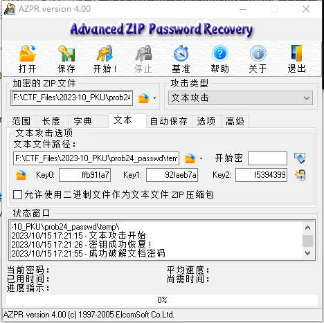
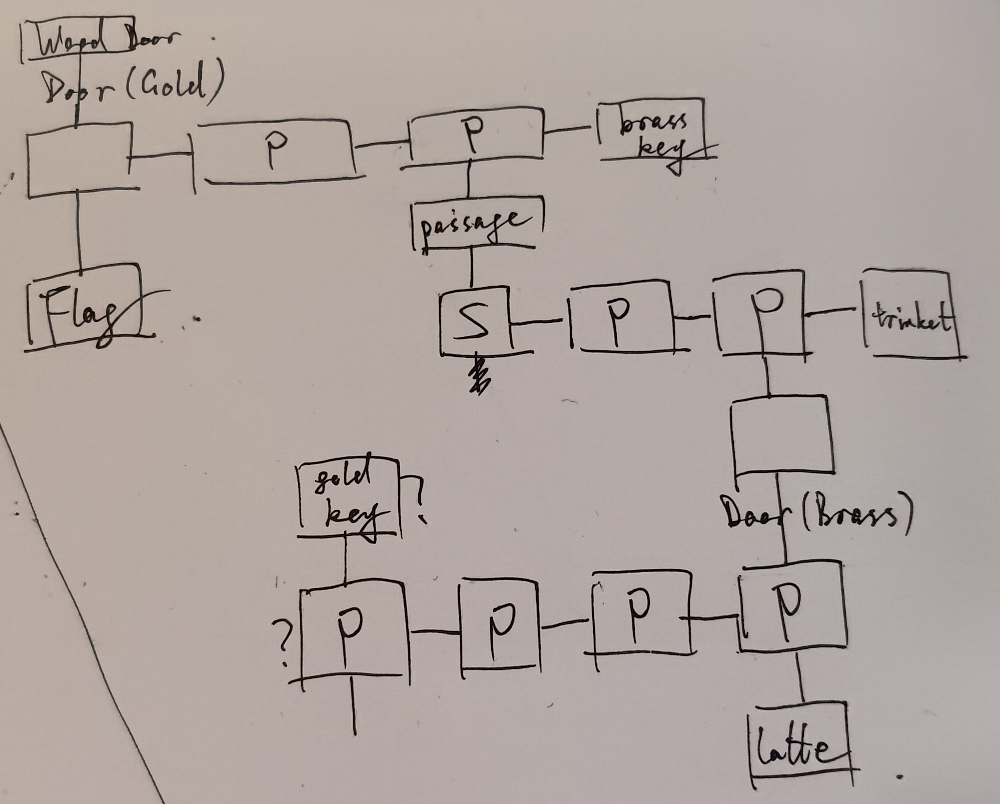
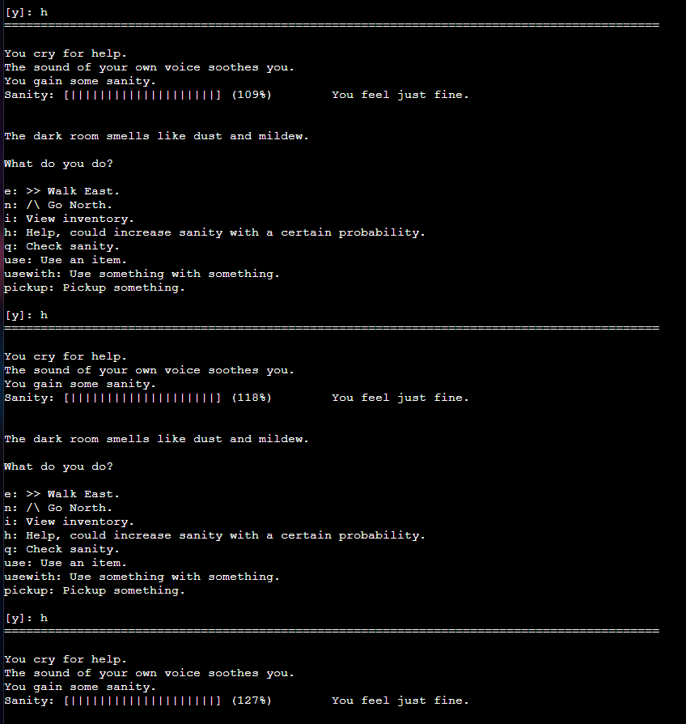
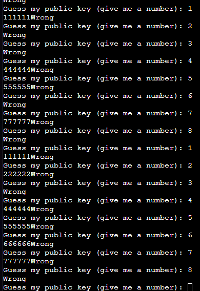
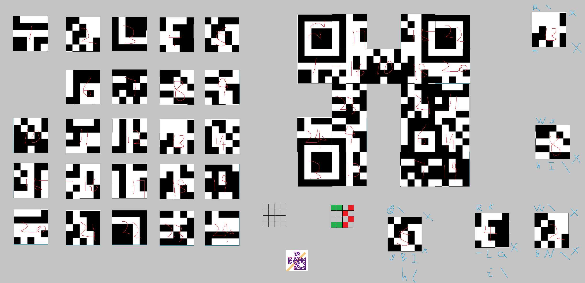
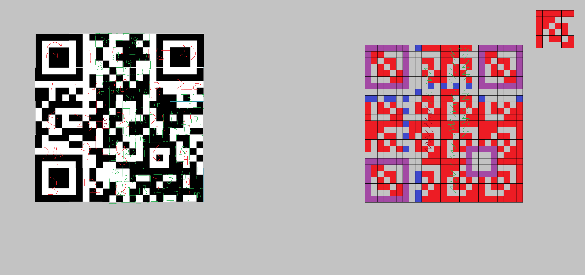
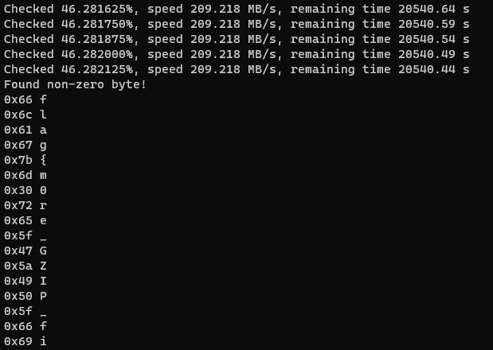

# GeekGame-3rd WriteUp by thrfirs

[TOC]

---

## 前言

在又一个繁忙的秋天，有幸于毕业前最后一次参加 GeekGame。尽管在比赛中奋战 ~~同时在毕设上摸鱼~~ 了一整周，最后依然没突破第一次参赛拿到的排名，有点小遗憾，但还是感谢赛事组一直以来为大家奉献的高质量题目与良好参赛体验。预祝 GeekGame 今后也能越办越好！

另外，虽然我已经提交选手反馈问卷，但想在此补充一些 ~~当时忘了写的~~ 新增题目类型建议：

- 2/3/4 层网络攻击：在到目前为止的三届 GeekGame 中，Web 题目似乎都只关注应用层技术（当然，比赛公告里对 Web 的考察范围说明是“网站安全”，所以这样出题肯定没有问题）；但在网络安全领域，针对 TCP/IP 协议栈的安全攻防也是一个核心研究方向。考虑到难以让选手直接攻击网络设备，也不能出 DDoS 等类型的题目，那么能否构造一个可控的虚拟网络环境，让选手尝试中间人、伪造身份、虚构/修改路由等攻击手段？
- 异常行为识别：风控领域的一个主要研究方向就是用户异常行为检测，或许可以在 Misc 里加一些相关题目？例如提供若干用户交易行为数据和简单的日志查询平台（限制查询频率），让选手定位并追踪某些交易流，最后在日志平台查询到某笔交易的附带文本信息，其中包含 flag 等。
- 神经网络：这个在反馈问卷里写了，现在深度学习大火，对于深度学习模型的攻击也是热门研究领域，所以希望能有针对分类模型的对抗攻击，或者从网络权值还原训练数据等题目。

好了，该写具体的 Writeup 了。下文将分别叙述我在比赛两个阶段中解出的 flag 与对应解法。


---

## 第一阶段：无/较少提示

### Tutorial

#### prob23  一眼盯帧

> *~~如题所述，盯帧即可~~*

题目附件是一个 GIF，明显每帧按顺序给出一个字符，并且第五帧和最后一帧是 `{` 和 `}`；考虑到这是签到题，那么很可能是对 `flag{xxx}` 字符串做 ROT13 等简单处理之后直接生成 GIF，所以只需要读出字符串并做还原。

用眼睛盯实在太痛苦了，因此随便找个能拆分 GIF 帧的工具或网站（例如在 Google 搜索“gif frame extractor”，选第一个网站 https://ezgif.com/split），得到字符串`synt{jrypbzrgbtrrxtnzr}`，做 ROT13 得到 `flag{welcometogeekgame}`，显然是 **正确 flag**。


#### prob18  小北问答!!!!!

> *Google 救我！*

1. **北大高性能计算平台的非交互任务提交命令**：

   Google 搜索 `北京大学 高性能计算平台 "交互"`，用引号强制搜索结果包括关键词“交互”，找到平台官方文档网页 https://hpc.pku.edu.cn/_book/guide/slurm/slurm.html，其中提到：

   > 运行作业的方式有两种：
   >
   > 一种是将计算过程写成脚本，通过sbatch指令提交到计算节点执行；
   >
   > 另一种是通过salloc申请到计算节点，再ssh连接到计算节点进行计算；

   由描述知第二种命令是交互式操作命令，而第一种批式作业则是非交互式，因此答案为 `sbatch`。

2. **Redmi K60 Ultra 内核版本号**：

   Google 搜索 `redmi k60 ultra kernel`，找到小米内核开源列表 GitHub 页面 https://github.com/MiCode/Xiaomi_Kernel_OpenSource，在其中找到红米 K60 Ultra 对应的分支名称是 `corot-s-oss`，因此首先查看 [该分支](https://github.com/MiCode/Xiaomi_Kernel_OpenSource/tree/corot-t-oss)；在其中找到 [Makefile](https://github.com/MiCode/Xiaomi_Kernel_OpenSource/blob/corot-t-oss/Makefile) 文件，其前几行是：

   ```
   # SPDX-License-Identifier: GPL-2.0
   VERSION = 5
   PATCHLEVEL = 15
   SUBLEVEL = 78
   ...
   ```

   由 SemVer 规范知，此处对应的内核版本号为 `5.15.78`。

3. **Apple Watch Series 8 内部识别号**：

   Google 搜索 `apple watch series 8 internal identifier`，在前几个结果中没找到有用信息；

   换成搜索 `apple internal identifier database`，找到排名第二的网页 https://gist.github.com/adamawolf/3048717，在其中找到 41mm 蜂窝版本的 Apple Watch Series 8 对应的一行 `Watch6,16 : Apple Watch Series 8 41mm case (GPS+Cellular)`，因此答案为 `Watch6,16`。

4. **GeekGame 平台截止10月1日对昵称的禁止字符数**：

   显然不能直接遍历 Unicode 字符输入到平台，通过响应信息来计数。~~但居然真有人这么做了（~~

   在 GeekGame 平台页面底部有 [开源协议链接](https://geekgame.pku.edu.cn/#/license)，在协议页面找到 [开源仓库](https://github.com/PKU-GeekGame/guiding-star)，随后跳转到有具体代码的 [后端仓库](https://github.com/PKU-GeekGame/gs-backend)（找后端而不是前端，因为可以通过自行构造请求绕过前端检查，所以至少在后端一定要有昵称过滤逻辑）；在后端代码最接近10月1日的 [commit](https://github.com/PKU-GeekGame/gs-backend/tree/abbbbb7222052fd8d15a5a4b6b802847eeaf95af) 里一番翻找，发现与昵称过滤相关的 [代码文件](https://github.com/PKU-GeekGame/gs-backend/blob/abbbbb7222052fd8d15a5a4b6b802847eeaf95af/src/store/user_profile_store.py)：

   ```python
   from unicategories import categories
   ...
   
   def unicode_chars(*cats: str) -> Set[str]:
       ret = set()
       for cat in cats:
           ret |= set(categories[cat].characters())
       return ret
   ...
   
   class UserProfileStore(Table):
       ...
       
       # https://unicode.org/reports/tr51/proposed.html
       EMOJI_CHARS = (
           {chr(0x200d)}  # zwj
           | {chr(0x200b)}  # zwsp, to break emoji componenets into independent chars
           | {chr(0x20e3)} # keycap
           | {chr(c) for c in range(0xfe00, 0xfe0f+1)} # variation selector
           | {chr(c) for c in range(0xe0020, 0xe007f+1)} # tag
           | {chr(c) for c in range(0x1f1e6, 0x1f1ff+1)} # regional indicator
       )
   
       # https://www.compart.com/en/unicode/category
       DISALLOWED_CHARS = (
           unicode_chars('Cc', 'Cf', 'Cs', 'Mc', 'Me', 'Mn', 'Zl', 'Zp') # control and modifier chars
           | {chr(c) for c in range(0x12423, 0x12431+1)} # too long
           | {chr(0x0d78)} # too long
       ) - EMOJI_CHARS
       WHITESPACE_CHARS = unicode_chars('Zs') | EMOJI_CHARS
   
       @classmethod
       def _deep_val_nickname(cls, name: str) -> Optional[str]:
           all_whitespace = True
           for c in name:
               if c in cls.DISALLOWED_CHARS:
                   return f'昵称中不能包含字符 {hex(ord(c))}'
               if c not in cls.WHITESPACE_CHARS:
                   all_whitespace = False
   
           if all_whitespace:
               return f'昵称不能全为空格'
   
           return None
   	
       ...
   ```

   本题只问“禁止字符”，因此应该是问 `DISALLOWED_CHARS` 这个列表的长度。

   同时题目在开赛一段时间后给出公告提示，说本题结果与 Python 版本有关；由于看到后端源码有海象运算符 `:=`，因此从最新正式版本 Python 3.12 开始遍历到最早正式支持 `:=` 运算符的 Python 3.8，用每个版本输出的 `len(DISALLOWED_CHARS)` 尝试提交，最后发现 Python 3.8 得到的结果是正确的，值为 `4445`。

5. **2011年1月 Bilibili 游戏区的子分区**：

   首先查看 Bilibili 的 [维基百科页面](https://zh.wikipedia.org/wiki/Bilibili)，在其中看到：

   > ### 网站改版
   >
   > 2009年网站域名为mikufans.cn[[36\]](https://zh.wikipedia.org/wiki/Bilibili#cite_note-44)后改成bilibili.us，2011年6月25日，bilibili.us域名失效，正式访问域名更改为bilibili.tv。哔哩哔哩同时宣布在2011年6月26日开放注册一天。

   因此知道2011年1月时 Bilibili 的网站域名仍为 bilibili.us。

   然后访问互联网档案馆 [Wayback Machine](https://archive.org/web/)，在其中搜索 bilibili.us，找到2011年1月某一天（如 Jan 02）的存档，并一步步点击跳转到游戏区，看到：

   

   因此可知答案是 `游戏视频,游戏攻略·解说,Mugen,flash游戏`。

   注：最开始是直接选中页面中“游戏视频”那一行，把空格改成逗号之后直接提交，然后发现答案不对，后来检查发现这样会导致在“flash游戏”后面有一个不可见字符……去掉不可见字符就对了。

6. **某照片中的大型建筑物官网**：

   **① ~~简单解法~~**

   直接选中图片中建筑物的一部分，用 Google 做图片搜索：

   

   观察下边的卢森堡音乐厅图片，跟题目图片那个建筑物长得挺像的。因此直接 Google 搜索 `卢森堡音乐厅 官网`，找到 https://www.philharmonie.lu/，按照题目 regex 要求改成 `philharmonie.lu`，提交，正确！

   **② 预期解法？**

   本题建筑物特征明显，图片搜索实际上已经足够。但为了交叉验证，考虑用图上更多信息做搜索。

   看到图中有“SPONSOR GOLD”等信息，因此尝试 Google 搜索 `金牌赞助商 启迪控股`，发现第一位结果是 http://www.iaspbo.com.cn/contents/2/533，标题为“2023年卢森堡IASP世界大会的赞助商”，且其中金、银、铜赞助商与题目图片中信息完全一致；

   继续搜索 `iasp world conference 2023`，找到大会官网 https://www.iaspworldconference.com/；浏览其中的各个页面，发现在“SOCIAL EVENTS”中有建筑物与题目图片相似：

   

   从下边的信息发现建筑物叫“Philharmonie Luxembourg”，即卢森堡音乐厅。

   此外，在题目图片中左下角有一辆带有 logo 的面包车，上面有可辨认的文字 `w*sound*u`，其中第二位比较像 `x` 或 `k`。分别用 Google 搜索 `"wxsound"` 和 `"wksound"`，找到 http://wksound.lu/ 与可辨认文字高度相关，点进去发现该网站 logo 与面包车上面图案一致，因此确认图中地点为卢森堡。

   

   综合上述信息，图中建筑物为卢森堡音乐厅。


### Misc

#### prob05  Z公司的服务器

> *古老到协议文档和代码都一股灰尘味……*

首先打开网页终端，发现无法交互，等待一段时间之后连接自动关掉了，不知道为什么。只能选择 WireShark 打开附件，随便选一条流量追踪 TCP 流，观察到只有一条完整的 TCP 流，其中可读的文本信息有 `**.B00000000000000`、`**.B0100000063f694` 等。

Google 搜索 `**.B0100000063f694`，发现与 `rz` 和 `sz` 命令有关；进一步搜索这两个命令，发现是一种古老的文件传输协议 ZMODEM，但许多现代终端软件仍然支持用这种协议做文件传递。

本人在 Windows 上使用的终端软件 MobaXterm 也支持该协议，因此先用该软件随便连到一个终端（例如 WSL 或者远程服务器），然后 `nc prob05.geekgame.pku.edu.cn 10005` 连接到题目服务器，随后在终端界面内打开右键菜单，点选“Receive file using Z-modem”，就可以与题目服务器交互，得到第一个 flag 对应的 txt 文件，打开后可得 **第一个 flag** 为 `flag{Anc1ent_tr4nSf3r_pr0TOcoi_15_57111_In_u5E_t0d4y}`。

接下来尝试分析流量文件：~~并不会流量重放，所以~~ 猜测需要解析 ZMODEM 协议流量包的具体字段，因此查找 ZMODEM 协议的介绍，这里我主要看的是 https://wiki.synchro.net/ref:zmodem 这个协议介绍页面，以及 https://blog.csdn.net/alpbrook/article/details/123275755 这篇博客对 ZMODEM 抓包的分析。

由协议介绍知，在主要的文件传输流量中，每当遇到 ZDLE 符号 `0x18` 时，它与后面的一个字节构成原始文件中一个字节的对应，解码时需要去掉 ZDLE 并把传输过来的字节与 `0x40` 求异或，得到原始字节；并且去掉 ZMODEM frame header 后，每 1030 个解码后的字节构成一个 chunk，其前 1024 字节为 payload，后 6 字节为 2 字节的 ZDLE ZCRCE 控制序列和 4 字节的 CRC。

此外，目测流量中去除 frame header 之后，剩余的流量以 `ffd8ffe0` 开头，因此很可能是在传输 jpg 文件。

将文件传输部分的流量按照 hex 格式从 WireShark 中拷贝出来，然后按照上述方法解码，解码代码如下：

```python
stream = "ffd8ffe018401850..."

FRAME_DATA_LENGTH = 1024
FRAME_END_LENGTH = 1
FRAME_CRC_LENGTH = 4
FRAME_TOTAL_LENGTH = FRAME_DATA_LENGTH + FRAME_END_LENGTH + FRAME_CRC_LENGTH

stream = stream.replace("\n", "")
print(len(stream))

# Split the stream into bytes
chunks = [int(stream[i:i+2], 16) for i in range(0, len(stream), 2)]

def decode_zdle(chunks):
    res = []
    i = 0
    while i < len(chunks):
        if chunks[i] == 0x18:
            # Apply ZDLE decoding (XOR with 0x40)
            decoded_byte = chunks[i + 1] ^ 0x40
            res.append(decoded_byte)
            i += 2
        else:
            res.append(chunks[i])
            i += 1
    return res

raw_decoded_chunks = decode_zdle(chunks)
print(len(raw_decoded_chunks))
# print("".join("{:02x}".format(b) for b in decoded_chunks))

decoded_chunks = []
for i in range(0, len(raw_decoded_chunks), FRAME_TOTAL_LENGTH):
    frame = raw_decoded_chunks[i:i+FRAME_TOTAL_LENGTH]
    data = frame[:FRAME_DATA_LENGTH]
    decoded_chunks.extend(data)

with open('output.jpg', 'wb') as f:
    f.write(bytearray(decoded_chunks))
```

得到可正确打开的 output.jpg，打开后得到 **第二个 flag**：`flag{traFf1c_aNa1y51s_4_ZMODEM}`。


#### prob15  猫咪状态监视器

> *猫猫 ×   cat √*

观察附件提供的源码，发现 `STATUS` 对应的命令行是 `"/usr/sbin/service {} status".format(service_name)`，大概率存在代码注入风险。考虑到源码中执行命令行时用 `shlex.split(cmd)` 做了预处理，且后续执行时设置了 `subprocess.Popen(..., shell=False)`，因此无法简单地通过 shell 方式实现注入（如插入 `&&` 等），需要利用 `/usr/sbin/service` 自身的注入漏洞。

Google 搜索 `/usr/sbin/service exploit`，排名第一位的网页是 https://gtfobins.github.io/gtfobins/service/，其中介绍了一种利用方式：

> ## Shell
>
> It can be used to break out from restricted environments by spawning an interactive system shell.
>
> ```shell
> /usr/sbin/service ../../bin/sh
> ```

由题目名称猜测，同样的执行方式也可以执行 `../../bin/cat`；根据附件提供的 Dockerfile 得知 flag 位于 `/flag.txt`，因此连接到题目服务器后，先输入 `STATUS` 进入有注入漏洞的流程，然后输入 `../../bin/cat /flag.txt` 执行注入，得到服务器输出 `flag{Re4d_U5r_sB1n_SERV1ce_iS_hELpful}`，即为**本题对应的 flag**。


#### prob24  基本功

> *这下那些带密码的 学习资料 有救了*

观察第一个附件压缩包，发现其中有一个 `chromedriver_linux64.zip` 和 `flag1.txt`。由于 chromedriver 有官方公开可下载版本，怀疑是通过明文攻击获取 flag1.txt 的内容。

看到 `chromedriver_linux64.zip` 的未压缩大小是 5845152，因此 Google 搜索 `chromedriver_linux64.zip 5845152`，找到对应的版本为 `89.0.4389.23`，下载该版本 Linux chromedriver 压缩包确认大小与题目附件中一致，从而获取到有效的明文。

使用 `AZPR 4.00` 工具基于明文文件执行密钥反推，得到第一个附件 zip 文件的三个密钥；用这三个密钥提取出 flag1.txt 的内容，得到第一个 flag 为 `flag{Insecure Zip Crypto Against Any Known File Content}`。



然后观察第二个附件压缩包：其中没有额外的明文文件，但有一个 `flag2.pcapng`；由于 `.pcapng` 类型的文件具有已知的文件头，因此猜测通过少量明文即可成功执行明文攻击。

搜索通过少量明文片段攻击解密 zip 文件的方法，找到 https://www.freebuf.com/articles/network/255145.html，其中直接介绍了用 https://github.com/kimci86/bkcrack 工具对 `.pcapng` 文件的 zip 压缩执行 8+4 字节明文攻击的方法：

> **选用第二段文件头格式：**
> 00 00 4D 3C 2B 1A 01 00 00 00 FF FF FF FF FF FF FF FF
>
> **攻击：**
> echo -n "00004D3C2B1A01000000FFFFFFFFFFFFFFFF" | xxd -r -ps > pcap_plain1
>
> time bkcrack -C 3.zip -c capture.pcapng -p pcap_plain1 -o 6
>
> **解密：**
> bkcrack -C 3.zip -c capture.pcapng  -k e33a580c  c0c96a81 1246d892  -d out.pcapng

按照相同方法，本地编译 bkcrack 后执行明文攻击，再用攻击反推得到的三个密钥得到原始的 `out.pcapng` 文件；用 WireShark 打开该文件并追踪 TCP 流，可以找到一条有较多交互信息的流，其中最后给出了 `flag{iNSEcUrE-zIp-crYPtO-eVeN-witHOuT-KnOWN-fiLe-CoNtENT}`，即为 **第二个 flag**。


#### prob16  Dark Room

> 

打开游戏，尝试几次可以确定游戏的地图如下：



其中 `S` 为玩家起始的房间，在不使用 `help` 指令、完美执行所有操作的情况下，最终走到 `Wood Door` 通关时会剩余 90% 的理智值。通关后，会有一段提示称通关后如果剩余理智值大于等于 117% 则会给出第一个 flag。

查阅题目给出的参考源码项目 https://github.com/tinichu316/Dark_Room，发现 help 指令本身每次会有 20% 的概率给玩家补充 10% 的理智值，剩余 80% 会扣除理智值；由于每回合动作均消耗 1% 理智值，因此每次 help 相当于以 20% 概率给玩家补充 9% 理智值，即想要以 117% 通关游戏，就必须至少有 3 次 help 各自成功补充 9% 理智值。

考虑到 help 指令可以在任何回合使用，因此在游戏一开始就尝试“三连 help 均成功补充 9% 理智值”是最高效的策略。这个策略的成功概率是 (0.2)^3 = 1/125，每次重开游戏只需要刷新页面并重新输入开始游戏、姓名、确认开始、三次 `h` 指令并观察结果即可。这个过程可以被程序自动化，但由于本人在 [某个游戏](https://bluearchive.jp/) 里已经积累了丰富的“*凹开局、凹暴击、凹安定、凹命中、凹分身*”等经验，已经能对随机失败的情况面不改色地重开，因此直接选择手动操作上述过程，大概试了不到 30 分钟就遇到了理想情况。



随后只需要按完美操作步骤执行后续游戏流程，通关后即得到 **第一个 flag**。（忘了记录具体的 flag 字符串了）

而在上述地图中，`flag` 对应的房间可以与服务器交互尝试猜测 flag 的值。但当输入的字符串不是纯数字时，程序会给出报错信息与 Traceback 日志：

```
File "dark_room/player.py", line 249, in <module>
248:   while flag_number:
249:      choice = int(self.recv(b"Guess my public key (give me a number): ").decode())
                ^^^^^^^^^^^^^^^^^^^^^^^^^^^^^^^^^^^^^^^^^^^^^^^^^^^^^^^^^^^^^^^^^^^^
250:      if flag_number & 1:
251:          p = getStrongPrime(2048)
252:          q = getStrongPrime(2048)
253:      flag_number >> 1
```

可以看到，如果当前 `flag_number` 的最后一位是 1，则会随机生成两个大质数，并且在后续 253 行暗示了 `flag_number` 会被继续右移一位。尝试在这个循环中多次输入数字 `1`，发现每次输出 `Wrong!` 提示信息的延时确实有差别，有时立即给出错误提示，有时则要等待将近 1 秒，且每次等待时间基本稳定。因此，猜测该过程是通过每次猜测的延时推断每个 bit 的值，然后再对得到的 bit 序列做解码。

获取 bit 序列的过程同样可以程序自动化，但简便起见此处仍然手工执行。这里可以利用 console 在有延迟时的输入特性：如果从输入到输出有延迟，则可以多次多次在同一行上输入，且不会传输到服务器，而如果输入到输出几乎是零延迟，则人手工执行的输入几乎一定会慢于 console 的刷新，所以会切换到下一行输入，例如下图。因此，在 `Wrong!` 前有较长输入即意味着该 bit 对应 1，而较短输入则对应 0。这种方法便于人眼检验每个 bit 的值，而不用紧盯屏幕观察刷新延时。



获取前 8 个 bit 得到 `10111110`，翻转后即为 `}` 字符在 ASCII 对应的 `0x7d`，并且按顺序解码接下来的每 8 个 bit 得到 `ExcellENtLy`，可以辨认其语义，因此证明该方法确实可以正确获取 flag。继续操作得到 `{You_s0lVEd_tH1s_chaLleNge_ExcellENtLy}`，前面补上 `flag` 前缀即得到 **第二个 flag**。


### Web

#### prob14  Emoji Wordle

> 👁

首先看 level 1：由于 level 1 的答案是固定的，因此只要能知道哪些 emoji 出现在最终答案中，就可以对 64 个位置并行枚举每个位置的值，直到所有位置都得到🟩。因此，最重要的就是确认哪些 emoji 可能出现在最终的答案中。搜索发现 emoji 数量大概在 5000 左右，因此考虑直接枚举。

枚举列表生成逻辑如下：用 Python 的 emoji 库生成全部 emoji，去掉其中会被识别为大于等于 2 个字符的 emoji（例如一些肤色或性别的组合 emoji），再去掉一些无法在 console 中显示导致变成 `\u00xxxxxx` 的 emoji，最终得到 1122 个；但尝试之后发现有一个答案中出现的 emoji 不在这种方法得到的 emoji 备选列表中，因此只能通过观察网页端每次随机生成的 emoji 序列，找到这个特殊的 emoji “👁”。

```python
from emoji.unicode_codes import get_emoji_unicode_dict

d = get_emoji_unicode_dict("en")

L = []
for v in d.values():
    if "u" in str(set([v])).lower():
        # print(v)
        continue
    if len(v) > 1:
        continue
    L.append(v)

EMOJI_LIST = L + ["👁"]
```

得到所有合法备选 emoji 后，只需要不放回地每次抽取 64 个不同 emoji 作为输入，提交到网页端看匹配结果，如果为🟥则该 emoji 不在最终答案里，否则它一定在最终答案里；剩余不到 64 个时备选 emoji 时，任选一个必然不出现在答案中的 emoji，如🟥，来补齐即可。最后得到答案中可能出现的所有 emoji 列表为 👙👈💅👆👡👔👇👽👶👞👓👺💂👧👉👢👛💆👦👵👝💈💁👩👗👲👼👸👿👴👤💊👘👃👜👱👅👳👄💄💃👂👁，共 43 个。

接下来只需要对答案的 64 个位置，每个位置不重复地遍历这 43 个可能的 emoji：如果一个位置得到 🟩，则固定该位置的 emoji，否则继续不重复地轮换。最终得到答案为 💈💅👼💁👦👗💊💊👱👇👔💆👺👦👓👳👔👉👞💄👧👘💃👺👸👴👿👙👵💆👩👽👛👓👦👝👢💃💅👶👅💈👈💅👼👁👃💂👆👄👂👳👲👢💆👤👜👆👺👱👺👛👆👡，从而得到网页显示的 **第一个 flag**：`flag{s1Mp1e_brut3f0rc3}`。

接下来看 level 2：题目给出提示称 level 2 的答案存储在会话中，因此观察每次打开 level 2 时网页产生的存储，发现会生成一个较长的 cookie，其格式为 `xxx.xxx.xxx`；将这个 cookie 丢给 GPT4 API，询问这是什么 cookie 格式，得到猜测为 JWT (Json Web Token)；因此搜索一个 JWT 的解码网站，例如 https://jwt.io/，将 level 2 生成的 cookie 直接解码，发现有 64 个 emoji 组成的序列，输入网页即得到 **第二个 flag**：`flag{d3c0d1n9_jwT_15_345y}`。


#### prob13  简单的打字稿

> *对 TypeScript 一窍不通；感谢 GPT4 的倾情支援*

**flag1 解法**：本地用 Deno 测试以 `let s: flag1 = "abc"` 作为输入，发现报错信息会给出 `error: TS2322 [ERROR]: Type '"abc"' is not assignable to type '"flag{xxx}"'.`。由于判断程序会检查报错信息的 stderr 里是否有 flag 字样，因此考虑将 `flag` 从原本的类型中过滤掉。向 GPT4 API 提问“如何从 `type flag1 = 'flag{abc123}'` 仅通过类型推导得到 `type T = 'abc123'`”，其生成的代码形如：

```typescript
type ExtractT<T extends string> = T extends `flag{${infer U}}` ? U : never;
type T = ExtractT<flag1>;
```

从而只需要用 `let s: T = "123"` 就可以得到不包含 `flag{}` 前后缀的类型报错信息。

将上述程序输入网页交互，即可得到：

```
Process exited with code 1
[+] Stdout:

[+] Stderr:
Check file:///app/$deno$stdin.ts
error: TS2322 [ERROR]: Type '"1"' is not assignable to type '"tOo0_e4sY_f1ag_FoR_TooO_EaSy_laNg"'.
let a: tt = "1"
    ^
    at file:///app/$deno$stdin.ts:6:5
```

所以得知 **第一个 flag** 为 `flag{tOo0_e4sY_f1ag_FoR_TooO_EaSy_laNg}`。

注：用类似的方法提示 GPT4，在 flag2 上已经进展得到 `type T = { 'flag{xxx}': never } & Record<string, string>`，但不知道如何继续推导得到具体的 flag 字符串类型。


### Binary

#### prob25  汉化绿色版免费下载

> *这可太有那味了*

由于附件提供了 `.xp3` 文件，看起来是 KRKR 引擎的游戏存档，因此使用 https://github.com/morkt/GARbro 等工具打开 `data.xp3`；发现文件本身未被加密，直接可以读取其中的诸多文件，例如找到 `scenario/done.ks` 文件并切换为 GB2312 编码读取，可以发现其中直接就有 **第一个 flag**：`flag{did-you-unpack-the-xp3?}`。

继续看 `scenario` 目录下的其它文件，发现是与判别流程相关的脚本；每次输入通过 `hash = (hash * 13337 + x) % 19260817` 计算哈希，两次哈希一致则输出第一个 flag。而题面称 flag2 是出题人存储在存档中的内容，观察 `data.xp3` 没有找到与存档相关的记录值，因此转去看附件中的 `savedata` 文件夹。

通过二进制编辑器直接打开 `data0.kdt`、`datasc.ksd`、`datasu.ksd` 等，没有观察到可以辨别的信息；Google 搜索 `KRKR 存档加解密`，找到 https://iyn.me/i/post-45.html 文章，其中提到 https://github.com/arcusmaximus/KirikiriTools 工具可以解除 KRKR 存档混淆，尝试后成功读取到这几个文件的内容。

其中，`data0.kdt` 中关键信息为：

```
"user" => %[
  "hash" => int 1337,
  "text" => string "flag{",
  "prev_hash" => int 7748521
 ],
```

`datasu.ksd` 的全部信息为：

```
%[
 "trail_round1_sel_i" => int 1,
 "autotrail_func_init" => int 1,
 "trail_func_init" => int 1,
 "autotrail_first_start" => int 1,
 "autotrail_round1_sel_i" => int 1,
 "trail_round1_round_1" => int 1,
 "trail_autolabel_autoLabelLabel" => int 18,
 "autotrail_round1_sel_end" => int 2,
 "trail_round1_sel_fin" => int 1,
 "autotrail_autolabel_autoLabelLabel" => int 2,
 "trail_round1_sel_a" => int 6,
 "autotrail_round1_sel_e" => int 1,
 "trail_first_start" => int 1,
 "trail_round1_sel_loop" => int 18,
 "autotrail_round1_sel_a" => int 1,
 "autotrail_round1_sel_o" => int 1,
 "trail_round1_sel_end" => int 17,
 "autotrail_round1_sel_loop" => int 1,
 "autotrail_round1_sel_fin" => int 1,
 "trail_round1_sel_e" => int 3,
 "autotrail_round2_round_2" => int 1,
 "trail_round1_sel_o" => int 6,
 "autotrail_round1_round_1" => int 2
]
```

从其中可以猜测出，出题人在存档中第一次输入了 6 个 A、3 个 E、1 个 I、6 个 O、0 个 U 和 1 个 fin 符号（即 `}`），最后得到的 hash 值为 7748521。因此编写程序遍历所有可能性：

```python
from typing import Tuple, List, Dict, Set, Optional

TARGET = 7748521
N = 4
L = 16

INIT_HASH = 1337
INIT_COUNT = [6, 3, 1, 6]
P = 13337
M = 19260817
FACTORS = [11, 22, 33, 44]
FINAL_FACTOR = 66

solutions = []

def dfs(counts: List[int], curr_seq: List[int], curr_hash: int):
    global solutions
    if len(curr_seq) == L:
        curr_hash = (curr_hash * P + FINAL_FACTOR) % M
        if curr_hash == TARGET:
            solutions.append(curr_seq)
            print(f"Found {len(solutions)} solutions")
        return

    for i in range(N):
        if counts[i] == 0:
            continue
        counts[i] -= 1
        new_hash = (curr_hash * P + FACTORS[i]) % M
        dfs(counts, curr_seq + [i], new_hash)
        counts[i] += 1
    
def main():
    dfs(INIT_COUNT, [], INIT_HASH)
    print(f"Found {len(solutions)} solutions")
    for seq in solutions:
        print("".join([str(i) for i in seq]))


if __name__ == "__main__":
    main()
```

最后发现只有一个解，映射出来是 `OOAAAAEAEIEAOOOO`，所以 **第二个 flag** 是 `flag{OOAAAAEAEIEAOOOO}`。


### Algorithm

#### prob04  关键词过滤喵，谢谢喵

> *你喵什么喵😅*

第一阶段只解出来 flag1 喵！

flag1 说是字数统计，其实是要实现 `x+=1` 的操作喵！因为只需要把原串的每一个字符全换成 `😂`（题面说了原文不会有 emoji 喵），然后在最前面加一个 `0`，接下来每删掉一个 `😂` 就把最前面的数字做自增 1 的操作，最后把做若干次自增操作得到的数字字符串输出就可以了喵！

实现 `x+=1` 主要分成两种情况喵！

- 第一种情况是数字字符串结尾为 `[0-8]`，这个时候只需要分 9 种情况分别匹配，例如匹配到结尾是 `2` 就把结尾换成 `3`，这样就行了喵，因为没有进位操作喵！
- 第二种情况是数字字符串结尾为 `9`，这个时候做自增 1 就引入了进位喵，比较复杂喵！我的实现方式是首先把所有结尾连续的 `9` 都换成一个原串没有的字符，例如 `B` 喵！然后如果第一个 `B` 前面什么都没有，意味着原先的数字串形如 `99...9`，所以只需要在最前面加一个 `1` 字符就行了喵！而如果第一个 `B` 前面有东西，则必然是 `[0-8]` 的字符，所以按照前述第一种情况做不进位自增就行了喵！最后把所有的 `B` 换回 `0` 喵！

最后实现出来的程序像下面这样子喵：

```
init：
重复把【[^😂]|\n】替换成【😂】喵

如果没看到【😂】就跳转到【emptyend】喵

把【(😂+)】替换成【0A\1】喵

loop：
重复把【B】替换成【0】喵
如果没看到【😂】就跳转到【end】喵

把【A😂(😂*)】替换成【A\1】喵

checkadd：
如果看到【0[AB]】就跳转到【add0】喵
如果看到【1[AB]】就跳转到【add1】喵
...
如果看到【8[AB]】就跳转到【add8】喵
如果看到【9[AB]】就跳转到【add9】喵

add0：
把【0([AB])】替换成【1\1】喵
如果看到【A】就跳转到【loop】喵

add1：
把【1([AB])】替换成【2\1】喵
如果看到【A】就跳转到【loop】喵

...

add8：
把【8([AB])】替换成【9\1】喵
如果看到【A】就跳转到【loop】喵

add9：
重复把【9(B*A)】替换成【B\1】喵
如果看到【[0-8][BA]】就跳转到【checkadd】喵
把【(B*A)】替换成【1\1】喵

如果看到【A😂】就跳转到【loop】喵

emptyend：
把【.*】替换成【0A】喵

end：
把【([0-9]+)A】替换成【\1】喵
谢谢喵
```

需要注意这里所有的冒号居然都需要是中文（全角）冒号喵！很烦人喵！

最后提交上去就可以得到 **第一个 flag** `flag{W0w_yoU_c4N_REAl1Y_reGex}` 喵！


#### prob08  小章鱼的曲奇

> *呜呜呜我也曾是杏仁啊*

观察题目附件程序：

- 第一个 flag 的流程是先输出某个随机种子下的连续 2500 > 4*624 = 2496 个字节，然后继续输出该随机种子生成的字节序列与 flag1 的异或序列。由于 Python random 库使用 mt19937 算法生成随机数，因此这个 flag 是经典的根据 624 个字节反推随机数生成器状态，然后预测随机序列的问题。因此，只需要找一个开源的 mt19937 预测库，例如我使用的是 `pip install mersenne-twister-predictor`，然后用它读入 2500 个字节并做后续预测，把题目服务器输出与预测字节序列再求一次异或，就可以得到 flag1 了。

  ```python
  def get_smol_cookie(ancient_words_hex_str: str) -> bytes:
      ancient_words = bytes.fromhex(ancient_words_hex_str)
  
      N = 2500
      rand_bytes = ancient_words[:N]
      xored_cookie_bytes = ancient_words[N:]
  
      # step 1: use the first 2500 bytes to initialize a predictor
      predictor = MT19937Predictor()
      for i in range(N // 4):
          predictor.setrandbits(int.from_bytes(rand_bytes[4*i:4*i+4], 'little'), 32)
      
      # step 2: predict the next len(xored_cookie_bytes) bytes
      predicted_bytes = predictor.randbytes(len(xored_cookie_bytes))
      original_cookie_bytes = xor_arrays(predicted_bytes, xored_cookie_bytes)
  
      return original_cookie_bytes
  
  S = "75b95f6f..."  # 服务器输出
  print(get_smol_cookie(S))
  ```

  最后得到 **第一个 flag**：`flag{RAnd0m_1S_eZ_2_PREd1cT}`。

- 第二个 flag 的流程是给出服务器随机生成的、不可预测的 `seed1`，并由选手给出必须与 `seed1` 不同的 `seed2`，再在服务器生成一个新的不可预测随机种子 `seed3`，然后将前两个种子随机做若干次 `randbytes` 以使其结果不可预测，最后将这三个种子各自对应的随机字节序列求异或后输出前 2500 个字节，并继续与 flag2 求异或后输出。此处可以发现，如果前两个随机种子对应的生成器能够生成完全相同的序列，则问题转化为第一问。因此，第二问实质上是要求选手构造一个新的 `seed2`，使其对应的随机数生成器内部初始状态与 `seed1` 得到的初始状态完全相同，由此才能在后续得到完全一致的随机序列。

  此处先看 random 库的 Python 源码，发现 `seed` 函数是一个对 C 实现的 stub，因此再去找到 CPython 实现 seed 设置过程的源码：https://github.com/python/cpython/blob/main/Modules/_randommodule.c，观察其过程发现主要是把输入字节序列送入 `init_by_array` 函数：

  ```C
  /* initialize by an array with array-length */
  /* init_key is the array for initializing keys */
  /* key_length is its length */
  static void
  init_by_array(RandomObject *self, uint32_t init_key[], size_t key_length)
  {
      size_t i, j, k;       /* was signed in the original code. RDH 12/16/2002 */
      uint32_t *mt;
  
      mt = self->state;
      init_genrand(self, 19650218U);
      i=1; j=0;
      k = (N>key_length ? N : key_length);
      for (; k; k--) {
          mt[i] = (mt[i] ^ ((mt[i-1] ^ (mt[i-1] >> 30)) * 1664525U))
                   + init_key[j] + (uint32_t)j; /* non linear */
          i++; j++;
          if (i>=N) { mt[0] = mt[N-1]; i=1; }
          if (j>=key_length) j=0;
      }
      for (k=N-1; k; k--) {
          mt[i] = (mt[i] ^ ((mt[i-1] ^ (mt[i-1] >> 30)) * 1566083941U))
                   - (uint32_t)i; /* non linear */
          i++;
          if (i>=N) { mt[0] = mt[N-1]; i=1; }
      }
  
      mt[0] = 0x80000000U; /* MSB is 1; assuring non-zero initial array */
  }
  ```

  可以发现第二个 for 循环与初始 seed 序列 `init_key` 无关，所有的相关过程都在第一个 for 循环，而其中实际上是在第 `i` 个位置使用 `init_key[j] + (uint32_t)j` 作为该字节的随机种子，其中 `j` 不断在 seed 序列长度范围内循环。因此，可以将原先的 `init_key` 序列拷贝一份放到原先序列的后面，并把后面这一份每个字节都减去原先序列的长度（无符号减法），从而使初始化过程中对于每个 `i` 得到的 `init_key[j] + (uint32_t)j` 与原先无差别。这个过程的 Python 实现如下：

  ```python
  def dup_seed(seed_hex: str) -> int:
      seed = int(seed_hex, 16)
      
      # 1. convert it to bytes
      b32_len = (seed.bit_length() - 1) // 32 + 1
      b8_len = b32_len * 4
      seed_bytes = seed.to_bytes(b8_len, 'little')
  
      # 2. dup the bytes and subtract b32_len for each
      dup_seed_bytes = bytes()
      for i in range(0, len(seed_bytes), 4):
          b32_int = int.from_bytes(seed_bytes[i:i+4], 'little')
          new_int = (b32_int - b32_len + 2**32) % 2**32
          dup_seed_bytes += new_int.to_bytes(4, 'little')
      
      # 3. concatentate the bytes and convert it back to int
      new_seed_bytes = seed_bytes + dup_seed_bytes
      new_seed = int.from_bytes(new_seed_bytes, 'little')
  
      return new_seed
  ```

  这样，对于服务器给出的一个 256 bit 的 seed 字节序列，只需要用 `dup_seed` 函数构造一个长度翻倍的新 seed 给服务器，最终得到的输出就可以用第一问的方法来解决了。这样得出的 **第二个 flag** 是 `flag{cRAFT1nG_sEEd_cAN_b3_fuUuN}`。

- 观察第三个 flag 的判断流程，发现只需要使给服务器的 100 个 seed 能够分别与服务器给出的 100 个 seed 产生相同随机序列；这可以用第二问的方法来构造，但正如出题人在比赛第二阶段给出的提示：“由于出题人不慎少判断了一个条件，此题存在一个非常简单的非预期解”，本题第三问判断程序并没有 *要求选手返回给服务器与原本服务器给出的 seed 一定不同*，因此只需要想办法绕过 tty 每次只能输入 4096 个字符的限制，用 pwntools 等库接收服务器传来的 100 个种子序列并原样传回去，就可以得到 **第三个 flag** `flag{pYThON_rANd0M_sOo000oO0oOoO0OooO000_eaSy}` 了。


#### prob19  华维码

> *遥遥领先*

本题解出了 flag1。在做法上没有什么特殊的，主要就是参考 QRCode 的 [中文](https://zh.wikipedia.org/wiki/QR%E7%A2%BC) 和 [英文](https://en.wikipedia.org/wiki/QR_code) 维基百科，并按以下步骤拼拼图：

- 先确认三个大定位点对应的块，以及其边界对应的块；
- 找到小定位点对应的块，如果可能的话再额外找到这个块旁边的边界块；
- 从大定位点边上的纠错等级区域确认该二维码是 L 等级，从而确定其存储的有效字节数为；
- 从大定位点边上的掩码类别区域确认该二维码使用 `((i*j)%3+i*j)%2=0` 的 mask；
- 猜测二维码使用 Binary 的编码模式，因此每个数据段有 8 个字节长，且二维码右下角在掩码前应该是 `0100`，从而确定右下角的块，接着计算出整个二维码存储了 31 字节的信息；
- 从右下角开始逐渐往上、往左，按二维码数据顺序蛇形拼接每个块，原则是能够不断地解出更多有语义含义、在 ASCII 可显示编码范围内的字节；
- 拼完之后拿微信扫码。

由于 Writeup 主要是为了证明题目是自己做的，这里就只放两张中间过程吧。如果不写代码来自动化上面过程的话，实质就只是体力活……





最后扫码得到 第一个 flag：`flag{Lol-Amazing-I-Love-Qrcode}`。


---

## 第二阶段：有提示

算了下分数，无论如何都拿不到二等奖。开摆！

### Web

#### prob01  第三新XSS

> *连一刻都没有为 prob13 flag1 哀悼，立刻赶到 GPT4 面前的是—— prob01 flag1。*

本题解出了 flag1。

看到本题新增的提示：“给 Cookie 设置 Path 并不能带来安全性。[MDN 文档](https://developer.mozilla.org/en-US/docs/web/api/document/cookie#security) 专门有一节来指出其中的问题。”

查看对应的 MDN 文档，找到如下一段：

> It is important to note that the `path` attribute does *not* protect against unauthorized reading of the cookie from a different path. It can be easily bypassed using the DOM, for example by creating a hidden [`<iframe>`](https://developer.mozilla.org/en-US/docs/Web/HTML/Element/iframe) element with the path of the cookie, then accessing this iframe's `contentDocument.cookie` property. The only way to protect the cookie is by using a different domain or subdomain, due to the [same origin policy](https://developer.mozilla.org/en-US/docs/Web/Security/Same-origin_policy).

把本题附件里 XSS bot 的源码和这段话提供给 GPT4 API，对话如下：

>**Me**:
>
>Have a look at this sample Python XSS bot program:
>
>```
>with webdriver.Chrome(options=options) as driver:
>    print('\nSetting up flag 1')
>    driver.get(admin_url)
>    time.sleep(.5)
>    driver.execute_script(f'document.cookie = "flag={getflag(1)}; path=/admin"')
>    time.sleep(.5)
>    
>    print('\nVisiting your webpage')
>    driver.get(hacker_url)
>    time.sleep(1)
>    
>    title = driver.title
>    print('\nThe page title is:', title)
>```
>
>According to MDN document: \"It is important to note that the path attribute does not protect against unauthorized reading of the cookie from a different path. It can be easily bypassed using the DOM, for example by creating a hidden <iframe> element with the path of the cookie, then accessing this iframe's contentDocument.cookie property. The only way to protect the cookie is by using a different domain or subdomain, due to the same origin policy.\"
>
>Suppose admin_url and hacker_url is in the same domain. Then how to correctly set up an iframe in hacker's page and get the flag1 in the cookie to be the title?
>
>**GPT4**:

接下来直接把 GPT4 给出的最后这两段代码放到题目网站 `https://prob99-9nhqtlzy.geekgame.pku.edu.cn/` 里，注册为某个用户名（例如 `abc`）的个人主页内容，然后让 XSS bot 访问 `http://prob99-9nhqtlzy.geekgame.pku.edu.cn/abc/`（设置 http 保证 XSS bot 评测的是 flag1），即可得到 **第一个 flag**：`flag{ToTALLY-NO-sECuRItY-In-The-SAME-ORIgiN}`。


### Algorithm

#### prob04  关键词过滤喵，谢谢喵

> *喵个没完了是吧😅*

这次多解出了 flag2 喵！因为题目给出新提示喵：“就像[睡排序](https://www.rosettacode.org/wiki/Sorting_algorithms/Sleep_sort)一样，文本按字数排序也可以用类似的方法实现喵！”

所以可以这样实现字符串排序喵：

- 先把每行字符串旁边都加一串等长但只由✨构成的字符串，同时用❤做分隔喵！例如原串是 `永雏塔菲\n黑桃影\n`，做变换之后变成 `永雏塔菲✨✨✨✨❤黑桃影✨✨✨❤` 喵！
- 每次都在每段连续的✨里删掉一个，直到有些串边上的✨完全被删光喵！比如上面的例子一直删除会变成  `永雏塔菲✨❤黑桃影❤` 喵！
- 把✨被删光的串挪到最后面去，再加上 `\n` 喵！最后所有的串就都是按字符数量从小到大排序、按 `\n` 分隔的了喵！比如例子就会变成 `黑桃影\n永雏塔菲\n` 喵！

最后加上一些辅助性的分隔符、边界检查之类的细节喵！得到的代码像下面这样子喵：

```
preprocess：
重复把【\n{2,}】替换成【\n】喵
把【\n】替换成【❤】喵
把【([^❤])$】替换成【\1❤】喵
把【^([^❤])】替换成【❤\1】喵

sortinit：
重复把【❤([^❤✨]*?)([^❤✨])❤】替换成【❤\2✨\1❤】喵
重复把【❤([^❤✨]*)(✨*)([^❤✨]*?)([^❤✨])❤】替换成【❤\4\1✨\2\3❤】喵
把【❤$】替换成【❤👌】喵

sortloop：
如果没看到【✨❤】就跳转到【end】喵
把【✨❤】替换成【❤】喵
重复把【❤([^❤✨]*?)❤(.*)$】替换成【❤\2\1💕】喵
如果看到【✨❤】就跳转到【sortloop】喵

end：
把【💕】替换成【\n】喵
把【[❤✨👌]】替换成【】喵
谢谢喵
```

提交上去之后得到 `flag{CaN_c4n_NEeD_ShoW_sh0w_Way}`，这就是 **第二个 flag** 喵！


#### prob21  未来磁盘

> *暴力出奇迹*

本题解出了 flag1。

尝试直接解压附件给出的 flag1.gz，解压第一次结果大小约 11MB，解压第二次结果大小约 7GB，因此猜测第三次解压后就可以得到题目描述所写“约 7TB”的原文件；尝试在第二次解压结果基础上做 `dd if=flag1.gz bs=1 count=1000 | gunzip -c 2> /dev/null | xxd -p`，看到输出的全都是 0，所以可以基本确认这一次解压就可以得到前后两段全零序列以及中间的 flag1。

由于手头没有 7TB 硬盘，因此考虑通过 shell pipe 将 gzip 解压结果传到某个程序中，用程序监测全 0 的流中何时出现非零字节，并输出这段非零字节序列。

用 Python 编写如下监测程序：

```python
import sys
import time

CHUNK_SIZE = 10 * 1024**2
MB_SIZE = 1024**2
REPORT_MB = 10
REPORT_SIZE = REPORT_MB * MB_SIZE

ESTIMATED_TOTAL_MB = 8000000

class Reader:
    def __init__(self):
        self.buffer = b''
        self.idx = 0
        self.refresh_buffer()
    
    def refresh_buffer(self):
        self.buffer = sys.stdin.buffer.read(CHUNK_SIZE)
        self.idx = 0
    
    def getbyte(self) -> int:
        if self.idx >= len(self.buffer):
            self.refresh_buffer()
        if self.idx >= len(self.buffer):
            return -1
        self.idx += 1
        return self.buffer[self.idx - 1]


def main():
    r = Reader()

    # 1. read until there is a non-zero byte
    x = -1
    i = 0
    checked_mb = 0
    t = time.time()
    while True:
        x = r.getbyte()
        if x:
            break
        i += 1
        if i % REPORT_SIZE == 0:
            checked_mb += REPORT_MB
            curr_t = time.time()
            speed = checked_mb / (curr_t - t)
            remaining_time = (ESTIMATED_TOTAL_MB - checked_mb) / speed
            print(f"Checked {checked_mb / ESTIMATED_TOTAL_MB:05%}, speed {speed:.03f} MB/s, remaining time {remaining_time:.02f} s")
            
    print("Found non-zero byte!")
    print(hex(x), chr(x))
    
    # 2. read until there is a consecutive 10 bytes of 0x00
    zero_cnt = 0
    saved_bytes = [x]
    while True:
        x = r.getbyte()
        saved_bytes.append(x)
        print(hex(x), chr(x))
        if x == 0:
            zero_cnt += 1
        else:
            zero_cnt = 0
        if zero_cnt >= 10:
            break
    
    # 3. print the result
    print(bytes(saved_bytes).decode('utf-8'))


if __name__ == '__main__':
    main()
```

接下来用 `cat flag1.gz | gunzip -c 2> /dev/null | python check.py` 即可实现解压结果字节流的监测。由于 CPython 执行效率较低，因此换成 PyPy，达到约 200 MB/s 的 gunzip 输出流监测速度，跑了大概 5 个小时，得到如下结果：



最后把输出内容总结起来就是 **第一个 flag**。（只做了截图，又忘记保存完整 flag 字符串了）

注：事实上在第一阶段就打算用这个做法来跑，但当时估算最多需要 23000 秒左右，然后脑子一抽当成了 23 小时，以为来不及在第一阶段跑出来，就没这样做……然后看到第二阶段的提示“直接解压大约需要 8 小时”，才意识到整个解压过程可以几个小时就跑完 :(

---

