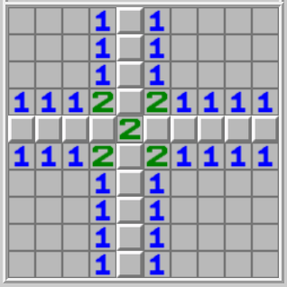

# 题目列表

| 分类 | 官方题解和源码 | 题目标题 | Flag | 分值 | 校内通过 | 总通过 |
| --- | --- | --- | --- | --- | --- | --- |
| Tutorial | [→ prob23-signin](../official_writeup/prob23-signin/) | 一眼盯帧 | / | 100 | 205+5 | 970+42 |
|  | [→ prob18-trivia](../official_writeup/prob18-trivia/) | 小北问答!!!!! | 半份 Flag | 150 | 120+2 | 330+6 |
|  |  |  | 整份 Flag | 150 | 57+5 | 121+11 |
| Misc | [→ prob05-zserver](../official_writeup/prob05-zserver/) | Z 公司的服务器 | 服务器 | 150 | 46+5 | 138+9 |
|  |  |  | 流量包 | 200 | 16+6 | 43+11 |
|  | [→ prob15-service](../official_writeup/prob15-service/) | 猫咪状态监视器 | / | 200 | 10+11 | 39+22 |
|  | [→ prob24-password](../official_writeup/prob24-password/) | 基本功 | 简单的 Flag | 150 | 68+6 | 174+22 |
|  |  |  | 冷酷的 Flag | 200 | 39+16 | 102+26 |
|  | [→ prob16-darkroom](../official_writeup/prob16-darkroom/) | Dark Room | Flag 1 | 150 | 43+7 | 71+12 |
|  |  |  | Flag 2 | 250 | 9+9 | 15+13 |
|  | [→ prob22-minecraft](../official_writeup/prob22-minecraft/) | 麦恩·库拉夫特 | 探索的时光 | 100 | 51+0 | 170+2 |
|  |  |  | 结束了？ | 150 | 17+2 | 47+8 |
|  |  |  | 为什么会变成这样呢？ | 300 | 5+1 | 19+2 |
| Web | [→ prob14-emoji](../official_writeup/prob14-emoji/) | Emoji Wordle | Level 1 | 150 | 64+5 | 136+7 |
|  |  |  | Level 2 | 150 | 38+8 | 95+15 |
|  |  |  | Level 3 | 200 | 16+7 | 42+12 |
|  | [→ prob01-homepage](../official_writeup/prob01-homepage/) | 第三新XSS | 巡猎 | 200 | 23+6 | 78+14 |
|  |  |  | 记忆 | 300 | 4+10 | 18+23 |
|  | [→ prob13-easyts](../official_writeup/prob13-easyts/) | 简单的打字稿 | Super Easy | 300 | 22+5 | 58+14 |
|  |  |  | Very Easy | 200 | 13+4 | 34+6 |
|  | [→ prob17-hass](../official_writeup/prob17-hass/) | 逝界计划 | / | 350 | 1+4 | 4+16 |
|  | [→ prob02-greatwall](../official_writeup/prob02-greatwall/) | 非法所得 | Flag 1 | 200 | 12+3 | 32+8 |
|  |  |  | Flag 2 | 200 | 10+2 | 27+5 |
|  |  |  | Flag 3 | 200 | 9+2 | 24+7 |
| Binary | [→ prob25-krkr](../official_writeup/prob25-krkr/) | 汉化绿色版免费下载 | 普通下载 | 150 | 75+7 | 205+23 |
|  |  |  | 高速下载 | 200 | 44+13 | 89+20 |
|  | [→ prob09-easyc](../official_writeup/prob09-easyc/) | 初学 C 语言 | Flag 1 | 150 | 51+6 | 125+13 |
|  |  |  | Flag 2 | 250 | 12+1 | 26+1 |
|  | [→ prob10-babystack](../official_writeup/prob10-babystack/) | Baby Stack | Flag 1 | 200 | 15+6 | 45+12 |
|  |  |  | Flag 2 | 300 | 11+1 | 29+5 |
|  | [→ prob20-polynomial](../official_writeup/prob20-polynomial/) | 绝妙的多项式 | Baby | 250 | 21+4 | 36+6 |
|  |  |  | Easy | 250 | 14+2 | 24+2 |
|  |  |  | Hard | 200 | 13+2 | 20+2 |
|  | [→ prob07-noexec](../official_writeup/prob07-noexec/) | 禁止执行，启动 | Flag 1 | 200 | 9+3 | 22+6 |
|  |  |  | Flag 2 | 300 | 4+0 | 10+1 |
|  |  |  | Flag 3 | 300 | 1+0 | 6+0 |
| Algorithm | [→ prob04-filtered](../official_writeup/prob04-filtered/) | 关键词过滤喵，谢谢喵 | 字数统计喵 | 150 | 52+2 | 83+3 |
|  |  |  | 排序喵 | 250 | 38+5 | 52+7 |
|  |  |  | Brainfuck 喵 | 250 | 22+2 | 27+2 |
|  | [→ prob21-gzip](../official_writeup/prob21-gzip/) | 未来磁盘 | Flag 1 | 150 | 11+4 | 26+7 |
|  |  |  | Flag 2 | 300 | 2+0 | 7+0 |
|  | [→ prob12-minesweeper](../official_writeup/prob12-minesweeper/) | 扫雷III | / | 350 | 7+0 | 9+0 |
|  | [→ prob08-cookie](../official_writeup/prob08-cookie/) | 小章鱼的曲奇 | Smol Cookie | 150 | 49+2 | 83+4 |
|  |  |  | Big Cookie | 250 | 35+4 | 56+6 |
|  |  |  | SUPA BIG Cookie | 300 | 36+15 | 62+19 |
|  | [→ prob19-qrcode](../official_writeup/prob19-qrcode/) | 华维码 | 华维码 · 特难 | 200 | 14+3 | 26+4 |
|  |  |  | 华维码 · 特小 | 400 | 1+0 | 3+1 |

“分值” 表示题目原始分值，实际分值取决于校内第一阶段通过人数。

“校内通过” 和 “总通过” 人数的两个部分分别表示第一阶段和第二阶段的通过人数。

## [Tutorial] 一眼盯帧

**[【→ 官方题解和源码】](../official_writeup/prob23-signin/)**

    

欢迎参赛！随着比赛进行，我们会发布对题目的补充说明、提示及后续赛程安排，届时将在本平台和 QQ 群 895754285 发布。
<del>这是咱们勤工俭学服务中心的 QQ 群，后面爷忘了。</del>

如果你对题目有疑问，可以在群里私聊管理员或发邮件到 geekgame at pku.edu.cn。除通过上述方式与组委会联系外，所有选手在比赛结束前不得与他人讨论题目。

<strong>萌新教学：</strong>

本比赛的每道题目都对应着一个或多个被称为 Flag 的答案，其形如 <code>flag{...}</code>。
Flag 区分大小写，所有字符均为可打印 ASCII 字符。
你需要<strong>根据题目所给附件的要求解出 Flag</strong>，或者攻击题目指定的系统<strong>在服务器中得到 Flag</strong>。将 Flag 输入到下面的文本框即可得分。

<a href="#/game">比赛主页</a> 的 “资料推荐” 栏目有一些让你快速了解常见解题方法的资料。
<a href="#/info/faq">选手常见问题</a> 的 “常用工具” 栏目列举了一些你可能会用到的工具。

<strong>点击下方 “下载题目附件” 查收本题的 Flag。本题的 Flag 是在英文中有意义的内容，且所有字母均为小写。</strong>

<strong>第二阶段提示：</strong>

<ul>
<li>实在不知道该给什么提示。因为只需要把 GIF 里每个帧里的字母拼起来，然后做个 ROT13 就解出来了。</li>
<li>华清大学为了照顾不会提取 GIF 每个帧的选手，<a target="_blank" rel="noopener noreferrer" href="https://mp.weixin.qq.com/s?__biz=MzUyOTg0Mjg4Mw==&amp;mid=2247485759&amp;idx=1&amp;sn=affd2a7a0710605c832009d900902ddb">在比赛前连夜购买了正版 Photoshop</a>，终于跟上了兆大的脚步。让我们恭喜华清大学！</li>
</ul>

## [Tutorial] 小北问答!!!!!

**[【→ 官方题解和源码】](../official_writeup/prob18-trivia/)**

菜宝曾是 PKU GeekGame 的资深出题人。在这届比赛中，新人小祥加入了出题队伍，并包揽了总数三分之一的题目。看着自己昔日的伙伴很快和小祥打成一片，菜宝内心很不是滋味。

<blockquote>

字幕 &amp; 旁白：“觉得 GeekGame 开心，我一次都没有这样想过”

</blockquote>

在凌晨的海底捞，独自一人，坐在角落嗦粉。与出题组告别后的菜宝喝完了一罐又一罐碳酸饮料。

<blockquote>

道具注意要用那种细长的易拉罐，喷成黑色

</blockquote>

突然，手机屏幕亮起。“至少让我当面向你道歉好吗？我也吓了一跳，不知道事情会变成那样……所以我想好好解释一下。”

<blockquote>

屏幕特写，需要额外补光照亮桌面细节

</blockquote>

原来这届比赛还缺一道小北问答作为<strong>考察情报搜集能力</strong>的题目，出题组正一筹莫展。小北问答是 PKU GeekGame 的传统题目，PKU GeekGame 不能失去小北问答，就像东方不能失去博丽灵梦。

<blockquote>

屏幕特写，展示微信发送语音界面，剪辑时注意人声要和对讲机动画同步

</blockquote>

“那……一辈子的小北问答，能陪我出吗？”

<blockquote>

切片尾曲《花の塔》，前奏做 3s 渐入

</blockquote>

啊对，因为故事的背景在海底捞，所以小北问答除了<strong>答对所有题目</strong>可以获得整份 Flag 之外，<strong>答对一半题目</strong>还可以获得半份 Flag。

<strong>第二阶段提示：</strong>

<ul>
<li>第四题：比赛平台使用的 Python 版本是 3.8。有很多在线运行 Python 的网站，甚至 <a target="_blank" rel="noopener noreferrer" href="https://godbolt.org/">Compiler Explorer</a> 都能运行各种版本的 Python。</li>
<li>第五题：除了 <a target="_blank" rel="noopener noreferrer" href="https://web.archive.org/">web.archive.org</a> 以外，也可以在其他地方找到一些蛛丝马迹，只不过比较麻烦。比如……2011 年的拜年祭？</li>
<li>第六题：这个照片并非在拍摄会议的会场，而是背对着会场在拍摄对面的建筑。你需要先找到会场，然后再找到对面的建筑。</li>
</ul>

## [Misc] Z 公司的服务器

**[【→ 官方题解和源码】](../official_writeup/prob05-zserver/)**

Z 公司有很多服务器。出于安全考虑，这些服务器不能直接通过 SSH 登录，需要经过层层跳板，传输文件很不方便。

但是<strong>有一种古老的方法</strong>可以拿到服务器上的文件。这究竟是什么方法呢？

同时，黑客还拿到了一段这个服务器的流量。连接到服务器即可用这种方法接收 Flag 1，流量包中记录了用这种方法接收到的 Flag 2。

<strong>萌新教学：</strong>

如下面的说明所示，本题在 <code>prob05.geekgame.pku.edu.cn</code> 主机开放了 TCP 10005 端口。
你可以点击链接启动网页终端。如果涉及网页终端难以输入的特殊字符，也可以使用命令行工具 netcat 或者 pwntools 等带 socket 通信功能的库连接到这个端口。参见 <a href="#/info/faq">FAQ：关于终端交互</a>。

请与这个端口上的程序交互获得 Flag。连接频率限制是 30 秒 3 次。

题目会要求输入个人 Token 来验证你的选手身份。点击页面底部的 “复制个人 Token” 按钮可以复制自己的 Token。网页终端会自动填入 Token。

<strong>第二阶段提示：</strong>

<ul>
<li>这是题目的 Dockerfile：</li>
</ul>

<pre style="line-height: 125%;"><code>FROM ubuntu:22.04
RUN apt update &amp;&amp; apt install -y lrzsz
WORKDIR /
COPY flag.txt /
CMD sz flag.txt
</code></pre>

<ul>
<li>有些工具对此协议支持存在 bug，你可以换别的试试。</li>
<li>可以看看 <a target="_blank" rel="noopener noreferrer" href="http://gallium.inria.fr/~doligez/zmodem/zmodem.txt">这个协议的规范</a>。</li>
</ul>

## [Misc] 猫咪状态监视器

**[【→ 官方题解和源码】](../official_writeup/prob15-service/)**

Nano 最近新养了一只猫叫瑟维斯！

由于 Nano 经常外出，他希望能够远程监视瑟维斯的状态，以确保她的安全和舒适。

于是，为了方便照顾，Nano 开发了一款名为「瑟维斯状态查看器」（Service Checker）的监视器！

纯命令行无 UI，非常 Geek！

<blockquote>

Nano: 但我写这玩意不是为了让你拿 flag 的，也不是为了让猫猫吃 flag 的……嗯？

</blockquote>

<strong>第二阶段提示：</strong>

<ul>
<li>可以看看 <code>/usr/bin/service</code> 的源码，了解一下 STATUS 命令是如何调用对应服务的。</li>
<li>LIST 命令不输出任何东西是正常现象。因为题目环境里没有运行任何服务。</li>
</ul>

## [Misc] 基本功

**[【→ 官方题解和源码】](../official_writeup/prob24-password/)**

在我们嘿客界，有四种基本功要练。知道是哪四种吗？

<em>我知道：说、学、逗、唱。</em>

不对。在我们 GeekGame 是 Misc、Web、Binary、Algorithm。不同的地方说法不一样，比如在别的比赛里，Algorithm 可能叫 Crypto。

<em>确实，也可能叫 Math。</em>

那我们先来说说 Misc 吧。Misc 是基本中的基本，代表所有老赛棍都要掌握的技能。

<em>那万一我不掌握，岂不是比赛就爆了，电脑也爆了，○○也爆了？</em>

很佩服你有如此觉悟，正因如此我们要多多练习。你觉得作为嘿客，最应该练习什么技能？

<em>我觉得是盗 QQ 号，还有破解密码。</em>

盗 QQ 号不行，万一腾讯以后会赞助呢。上届比赛黑了一下某品牌，这届就来赞助了，怪尴尬的。破解密码倒是有很多说法。

<em>对，我就擅长搞这个。比如你的笔记本电脑，我用五秒钟就能破解登录密码。信不信？</em>

不信。你来试试。

<em>好，这个指纹传感器，麻烦按一下。谢谢。</em>

不不不，破解密码不是这么玩的。看见我电脑里这<strong>两个压缩包</strong>了吗，我随便用了个密码给它加密了。也不算太长，<strong>但至少有 50 个字节，可能会有大小写字母和特殊符号</strong>。当然我不会告诉你密码是什么。试试看能不能破解？

<strong>第二阶段提示：</strong>

<ul>
<li>如果你知道压缩包中任何一个文件的内容，即可发起 <a target="_blank" rel="noopener noreferrer" href="https://github.com/kimci86/bkcrack">ZIP 明文攻击</a>。</li>
<li>甚至不需要知道完整的文件内容，只需要知道其中的任意 12 个字节（其中 8 个字节必须连续）即可。</li>
</ul>

## [Misc] Dark Room

**[【→ 官方题解和源码】](../official_writeup/prob16-darkroom/)**

这是一个文本游戏，在游戏中你将要寻找钥匙、获取宝物、寻求帮助，最后逃脱小黑屋通关。

地图中存在两个 Flag，你需要根据游戏提示、甚至寻找能够破坏或利用的游戏规则，来找到他们。祝好运！

<strong>补充说明：</strong>

<ul>
<li>题目源码在 <a target="_blank" rel="noopener noreferrer" href="https://github.com/tinichu316/Dark_Room">tinichu316/Dark_Room</a> 的基础上经过了一点修改。</li>
<li>本题的连接频率限制是 3 秒一次。</li>
<li>为了避免不同用户之间存档混乱，每次连接时均会启动一个新的实例，即不能读取上次连接的存档。</li>
</ul>

<strong>第二阶段提示：</strong>

<ul>
<li>Flag 1：<code>help</code> 真的有用。</li>
<li>Flag 2：程序报错时会泄露一些源代码。</li>
</ul>

## [Misc] 麦恩·库拉夫特

**[【→ 官方题解和源码】](../official_writeup/prob22-minecraft/)**

<blockquote>

你这辈子就是被 Minecraft 给害了，没法跟正经妹子处事，跟妹子吃饭的时候，总是在想，她要是能帮我造个树厂就好了，无人值守多树种一小时一万多原木，送她回家的时候，总是在想，她要是用矢量珍珠炮送我回家就好了。坐在她的家里的沙发上的时候，她说进房间换个衣服，你的心怦怦跳，她要是出来的时候给你展示她的全物品分类器怎么办？她要是靠过来时要拉你去打机械动力怎么办？然后妹子穿着睡衣出来了，问你做不做一些两个人才能做的事情，你反手新建一张格雷科技和神秘时代六的图让她来开荒，她沉默了一会说我说的不是游戏

</blockquote>

作为掌握至尊出题人之力的小 M 把 Flag 藏在了一张 Minecraft 地图里。不过他显然不想让你轻松拿到它。

<strong>补充说明：</strong>

<ul>
<li>可以使用自己的 Minecraft 客户端或者使用开源客户端来游玩。请参考 <a target="_blank" rel="noopener noreferrer" href="https://mivik.moe/ctf-minecraft/">这里的说明</a>。</li>
<li>附件所给存档的 Minecraft 版本是 1.18.2。如果你的客户端版本不同，可能会出现问题。</li>
</ul>

<strong>第二阶段提示：</strong>

<ul>
<li>手玩找不到的东西，或许可以让程序帮忙？</li>
<li>Flag 2: 可以看看 <a target="_blank" rel="noopener noreferrer" href="https://minecraft.fandom.com/zh/wiki/Anvil%E6%96%87%E4%BB%B6%E6%A0%BC%E5%BC%8F">Minecraft 的存档格式</a>。</li>
<li>Flag 3: 可以看看 <a target="_blank" rel="noopener noreferrer" href="https://minecraft.fandom.com/zh/wiki/%E7%BA%A2%E7%9F%B3%E7%94%B5%E8%B7%AF?variant=zh#%E7%BA%A2%E7%9F%B3%E6%A8%A1%E6%8B%9F%E7%94%B5%E8%B7%AF">红石模电</a>。</li>
</ul>

## [Web] Emoji Wordle

**[【→ 官方题解和源码】](../official_writeup/prob14-emoji/)**

<blockquote>

⬛⬛🟨⬛⬛

⬛⬛🟨⬛🟩

🟨⬛🟨🟩🟩

🟩🟩⬛🟩🟩

🤡🤡🤡🤡🤡

</blockquote>

你能在规定的次数之内猜出由 64 个 Emoji 组成的 Wordle 吗？猜测结果正确就能拿到 Flag。

<strong>补充说明：</strong>

<ul>
<li>Level 1 的答案是固定的；Level 2 和 3 的答案是随机生成并存储在会话中的。</li>
<li>此题属于 Web 而非 Algorithm。解出此题无需知道答案的生成算法。</li>
</ul>

<strong>第二阶段提示：</strong>

<ul>
<li>本题使用了 Play Framework。这是一种无状态 Web 框架，其实服务器什么都没有存储。</li>
<li>可以看看 <a target="_blank" rel="noopener noreferrer" href="https://www.playframework.com/documentation/2.8.x/SettingsSession">它的 Session 实现</a>，留意一下每次请求 Cookie 发生了什么变化。</li>
<li>另外，输入框里面的 Placeholder 是从 128 个 Emoji 中随机（有放回）抽取 64 个，但是答案只会涉及 64 种 Emoji。在知道答案涉及的 64 种 Emoji 的前提下，可以用 64 次猜测得到答案。</li>
</ul>

## [Web] 第三新XSS

**[【→ 官方题解和源码】](../official_writeup/prob01-homepage/)**

第三新兆京大学的第三新学院坐落在美丽的第三新燕园校区。在这里工作的第三新学生在欣赏第三新燕园校区的第三新风光之余，还组建起了第三新实验室，努力发展解决卡脖子难题的第三新技术。

就像其他世界一流大学一样，第三新学院也有自己的第三新官网，每个第三新学生可以向第三新教务提出申请，在上面放置自己的第三新个人主页。在第三新教务座谈会上，有人提出了质疑：

<blockquote>

“允许任何人在官网上设置个人主页，请问这是否存在安全漏洞？比如，能否通过 XSS 漏洞篡改他人的主页内容。”

“暂时不能给你明确的答复。不过有一点可以保证，这套系统从根本上杜绝了 XSS 漏洞，因为<strong>所有人共享同一个网站</strong>，Cross-Site 不了一点。”

“好的，这套系统没有 XSS 漏洞。那么是否有第三新 XSS 漏洞呢？”

“这个问题需要你自己去衡量。”

</blockquote>

此时人们尚未意识到，命运的第三新齿轮即将开始转动……

<strong>萌新教学：</strong>

本题提供了一个模拟受害者行为的程序，称为 XSS Bot。它会自动操作浏览器将 Flag 放置在目标网站上，然后访问你指定的网址。

请设法找到并利用目标网站上的漏洞，通过与 XSS Bot 交互获得受害者浏览器中的 Flag。

<strong>第二阶段提示：</strong>

<ul>
<li>给 Cookie 设置 Path 并不能带来安全性。<a target="_blank" rel="noopener noreferrer" href="https://developer.mozilla.org/en-US/docs/web/api/document/cookie#security">MDN 文档</a> 专门有一节来指出其中的问题。</li>
<li>你需要 <a target="_blank" rel="noopener noreferrer" href="https://developer.mozilla.org/en-US/docs/Web/API/Service_Worker_API/Using_Service_Workers">注册一个 Service Worker</a>，而且要注册到 <code>"/"</code> 这个 scope 上。</li>
</ul>

## [Web] 简单的打字稿

**[【→ 官方题解和源码】](../official_writeup/prob13-easyts/)**

<marquee direction="up" scrollamount="4" height="350">

<blockquote>

尊敬的用户,您好!

我们深刻认识到,大力推广使用TypeScript这门优秀的编程语言,将对我国社会主义现代化建设产生深远的正面影响。我们梳理了TypeScript与现代化建设的结合点,并进行了详细阐述,请您评价。

第一,TypeScript将提升我国软件和信息技术产业水平,强力促进经济增长。信息技术深入各行各业,软件产业已成为支柱产业。TypeScript作为新一代编程语言,将大幅提高软件开发效率和质量,降低开发成本。这将使我国软件企业在国际市场更具竞争力,抢占更大市场份额。软件产业的腾飞必将拉动整个电子信息产业的发展,为经济增长提供强大动力。信息技术进步也将使传统产业智能化升级,推动经济结构优化。

第二,TypeScript将提升程序员工作效率,降低企业人力成本。TypeScript编程更高效,企业用人更少,可将节省的人力资源投入到创新领域。程序员效率提升速度超过工资上涨速度,企业的人力成本将明显降低。这将减轻企业运营压力,使更多资源向技术创新聚集,推动产业结构升级。同时,新的就业岗位将涌现出来,吸纳更多人才,促进社会主义市场经济的繁荣与发展。

第三,TypeScript在“双碳”目标、生态文明建设中具有重要应用前景。TypeScript可广泛应用于环境监测、气候模型、碳排放统计等领域的软件开发,大幅提高工作效率。这将为制定气候政策、评估碳中和路径提供强有力的技术支持。利用TypeScript打造的环境管理系统,也将助力环境污染治理和生态文明建设。一个绿色的中国,才是一个美丽的中国。

我们呼吁北大等高校里富有社会责任感的青年学子,在学习TypeScript技能的同时,将之用于服务国家发展大局。让我们继续在信息技术进步的道路上阔步前行,以TypeScript为工具,建设一个我们夢想中的社会主义现代化强国,以人民为中心,实现中华民族伟大复兴!

</blockquote>

</marquee>

显然，题面要是让 Claude 生成，就会变成上面那个鬼样。

不过前人说，TypeScript 确实很安全，至少对于类型来说更是如此。那么若我<strong>把 Flag 放在类型里</strong>，阁下又将如何应对？

<pre style="line-height: 125%;"><code>type flag1 = &#39;flag{...}&#39;
type flag2 = object | { new (): { v: () =&gt; (a: (a: unknown, b: { &#39;flag{...}&#39;: never } &amp; Record&lt;string, string&gt;) =&gt; never) =&gt; unknown } }

// your code here
</code></pre>

<strong>第二阶段提示：</strong>

<ul>
<li>如果 JS 无法直接输出 Flag，那我们就利用类型检查器的报错来输出 Flag。</li>
<li>输出包含 <code>flag</code> 就会绷，但是能不能转化成没有 <code>flag</code> 的内容多次输出呢？</li>
</ul>

## [Web] 逝界计划

**[【→ 官方题解和源码】](../official_writeup/prob17-hass/)**

注意看，眼前的这个人叫小帅，他是 PKU GeekGame 的平台运维客服，正坚守在平台机房内查看运行状况。

小帅的生活很辛苦。每年都有很多选手为了抢一血在<ruby>凌晨一点<rt>25時</rt></ruby><ruby>熬夜<rt>ナイト</rt></ruby><ruby>写代码<rt>コード</rt></ruby>，因此小帅不得不半夜睡在机房，遇到问题好随时处理。机房的电灯开关在楼下的配电室，操作不便，小帅为此设置了一套智能家居系统 <a target="_blank" rel="noopener noreferrer" href="https://www.home-assistant.io/">Home Assistant</a> 管理电灯开关。

     
    ↑ GeekGame 平台机房（示意图） / &copy;视觉沙勒

小帅在自己的电脑安装上 Home Assistant，惊叹道这个系统极为先进，在网页上点点鼠标就能自动控制智能设备、存储多媒体文件，甚至还能执行任意 Jinja 模版、用 nmap 扫描内网……既然这些功能都能做到，那 <strong>读取服务器磁盘中的 /flag.txt</strong> 也不难做到，对吧？

正所谓 It's not a bug, it's a feature. 点击屏幕下方小黄车，试试就逝世。

<strong>补充说明：</strong>

<ul>
<li>好消息：解出本题无需写任何代码，只需利用 Home Assistant 网页上的已有功能；坏消息：Home Assistant 的已有功能实在是太多了。</li>
<li>解出本题<strong>不依赖于内网其他设备</strong>。</li>
<li>建议选手下载源码在本地运行，以方便调试（例如 <code>docker exec -it hass /bin/bash</code>）。</li>
</ul>

<strong>提示：</strong>

<ul>
<li>为了安全性，大多数与读写文件相关的集成都无法直接从Web界面添加。但是有一个集成看似与读写文件无关，却能顺便做到读写文件……</li>
</ul>

<strong>第二阶段提示：</strong>

<ul>
<li>……那就是大家都喜欢的 <code>nmap</code> 集成。</li>
<li>你可能想用 <code>nmap --script</code> 执行任意脚本，但可惜它的 Docker 里没装完整的运行环境。试试别的方式吧。</li>
</ul>

## [Web] 非法所得

**[【→ 官方题解和源码】](../official_writeup/prob02-greatwall/)**

小太极是摆带信科的大四老狗。他的室友保研到了摆带原神学院，学术爱情双丰收；而
小太极除了和教务学会太极拳后，本科四年一无所成，单身的他被扫地出门，最终只得保研到 CMU（Changping Machikou University，现改名为新*园），离校前存放在活动室的个人物品还被别人清理掉了。

恼火之余，小太极看到室友的电脑桌面上，在原神图标下面居然有某蓝色软件。联想到承德某同行的经历，他豁然开朗：这一切居然是室友的非法所得。请你帮助小太极通过网络，找出他室友电脑上的三处证据，让老大哥vivo50w🫡

<strong>补充说明：</strong>

<ul>
<li>可阅读源码中的 <code>prepare_flag.mjs</code> 等文件了解 Flag 的位置。</li>
<li>VNC 界面仅供观看，请点击网页其他处的按钮进行操作。</li>
</ul>

<strong>第二阶段提示：</strong>

<ul>
<li>可以看看 <a target="_blank" rel="noopener noreferrer" href="https://clash.gitbook.io/doc/restful-api">文档</a>。</li>
<li>原神学院官网被隐藏起来了，需要你<strong>自己</strong>去衡量。</li>
<li>这是一个古老版本的 CFW。可以看看 <a target="_blank" rel="noopener noreferrer" href="https://github.com/Fndroid/clash_for_windows_pkg/issues/2710">GitHub Issues</a>。</li>
</ul>

## [Binary] 汉化绿色版免费下载

**[【→ 官方题解和源码】](../official_writeup/prob25-krkr/)**

<pre style="line-height: 125%;"><code>                      欢迎访问兆大ＣＴＦ：

                      精彩的Flag等着你来拿！！
    
               ╭═══════════════╮
               ║        兆 大 Ｃ Ｔ Ｆ        ║
 ╭══════┤     geekgame.pku.edu.cn      ├══════╮
 ║            ║         世 纪 下 载          ║            ║
 ║            ╰═══════════════╯            ║
 ║                                                          ║
 ║声明：                                                    ║
 ║   1) 本站不保证所提供软件或程序的完整性和安全性。        ║
 ║   2) 请在使用前查毒。                                    ║
 ║   4) 转载本站提供的资源请勿删除本说明文件。              ║
 ║   5) 本站提供的程序均为网上搜集，如果该程序涉及或侵害到您║
 ║      的版权请立即写信通知我们。                          ║
 ║   6) 本站提供软件只可供研究使用，请在下载24小时内删除,   ║
 ║      切勿用于商业用途，由此引起一切后果与本站无关。      ║
 ║                                                          ║
 ║                                                          ║
 ║     1. 推荐使用：WinRAR V3.2以上版本解压本站软件         ║
 ║     2. 本站承接CTF，虚拟皮套，网站制作，等业务           ║
 ║                                                          ║
 ║         兆大ＣＴＦ: https://geekgame.pku.edu.cn          ║
 ║                                                          ║
 ║         奖品领取;网站合作  Email: geekgame at pku.edu.cn ║
 ║                                                          ║
 ║                                                          ║
 ║    ╭───────────────────────╮    ║
 ╰══┤     兆大ＣＴＦ https://geekgame.pku.edu.cn   ├══╯
       ╰───────────────────────╯

如果你觉得我们网站能给你带来方便，请把 https://geekgame.pku.edu.cn 网站介绍给你的朋友！！！
</code></pre>

<strong>补充说明：</strong>

<ul>
<li>如程序描述，Flag 2 是 “出题人在存档里输入的内容”，并非所有能通过程序判定的 Flag 都是对的。Flag 2 可以唯一解出，如果发现多解说明你漏掉了一些信息。</li>
</ul>

<strong>第二阶段提示：</strong>

<ul>
<li>Flag 1：有很多做法，比如啃生肉用的机翻软件就可以提取内存中的文字，Cheat Engine 也可以。但为了 Flag 2，还是建议你找个软件解包一下 <code>data.xp3</code>。</li>
<li>Flag 2：除了 <code>data0.kdt</code> 以外，<code>savedata</code> 文件夹里还有两个文件。它们存储了什么信息？</li>
</ul>

## [Binary] 初学 C 语言

**[【→ 官方题解和源码】](../official_writeup/prob09-easyc/)**

大一的小 A 在学习了《计算概论A》后，对自己的 C/C++ 水平非常自信，认为自己写出的程序不可能有 Bug （虽然可能会有写不出来的程序），于是他发起了一个悬赏，能发现程序的漏洞并读取到他服务器上的 Flag 的人，便可以狠狠奖励。

大二的小 B 在学习了《计算机系统导论》后，看了一眼小 A 的程序，便指出你这个程序的漏洞太明显了，他根本不屑于动手去攻击。

小 A 表示不信，仍然公开悬赏，觉得没有人可以可以拿下他的服务器。

<strong>补充说明：</strong>

<ul>
<li>如果你发现题目下发的程序跑不起来，建议仔细查看源码或先在本地调试。</li>
</ul>

<strong>第二阶段提示：</strong>

<ul>
<li>Flag 1: 可以思考一下代码中的变量都存在了什么地方，<code>printf</code> 的不同参数会获取哪些地方的值。</li>
<li>Flag 2: gcc 的 <code>printf</code> 函数有一个特殊的用法，这种用法下 <code>printf</code> 不只是读取变量并输出，而是可以将数据写入变量。后面的部分就是一个传统的 pwn 任务。你可以参考 <a target="_blank" rel="noopener noreferrer" href="https://ctf-wiki.org/pwn/linux/user-mode/stackoverflow/x86/basic-rop/">CTF-Wiki</a> 相关章节，结合课内所学来实现它。</li>
</ul>

## [Binary] Baby Stack

**[【→ 官方题解和源码】](../official_writeup/prob10-babystack/)**

A pwn challenge 4 babies (or college students)！

<blockquote>

这样的栈溢出题目对于小朋友来说有些幼稚，但对大学生刚刚好。

</blockquote>

<strong>第二阶段提示：</strong>

<ul>
<li>你可以 <a target="_blank" rel="noopener noreferrer" href="/service/attachment/prob10-babystack/prob10-src.zip">下载题目源码</a>。</li>
<li>Flag 1: integer overflow and stack overflow~</li>
<li>Flag 2: format string leak，format string任意地址写。可以参考 <a target="_blank" rel="noopener noreferrer" href="https://ctf-wiki.org/pwn/linux/user-mode/fmtstr/fmtstr-exploit/#_13">CTF Wiki</a>，但是给的例子是 32 位的，需要改成 64 位的。</li>
<li>在 2.27 及以后的 glibc 版本中，<code>system</code> 会使用 <code>movaps</code> 指令，此时会要求 <code>rsp</code> 按 16 字节对齐。如果 gdb 调试时发现停止在了这一行，可以通过使用一个单独的 ret gadget 来使其对齐。</li>
</ul>

## [Binary] 绝妙的多项式

**[【→ 官方题解和源码】](../official_writeup/prob20-polynomial/)**

<blockquote>

Welcome to the world of polynomial!

</blockquote>

小Y是一个计算机系的同学，但是非常不幸的是他需要上很多的数学专业课。

某一天，他正看着书上一堆式子发呆的时候，突然灵光一闪，想到几个绝妙的多项式。

他想考考你能不能猜出多项式是多少？

<em>当然大家都不会读心术，小Y给了你一些信息</em>

<strong>第二阶段提示：</strong>

<ul>
<li>ChatGPT 或许能帮你辨认出小 Y 给的信息。</li>
<li>如何在 Zp 空间中进行除法，对多项式是否有类似的方法？</li>
</ul>

## [Binary] 禁止执行，启动

**[【→ 官方题解和源码】](../official_writeup/prob07-noexec/)**

你说的对，但是《禁止执行》是由 PKU GeekGame 自主研发的一道全新开放世界 CTF 题目。在这里，你将扮演一名为「Linux Shell 终端用户」的神秘角色，在自由的命令中邂逅内容各异、属性独特的文件们——同时，逐步发掘「Flag」的真相：

<ul>
<li>分别在 Easy 和 Hard 两个线上环境中，执行如下指令（Shellcode）可获得 Flag 1 和 Flag 2。</li>
</ul>

<pre style="line-height: 125%;"><code>    movq $548, %rax   # __NR_get_flag
    xorq %rdi, %rdi   # id = 0
    movq %rsp, %rsi   # buf = %rsp
    syscall

    movq $1, %rax     # __NR_write
    movq %rax, %rdi   # fd = STDOUT_FILENO
    movq %rsp, %rsi   # buf = %rsp
    movq $32, %rdx    # len = 32
    syscall
</code></pre>

<ul>
<li>在 Hard 线上环境中，加载并运行可执行文件 <code>/tmp/hard_flag</code> 可以获得 Flag 3。</li>
</ul>

<strong>补充说明：</strong>

<ul>
<li>本题不是内核题，因此，本题的预期解法中不涉及任何对内核镜像的分析。</li>
<li>本题不是逆向题，本题的预期解法中不涉及对二进制文件（如 <code>/tmp/hard_flag</code>）的逆向分析。</li>
</ul>

<strong>第二阶段提示：</strong>

<ul>
<li>Flag 1: 利用调试器 <code>/bin/lldb</code> 可以代码注入。</li>
<li>Flag 2: 通过写文件 <code>/proc/[pid]/mem</code> 可以代码注入。</li>
<li>Flag 3: 使用 <a target="_blank" rel="noopener noreferrer" href="https://man7.org/linux/man-pages/man2/memfd_create.2.html">memfd</a> 可以执行任意二进制文件。</li>
</ul>

## [Algorithm] 关键词过滤喵，谢谢喵

**[【→ 官方题解和源码】](../official_writeup/prob04-filtered/)**

你好喵，我是粉色头发的少女喵，王牌发明家喵！

我擅长过滤文本中的一些关键词喵，附件里的程序是我最新的发明：<strong>**filtered**</strong> 喵！

把它交给了一个英国小女孩，看起来效果很不错喵！

这个程序可以进行正则匹配喵，就像你可以同时使用 <code>关.*?喵，.*?谢谢喵</code> 来匹配“关注⭕️⭕️⭕️⭕️喵，关注⭕️⭕️⭕️⭕️谢谢喵”和这道题目的标题“关键词过滤喵，谢谢喵”——当你理解了这一点，你就理解了正则喵！

为了过滤更复杂的东西，甚至是进行文本替换，你可以写一些像这样的规则喵：

<pre style="line-height: 125%;"><code>  重复把【 】替换成【】喵
  如果看到【MaxXing】就跳转到【什么也不做】喵
  把【关注(.+?)喵】替换成【举办\1喵】喵

什么也不做：
  谢谢喵
</code></pre>

把它输入给程序，程序就可以按照你的要求处理文本了喵，很方便喵！

现在你已经完全掌握了最先进的关键词过滤技术了喵（建议再仔细看看程序的实现喵），接下来请帮我完成一些工作喵！

谢谢喵！

<blockquote>

注意喵，所有 flag 的输入里都不会出现 emoji 喵，可能在做文本替换的时候有用喵！

每个 flag 的具体评测规则见附件的 judge.py 喵！

</blockquote>

<strong>字数统计喵</strong>

输入一个字符串，输出 10 进制的字符串长度喵，结果需要和 Python 中的 <code>len(...)</code> 保持一致喵！

<strong>排序喵</strong>

输入一个字符串，忽略其中的空行，并将剩余的行按照字数从小到大排序喵！

比如输入是：

<pre style="line-height: 125%;"><code>aaa
b

cc
</code></pre>

输出就是：

<pre style="line-height: 125%;"><code>b
cc
aaa
</code></pre>

<strong>Brainfuck 喵</strong>

鉴于越来越多的谜语人把关键词藏在 brainfuck 代码里，所以请你帮我用替换规则写一个 brainfuck 解释器喵，把他们绳之以法喵！

输入一个合法的 brainfuck 程序，语法可参考<a target="_blank" rel="noopener noreferrer" href="https://esolangs.org/wiki/Brainfuck">这个描述</a>，输出程序执行后的输出喵！

为了不让这个过程太折磨，我们做一些简化喵：

<ul>
<li>Memory cell 中的内容一定是非负整数喵！</li>
<li>不需要处理输入操作（也就是 <code>,</code>）和其他扩展操作（<code>#</code>、<code>!</code> 之类）喵！</li>
<li>输出字符的 ASCII 一定介于 32（空格）和 122（<code>z</code>）之间（含端点）喵！</li>
</ul>

<strong>第二阶段提示：</strong>

<ul>
<li><strong>**filtered**</strong> <del>抄袭</del> 参考了 Slashalash 和 REGXY 两种 esolang 的设计，你或许可以上网搜索看看一些用它们编写的程序喵！搜不到的话可以试试 bing 喵！</li>
<li>就像<a target="_blank" rel="noopener noreferrer" href="https://www.rosettacode.org/wiki/Sorting_algorithms/Sleep_sort">睡排序</a>一样，文本按字数排序也可以用类似的方法实现喵！比如每次把所有行都删掉一个字符，然后把最先删完的那行排在最前……之类的喵！</li>
<li>实现 Brainfuck 解释器可能需要一些耐心喵！注意 Brainfuck 程序中除 <code>&gt;</code>、<code>&lt;</code>、<code>+</code>、<code>-</code>、<code>.</code>、<code>[</code> 和 <code>]</code> 以外的字符都应该被忽略，以及你可能需要一些额外的状态来记录循环嵌套的层数喵！</li>
</ul>

## [Algorithm] 未来磁盘

**[【→ 官方题解和源码】](../official_writeup/prob21-gzip/)**

2077 年，随着核聚变、脑机接口和时光机技术的成熟，人类终于可以在磁盘上存储十亿人愿意生活在其中的虚拟世界。

2077 年的小 Z 有一块 1EB 大小的磁盘。小 Z 在上面干了这些事：

<ul>
<li>生成两个巨大的全 0 文件：<code>fallocate -l size1 file1 &amp;&amp; fallocate -l size2 file2</code>（这里 <code>size1</code> 和 <code>size2</code> 是未知的值，但不会超过 1EB）</li>
<li>把两个文件和 Flag 拼起来：<code>cat file1 flag file2 &gt; file</code></li>
<li>用 gzip 压缩生成的文件：<code>gzip file</code></li>
<li>得到的文件还很大，因此他重复了几次压缩操作：<code>mv file.gz file &amp;&amp; gzip file</code></li>
<li>把得到的 <code>file.gz</code> 传送回 2023 年</li>
</ul>

现在你得到了从 2077 年传送回来的 <code>file.gz</code> 文件。你能解压出里面的 Flag 吗？

<strong>补充说明：</strong>Flag 1 的原文件大小约 7TB，Flag 2 的原文件大小约 27PB。

<strong>提示：</strong>

<ul>
<li>运行 <code>cat /dev/zero | gzip | hexdump</code>，看看会输出什么。</li>
<li>运行 <code>cat /dev/zero | gzip | gzip | hexdump</code> 呢？如果你看不到任何输出，有什么办法可以加速这个计算过程？</li>
</ul>

<strong>第二阶段提示：</strong>

<ul>
<li>Flag 1: 直接解压大约需要 8 小时。你一定要真的解压<strong>到硬盘</strong>上吗？</li>
<li>Flag 2: 可以阅读一下 <a target="_blank" rel="noopener noreferrer" href="https://github.com/sigpwny/UIUCTF-2023-Public/blob/main/challenges/web/futuredisk/SOLVE.md">这个题解</a>。事实上本题的题面也是从那道题改写的。</li>
<li>另外，之前的提示中的两个命令最后都会产生周期性的输出，这个周期是多少？既然输出是周期性的，你可以尝试删除中间结果中重复出现的部分。</li>
</ul>

## [Algorithm] 扫雷III

**[【→ 官方题解和源码】](../official_writeup/prob12-minesweeper/)**

<blockquote>

大型纪录片《扫雷》持续为您播出……

</blockquote>

前两届 PKU GeekGame 的扫雷题都被大量选手秒杀。五星上将麦克阿瑟回忆前两次题目的特点，试图找出为什么有这么多选手都能快速秒杀。

仔细思考后，五星上将麦克阿瑟发现了这两次题目都如下缺陷：

<ul>
<li>

生成过于依赖随机数，选手似乎总能看破随机数生成器的规律。

</li>
<li>

地图太小，只有几千个方格怎么能拦住选手呢。

</li>
<li>

雷数太少，选手轻松点几下就能做出题目了。（就连隔壁比赛的拥有大量雷数的大型扫雷也丝毫不会影响选手的切题速度）

</li>
<li>

结束后显示全部的雷，选手可以总结上一盘经验备战下一盘，提高胜率。

</li>
</ul>

五星上将麦克阿瑟总结上述经验，准备了一道全新的扫雷题。<strong>完成扫雷即可获得 Flag。</strong>

在本题中，你会见到：

<ul>
<li>

超大棋盘，总共有大约十万格等待你发掘。

</li>
<li>

超多雷数，你需要找到大约一万个雷。

</li>
<li>

不够随机，你无法看透地雷的分布规律。

</li>
<li>

战争迷雾，踩雷爆炸后你也不能看到其他的雷，也不能继续操作。

</li>
</ul>

由于本次题目雷区过大，我们专门为你配备了一个扫雷机器人。这个机器人可以帮你完成一些简单的扫雷工作：机器人会搜索整个雷区，对于容易确定的雷会帮你进行标记、对于容易确定的空地会帮你打开。你也可以一次让扫雷机器人搜索多次。为了保证机器人不会因为玩家的错误操作而报废，机器人只会识别他自己标的雷（即你自己不能亲自标雷）。

题目操作方式：左键打开格子，右键使用机器人探测。

<strong>补充说明：</strong>

<ul>
<li>由于扫雷游戏的特点，本题后端只会串行处理请求。因此<strong>同时发送多个请求不会提高速度</strong>，反而可能导致前端失去同步而全部重新渲染，造成卡顿。</li>
<li>如果你写了一个 JS 脚本直接在页面上运行，可以开一个新标签页并定时刷新来观测游戏进度。</li>
<li>出题人的串行脚本可以在 5 分钟内解出此题。</li>
</ul>

<strong>第二阶段提示：</strong>

<ul>
<li>你需要了解一些扫雷的中阶技巧，可以思考一下格子内数字的含义，并做一些计算和推演。</li>
<li>显然题目雷区是由固定的几类元件以固定的排布方式组成的，可以结合猜测做一些尝试，了解元件的类型以及它们的作用。</li>
<li>可以尝试解决以下使用与本题类似方法生成的地图，这可能对你熟悉扫雷游戏有一定帮助。此图是有唯一解的。
</li>
</ul>

## [Algorithm] 小章鱼的曲奇

**[【→ 官方题解和源码】](../official_writeup/prob08-cookie/)**

Smol Tako 是一只小章鱼。

众所周知，章鱼都很喜欢吃曲奇。作为一名资深的曲奇评论家，Smol Tako 更是只身前往世界各地，寻找最美味、最具特色的曲奇。

终于，跟随一张古老的藏宝图，Smol Tako 来到了 ⱦħē łⱥꞥđ ꝋӻ đēłīꞡħⱦ。据说，在这里的深渊，驻守着 Ancient Tako，它守护着世界上最美味的曲奇。但 Ancient Tako 使用的语言是古神之语，Smol Tako 无法理解。它找到了精通网络安全的你，希望你能帮助它翻译古神之语，让它获得曲奇。

<blockquote>

我去，<a target="_blank" rel="noopener noreferrer" href="https://b23.tv/HNVDJ9z">管人吃</a>！

</blockquote>

<strong>第二阶段提示：</strong>

<ul>
<li>Flag 2: 可以看看 <a target="_blank" rel="noopener noreferrer" href="https://github.com/python/cpython/blob/main/Modules/_randommodule.c">Python 的 Random 实现</a>。</li>
<li>Flag 3: 由于出题人不慎少判断了一个条件，此题存在一个非常简单的非预期解。</li>
</ul>

## [Algorithm] 华维码

**[【→ 官方题解和源码】](../official_writeup/prob19-qrcode/)**

想要获得华维 Mate 60？首先你得来试一试华维码！

<b>Huavvei Mate Hard？华维码 · 特难！</b>

<blockquote>

Q: 怪，华容道为什么会和二维码搭上关系？

A: 这你就不知道了，这是多么遥遥领先的出题思路！

</blockquote>

<b>Huavvei Mate Nano？华维码 · 特小！</b>

<blockquote>

Q: Hard 难度我能理解，但 Nano 是什么难度？

A: 你看那些华容道格子是不是很 Nano？

</blockquote>

<strong>补充说明：</strong>

<ul>
<li>此题属于 Algorithm 而非 Web。按页面要求通关即可获得 Flag，无需利用 Web 漏洞。</li>
<li>操作步数上限为 30000。正常的操作步数应远小于此限制。</li>
</ul>

<strong>第二阶段提示：</strong>

<ul>
<li>可以看看 <a target="_blank" rel="noopener noreferrer" href="https://blog.tonycrane.cc/p/409d352d.html">这篇博客</a>。</li>
</ul>

